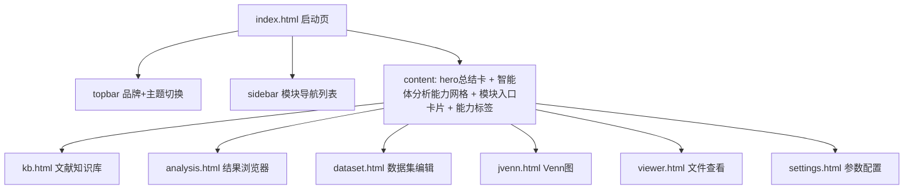

## 用户需求

为基于 LLM 的科研数据分析 agent 智能体工作站编写图形化外壳的启动主页 `agent/apps/index.html`，向用户展示软件的整体能力与功能入口。

## 产品概述

一个面向科研人员的 LLM 驱动组学数据分析工作站。用户通过 WinForm + WebView2 图形化外壳进入主页，主页需一段话总结软件能力，并提供各功能模块入口，同时把 `src/` 命令行程序（VB.NET LLM Agent）所实现的智能体分析能力也纳入展示。

## 核心功能

- 一段话总结软件能力：以本地 Ollama LLM agent 为核心，依据研究主题自动设计分析方案、自主编写 R 脚本完成整条组学生信分析流水线，并配套文献知识库、数据集定义、结果浏览、Venn 图、文件查看与参数配置等辅助模块。
- 智能体分析能力展示：呈现 14 个分析模块流水线（预处理、PCA/PLSDA/OPLSDA、差异组别设计、LIMMA 差异、KEGG 富集/GSVA、WGCNA、CMeans、贝叶斯网络、PLS-PM、随机森林、回归分析、跨组学整合、结果表格整理、论文初稿撰写），以及多组学样本对齐、文献检索与知识库构建、自定义模块等特性。
- 功能模块入口卡片：复用 `kb.css` 的 `.card--x` 彩色卡片，链接到 kb.html、analysis.html、dataset.html、jvenn.html、viewer.html、settings.html。
- 样式与 `agent/apps/styles/kb.css` 完全一致：复用其设计令牌（明暗双主题）、`.app` 网格布局、`.topbar`/`.sidebar`/`.content`、`.card`/`.card--x`、`.btn`、`.tag`、`.meta-grid`、`.doc-item`，不引入新样式名或颜色。
- 支持与现有页面一致的明暗主题切换（基于 `data-theme` 属性 + `localStorage("kb-theme")`），首屏防闪烁。

## 技术栈选型

- 前端：原生 HTML + CSS + 少量内联 JavaScript（与现有 `agent/apps/*.html` 保持一致，无框架）
- 样式：复用 `agent/apps/styles/kb.css` 的设计令牌与组件类（不新增样式文件或类名）
- 主题：内联最小脚本，读取 `localStorage("kb-theme")` 在首屏前设置 `data-theme`，并提供主题切换按钮，逻辑与 `js/kb.js` 对齐

## 实现方案

### 总体策略

将 `index.html` 作为应用启动页，使用与 `kb.html` 相同的 `.app` 网格骨架（topbar + sidebar + content）。sidebar 作为「模块导航」列表，content 内包含：

1. 顶部 hero 区（一个 `.card`）用一段话总结软件能力；
2. 智能体分析能力区：用 `.meta-grid` 或卡片网格展示 14 个分析模块流水线（标题 + 一句话说明），复用彩色 `card--x` 修饰；
3. 功能模块入口区：6 个彩色 `.card--x` 卡片，每张含标题、简介与「进入」整卡链接，指向对应 html 页面；
4. 底层能力/特性标签 `.tags`：多组学对齐、文献检索、知识库构建、自定义模块、PDF/DOCX 报告等。

### 关键技术决策

- 复用 `kb.css` 而非新建样式：保证视觉一致性、降低维护成本，符合用户强约束。
- 纯静态 `href` 跳转而非 SPA 路由：与现有各页面独立 html 架构一致，WebView2 外壳按文件名加载，无需路由框架。
- 内联主题脚本置于 `<head>`，在 CSS 生效前设置 `data-theme` 避免明暗闪烁；主题按钮复用 `.btn` 样式并调用与 `kb.js` 相同的 `localStorage` key（`kb-theme`）。
- 链接使用相对路径（如 `kb.html`），与现有页面同目录，确保 WebView2 正确加载。

### 性能与可靠性

- 纯静态页面、无外部 CDN 依赖（主页不需要 marked/pdfjs），首屏快、离线可用。
- 主题脚本仅做 localStorage 读取与属性设置，无网络请求、无重排风险。

## 实现注意事项

- 必须引入 `<link href="styles/kb.css" rel="stylesheet">`；不新建 css 文件。
- 颜色/阴影必须取自 `kb.css` 变量（如 `var(--accent)`、`var(--shadow)`、`var(--card-blue-soft)` 等），不得硬编码新色值。
- 卡片修饰类使用 `card--blue/green/purple/orange/teal/pink/gray` 之一，与现有彩色卡片体系一致。
- 主题初始化脚本需与 `js/kb.js` 一致：key 为 `kb-theme`，缺省按 `prefers-color-scheme` 回退 `light/dark`；按钮图标/文案（🌙/暗色、☀️/亮色）对齐。
- 链接仅指向已确认的 6 个入口页面；不引入不存在的页面。

## 架构设计

沿用现有 `.app` 网格布局，主页自身不引入新架构：



## 目录结构

```
agent/apps/
└── index.html   # [NEW] 软件 startup 主页。包含：
                 #   - <head> 内联主题初始化脚本（读取 localStorage("kb-theme") 设置 data-theme，防闪烁）
                 #   - <link href="styles/kb.css"> 引用既有样式
                 #   - .app 网格骨架（topbar + sidebar + content）
                 #   - topbar：品牌 Logo(🧬) + 标题「科研数据分析智能工作站」+ 主题切换按钮
                 #   - sidebar：模块导航列表（链接到 6 个页面，复用 .doc-item 样式）
                 #   - content：hero 总结卡片（一段话总结软件能力，含 LLM Agent + 模块化 R 脚本 + 配套模块）
                 #              + 智能体分析能力网格（14 模块流水线，复用 .card .card--x）
                 #              + 功能模块入口卡片（6 个彩色 .card--x，链接到对应页面）
                 #              + 底层能力/特性 .tags 标签云
                 # 要求：样式完全复用 kb.css，不新增类名/颜色
```

## 关键代码结构（可选）

无需新增 JS 模块；仅需内联最小主题脚本，逻辑对齐 `js/kb.js`：

- 读取 `localStorage.getItem("kb-theme")`，缺省按 `prefers-color-scheme` 回退 `light/dark`
- 设置 `document.documentElement.dataset.theme`
- 主题按钮点击在 `light`/`dark` 间切换并写回 `localStorage("kb-theme")`

## 设计风格

沿用 `kb.css` 的 VS Code 风格明/暗双主题设计语言，保持与现有各页面（kb.html/analysis.html/dataset.html 等）完全一致的视觉体系。采用卡片化布局，无新增装饰样式。

## 页面规划（单页：启动主页）

1. 顶栏（topbar）：左侧品牌区（Logo + 软件名 + 副标题），右侧主题切换按钮，复用 `.btn` 样式。
2. 侧边栏（sidebar）：「功能导航」标题 + 六个模块入口链接（`.doc-item`），点击跳转对应页面。
3. 内容区（content）按从上到下分块：

- 欢迎/总结卡片（`.card`）：一句话标题 + 一段话总结软件能力（LLM agent 驱动 + 模块化 R 脚本 + 文献/数据集/结果/可视化等配套模块）。
- 智能体分析能力网格（`.meta-grid` 或卡片行）：14 个彩色 `.card--x` 卡片，每张含序号/标题/一句话说明，呈现分析流水线（预处理、PCA、差异组别设计、LIMMA、KEGG、WGCNA、CMeans、贝叶斯网络、PLS-PM、随机森林、回归、跨组学整合、结果表格、论文初稿）。
- 功能模块入口网格：6 个彩色 `.card--x` 卡片，每张含图标/标题/简介/「进入」链接，分别对应 kb/analysis/dataset/jvenn/viewer/settings。
- 底层能力与特性标签区（`.tags`）：多组学样本对齐、文献检索、知识库构建、自定义模块、PDF/DOCX 报告等。

## 交互与响应式

- 主题切换即时生效，与现有页面体验一致；明暗双主题下颜色取自 `kb.css` 变量。
- 卡片 hover 使用 `kb.css` 已有的 `transform`/`box-shadow` 过渡（无需新写）。
- 复用现有 `@media (max-width: 860px)` 响应式断点，移动端侧栏抽屉化。