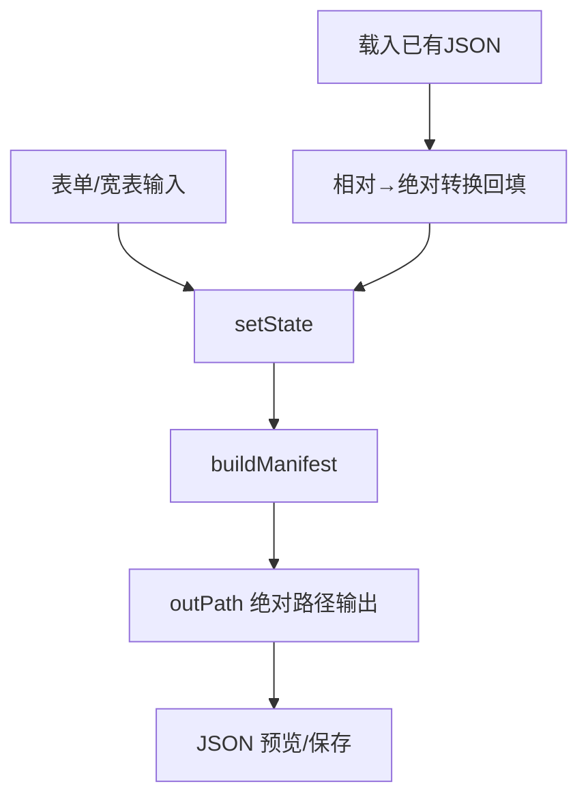

## 用户需求

将 dataset.json 编辑器的输出策略由"默认相对路径"改为"始终输出绝对路径"，避免生成的数据集清单中出现相对路径，保证下游分析流程直接以绝对路径定位文件。

## 产品概述

在既有数据集定义编辑器（agent/apps/dataset.html + js/dataset.js）基础上调整路径输出逻辑：生成的 expression / annotation / sampleinfo / mapping_file 字段恒为绝对路径，相对路径仅在用户手动勾选"使用相对路径"且填写基准目录时才生效。载入已有含相对路径的 JSON 时仍将其转换为绝对路径回填，且不自动切回相对输出模式。

## 核心功能

- 生成的 dataset.json 中所有文件路径字段默认保持绝对路径
- "使用相对路径"改为可选开关，默认关闭；勾选后需提供基准目录方可相对化
- 载入含相对路径的已有 JSON 时回填为绝对路径，且不自动切回相对输出
- 校验提示与草稿持久化同步调整，避免误导用户

## 技术栈选型

- 延续既有纯前端工程约定：原生 HTML5 + 原生 ES2020 JavaScript（IIFE），无构建工具
- 样式沿用 `agent/apps/styles/kb.css` 设计令牌，本任务不新增样式文件
- 改动仅限 `agent/apps/js/dataset.js` 中状态默认值、序列化出口、UI 渲染、校验、草稿与载入回填逻辑；不涉及后端 VB 代码（已确认后端 ResolvePaths 对绝对路径兼容）

## 实现方案

### 核心策略

将路径输出改为"绝对优先"：默认 `state.useRelativePath = false`，`outPath()` 去除相对化分支恒返回原始字符串（保留 trim 以保证干净输出），仅当显式勾选相对路径且基准目录非空时才调用 `PathUtil.toRelative()`。载入已有 JSON 时仍执行相对→绝对转换以便编辑，但移除"自动切回相对输出"的副作用。

### 关键技术决策

1. **默认绝对路径**：`useRelativePath` 默认值由 `true` 改为 `false`，从根源上保证新建清单输出绝对路径。
2. **`outPath()` 简化**：移除条件相对化分支，默认返回 `trim(p)`；相对化逻辑保留在条件分支内由 UI 开关驱动，避免破坏 `verifyFiles` 等其它调用方。
3. **UI 标签与提示**：复选框标签改为"使用相对路径（基于基准目录）"，默认不勾；未勾选时显示"当前输出绝对路径"说明文字。`baseDir` 输入框保留，仍用于载入相对 JSON 的解析与文件存在性校验的绝对化。
4. **校验调整**：仅在 `useRelativePath && !baseDir` 时给出警告（文案已适配），默认场景无警告。
5. **草稿与载入**：草稿读取时 `useRelativePath` 默认 `false`；载入 `loadManifestObject` 移除 `if (sawRelative) state.useRelativePath = true`，避免静默回退。

### 性能与可靠性

- 改动为纯逻辑分支调整，无新增 DOM 节点或事件监听，性能零影响
- 保持 baseDir 输入框用于文件存在性校验（verifyFiles），避免绝对化校验失效
- 草稿持久化字段兼容旧草稿（缺省 false），不破坏已有草稿恢复

### 实现要点

- 仅修改 `agent/apps/js/dataset.js`，不触碰 `dataset.html`、`dataset.css` 与后端
- `outPath()` 保留函数签名，避免其它模块（如 verifyFiles 第 1225 行）调用报错
- 相对路径转换能力仍保留，满足用户偶尔需要相对输出的诉求

## 架构设计

本任务为既有前端的局部逻辑优化，不涉及架构变更。数据流保持：表单输入 → setState → buildManifest（经 outPath 输出绝对路径）→ 预览/保存。



## 目录结构

```
g:/OmicsWorks/agent/apps/
└── js/
    └── dataset.js   # [MODIFY] 调整 useRelativePath 默认值(第93行)、outPath 相对化分支(第409-414行)、
                     #   校验相对路径警告(第552-554行)、renderPaths 复选框文案与默认态(第752行)、
                     #   loadDraft 默认 false(第985行)、loadManifestObject 移除自动切回(第1055行)、
                     #   relPathChk change 事件保持(第1367-1372行)
```

## Agent Extensions

### Skill

- **playwright-cli**
- Purpose: 在浏览器中验证路径输出行为（绝对路径默认输出、勾选相对路径需基准目录、载入相对 JSON 回填为绝对路径且不回退）
- Expected outcome: 通过 Playwright 自动化确认生成 JSON 中字段为绝对路径，且边界场景提示正确