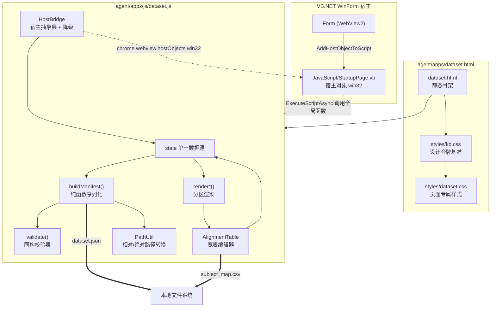

## 用户需求

在 `agent/apps/dataset.html` 中构建一个纯前端（HTML + JavaScript）的「组学数据集定义文件编辑器」Web 应用，用于可视化生成 Agent 数据分析流程所需的 dataset JSON 字符串。该 JSON 的结构由 `src/AppRuntime/DatasetManifest.vb` 与 `src/Program.vb` 的帮助文本定义。页面运行于 VB.NET WinForm 的 WebView2 控件中，由宿主代码提供本地文件系统真实路径。视觉风格必须与 `agent/apps/styles/kb.css` 的颜色令牌、阴影令牌、圆角体系完全一致。

## 产品概述

一个双栏工作台式的数据集清单编辑器：左侧为组学数据集列表（可增删、排序、切换），右侧为当前选中数据集的详细字段表单；下方独立区块承载样本对齐（sample_alignment）配置与宽表编辑；顶部提供模式切换、载入、校验、保存、主题切换等全局操作；右侧可展开实时 JSON 预览面板，随表单编辑即时同步高亮显示最终产物。

整体沿用现有 kb.html 的顶栏 + 侧栏 + 内容区栅格骨架，卡片化分区，浅色/暗色双主题，蓝色（#007acc）为主强调色，卡片带轻微阴影与左侧彩色标识条，交互带有细腻的位移与阴影过渡动效。

## 核心功能

### 1. 双模式数据集编辑

- **单组学模式**：简化表单，仅编辑一个数据集条目，输出仅含 1 个元素的同构 `datasets` 数组
- **多组学模式**：支持任意数量数据集条目的增加、删除、复制、上下排序
- 模式互相切换时保留已填数据，不丢失用户输入
- 每个条目字段：`id`（必填、唯一）、`type`（转录组/蛋白组/代谢组/脂质组等预设下拉 + 自由输入）、`label`（展示名）、`expression`（必填，表达矩阵 CSV）、`annotation`（注释表 CSV）、`sampleinfo`（样本元数据 CSV）、`unit`（单位，带常用值建议）

### 2. 本地文件路径选取

- 三个路径字段均提供「浏览」按钮，通过宿主对话框返回本地真实绝对路径
- 支持绝对路径 / 相对清单文件目录的相对路径两种展示形态，可一键互转
- 宿主不可用时（浏览器直开）降级为手工输入，并给出提示

### 3. 样本对齐（sample_alignment）编辑

提供四种互斥/协同的工作方式：

- **省略**：不声明该节点，表示各组学样本 ID 天然一致
- **引用已有 CSV**：通过宿主选择现成的宽表 CSV，写入 `mapping_file`
- **内联编辑**：可视化宽表编辑器，首列固定为 `subject_id`，其余列名自动跟随各数据集 `id` 同步（增删数据集时列自动增删、改名时列自动改名），写入 `subject_map` 内联数组
- **导出为 CSV**：把内联编辑好的宽表导出成 `subject_map.csv` 文件，并自动把 JSON 切换为 `mapping_file` 引用形式
- **自动提取样本名**：通过宿主读取各数据集 `expression` CSV 的表头，把样本列名抽取出来作为对应列的候选下拉/自动补全，并支持「按行数批量生成 subject_id」「按同名自动配对填充」

宽表编辑器支持：增删行、行内单元格编辑、单元格候选下拉、粘贴多行文本批量导入、清空、行数统计、未匹配/空值高亮。

### 4. 载入已有 JSON 二次编辑

- 通过宿主选择已有 dataset JSON 文件载入，或直接粘贴 JSON 文本载入
- 解析后回填全部表单与宽表，自动识别单组学/多组学模式
- 解析失败给出精确的错误位置与原因提示

### 5. 实时校验与预览

前端同构复刻后端校验规则，实时给出可定位的错误/警告：

- `datasets` 不可为空
- `id` 必填、去空格、大小写不敏感唯一（重复时指出与哪一条冲突）
- `expression` 必填
- `mapping_file` 与 `subject_map` 不可同时声明
- 内联 `subject_map` 每行非空且必须含 `subject_id`
- 宽表列名与数据集 `id` 不一致时告警
- 存在校验错误时保存按钮禁用，错误项在对应字段就地红框提示

JSON 预览面板实时同步、语法高亮、字符数统计。

### 6. 输出与落地

- **宿主保存**：调用宿主保存对话框，把 JSON 写入用户指定的本地路径；同样支持把宽表导出为 CSV
- **降级兜底**：宿主不可用时提供「复制到剪贴板」与「浏览器下载」两种方式
- 保存成功/失败均有明确状态反馈

### 7. 宿主集成

- 顶栏保留 `id="topbar"`，便于宿主内嵌时隐藏并由 Ribbon 接管操作
- 关键操作（主题切换、载入、保存、校验、取 JSON 文本、设置基准目录）全部暴露为页面全局函数，供宿主 `ExecuteScriptAsync` 直接驱动

## 视觉效果

- 顶栏：品牌标识 + 标题 + 模式切换段控件 + 主要操作按钮组 + 主题切换
- 左侧栏：数据集条目卡片列表，选中态为强调色边框 + 浅蓝底 + 内阴影，悬停右移 3px
- 主内容区：卡片化分区（基本信息卡 / 文件路径卡 / 样本对齐卡 / 校验结果卡），每卡带彩色左边条与圆点标题
- 宽表编辑器：斑马纹表格，粘性表头，单元格聚焦时强调色描边 + 柔光环
- JSON 预览：等宽字体、代码底色、可折叠侧滑面板
- 全局淡入上浮进场动画，按钮悬停上移 1px 并加深阴影，浅色/暗色主题平滑过渡

## 技术栈选型

严格沿用 `agent/apps/` 现有前端工程约定，零构建工具、零 npm、零框架：

| 层面 | 选择 | 依据 |
| --- | --- | --- |
| 页面 | 原生 HTML5（`<html lang="zh-CN" data-theme="light">`） | 与 kb.html / analysis.html / viewer.html 完全一致 |
| 脚本 | 原生 ES2020 JavaScript（IIFE 模块化，无打包） | 与 kb.js / app.js / viewer.js 一致 |
| 样式 | `styles/kb.css`（设计令牌基准）+ 新建 `styles/dataset.css`（页面专属） | 与 viewer.html 的「kb.css 在前、专属 css 在后」约定一致 |
| 宿主交互 | WebView2 `chrome.webview.hostObjects.win32`（异步代理）+ 宿主 `ExecuteScriptAsync` 调用全局函数 | 复用 `BasePage.HostObject = "win32"` 已有注册机制 |
| 第三方依赖 | **无**（JSON 高亮自行实现约 40 行，避免引入 CDN 依赖） | 页面在 WinForm 内网环境运行，CDN 不可靠；kb.html 的 marked CDN 属特例 |


### 文件拆分取舍说明

用户原话为「基于 html+javascript 代码」，但工程既有约定（kb.html / analysis.html / viewer.html 无一例外）均为 `xxx.html` + `styles/xxx.css` + `js/xxx.js` 三件套。**采用三件套拆分**，理由：

1. 与既有 4 个页面保持结构一致，降低维护认知成本
2. `styles/kb.css` 必须以 `<link>` 引入才能复用令牌，本身已是多文件形态
3. 单文件会导致约 2000 行的巨型文件，不利于后续扩展

## 实现方案

### 核心策略

采用**单一数据源（Single Source of Truth）+ 声明式渲染**的轻量 MVC：

维护一个内存中的规范化状态对象 `state`（含 `mode` / `datasets[]` / `alignment` / `baseDir` / `activeIndex`），所有 UI 交互只修改 `state`，随后调用 `render()` 按需重绘受影响区域；`buildManifest(state)` 是唯一的纯函数出口，负责把 `state` 序列化为符合 `DatasetManifest` 契约的 JSON 对象；`validate(state)` 是唯一的纯函数校验器，返回结构化错误列表。这样保证「表单 → 预览 → 保存」三者永远一致，杜绝多处拼装 JSON 导致的不一致。

### 关键技术决策

**决策 1：宽表列与数据集 id 的联动采用「列定义派生」而非「列数据冗余」**

`subject_map` 的行对象是 `{ subject_id, <id1>, <id2>, ... }`，其键集合完全由 `datasets[].id` 决定。若把列名冗余存一份，数据集改名时需同步两处，极易失配。因此宽表在 `state` 中存为 `alignment.rows: Array<{subject_id, values: Map<datasetId, string>}>` 的等价结构（实际用普通对象 + 每次渲染时以 `datasets[].id` 为准投影列）。数据集改名时执行一次键迁移（旧键值搬到新键），删除时保留孤儿键但渲染时不展示、序列化时剔除——这样用户误删后重新添加同名数据集，数据仍可恢复，提升容错。

**决策 2：宿主交互统一封装为 `HostBridge` 抽象层，全异步 + 能力探测 + 优雅降级**

WebView2 的 `chrome.webview.hostObjects.win32` 是异步代理，所有调用返回 Promise。由于 `StartupPage` 类当前为空壳（无任何公开方法），JS 侧必须做到：

- 启动时探测 `window.chrome?.webview?.hostObjects?.win32` 是否存在，写入 `HostBridge.available`
- 每个宿主方法调用包裹 `try/catch`，方法不存在（COM 抛错）时回退到降级路径而非整页崩溃
- 降级路径：文件选取 → 手工输入框；文件保存 → `Blob` + `<a download>` 下载 + 剪贴板复制；读取 CSV 表头 → 提供 `<input type="file">` 本地读取兜底

这使得页面在「宿主方法尚未实现」「浏览器直接打开调试」两种场景下都完全可用，不阻塞前端交付。

**决策 3：定义清晰的宿主方法契约（供 VB 侧后续实现），全部为字符串进/字符串出**

COM 互操作对复杂类型支持差，因此契约统一为 `String -> String`（JSON 编码），避免数组/字典跨边界。签名见下方「关键代码结构」。

**决策 4：校验器与后端 `Validate` 方法同构，错误信息语义对齐**

前端校验完整复刻 `DatasetManifest.Validate` 的 6 条规则（含 `StringComparer.OrdinalIgnoreCase` 的大小写不敏感 id 去重语义），错误对象携带 `path`（如 `datasets[1].id`）用于就地定位高亮。**唯一不复刻的是「文件是否存在」**——该校验需要文件系统访问，改为可选的宿主异步探测（`fileExists`），宿主不可用时降为「未验证」灰色提示而非错误，避免误报阻断。

**决策 5：JSON 预览采用增量防抖渲染，避免大宽表下的性能问题**

宽表可能达到数百行，每次按键都全量序列化 + 高亮会造成卡顿。预览面板采用 150ms 防抖，且仅在面板可见时渲染；高亮用单次正则替换实现（O(n)），不引入 highlight.js。宽表本身使用 `contenteditable` 单元格 + 事件委托（表格容器绑定一个 `input` / `focusin` 监听），避免为每个单元格挂载监听器导致的 O(rows × cols) 事件开销。

**决策 6：相对路径 / 绝对路径转换在前端完成**

`DatasetManifest.ResolvePath` 以清单文件所在目录为基准解析相对路径。前端维护 `state.baseDir`（保存时由宿主回填，或用户手动指定），提供纯字符串的 Windows 路径相对化函数（大小写不敏感的公共前缀剥离 + `./` 前缀），并在 UI 上以开关控制输出形态。转换失败（跨盘符）时自动保留绝对路径并提示。

### 性能与可靠性

- 状态更新 → 渲染为分区重绘：改字段只重绘当前表单区，改 id 才触发侧栏 + 宽表列头重绘，避免全页重排
- 宽表渲染上限保护：超过 500 行时提示改用 `mapping_file` 引用方式，避免 DOM 爆炸
- 所有用户输入在写入 DOM 前经 `escapeHtml` 处理，防止路径/标签中的特殊字符破坏结构
- 状态自动持久化到 `localStorage`（key `dataset-editor-draft`），意外关闭后可恢复草稿；容量超限静默失败不影响主流程

### 技术债规避

- 复用 kb.css 全部既有类（`.app` / `.topbar` / `.brand` / `.btn` / `.card` / `.banner` / `.empty` / `.tag` / `.doc-item` 等），`dataset.css` 只新增 kb.css 确实缺失的表单控件、分段控件、表格编辑器、抽屉面板样式，且**一律使用 kb.css 的 CSS 变量**（`--accent` / `--shadow-md` / `--radius-sm` 等），不硬编码任何颜色值，从而自动获得暗色主题支持
- 主题切换逻辑与 `kb.js` 完全一致：`data-theme` 属性 + `localStorage` key 复用 `"kb-theme"`，`toggleTheme` 挂全局
- 不修改任何现有文件的行为；`index.html` 为 0 字节空文件，本次不动

## 实现要点

1. **`toggleTheme` 必须是全局可调用函数**（`window.toggleTheme = ...`，非 `const`/`let`），因为宿主 `FormFolderWorkspace.vb:152` / `FormKnowledgeBase.vb:28` 的既有模式就是 `ExecuteScriptAsync("toggleTheme();")`
2. **`topbar` 必须保留 `id="topbar"`**，宿主内嵌时会执行 `document.getElementById('topbar').style.display = 'none'`
3. **主题持久化 key 沿用 `"kb-theme"`**，保证与 kb.html / viewer.html 在同一 WebView2 用户数据目录下主题一致
4. **`body` 在 kb.css 中为 `overflow: hidden`**，滚动必须交给 `main.content`；新增的宽表容器需自带 `overflow: auto` 与粘性表头
5. **`.app` 栅格为 `312px 1fr` / `auto 1fr`**，直接复用即可得到与 kb.html 一致的顶栏 + 侧栏 + 内容区布局
6. **宿主对象访问必须用可选链**：`window.chrome?.webview?.hostObjects?.win32`，浏览器直开时 `chrome` 对象不存在
7. **COM 异步代理的属性访问也是 Promise**，方法调用必须 `await`，不可同步取返回值
8. **JSON 序列化时剔除空字段**：`annotation` / `sampleinfo` / `label` / `unit` / `type` 为空字符串时不写入 JSON，保持产物整洁（后端这些字段允许为空）
9. **`sample_alignment` 为「省略」模式时整个节点不写入 JSON**，而非写 `null` 或空对象
10. **不引入任何 CDN 依赖**，页面在 WinForm 离线环境需完全可用
11. 状态变更统一走 `setState` 入口，便于集中处理防抖预览、草稿持久化、校验触发，避免散落的副作用

## 架构设计



### 数据流

```
用户交互 (输入/点击/粘贴)
   → setState(patch)
   → validate(state) 产出结构化错误
   → render 分区重绘 (侧栏 / 表单 / 宽表 / 校验卡)
   → 防抖 150ms → buildManifest(state) → JSON 预览面板
   → 保存按钮 → HostBridge.saveTextFile() → 宿主对话框 → 落盘
                └─(宿主不可用)→ Blob 下载 / 剪贴板复制
```

### 模块职责

| 模块 | 职责 |
| --- | --- |
| `state` | 唯一可变数据源；`mode`、`datasets[]`、`alignment`、`baseDir`、`useRelativePath`、`activeIndex`、`errors[]` |
| `HostBridge` | 封装全部 WebView2 宿主调用；能力探测；异常捕获；降级实现 |
| `buildManifest` | `state` → `DatasetManifest` 契约对象的纯函数；剔除空字段；路径形态转换 |
| `validate` | 同构复刻后端 `Validate` 的纯函数校验器；返回 `{path, level, message}[]` |
| `AlignmentTable` | 宽表编辑器；列定义派生自 `datasets[].id`；事件委托；粘贴导入；CSV 导出 |
| `PathUtil` | Windows 路径相对化 / 绝对化；文件名提取；跨盘符保护 |
| `render*` | 分区渲染函数族：`renderSidebar` / `renderEntryForm` / `renderAlignment` / `renderValidation` / `renderPreview` |
| 全局 API | `run()` / `toggleTheme()` / `loadManifestJson()` / `getManifestJson()` / `setBaseDir()` / `saveManifest()` 供宿主驱动 |


## 目录结构

### 结构摘要

本次实现新增 1 个页面脚本、1 个页面样式，填充 1 个现存空文件；同时为 VB 宿主侧补充文件对话框相关的宿主方法（作为可选的配套项，JS 侧在其缺失时可降级运行）。

```
g:/OmicsWorks/
├── agent/
│   └── apps/
│       ├── dataset.html                # [MODIFY] 当前为 0 字节空文件，本次填充完整页面骨架。
│       │                               #   引入顺序：styles/kb.css → styles/dataset.css → js/dataset.js。
│       │                               #   结构复用 kb.html 约定：div.app > header.topbar#topbar
│       │                               #   + aside.sidebar#sidebar + div.scrim#scrim + main.content#content。
│       │                               #   topbar 含：drawer-toggle、brand(logo/标题/副标题)、spacer、
│       │                               #   单/多组学分段切换、载入按钮、保存按钮(primary)、预览开关、themeBtn。
│       │                               #   sidebar 含：数据集列表容器 #datasetList + 「添加数据集」按钮。
│       │                               #   content 含：#entryForm 卡片、#alignmentCard 卡片、
│       │                               #   #validationCard 卡片，以及右侧可折叠的 #previewPanel。
│       │                               #   所有交互元素只留占位与 id，逻辑全部在 dataset.js 中绑定。
│       ├── styles/
│       │   └── dataset.css             # [NEW] 页面专属样式，必须在 kb.css 之后引入。
│       │                               #   补充 kb.css 缺失的：表单控件(.field/.field label/.field input/
│       │                               #   select/textarea 的聚焦态 accent 描边 + accent-soft 光环)、
│       │                               #   分段控件(.segmented/.segmented button.active)、
│       │                               #   路径输入行(.path-row: input + 浏览按钮 + 清除按钮)、
£       │                               #   宽表编辑器(.align-table: 斑马纹/粘性表头/单元格聚焦态/
│       │                               #   .cell-empty 警示色/行操作列)、
│       │                               #   工具条(.toolbar)、可折叠预览抽屉(.preview-panel/.open)、
│       │                               #   JSON 高亮 token 色(.tok-key/.tok-str/.tok-num/.tok-punc)、
│       │                               #   字段级错误态(.has-error/.field-err)、
│       │                               #   状态吐司(.toast)。
│       │                               #   严格只使用 kb.css 的 CSS 变量，不硬编码颜色，
│       │                               #   暗色主题自动生效；含 860px 断点响应式适配。
│       └── js/
│           └── dataset.js              # [NEW] 页面全部逻辑，IIFE 包裹，风格对齐 kb.js。
│                                       #   分区块：常量与预设(组学类型/单位候选)、主题(复刻 kb.js 的
│                                       #   applyTheme/initTheme/全局 toggleTheme，key 沿用 "kb-theme")、
│                                       #   state 定义与 setState、HostBridge(能力探测+全部宿主调用+降级)、
│                                       #   PathUtil(相对/绝对转换)、buildManifest(纯函数序列化)、
│                                       #   validate(同构校验)、AlignmentTable(宽表编辑器,事件委托)、
│                                       #   CSV 解析与生成(处理引号/逗号转义)、
│                                       #   render 函数族(分区重绘)、JSON 高亮、防抖预览、
│                                       #   草稿持久化、事件绑定、
│                                       #   最后暴露全局 API：run/toggleTheme/loadManifestJson/
│                                       #   getManifestJson/setBaseDir/saveManifest/setMode。
└── win32/
    └── Application/
        └── JavaScript/
            └── StartupPage.vb          # [MODIFY] 当前为空壳类(仅 ClassInterface+ComVisible 特性)。
                                        #   新增 COM 可见的公开方法供 JS 调用，全部 String 进 String 出：
                                        #   OpenFileDialog(optionsJson)、SaveFileDialog(optionsJson)、
                                        #   WriteTextFile(argsJson)、ReadTextFile(path)、
                                        #   ReadCsvHeader(path)、FileExists(path)。
                                        #   均需 try/catch 包裹并以 JSON 返回 {ok, data|error}，
                                        #   避免 COM 异常穿透到 JS。对话框需在 UI 线程上调用。
                                        #   注意：此文件为配套项，JS 侧在方法缺失时自动降级，
                                        #   两者可独立交付。
```

## 关键代码结构

### 1. 前端状态模型（唯一可变数据源）

```js
/**
 * @typedef {Object} DatasetEntryState
 * @property {string} id          组学标识，唯一（大小写不敏感）
 * @property {string} type        transcriptome | proteome | metabolome | lipidome | 自定义
 * @property {string} label       中文展示名
 * @property {string} expression  表达矩阵 CSV 绝对路径（必填）
 * @property {string} annotation  分子注释表 CSV 绝对路径（可空）
 * @property {string} sampleinfo  样本元数据 CSV 绝对路径（可空）
 * @property {string} unit        数据单位（可空）
 * @property {string[]} sampleNames 由宿主读取 expression 表头得到的样本名候选（不参与序列化）
 */

/**
 * @typedef {Object} EditorState
 * @property {'single'|'multi'} mode
 * @property {DatasetEntryState[]} datasets
 * @property {number} activeIndex
 * @property {Object} alignment
 * @property {'none'|'file'|'inline'} alignment.kind
 * @property {string} alignment.mappingFile          kind==='file' 时有效
 * @property {Array<Object<string,string>>} alignment.rows  kind==='inline' 时有效，每行含 subject_id 键
 * @property {string} baseDir                        清单文件所在目录，用于相对路径解析
 * @property {boolean} useRelativePath               输出时是否相对化路径
 */
```

### 2. 宿主方法契约（JS 调用侧 / VB 实现侧共同遵守）

所有方法 `String -> String`，返回体统一为 `{"ok":true,"data":...}` 或 `{"ok":false,"error":"..."}` 的 JSON 字符串，避免 COM 复杂类型与异常穿透。

```
win32.OpenFileDialog(optionsJson)
    入参 {"title":"...","filter":"CSV 文件|*.csv|所有文件|*.*","multiselect":false,"initialDir":"..."}
    返回 {"ok":true,"data":{"paths":["C:\\...\\counts.csv"]}}   取消时 paths 为空数组

win32.SaveFileDialog(optionsJson)
    入参 {"title":"...","filter":"JSON 文件|*.json","defaultName":"dataset.json","initialDir":"..."}
    返回 {"ok":true,"data":{"path":"C:\\...\\dataset.json"}}    取消时 path 为空串

win32.WriteTextFile(argsJson)
    入参 {"path":"C:\\...\\dataset.json","content":"...","encoding":"utf-8"}
    返回 {"ok":true,"data":{"path":"..."}}

win32.ReadTextFile(path)
    返回 {"ok":true,"data":{"content":"...","path":"..."}}

win32.ReadCsvHeader(path)
    读取 CSV 首行，返回列名数组（用于自动提取样本名）
    返回 {"ok":true,"data":{"columns":["gene_id","S1","S2","S3"]}}

win32.FileExists(path)
    返回 {"ok":true,"data":{"exists":true}}
```

### 3. 宿主可驱动的页面全局 API

```js
window.run(baseUrl)                 // 沿用现有页面约定的初始化入口
window.toggleTheme()                // 切换主题，宿主 ExecuteScriptAsync 直接调用
window.setMode('single'|'multi')    // 切换单/多组学模式
window.setBaseDir(dirPath)          // 宿主指定清单文件基准目录
window.loadManifestJson(jsonText)   // 载入 JSON 文本回填表单，返回是否成功
window.getManifestJson()            // 取当前编辑产物的 JSON 字符串
window.saveManifest()               // 触发保存流程（宿主对话框 → 落盘）
```

## 设计定位

桌面端 WinForm 内嵌的专业工具型 Web 应用。设计语言严格延续 `agent/apps/styles/kb.css` 已确立的 **VS Code / Visual Studio 亮暗双主题** 体系，视觉调性为「专业、克制、高信息密度、微交互精致」，而非消费级炫技风格。所有颜色、阴影、圆角一律取自 kb.css 已有的 CSS 变量，暗色主题零成本自动适配。

## 页面结构（单页面，四大功能区）

沿用 kb.css 的 `.app` 栅格骨架（`grid-template-columns: 312px 1fr` / `grid-template-rows: auto 1fr`），与 kb.html / viewer.html 视觉完全同源。

### 区块一：顶栏 Topbar（跨两列，`id="topbar"`）

高度约 62px，白/深底 + 底部 1px 边框 + `--shadow-sm`。左起：抽屉汉堡按钮（移动端显示）、品牌区（38px 圆角强调色方块 logo 内置 DNA 图标 + 主标题「数据集定义编辑器」+ 12px 灰色副标题显示当前清单文件名或「未命名」）；中部弹性留白；右侧操作组：单/多组学分段切换控件、「载入 JSON」、「导出宽表 CSV」、「保存」（primary 强调色实心）、「预览」切换、主题切换按钮。按钮均为 `.btn` 规格（13.5px / 600 字重 / 8px 圆角），悬停上移 1px 并加深阴影。

### 区块二：左侧栏 Sidebar（数据集列表）

浅灰底（`--ui-background-alt`）+ 右侧 1px 分隔线。顶部 12px 大写字距标题「数据集列表」，其下搜索框（复用 `.search`，聚焦时强调色描边 + 2px 柔光环）。列表项复用 `.doc-item` 形态：等宽字体的 `id`（如 `rna`）作 fname 行、`label` 作粗体 title 行、`type` 作强调色 src 行；悬停右移 3px 并浮起，选中态为强调色边框 + `--accent-soft` 底 + 内嵌 1px 强调色描边。每项右侧悬停浮现「复制 / 删除 / 上移 / 下移」微型图标按钮。列表底部固定一个虚线边框的「+ 添加数据集」占位按钮，悬停时边框转为强调色。单组学模式下侧栏收起，主区独占全宽。

### 区块三：主内容区（卡片化表单）

`main.content` 内以 `.view`（max-width 1080px 居中）承载三张卡片，均带 `rise` 进场动画：

- **基本信息卡（card--blue）**：蓝色左边条 + 蓝点标题「数据集基本信息」。两列自适应栅格排布 `id` / `type` / `label` / `unit` 四个字段。`id` 带唯一性即时校验，冲突时红框 + 下方 12px 红色说明；`type` 为可输入下拉（预设转录组/蛋白组/代谢组/脂质组）；`unit` 带 TPM / FPKM / peak area 快捷标签（复用 `.tag`，点击填入）。
- **文件路径卡（card--teal）**：青色左边条。三行路径输入组（表达矩阵 / 分子注释 / 样本元数据），每行为「标签 + 等宽字体输入框 + 浏览按钮 + 清除按钮」的 flex 行；表达矩阵行带必填红点标记。路径已选中时下方显示 11px 灰色文件名摘要与「文件存在 / 未验证」状态微标（绿点 / 灰点）。卡片底部一条「相对路径输出」开关 + 基准目录展示。
- **样本对齐卡（card--purple）**：紫色左边条。顶部四选一分段控件（省略 / 引用 CSV / 内联编辑 / 从矩阵提取）。选中「引用 CSV」显示单行路径选择；选中「内联编辑」展开宽表编辑器；选中「从矩阵提取」显示各数据集样本名抽取结果与「自动同名配对」按钮。
- **校验结果卡（card--orange / card--green）**：有错误时为橙色边条 + 错误清单（每条含可点击的定位路径如 `datasets[1].id`）；全部通过时切为绿色边条 + 对勾与「校验通过，可保存」文案。

### 区块四：宽表编辑器（样本对齐卡内嵌）

独立滚动容器（`max-height: 420px; overflow: auto`），粘性表头。首列固定为 `subject_id`（浅色锁定底 + 小锁图标），其余列名自动跟随各数据集 `id` 实时同步。单元格为 `contenteditable`，聚焦时强调色 1px 描边 + `--accent-soft` 2px 柔光环；空单元格显示极淡的警示底色。偶数行斑马纹（`--ui-background-alt`）。每行末尾悬停浮现删除图标。表格上方工具条：「+ 添加行」「批量粘贴」「清空」「自动同名配对」「导出 CSV」以及右对齐的行数统计（如「12 行 × 3 列」）。

### 区块五：JSON 预览抽屉（右侧可折叠）

默认收起，点击顶栏「预览」从右侧滑入宽 420px 的面板（`--shadow-lg` + 1px 左边框）。内部为等宽字体（`--font-code`）、`--code-background` 底色的滚动代码区，JSON 语法着色：键名用强调蓝、字符串用青绿、数字用橙、标点用弱化灰。顶部小工具条含「复制」「下载」按钮与字符数统计。切换以 0.3s ease 位移过渡。

## 交互与动效

- 全局进场：卡片 `rise` 0.4s（上移 14px + 淡入），主区切换 `fade` 0.35s
- 按钮悬停上移 1px + 边框转强调色 + `--shadow-sm`；按下回落
- 侧栏列表项悬停右移 3px
- 输入框聚焦：边框转 `--accent` + `0 0 0 2px var(--accent-soft)` 柔光环，0.2s 过渡
- 主题切换：`body` 的 background/color 0.35s ease 平滑过渡（kb.css 已内置）
- 保存成功/失败：右下角吐司提示，淡入上浮后 2.5s 自动消散
- 校验错误：字段红框以 0.2s 过渡出现，不使用抖动等干扰性动画
- 响应式：860px 断点下侧栏转为抽屉（复用 kb.css 的 `.scrim` / `.drawer-toggle` 机制），预览面板转为全屏覆盖

## 主题

浅色为默认（VS Code 亮色体系，白底 + #007acc 蓝），暗色为 VS Code Dark+ 体系（#1e1e1e 底 + #d4d4d4 前景）。切换由 `html[data-theme]` 驱动，持久化 key 沿用 `"kb-theme"`，与 kb.html / viewer.html 保持全局一致。

## Agent Extensions

### SubAgent

- **code-explorer**
- Purpose: 在实现宿主方法（`win32/Application/JavaScript/StartupPage.vb`）前，确认 win32 项目中已有的文件对话框调用惯例、异常处理与日志约定、以及 `Workbench` / `BasePage` 相关的既有工具方法，避免重复造轮子或违反既有约定
- Expected outcome: 产出 win32 项目内可复用的对话框/文件 IO 辅助方法清单与命名约定，使新增宿主方法与既有代码风格一致