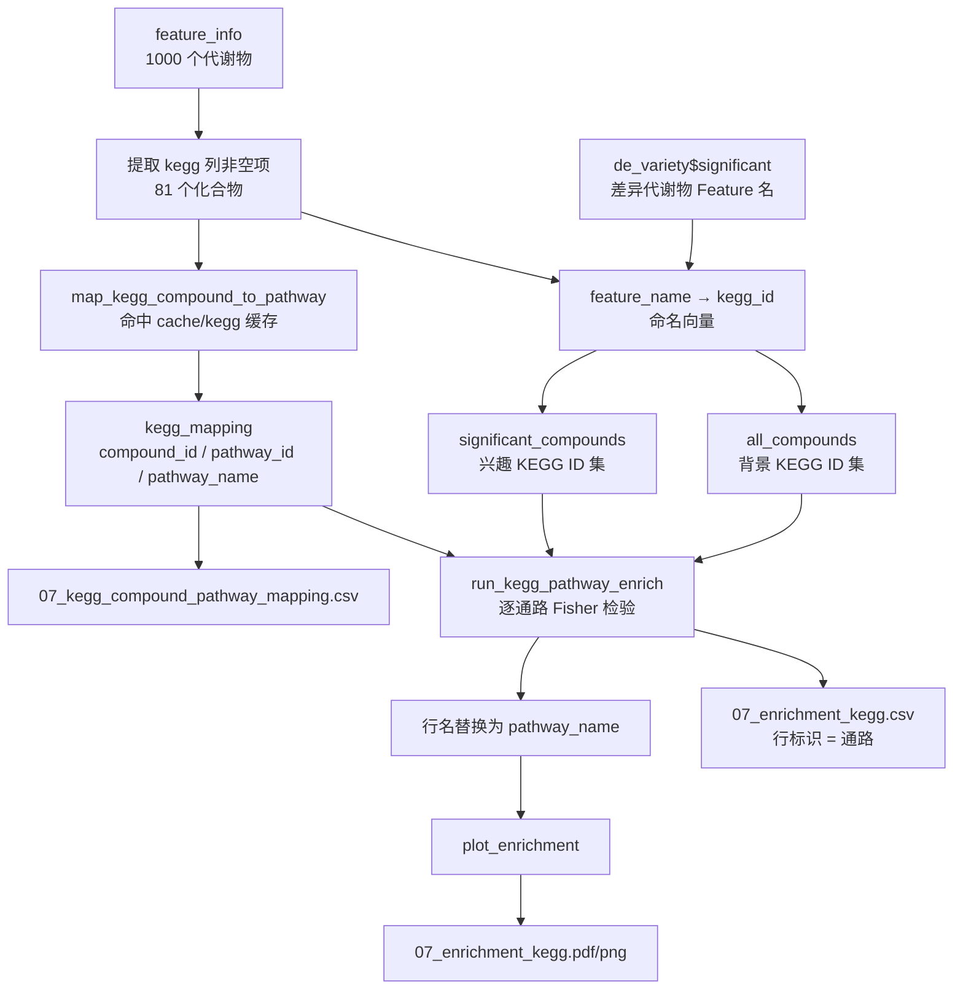

## 用户需求

修正 `test/multiple_omics/metabolism_demo/run_metabolome_demo.R` 中 KEGG 富集分析的科学性错误。

当前实现直接把代谢物注释表的 `kegg` 列（KEGG **化合物 ID**，形如 `C06174`）当作富集类别做 Fisher 检验。这在科学上是错误的：KEGG 富集的分析对象应当是**代谢通路（pathway）**，而非化合物 ID 本身。以化合物 ID 为类别时，每个"类别"通常只对应一个化合物，检验退化为无意义的单元素分组。

需要改为：先按 KEGG 化合物 ID 把代谢物映射到所属通路，再以通路为单位做过表达富集检验，重新生成 `results/07_enrichment_kegg.csv` 与对应结果图。

## 产品概述

在原有代谢组学 demo 基础流程中，将 SECTION 8 的 KEGG 富集环节由"化合物 ID 富集"整体替换为"通路富集"，其余分析段（化学分类富集 super_class / class / family）保持不变。

修正后的 KEGG 富集链路：

- 从注释表取出带 KEGG 化合物 ID 的代谢物（1000 个中共 81 个有注释）
- 通过化合物-通路映射把这些化合物展开为所属通路（一个化合物可归属多条通路）
- 背景集为全部有 KEGG 注释的化合物，兴趣集为差异代谢物中有 KEGG 注释的部分
- 对每条通路做 Fisher 精确检验，输出通路层面的富集结果

## 核心功能

### KEGG 化合物到通路映射

- 由注释表提取代谢物名称与 KEGG 化合物 ID 的对应关系，剔除空值
- 调用化合物-通路映射能力获得「化合物 → 通路 ID / 通路名称」关系表，优先命中本地缓存，避免重复联网查询
- 导出映射明细表，记录参与富集的化合物数、覆盖通路数与映射记录数

### 通路层面富集检验

- 背景集：全部带 KEGG 注释的化合物
- 兴趣集：差异代谢物中带 KEGG 注释的化合物
- 以通路为单位做单侧 Fisher 精确检验，计算富集倍数与校正 p 值
- 输出结果以通路名称标识，包含通路 ID、通路内化合物数、命中数、富集倍数、原始 p 值与校正 p 值

### 结果输出

- `results/07_enrichment_kegg.csv`：通路富集结果表，行标识为通路而非化合物 ID
- `results/07_kegg_compound_pathway_mapping.csv`：化合物-通路映射明细
- `figures/07_enrichment_kegg.pdf/png`：通路富集条形图，纵轴为通路名称，按富集倍数排序，显著通路以强调色区分

### 运行时信息输出

- 打印带 KEGG 注释的背景化合物数、兴趣化合物数、映射覆盖通路数
- 打印达到最小通路规模的通路数量、显著通路数量与 Top 通路名称
- 当映射为空或无通路达到规模阈值时给出明确提示并输出占位图，不中断整体流程

### 视觉效果

富集条形图为横向条形图，纵轴为通路名称（长名称截断显示），横轴为富集倍数，显著通路以红色填充、非显著以灰色填充，图例标注显著性阈值，标题标明为 KEGG Pathway Enrichment。

## 技术栈

- **运行环境**：GNU R 4.5.0（`C:\Program Files\R\R-4.5.0\bin\Rscript.exe`），Windows / PowerShell
- **模块库**：项目自有 `agent/rscript` 模块化脚本集
- **复用模块**：
- `agent/rscript/utils/kegg_pathway.R` —— `map_kegg_compound_to_pathway()`、`run_kegg_pathway_enrich()`
- `agent/rscript/enrichment/fisher_enrich.R` —— `plot_enrichment()`
- `agent/rscript/utils/export.R` —— `export_table()`、`export_plot()`
- **调用方式**：demo 脚本通过 `source_modules()` 加载模块后调用其导出函数，不在 demo 中重写分析逻辑

## 实现方案

### 总体策略

**复用库中已有的正确实现，不新增分析逻辑**。经核查，`agent/rscript/utils/kegg_pathway.R` 文件头注释已明确写明其设计目的为「此举纠正了把化合物 ID 当作通路 ID 的科学性错误」，即库层面早已提供了正确的通路富集能力，只是 demo 脚本未使用它。因此本次修正的本质是**把 demo 的调用方式从错误函数切换到正确函数**，而非编写新算法。

改动集中在 `run_metabolome_demo.R` 的 SECTION 8 末尾一段（现第 330-341 行），替换为三步：化合物-通路映射 → 通路富集 → 通路富集绘图。其余 SECTION 完全不动。

### 关键技术决策

**决策 1：函数选型 —— `run_kegg_pathway_enrich` 而非 `run_fisher_enrich`**

两者的类别语义完全不同：

| 维度 | `run_fisher_enrich(category_col="kegg")`（当前错误做法） | `run_kegg_pathway_enrich`（正确做法） |
| --- | --- | --- |
| 类别来源 | `feature_info$kegg` 单元格取值 | 化合物-通路映射表的 `pathway_id` |
| 类别语义 | 一个 KEGG 化合物 ID | 一条 KEGG 代谢通路 |
| 一对多关系 | 不支持（一个化合物只有一个 kegg 值） | 支持（一个化合物归属多条通路） |
| 背景集构成 | 全部有 kegg 值的化合物 | 全部有通路注释的化合物 |
| 结果行标识 | 化合物 ID（如 `C06174`） | 通路（如 `Metabolic pathways`） |


`run_fisher_enrich` 内部对 `category_col` 做 `table()` 计数，隐含「一个特征恰属一个类别」的假设，结构上无法表达化合物-通路的一对多关系，因此不能通过传参修正，必须换函数。

**决策 2：ID 命名空间的对齐（关键，易错点）**

本流程存在三套并存的标识体系，必须严格区分：

| 标识体系 | 取值示例 | 出现位置 |
| --- | --- | --- |
| Feature ID | 化合物名称（`FEATURE_ID_COL = "name"`） | `log2_mat` 行名、`de_variety$significant$feature_id`、`feature_info` 行名 |
| KEGG 化合物 ID | `C06174` | `feature_info$kegg` 列 |
| KEGG 通路 ID | `path:map01100` | 映射表 `pathway_id` 列 |


`run_kegg_pathway_enrich(significant_compounds, all_compounds, kegg_mapping)` 的前两个参数要求为 **KEGG 化合物 ID**，而 demo 中差异结果 `de_variety$significant$feature_id` 是 **Feature 名称**。因此必须先做一次 Feature 名 → KEGG 化合物 ID 的转换：

- 由 `feature_info` 构造 `feature_name → kegg_id` 命名向量（剔除 kegg 为空者）
- `all_compounds` = 该向量的全部取值（去重）
- `significant_compounds` = 差异特征名经该向量映射后的取值（去重、剔除 NA）

若跳过此转换直接传 Feature 名，`kegg_mapping$compound_id %in% all_compounds` 恒为 FALSE，会导致背景集为空、函数早退返回空 data.frame——这与既往在 `plspm_net.R` 中确证并修复过的 KEGG 命名空间错配属于同一类缺陷，需重点防范。

**决策 3：复用 KEGG 缓存，避免重复联网**

`map_kegg_compound_to_pathway(kegg_ids, cache_dir = KEGG_CACHE)` 已具备完善的双层缓存（正结果 `kegg_pathway_mapping.csv` + 负结果 `kegg_no_pathway_ids.txt`）。实测缓存已覆盖全部 81 个待查化合物（57 个有通路、24 个无通路），因此本次调用将完全命中缓存，耗时约 1.8 秒，无需联网。

`KEGG_CACHE` 常量已在 `config.R` 中定义并自动建目录，直接复用，不新增路径常量。

**决策 4：`min_size` 参数取值**

`run_kegg_pathway_enrich` 的 `min_size` 作用于**通路内的背景化合物数**（`length(pw_compounds) < min_size` 时跳过），语义与 `run_fisher_enrich` 的「显著集内计数」不同。

因背景集仅 57 个有通路注释的化合物，而通路数达 219 条，多数通路仅含 1-2 个化合物。取 `min_size = 2` 可在保留足够通路数的同时滤除单化合物通路（单化合物通路的富集检验无统计意义）。该取值与同 SECTION 中化学分类富集保持一致。

**决策 5：绘图函数复用与列名兼容性**

`plot_enrichment()` 依赖两个字段：行名（作为类别标签）与 `fold_enrichment` 列、`p_adj` 列。`run_kegg_pathway_enrich` 的返回结构恰好满足：

- 行名 = `make.unique(pathway_id)`
- 列含 `pathway_name`、`fold_enrichment`、`p_adj`、`significant`

但直接绘图会以 `pathway_id`（`path:map01100`）为标签，可读性差。因此在绘图前将行名替换为 `pathway_name`（通路名称），并对超长名称截断，使图形标签为人类可读的通路名。此操作为纯展示层数据整形，属 demo 职责范围，不修改模块。

**决策 6：错误处理与边界保护**

沿用本项目「不在 demo 中用 tryCatch 掩盖模块缺陷」的既定纪律，但需对**合法的空结果**做流程保护：

- 映射表为空 → 打印提示，跳过富集，仍导出空表与占位图
- 无通路达到 `min_size` → `run_kegg_pathway_enrich` 内部已 warning 并返回空 data.frame，`plot_enrichment` 已有空输入占位图分支，可安全衔接
- 上述均为数据本身导致的合法阴性，非缺陷；若运行中出现真实报错，按既定纪律回到模块源码修复

### 性能与影响面

- 映射步骤命中缓存，约 1.8 秒；通路富集为 219 条通路的 Fisher 检验循环，毫秒级
- 改动仅涉及 SECTION 8 末尾约 12 行的替换 + 模块加载清单增加一项，不影响 SECTION 1-7 与 SECTION 9 的缓存产物
- 其余 6 个 demo 脚本（WGCNA / 关联网络 / 回归 / PLSPM 等）不受影响，无需重跑

## 实现要点

- 在脚本顶部 `source_modules()` 清单中追加 `"utils/kegg_pathway.R"`，与现有加载风格一致
- 保持 SECTION 8 现有的 `section()` / `step()` / `cat()` 进度输出风格，打印背景化合物数、兴趣化合物数、覆盖通路数、显著通路数
- `export_table` 导出富集结果时 `use_rownames = TRUE`，`id_col_name = "pathway_id"`，使 CSV 首列为通路 ID，同时保留 `pathway_name` 列
- 图形文件名沿用 `07_enrichment_kegg`，保证覆盖旧产物，不产生冗余文件
- 变量命名沿用现有风格（`er_kegg` 等），避免与既有变量冲突

## 架构设计



数据流：注释表 → 提取 KEGG 化合物 ID → 化合物-通路映射（走缓存）→ Feature 名与 KEGG ID 双向对齐 → 通路级 Fisher 富集 → 结果表 + 通路富集图。

## 目录结构

```
g:/OmicsWorks/
├── test/multiple_omics/metabolism_demo/
│   ├── run_metabolome_demo.R                   # [MODIFY] 主改动文件。
│   │                                           #   (1) 顶部 source_modules() 清单追加 "utils/kegg_pathway.R"；
│   │                                           #   (2) 删除 SECTION 8 末尾"富集 category_col = kegg (边界测试)"
│   │                                           #       整段（现第 330-341 行），该段以 KEGG 化合物 ID 为类别，
│   │                                           #       是本次要修正的科学性错误；
│   │                                           #   (3) 新增"SECTION 8.4 KEGG 通路富集"段：由 feature_info 构造
│   │                                           #       feature_name → kegg_id 命名向量；调用
│   │                                           #       map_kegg_compound_to_pathway(kegg_ids, cache_dir=KEGG_CACHE)
│   │                                           #       获得化合物-通路映射并导出明细表；把差异特征名转为
│   │                                           #       KEGG 化合物 ID 作为 significant_compounds，全部有 KEGG
│   │                                           #       注释的化合物作为 all_compounds；调用
│   │                                           #       run_kegg_pathway_enrich(min_size=2) 得到通路级富集结果；
│   │                                           #       导出 07_enrichment_kegg.csv（use_rownames=TRUE,
│   │                                           #       id_col_name="pathway_id"）；绘图前把行名替换为
│   │                                           #       pathway_name 并截断超长名称，调用 plot_enrichment 后
│   │                                           #       export_plot 覆盖 07_enrichment_kegg 图；
│   │                                           #   (4) 打印背景/兴趣化合物数、覆盖通路数、达标通路数、显著通路数
│   │                                           #       与 Top 通路名，便于验证结果为通路而非化合物 ID；
│   │                                           #   (5) 空映射与空富集结果做流程保护，仍导出表与占位图，不中断
│   ├── results/
│   │   ├── 07_enrichment_kegg.csv              # [REGENERATE] 通路级富集结果，覆盖旧的化合物 ID 富集结果。
│   │   │                                       #   首列 pathway_id，含 pathway_name / sig_count / bg_count /
│   │   │                                       #   fold_enrichment / p_value / p_adj / significant
│   │   └── 07_kegg_compound_pathway_mapping.csv # [NEW] 化合物-通路映射明细，记录 compound_id / pathway_id /
│   │                                           #   pathway_name，作为富集结果的可追溯依据
│   ├── figures/
│   │   ├── 07_enrichment_kegg.pdf              # [REGENERATE] 通路富集横向条形图，纵轴为通路名称
│   │   └── 07_enrichment_kegg.png              # [REGENERATE] 同上 PNG 版本
│   └── DEBUG_REPORT.md                         # [MODIFY] 新增一节记录本次科学性修正：错误描述（以化合物 ID
│                                               #   为富集类别）、根因（未使用库中已有的通路富集函数）、
│                                               #   修复方案（改用 map_kegg_compound_to_pathway +
│                                               #   run_kegg_pathway_enrich）、修复前后结果对比（类别数与
│                                               #   类别语义变化）
│
└── agent/rscript/                              # 预期不改动，仅在实测出现真实报错时按既定纪律修复
    ├── utils/kegg_pathway.R                    # [READ] 复用 map_kegg_compound_to_pathway 与
    │                                           #   run_kegg_pathway_enrich；该文件头注释已声明其设计目的即为
    │                                           #   纠正"把化合物 ID 当作通路 ID"的错误
    └── enrichment/fisher_enrich.R              # [READ] 复用 plot_enrichment 绘制通路富集条形图
```

## 验证方式

1. 用 `Rscript.exe` 完整运行 `run_metabolome_demo.R`，确认无报错、无警告
2. 检查 `07_enrichment_kegg.csv` 首列为通路 ID（`path:mapXXXXX`）且含 `pathway_name` 列，行标识不再是 `C0xxx` 形式的化合物 ID
3. 核对表中 `bg_count` 均 ≥ 2（`min_size` 生效），`sig_total` / `bg_total` 与打印的兴趣/背景化合物数一致
4. 打开 `07_enrichment_kegg.png` 确认纵轴标签为通路名称而非化合物 ID
5. 确认 SECTION 1-7、SECTION 9 的产物与缓存未受影响

## Agent Extensions

### SubAgent

- **code-explorer**
- Purpose: 在实测运行出现跨模块报错时（如 `run_kegg_pathway_enrich` 内部因命名空间或列名不匹配报错），快速定位根因所在的文件、函数与代码行，并排查同类调用点是否存在相同问题
- Expected outcome: 准确给出缺陷所在文件路径、函数名与行位置，列出同类问题的其他调用点，避免遗漏重复缺陷