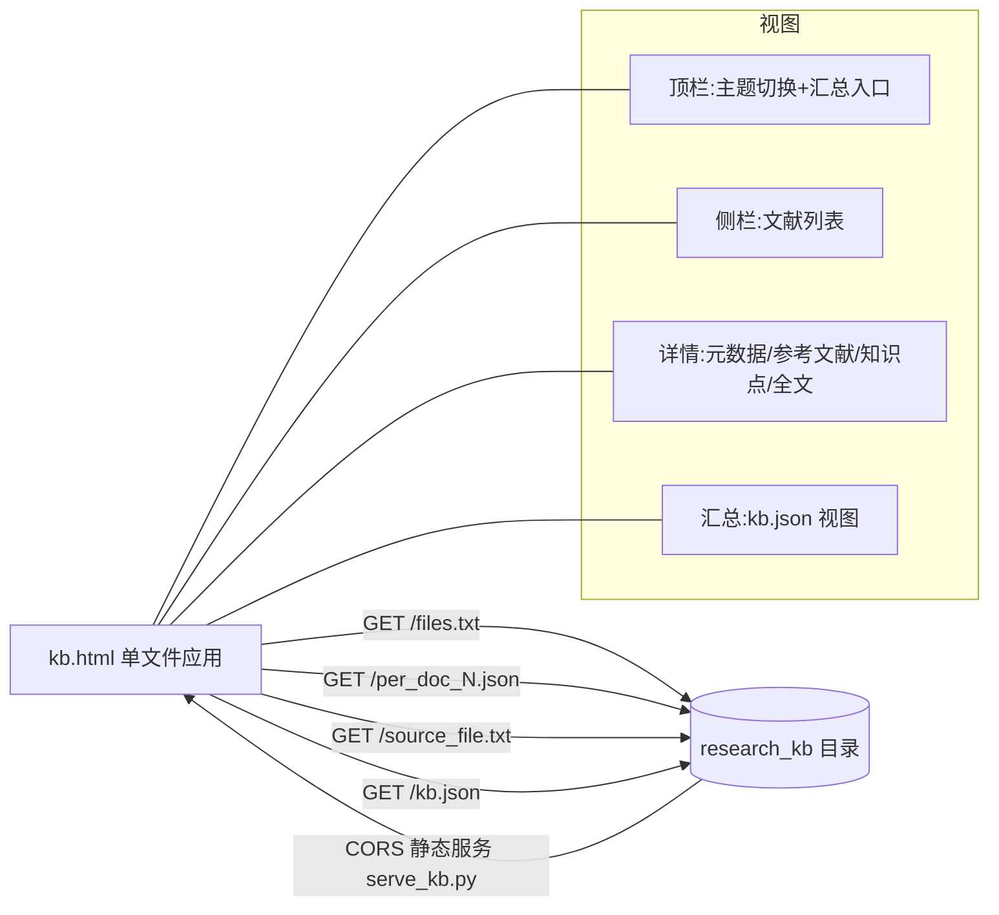

## 用户需求

基于 HTML + JavaScript 编写一个单文件 Web 应用（代码位于 `agent/apps/kb.html`），以交互方式管理位于 `G:\OmicsWorks\test\metabolism\demo\research_kb` 的文献知识库，并配套一个开启 CORS 的本地静态服务脚本用于托管该目录。

## 产品概述

应用提供三层知识库结构的可视化浏览：① txt 原文（从 PDF 提取）② per_doc 知识点提炼 json ③ kb.json 最终汇总。启动时从后端拉取文献清单，点击文献时惰性加载并解析其全文与关联知识点，同时可一键查看汇总知识库。界面支持生命科学主题的亮色 / 暗色自由切换。

## 核心功能

- 启动请求 `/files.txt` 获取全部 per_doc json 文件名（兼容 JSON 数组与换行文本两种格式）。
- 点击文献后惰性加载：解析 txt 前 4 行得到标题、元数据（doi/year/journal/keywords）、参考文献数组；渲染第 5 行起的 markdown 全文。
- 联动展示该文献关联的 per_doc 知识点（基因/蛋白、通路、代谢物、生物机制、关键发现、与研究主题相关性）。
- 通过 `/kb.json` 入口查看最终汇总知识库（研究主题、疾病表型、物种、组织及聚合的知识点）。
- 亮色 / 暗色主题切换并持久化，配色体现生命科学（绿 / 青 / 生物感）。
- 配套 Python 静态服务脚本（默认端口 80、目录为 research_kb），响应头开启 CORS，支持 `--port` / `--dir` 参数，使 `kb.html` 可直接以 file:// 打开并 fetch 绝对地址。

## 技术栈选择

- 前端：原生 HTML5 + 纯 JavaScript（ES6），单文件 `kb.html`，内联 CSS 与 JS，无构建工具、无框架。
- Markdown 渲染：CDN 引入 `marked.js`（`https://cdn.jsdelivr.net/npm/marked/marked.min.js`），CDN 失败时给出降级提示。
- 主题：CSS 自定义属性（`--var`）+ `<html data-theme>` 切换 + `localStorage` 持久化。
- 本地服务：Python 标准库 `http.server` 子类，重写响应头开启 `Access-Control-Allow-Origin: *` 等 CORS 头。

## 实现方案

- 策略：单文件客户端应用（轻量 SPA），所有数据通过 `fetch(BASE_URL + path)` 拉取；以 `BASE_URL` 常量（默认 `http://localhost`）集中配置端点。
- 三层数据流：① `GET /files.txt` → per_doc 文件名数组（侧栏）；② 点击 → `GET /per_doc_N.json`（取 `source_file` 与知识点）+ `GET /<source_file>.txt`（解析全文）并行惰性加载；③ 顶部按钮 → `GET /kb.json` 渲染汇总视图。
- txt 解析契约（关键，已核实）：按行切分，`lines[0]`=标题；`lines[1]`=元数据 JSON（`doi/year/journal/keywords`）；`lines[2]`=参考文献 JSON 数组（`title/doi/year/journal`）；`lines[3]`=空行；`lines[4..]`=markdown 全文。解析失败有容错（缺行/非 JSON 时降级展示原始文本）。
- 缓存：已加载的 per_doc json、txt 全文、kb.json 均存入内存 `Map`，避免重复请求；同一文献重复点击不触发二次网络请求。
- 性能与可靠性：懒加载仅在点开时请求全文，列表仅取文件名（不预拉全文），控制带宽与首屏时间；`marked.parse` 仅对当前文献全文执行；`fetch` 统一 `try/catch`，CORS / 404 / 解析错误给出明确中文提示而非静默失败。
- 技术债控制：沿用用户既定端点与文件格式，不引入额外抽象；解析逻辑集中在单一纯函数，便于后续扩展其他源格式。

## 实现要点

- 复用现有约定：端点路径、json 字段名（`source_file`、`biological_mechanisms[{mechanism,evidence}]` 等）严格对照已核实的真实文件。
- 日志：仅在控制台输出加载/错误关键节点（`console.warn/error`），不打印全文大对象，避免日志污染。
- 爆炸半径：仅新增两个文件，不改现有知识库数据；主题切换不影响数据逻辑；服务脚本默认只读托管，不写目录。

## 架构设计



## 目录结构

```
g:/OmicsWorks/
├── agent/apps/
│   └── kb.html            # [NEW] 单文件知识库管理 Web 应用。内联 CSS（主题变量+生命科学配色）与 JS。
│                           #   负责：BASE_URL 配置；fetch /files.txt 构建侧栏；点击惰性加载并解析
│                           #   per_doc json 与 txt 全文；marked.js 渲染 markdown；展示知识点面板；
│                           #   独立入口加载 /kb.json 汇总；亮/暗主题切换与 localStorage 持久化；
│                           #   加载/解析/网络错误的中文提示与缓存。
└── test/metabolism/demo/research_kb/
    └── serve_kb.py        # [NEW] 开启 CORS 的极简本地静态服务。继承 http.server，
                           #   重写响应头添加 Access-Control-Allow-Origin/Methods/Headers；
                           #   支持 --port（默认 80）与 --dir（默认脚本所在 research_kb）参数，
                           #   仅托管静态文件，供 kb.html 以 file:// 打开并跨域访问。
```

## 关键代码结构

```javascript
// txt 原文解析契约（纯函数，解析失败降级）
function parseDocTxt(rawText) {
  // 返回 { title, meta:{doi,year,journal,keywords:[]},
  //         references:[{title,doi,year,journal}], bodyMarkdown }
}

// 数据获取层（带缓存与 CORS/解析错误处理）
async function fetchJson(name)        // GET /<name>
async function fetchTextDoc(srcFile)  // GET /<srcFile>.txt -> parseDocTxt
async function loadKbSummary()        // GET /kb.json
```

## 设计风格

采用生命科学主题的 Glassmorphism（玻璃拟态）+ 现代简约风格。以薄荷白 / 深绿黑为底，emerald / teal 为强调色，卡片半透明磨砂、柔和阴影与微圆角，配合 hover 高亮、卡片淡入与主题过渡动效，营造专业、冷静、具有生物科技质感的界面。

## 页面规划（单页应用，桌面优先、响应式）

- 顶部导航栏：左侧品牌"文献知识库"与当前研究主题摘要；右侧含亮/暗主题切换按钮（日/月图标）与"知识库汇总"入口按钮。磨砂玻璃质感、底部细描边。
- 左侧文献栏：标题"文献列表"，由 `/files.txt` 渲染可滚动的 per_doc 列表，每项显示文件名与来源标题；hover 高亮、选中态 emerald 描边；加载中骨架占位。
- 主内容区-文献详情：① 元数据卡片（标题、DOI、年份、期刊、关键词标签）；② 参考文献卡片（解析第 3 行数组，列表展示标题/年份/期刊/DOI）；③ 知识点面板（基因/蛋白、通路、代谢物以标签云呈现；生物机制以"机制+证据"卡片；关键发现列表；相关性段落）；④ 全文区（marked.js 渲染 markdown，含标题层级、代码块与引用样式）。
- 主内容区-汇总视图：由 `/kb.json` 渲染，顶部展示 research_topic / disease_or_phenotype / organism / tissue 概览，下方聚合基因、通路、代谢物、机制的可折叠分区卡片。
- 响应式：窄屏时侧栏折叠为抽屉；卡片网格自适应列数。

## 交互

hover 微动效（抬升/描边发光）、卡片淡入、主题切换 0.3s 颜色过渡；知识点标签可点击高亮。