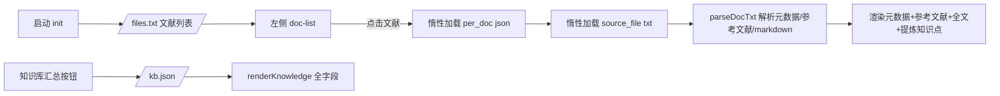

## 用户需求

修正并完善位于 `agent/apps/kb.html` 的文献知识库 Web 应用，解决当前存在的页面布局与 JS 交互逻辑问题，使其能稳定、流畅地以交互方式浏览知识库的三层结构。

## 产品概述

一个单文件（HTML + 原生 JavaScript）的本地知识库浏览器，从已开启 CORS 的本地静态服务（`http://localhost`）按需拉取数据，交互式查看文献知识库的三层结构：txt 原文、每篇文献的知识点提炼 json（per_doc）、以及最终汇总 kb.json。

## 核心功能

- 启动后请求 `/files.txt` 获取全部提炼 json 文件名列表并渲染左侧文献列表
- 点击文献时惰性加载对应全文 txt，解析其前 4 行结构化头（标题、元数据、参考文献）与第 5 行起的 markdown 全文，结构化展示：元数据卡、参考文献、markdown 渲染全文、关联的提炼知识点
- 点击「知识库汇总」请求 `/kb.json`，完整展示汇总知识库的全部字段
- 主题切换（亮/暗）、文献列表搜索筛选、移动端抽屉式侧栏

## 技术栈

- 前端：单文件 HTML + 原生 JavaScript（无构建、无框架），通过 CDN 引入 `marked` 渲染 markdown
- 数据来源：用户已运行的 CORS 静态服务 `http://localhost`（托管 `research_kb` 目录）；`BASE_URL` 在文件中硬编码为 `http://localhost`
- 设计语言：玻璃拟态 + 翠绿主色的浅/暗双主题（沿用现有 CSS 变量体系）

## 实现方案

保持单文件、零依赖、惰性加载的既有架构，仅针对已识别问题做精准修正，不引入新框架或重构。

### 关键修复点

1. **Grid 滚动失效（布局核心 bug）**：`.sidebar` 与 `main.content` 是 `height:100vh` 固定网格（`grid-template-rows: auto 1fr`）中的网格项，但缺少 `min-height:0` / `min-width:0`。当内容（长 markdown 全文、长知识点列表）超过可视区时，`overflow-y:auto` 无法生效，内容被 `body{overflow:hidden}` 裁切而非滚动。修复：为这两个网格项添加 `min-height:0`（并给主区加 `min-width:0`），使内部滚动正确触发。
2. **kb.json 汇总视图字段缺失**：现有 `renderKnowledge()` 仅渲染 `key_*` 列表、`biological_mechanisms`、`relevance_to_research_topic`。但 `kb.json` 还包含 `comparison_design_suggestions[{comparison,purpose}]`、`expected_findings[]`、`references[{title,key_finding}]`，当前被静默丢弃。需在汇总视图中补充这三种区块的渲染（per_doc 不含这些字段，需做存在性判断，避免误渲染）。
3. **交互体验与健壮性**：

- 切换文献时重置 `main` 的滚动位置（`scrollTop = 0`），避免残留旧滚动
- 侧栏初始「（点击加载标题）」占位改为更克制的文件名展示，加载后就地更新标题（沿用 `updateDocItemTitle`）
- 为 `selectDoc` 增加请求令牌（request token）防竞态：快速点击不同文献时，仅最后一次点击的结果生效，避免后发先至的覆盖

### 数据流



## 实现说明

- 复用现有 `parseDocTxt`、`getJson`/`getText`、`renderMarkdown`、`renderKnowledge`、`tagSection`、`mechanismsSection`、`bindTagToggle` 等函数，仅扩展 `renderKnowledge` 的字段分支与布局 CSS，避免大范围改动引发回归
- 新增区块渲染函数（如 `comparisonSection`、`expectedFindingsSection`、`kbReferencesSection`）保持与现有 `tagSection`/`mechanismsSection` 一致的卡片样式
- 所有新增渲染均做数组/字段存在性校验，空数据不渲染，保证 per_doc 与 kb 共用逻辑不互相污染
- 竞态防护采用模块级 `let activeToken = 0`，在 `selectDoc` 起始自增并捕获，异步结果返回后比对令牌，丢弃过期结果
- 不改动后端 `serve_kb.py` / `serve_kb.ps1`

## 目录结构

```
agent/apps/
└── kb.html   # [MODIFY] 单文件应用。修正：① .sidebar/main.content 添加 min-height:0/min-width:0 修复滚动；② renderKnowledge 扩展 kb.json 的 comparison_design_suggestions、expected_findings、references 三类区块渲染；③ selectDoc 增加滚动重置与异步竞态防护；④ 侧栏标题占位优化。保持现有玻璃拟态双主题风格与惰性加载逻辑不变。
```

保留现有的玻璃拟态（Glassmorphism）+ 翠绿（Emerald）主色、亮/暗双主题设计语言，不做视觉风格重塑，重点修正布局结构与三层知识结构的导航体验：

- 顶部栏（品牌 + 知识库汇总 + 主题切换）保持横跨双列的固定头部
- 左侧 312px 玻璃侧栏：文献列表 + 搜索框，修正后内部可独立滚动
- 右侧主区：修正后在固定高度内独立滚动，依次呈现「元数据卡 → 参考文献 → 全文(markdown) → 提炼知识点」的内容流；汇总视图呈现「概览 → 各类知识点 → 机制 → 相关性 → 对比设计建议 → 预期发现 → 文献关键发现」完整区块
- 区块统一使用圆角玻璃卡 + 翠绿渐变点缀，hover 微动效；关键词/标签可点击高亮
- 移动端（≤860px）侧栏转为抽屉，配遮罩层
整体维持生物感光斑背景、流畅淡入动画，仅修正导致内容被裁切的滚动问题并补全汇总视图的可视化层级。

## Agent Extensions

### Skill

- **playwright-cli**
- 用途：在浏览器中实测修正后的 kb.html（通过 file:// 打开，fetch 指向已运行的 http://localhost），验证三层结构导航、惰性加载、markdown 渲染、汇总视图全字段、主题切换与移动端抽屉
- 预期结果：截图/交互记录确认布局滚动正常、kb.json 全部字段正确渲染、无 JS 控制台报错，验证通过后停止测试会话不遗留进程