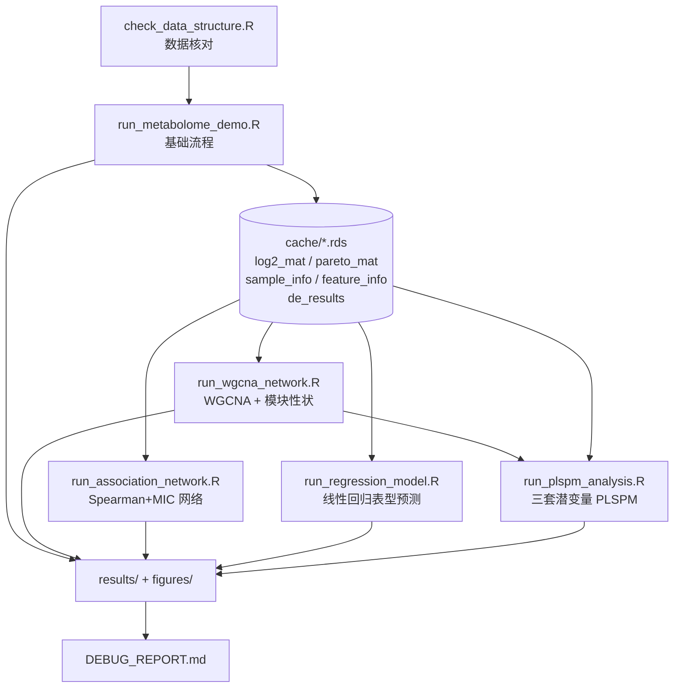

## 用户需求

在 `test/multiple_omics/metabolism_demo` 目录下构建一套完整的代谢组学分析 demo 流程，通过 `source()` 加载 `agent/rscript` 中的模块化 R 脚本并调用其函数完成分析，导出结果表格与插图。该流程同时作为模块库的集成测试用例：依据 GNU R 的真实运行输出定位缺陷，并在 `agent/rscript` 源码中修复（不允许在 demo 中用 tryCatch 绕过）。

在原有流程基础上追加 6 类分析模块：

1. WGCNA 共表达模块识别
2. Spearman + MIC 相关性网络
3. 线性回归模型预测分组/品种表型
4. PLSPM 路径分析 —— 以 WGCNA 共表达模块为潜变量
5. PLSPM 路径分析 —— 以 KEGG 通路为潜变量
6. PLSPM 路径分析 —— 以代谢物 class 分类为潜变量

## 产品概述

一套可一键运行的代谢组学分析 demo 流程，输入为烟叶发酵项目的三份测试数据：

- 代谢组表达矩阵（1000 个代谢物 × 312 个样本）
- 代谢物注释表（含 KEGG 编号、super_class、class、family 等化学分类）
- 样本信息表（含品种 variety、发酵阶段 phase、时间点 timepoint、产地 location 等分组信息）

流程按标准代谢组学分析范式串联全部功能模块，每一步均调用 `agent/rscript` 中已有的模块化函数，运行结束后在独立结果目录中产出全部数据表格与图片。

## 核心功能

### 基础分析链路

- **数据加载与对齐**：读取三张表，完成样本与特征对齐校验，输出数据概况摘要
- **数据预处理**：缺失值过滤、最小值一半填补、中位数归一化、log2 变换、Pareto 标度，记录每步矩阵规模变化
- **无监督分析**：主成分分析，按发酵阶段着色、品种区分形状，展示样本分布与聚集趋势
- **有监督判别分析**：偏最小二乘判别分析，输出样本得分分布与变量重要性排序
- **差异代谢物分析**：品种两组对比差异分析，以及按发酵阶段的多组差异检验
- **聚类热图**：选取差异显著代谢物绘制带样本分组注释与化合物类别注释的双向聚类热图
- **富集分析**：以代谢物化学分类为类别体系，对差异代谢物做过表达富集检验

### 新增分析链路

- **WGCNA 共表达模块**：基于软阈值幂构建加权共表达网络，识别代谢物共表达模块，输出模块成员归属、模块特征基因矩阵、软阈值筛选曲线与模块树状图；进一步做模块-表型关联分析，输出模块与品种/发酵阶段的相关性热图
- **Spearman + MIC 相关性网络**：在代谢物层内计算 Spearman 秩相关与 MIC 最大信息系数，合并两类统计量判定线性/非线性关联类型，输出显著关联边表、节点度表、枢纽节点清单与网络可视化图
- **线性回归表型预测**：以品种（二分类）与发酵阶段（多分类）为响应变量构建回归模型，输出逐特征单变量回归统计量（斜率、截距、R²、p 值、线性方程）、分类准确率与混淆矩阵
- **PLSPM 路径分析（三套潜变量体系）**：
- 以 WGCNA 共表达模块成员构造潜变量，分析模块间路径关系
- 以 KEGG 通路成员构造潜变量，分析通路间路径关系
- 以代谢物 class 分类构造潜变量，分析化学类别间路径关系
- 每套体系输出潜变量得分表、外模型载荷表、内模型路径系数表与路径网络图

### 视觉效果

- 图表为发表级质量：主成分与判别分析得分图带分组配色和置信椭圆；变量重要性图与富集结果图为横向条形图；差异分析为火山图并标注 Top 差异代谢物；热图带行列双向注释色块与层次聚类树；相关性网络与 PLSPM 路径图以节点度/路径系数映射视觉通道
- 分组配色统一，图例清晰，中文注释与英文图形标签并存

### 模块调试与修复

- 使用本机 R 解释器实际执行流程，逐段验证
- 依据 R 的真实报错与警告定位到模块源码的具体文件与函数
- 在 `agent/rscript` 源码中修复缺陷，修复后重跑直至流程完整无错通过
- 汇总说明修复了哪些模块的哪些问题，以及产出了哪些结果文件

## 技术栈

- **运行环境**：GNU R 4.5.0（`C:\Program Files\R\R-4.5.0\bin\Rscript.exe`），Windows / PowerShell
- **模块库**：项目自有 `agent/rscript` 模块化脚本集（65 个 `.R` 文件）
- **依赖包**（实测 `requireNamespace` 全部返回 TRUE，无需安装）：
- 基础绘图与数据：ggplot2、ggrepel、RColorBrewer、dplyr、tidyr、circlize
- 统计与组学：limma、mixOmics、ropls、ComplexHeatmap、pheatmap
- 新增模块依赖：**WGCNA、plspm、plsdepot、minerva、igraph、ggraph、tidygraph、psych、Hmisc、randomForest、caret、glmnet**
- **调用方式**：demo 脚本通过 `source()` 逐个加载所需模块脚本，再调用其导出函数；不在 demo 中重写任何分析逻辑

## 实现方案

### 总体策略

采用**分步骤多文件脚本 + 显式模块加载 + 中间态缓存**的架构：

1. **显式 `source()` 具体模块文件**（而非一次性 `source_all_scripts.R`），使报错直接对应到模块文件，便于定位修复；同时避免加载 microbiome/proteome/dbn 等无关脚本引入干扰
2. **按分析域拆分为多个可独立运行的脚本**：新增的 WGCNA / 关联网络 / PLSPM 属于重计算模块（WGCNA 的 TOM 计算、499500 对 Spearman、MIC 置换检验），若与基础流程塞进单文件，每次调试都要重跑全部前置步骤，迭代成本极高。因此拆分为基础流程脚本与进阶分析脚本，通过 `.rds` 中间态缓存衔接
3. **预处理产物落盘为 `.rds`**：基础流程末尾将 `log2_mat`、`pareto_mat`、`sample_info`、`feature_info`、差异分析结果缓存为 RDS，进阶脚本直接读取，避免重复预处理
4. **失败可续跑**：每个 section 独立产出结果，前面成功的产物不因后面报错丢失

### 关键技术决策

**决策 1：分组列的选择**

`sample_info`/`condition` 列有 26 个唯一值（粒度过细），直接用会导致配色板耗尽（`make_group_colors` 在 n>9 时退化为 `rainbow`）、limma 对比矩阵爆炸（25 个对比）、图例不可读。因此在调用时显式传参（不修改模块默认值，保持模块通用性）：

| 分析 | 分组列 | 组数 |
| --- | --- | --- |
| PCA 着色 / shape | `phase` / `variety` | 4 / 2 |
| PLS-DA | `variety` 与 `phase` 各跑一次 | 2 / 4 |
| limma 两组差异 | `variety`，显式 `control_group="Burley"` | 2 |
| 多组差异 ANOVA/F | `phase` | 4 |
| 热图列注释 | `phase` | 4 |
| 线性回归表型预测 | `variety`（二分类）+ `phase`（多分类） | 2 / 4 |
| WGCNA 模块-性状 | `variety`/`phase`/`day` 数值编码后作 traits | — |


**决策 2：`exclude_groups` 默认值的处理**

`run_limma`、`run_f_test`、`run_linear_model` 默认 `exclude_groups = "QC"`，但本数据集无 QC 样本。逻辑上 `!(x %in% "QC")` 应返回全 TRUE 从而保留全部样本，需实测确认；若 `group_col` 为 factor 导致比较异常，则在模块中加健壮性保护（`as.character()` 转换）。

**决策 3：新增模块的性能控制（关键）**

三个新增重计算模块在 1000×312 规模下的复杂度：

| 模块 | 复杂度 | 瓶颈 | 缓解策略 |
| --- | --- | --- | --- |
| `build_wgcna_modules` | O(p²) 邻接 + O(p³) TOM | p=1000 时 TOM 为 1000×1000 矩阵，`pickSoftThreshold` 扫描 20 个幂 | 按方差取 top 400 特征输入；`soft_power` 首轮自动选，记录后续可显式传入 |
| `run_intra_omics_association` | O(p²) 对数 = 499500 对 | `t(apply(mat,1,rank))` + 全对 rho 矩阵；MIC 置换 200 次 | 用 `top_n=300`（44850 对）；`max_pairs_for_mic=2000`；`mic_pvalue_method="permutation"`, `n_perm=200` |
| `run_plspm` | 每潜变量一次 `prcomp` + O(k²) 两两 lm | 潜变量数 k 过多时 inner model 为 k² 次回归 | `min_size` 控制潜变量粒度，必要时限制 k ≤ 15 |


这些参数在 demo 中显式传入，不修改模块默认值。

**决策 4：三套 PLSPM 潜变量体系的构造方式**

`run_plspm(expr_matrix, feature_info, latent_def, ...)` 的 `latent_def` 是「潜变量名 → 特征 ID 向量」的命名列表。三套体系的构造路径不同：

- **WGCNA 模块体系**：`build_wgcna_modules()` 返回的 `module_colors` 是「特征名 → 模块颜色」命名向量。由其反查每个模块的成员特征即可构造 `latent_def`（`split(names(module_colors), module_colors)`，剔除 `grey` 未分配模块）。这是纯数据整形，不属于分析逻辑，可在 demo 中内联；但更符合架构的做法是复用 `utils/predefined_modules.R` 的 `predefined_module_eigengenes` 思路——需先核实该文件是否提供可直接复用的构造函数
- **class 分类体系**：`build_latent_def_from_annotation()` 提供 `category_col` 参数，传入 `category_col="class"`、`use_kegg=FALSE`、`prefix_super="CLASS:"` 即可直接得到
- **KEGG 通路体系**：需先用 `map_kegg_compound_to_pathway()` 生成 `kegg_mapping`（含 `compound_id`/`pathway_id`/`pathway_name`），再传入 `build_latent_def_from_annotation(kegg_mapping=..., use_kegg=TRUE)`。**但该分支存在已确证的严重缺陷（见下）**

**决策 5：已确证缺陷 —— `build_latent_def_from_annotation` KEGG 分支命名空间错配**

源码（`network/plspm_net.R`）：

```
map_sub <- kegg_mapping[
  kegg_mapping$compound_id %in% kegg_vals[keep],
  c("compound_id", "pathway_name")
]
for (pid in unique(map_sub$pathway_name)) {
  members <- map_sub$compound_id[map_sub$pathway_name == pid]
  lv_features <- intersect(members, rownames(info))   # 永远为空
  ...
}
```

`members` 取自 `map_sub$compound_id`（KEGG 化合物编号，如 `C00025`），而 `rownames(info)` 是代谢物 feature ID（`METAB_xxxxx` 或化合物名）。两个命名空间永不相交 → `lv_features` 恒为空 → **KEGG 潜变量恒为 0 个，KEGG-PLSPM 必然失败**。

修复方案（最小改动、向后兼容）：在 KEGG 分支内建立 `compound_id → feature_id` 反向映射后再取成员：

```
# kegg_vals: names = feature_id, values = kegg compound_id
# 由 compound_id 反查 feature_id
members_cid <- map_sub$compound_id[map_sub$pathway_name == pid]
lv_features <- names(kegg_vals)[kegg_vals %in% members_cid]
lv_features <- intersect(lv_features, rownames(info))
```

**决策 6：KEGG 映射的离线可用性**

`map_kegg_compound_to_pathway()` 访问 KEGG REST API（带 `delay=0.3` 限速、`cache_dir` 缓存参数）。风险：网络不可用、API 限流、312 个化合物逐批查询耗时。且注释表 `kegg` 列**大部分为空**，实际可映射的化合物数可能很少。

处理策略（按优先级）：

1. 先统计 `kegg` 列非空比例与唯一 compound 数，评估可行性
2. 优先在 `extdata/` 下检索是否已有离线 KEGG 映射文件可复用
3. 调用 `map_kegg_compound_to_pathway()` 时**显式传入 `cache_dir`**（指向 demo 目录下的 cache 子目录），使首次查询结果落盘，后续重跑走缓存
4. 若 API 完全不可用或映射结果为空，则在模块中补充离线回退能力，并在报告中明确记录该限制；同时用 `class` 体系的 PLSPM 保证该分析类型仍有产出

**决策 7：WGCNA 输入矩阵的选择**

WGCNA 基于相关性构建网络，要求输入近似正态且保留特征间方差差异。Pareto 标度会压缩方差结构，因此：

- WGCNA、Spearman+MIC 网络、线性回归 → 使用 **log2 变换后的矩阵**
- PCA、PLS-DA → 使用 **Pareto 标度后的矩阵**
- limma 差异分析 → 使用 **log2 矩阵**（保证 logFC 语义正确）
- PLSPM → 使用 **log2 矩阵**（`run_plspm` 内部 `prcomp(scale.=TRUE)` 会自行标准化）

**决策 8：WGCNA 的 `cor` 函数冲突**

WGCNA 包与 `stats::cor` 存在众所周知的命名冲突，标准做法是在调用前 `cor <- WGCNA::cor`、调用后还原。`build_wgcna_modules` 内部通过 `corFnc = cor_fn_name` 字符串传参规避了部分问题，但 `TOMsimilarity`/`mergeCloseModules` 内部仍可能触发。需实测；若报错则在模块内加 `on.exit` 保护的临时覆盖。

**决策 9：非 ggplot 图形对象的导出**

模块返回的图形对象分三类，导出方式不同：

| 返回类型 | 涉及函数 | 导出方式 |
| --- | --- | --- |
| ggplot | `plot_pca_scores`、`plot_vip`、`plot_volcano`、`plot_enrichment`、`plot_soft_threshold`、`plot_module_trait`、`plot_association_network`、`plot_plspm_network` | `export_plot()` / `save_plot()` |
| ComplexHeatmap/pheatmap | `plot_heatmap` | **必须用 `export_heatmap()`** |
| base R 副作用绘图（返回 invisible NULL） | `plot_wgcna_dendrogram` | 二者皆不适用，需在模块中修复或用设备包裹 |


`plot_wgcna_dendrogram` 内部执行 `grDevices::pdf(NULL)` 打开空设备后用 base R 绘图，实际不会产出任何文件，且 `pdf(NULL)` 未配对 `dev.off()` 会泄漏设备。这是确定性缺陷，需修复为：接受 `output_dir`/`filename` 参数直接落盘，或移除 `pdf(NULL)` 使其在调用方打开的设备上绘制。

**决策 10：调试修复的边界控制**

- **只修被本流程调用到的模块**，不做无关重构
- 修复以**最小改动 + 向后兼容**为准：不改变函数签名与返回结构，只补齐健壮性（空结果保护、长度校验、列名兼容、factor/character 处理、命名空间映射修正）
- 若某处需改变行为，优先加防御分支而非替换原逻辑
- 每次修复后立即重跑对应 section 验证

### 已定位的高风险缺陷点

| 位置 | 风险描述 | 状态 |
| --- | --- | --- |
| `network/plspm_net.R` `build_latent_def_from_annotation` | KEGG 分支 compound_id 与 feature_id 命名空间错配，KEGG 潜变量恒为空 | **已确证** |
| `network/wgcna_module.R` `plot_wgcna_dendrogram` | `pdf(NULL)` 未配对 `dev.off()`；base 绘图返回 invisible NULL 无法配合 export_plot | **已确证** |
| `multivariate/plsda.R` `run_plsda` | `vip_df` 用 `rownames(expr_matrix)` 与 `vip_scores` 拼装，mixOmics 丢弃零方差变量时长度不一致 | 高风险 |
| `multivariate/plsda.R` `plot_plsda_scores` | scores 列名依赖 `comp1`/`Comp1` 猜测，mixOmics 实际可能为 `comp 1`（含空格） | 高风险 |
| `enrichment/fisher_enrich.R` `run_fisher_enrich` | 无类别通过 `min_size` 时 0 行 data.frame 的 `p_adj` 赋值与 `rownames` 设置异常 | 高风险 |
| `enrichment/fisher_enrich.R` `plot_enrichment` | `scale_fill_manual(labels=...)` 在显著性全 TRUE/全 FALSE 时 labels 数与 factor 水平数不匹配 | 高风险 |
| `multiomics/association_network.R` `.build_node_table` | `deg` 用含重复名的 `names_vec` 构造，`deg[s]` 按名索引只命中首个元素，degree 统计错误 | 高风险 |
| `multiomics/association_network.R` `run_intra_omics_association` | 499500 对全 rho 矩阵内存压力；MIC 置换耗时 | 性能 |
| `network/wgcna_trait.R` `wgcna_module_trait` | `traits` 需数值矩阵，而 variety/phase 为分类变量，需先数值编码；MEs 与 traits 样本对齐 | 高风险 |
| `network/wgcna_module.R` `build_wgcna_modules` | `pickSoftThreshold` 返回 NA 时的回退；WGCNA `cor` 命名冲突；TOM 计算耗时 | 中风险 |
| `utils/plot_helpers.R` `save_plot` | 内部用 `ggsave`，对非 ggplot 对象不兼容 | 中风险 |
| `visualization/heatmap_plot.R` `plot_heatmap` | 依赖 feature_info rownames 与 expr_matrix rownames 匹配，不一致则 `match()` 全 NA | 中风险 |
| `differential/limma_de.R` `run_limma` | `pvalue_topN` 分支 `rownames(comp_data)` 索引错位（前面已置 NULL）；`all_results` 在回退路径未定义 | 中风险 |
| `utils/load_data.R` `print.OmicsData` | 引用 `x$metadata$matched`，实际字段为 `matched_features`，打印 NULL | 低风险 |
| `preprocessing/filter_missing.R` | `group_missing` 以组名作列名，特殊字符导致 data.frame 列名 mangle | 低风险 |
| `machine_learning/linear_model.R` `run_linear_model` | 多分类依赖 nnet::multinom；1000 特征逐 feature OLS 性能；`control_group` 与 factor 水平处理 | 中风险 |
| `multiomics/plot_association_network.R` `plot_association_network` | 边数过多时布局不可读；空图保护 | 中风险 |


### 特征 ID 关联策略

表达矩阵首列列名为 `name`，注释表主键为 `ID`（METAB_xxxxx）且另有 `name` 列。实现第一步必须核对表达矩阵行名的实际取值：

- 若行名为化合物名 → `load_feature_info(file, id_col = "name")`
- 若行名为 METAB 编号 → `load_feature_info(file, id_col = "ID")`

该判定同时决定：`run_fisher_enrich` 的 `feature_id_col`、`plot_heatmap` 的注释匹配、`run_plspm` 的 `feature_id_col`、`build_latent_def_from_annotation` 的 `feature_id_col` 取值。

## 架构设计



数据流：原始 CSV → 预处理链路 → 双矩阵（log2 用于 WGCNA/网络/回归/PLSPM/limma，Pareto 用于 PCA/PLS-DA）→ 各分析模块 → 表格 + 插图 → 调试报告。

## 目录结构

```
g:/OmicsWorks/
├── agent/rscript/                              # [MODIFY] 依据实测报错修复被调用模块
│   ├── utils/
│   │   ├── load_data.R                         # [MODIFY?] print.OmicsData 引用 metadata$matched 但实际字段为
│   │   │                                       #   matched_features；load_feature_info 大小写回退分支会把 id_col
│   │   │                                       #   一并转小写，需确认不破坏 rownames 设置
│   │   ├── export.R                            # [MODIFY?] export_table 对 0 行 data.frame 的 cbind 行为；
│   │   │                                       #   export_heatmap 的 pheatmap/ComplexHeatmap 分支实测；
│   │   │                                       #   png(type="cairo") 在 Windows 的可用性回退
│   │   ├── plot_helpers.R                      # [MODIFY?] save_plot 用 ggsave 保存非 ggplot 对象会失败，
│   │   │                                       #   需加类型判断或明确由 export_heatmap 承担
│   │   ├── kegg_pathway.R                      # [MODIFY?] map_kegg_compound_to_pathway 的网络失败回退与
│   │   │                                       #   cache_dir 缓存有效性；空映射结果的下游保护
│   │   └── predefined_modules.R                # [READ] 核实 predefined_module_eigengenes 是否可复用于
│   │                                           #   由 WGCNA module_colors 构造 latent_def
│   ├── preprocessing/
│   │   ├── filter_missing.R                    # [MODIFY?] group_missing 以组名作列名的 mangle 问题；
│   │   │                                       #   全部特征被移除时的空矩阵保护
│   │   ├── impute_missing.R                    # [MODIFY?] impute_min_half 逐行 for 循环在 1000×312 的性能；
│   │   │                                       #   全 NA 行填 0 的边界
│   │   ├── normalize.R                         # [MODIFY?] 归一化后 NA 传播
│   │   └── scale.R                             # [MODIFY?] scale_pareto 对零方差行的处理
│   ├── multivariate/
│   │   ├── pca.R                               # [MODIFY?] ncomp 上限；plot_pca_scores 中 shape 水平超 25 的处理；
│   │   │                                       #   sample_info 按 scores$sample_id 重排的正确性
│   │   └── plsda.R                             # [MODIFY?] 高风险：vip_scores 与 rownames 长度不一致；
│   │                                           #   scores 列名 comp/Comp/含空格 兼容
│   ├── differential/
│   │   ├── limma_de.R                          # [MODIFY?] pvalue_topN 分支 rownames 索引错位；
│   │   │                                       #   all_results 在 limma 回退路径未定义；exclude_groups 无 QC 行为
│   │   ├── anova.R                             # [MODIFY?] 多因子建模与 exclude_groups 命名列表处理
│   │   └── f_test.R                            # [MODIFY?] 单组或组内样本不足时 aov 报错保护
│   ├── visualization/
│   │   ├── volcano_plot.R                      # [MODIFY?] p_value 为 0 时 -log10 产生 Inf；
│   │   │                                       #   direction 单一水平时 scale_color_manual labels 不匹配
│   │   └── heatmap_plot.R                      # [MODIFY?] feature_info rownames 匹配失效；
│   │                                           #   col_order 与 ComplexHeatmap column_order 一致性
│   ├── enrichment/
│   │   └── fisher_enrich.R                     # [MODIFY?] 高风险：空结果时 p_adj 赋值与 rownames 设置；
│   │                                           #   plot_enrichment 的 fill labels 数量不匹配
│   ├── network/
│   │   ├── wgcna_module.R                      # [MODIFY] 已确证：plot_wgcna_dendrogram 的 pdf(NULL) 未配对
│   │   │                                       #   dev.off()，base 绘图无法配合 export_plot；
│   │   │                                       #   [MODIFY?] pickSoftThreshold 返回 NA 回退、WGCNA cor 命名冲突
│   │   ├── wgcna_trait.R                       # [MODIFY?] traits 需数值矩阵而表型为分类变量；
│   │   │                                       #   MEs 与 traits 样本对齐；plot_module_trait 空结果保护
│   │   └── plspm_net.R                         # [MODIFY] 已确证：build_latent_def_from_annotation KEGG 分支
│   │                                           #   compound_id 与 feature_id 命名空间错配导致潜变量恒为空；
│   │                                           #   [MODIFY?] run_plspm 潜变量数过多时 inner model 性能与可解性；
│   │                                           #   plot_plspm_network 在 inner_model 为空时的保护
│   ├── multiomics/
│   │   ├── association_network.R               # [MODIFY?] 高风险：.build_node_table 中 deg 用含重复名向量构造，
│   │   │                                       #   按名索引只命中首个导致 degree 统计错误；
│   │   │                                       #   499500 对全 rho 矩阵内存；MIC 置换耗时
│   │   └── plot_association_network.R          # [MODIFY?] 边数过多布局不可读；空图/空边表保护
│   └── machine_learning/
│       └── linear_model.R                      # [MODIFY?] exclude_groups="QC" 默认值；多分类 nnet::multinom 依赖；
│                                               #   1000 特征逐 feature OLS 性能；control_group 与 factor 水平处理
│
└── test/multiple_omics/metabolism_demo/        # [NEW] demo 流程与产物目录
    ├── config.R                                # [NEW] 公共配置脚本。职责：集中定义 RSCRIPT_ROOT / DATA_DIR /
    │                                           #   OUT_DIR / CACHE_DIR 路径常量、分组列名常量（GROUP_VARIETY=
    │                                           #   "variety"、GROUP_PHASE="phase"）、性能参数常量（WGCNA_TOP_N、
    │                                           #   ASSOC_TOP_N、MIC_MAX_PAIRS、N_PERM）、以及一个按相对路径列表
    │                                           #   批量 source 模块的辅助函数。所有分析脚本首行 source 本文件，
    │                                           #   保证路径与参数单点定义
    ├── check_data_structure.R                  # [NEW] 前置数据核对脚本。职责：核实表达矩阵首列取值形态（化合物名
    │                                           #   vs METAB 编号）、表达矩阵行名与注释表 ID/name 列的匹配率、
    │                                           #   kegg 列非空比例与唯一 compound 数、class/super_class/family
    │                                           #   各分类的类别数与成员分布、候选分组列取值分布、缺失值与零值比例。
    │                                           #   输出核对摘要 CSV，用于确定后续脚本中 id_col / category_col /
    │                                           #   分组列 / KEGG 可行性的正确取值
    ├── verify_source_all.R                     # [NEW] 模块加载连通性验证脚本。职责：单独执行
    │                                           #   agent/rscript/source_all_scripts.R，捕获加载汇总（成功/失败
    │                                           #   清单），记录哪些模块脚本无法被 source。用于测试加载器本身并
    │                                           #   暴露语法级错误
    ├── run_metabolome_demo.R                   # [NEW] 基础流程主脚本。职责：数据加载对齐 → 预处理链路
    │                                           #   （filter_missing_values / impute_min_half / normalize_median /
    │                                           #   log2 内联变换 / scale_pareto）→ PCA（run_pca /
    │                                           #   plot_pca_scores，phase 着色 variety 形状）→ PLS-DA
    │                                           #   （run_plsda / plot_plsda_scores / plot_vip，variety 与 phase
    │                                           #   各一次）→ limma 两组差异（variety）+ 火山图 → ANOVA/F 多组
    │                                           #   差异（phase）→ 聚类热图（plot_heatmap + export_heatmap）→
    │                                           #   化学分类富集（run_fisher_enrich / plot_enrichment）。
    │                                           #   末尾将 log2_mat / pareto_mat / sample_info / feature_info /
    │                                           #   de_results 保存为 cache/*.rds 供进阶脚本复用。
    │                                           #   要求：每 section 醒目注释分隔并 cat 进度与关键中间量
    │                                           #   （矩阵维度、分组计数、显著特征数）；不实现分析逻辑
    ├── run_wgcna_network.R                     # [NEW] WGCNA 共表达模块分析脚本。职责：读取 cache 的 log2 矩阵，
    │                                           #   按方差取 top N 特征 → build_wgcna_modules 构建共表达模块 →
    │                                           #   导出模块成员归属表（特征→模块颜色）、模块特征基因矩阵 MEs、
    │                                           #   模块规模统计 → plot_soft_threshold 软阈值曲线图 →
    │                                           #   plot_wgcna_dendrogram 模块树状图 → 将 variety/phase 等分类
    │                                           #   表型数值编码为 traits 矩阵后调用 wgcna_module_trait 做模块-
    │                                           #   性状关联 → plot_module_trait 相关性热图 → 导出
    │                                           #   module_trait_cor / module_trait_p / module_trait_lm。
    │                                           #   末尾将 wgcna_result 保存为 cache/wgcna.rds 供 PLSPM 复用
    ├── run_association_network.R               # [NEW] Spearman+MIC 相关性网络脚本。职责：读取 cache 的 log2
    │                                           #   矩阵 → run_intra_omics_association（显式传 top_n 控制特征数、
    │                                           #   max_pairs_for_mic 控制 MIC 计算量、mic_pvalue_method=
    │                                           #   "permutation"、n_perm、score_method="combined"）→ 导出
    │                                           #   显著关联边表（source/target/spearman-rho/spearman-pval/MIC/
    │                                           #   MIC-pvalue/score/pvalue/association）与节点度表 →
    │                                           #   build_association_network 构图 → plot_association_network
    │                                           #   网络图 → get_association_hubs 枢纽节点表。
    │                                           #   要求：打印线性/非线性/不显著边的计数分布便于验证
    ├── run_regression_model.R                  # [NEW] 线性回归表型预测脚本。职责：读取 cache 的 log2 矩阵 →
    │                                           #   run_linear_model 分别以 variety（二分类）与 phase（多分类）
    │                                           #   为响应变量建模 → 导出逐特征单变量回归统计表（feature_id/
    │                                           #   comparison/slope/intercept/r2/adj_r2/p_value/p_adj/n/equation）、
    │                                           #   分类模型系数表、混淆矩阵表 → 打印分类准确率。
    │                                           #   要求：显式传 exclude_groups 与 control_group 以规避默认 QC 假设
    ├── run_plspm_analysis.R                    # [NEW] 三套潜变量 PLSPM 路径分析脚本。职责：读取 cache 的 log2
    │                                           #   矩阵、feature_info 与 wgcna_result。
    │                                           #   (a) WGCNA 模块潜变量：由 wgcna_result$module_colors 按模块
    │                                           #       分组构造 latent_def（剔除 grey），run_plspm 建模；
    │                                           #   (b) KEGG 通路潜变量：map_kegg_compound_to_pathway 生成
    │                                           #       kegg_mapping（显式传 cache_dir 落盘缓存），
    │                                           #       build_latent_def_from_annotation(use_kegg=TRUE,
    │                                           #       use_super_class=FALSE) 构造，run_plspm 建模；
    │                                           #   (c) class 分类潜变量：build_latent_def_from_annotation
    │                                           #       (category_col="class", use_kegg=FALSE) 构造，run_plspm 建模。
    │                                           #   每套体系导出潜变量得分表、外模型载荷表、内模型路径系数表，
    │                                           #   并用 plot_plspm_network 输出路径网络图。
    │                                           #   要求：每套体系前打印潜变量个数与各潜变量成员数，便于定位
    │                                           #   "潜变量为空" 类缺陷
    ├── cache/                                  # [NEW] 中间态缓存目录（.rds + KEGG 映射缓存），由脚本自动创建。
    │                                           #   作用：避免重跑重计算模块时重复执行预处理与 WGCNA
    ├── results/                                # [NEW] 结果表格输出目录（CSV），由脚本自动创建。
    │                                           #   预期产物：数据核对摘要、缺失值报告、预处理后矩阵、PCA 得分与
    │                                           #   载荷、PLS-DA 得分与 VIP、limma 差异结果与显著子集、ANOVA/F
    │                                           #   检验结果、富集结果、WGCNA 模块归属与 MEs、模块-性状关联表、
    │                                           #   关联网络边表/节点表/枢纽表、回归系数表与混淆矩阵、
    │                                           #   三套 PLSPM 的得分/载荷/路径系数表
    ├── figures/                                # [NEW] 结果插图输出目录（PDF + PNG），由脚本自动创建。
    │                                           #   预期产物：PCA 得分图与载荷图、PLS-DA 得分图、VIP 条形图、
    │                                           #   火山图、聚类热图、富集条形图、WGCNA 软阈值曲线图与模块树状图、
    │                                           #   模块-性状相关性热图、关联网络图、三套 PLSPM 路径网络图
    └── DEBUG_REPORT.md                         # [NEW] 调试修复报告。职责：逐条记录实测发现的模块缺陷——所在文件
                                                #   与函数、R 的原始报错信息、根因分析、修复方案与改动点、修复后
                                                #   验证结果；单列一节说明已确证的两处缺陷（plspm_net.R 的 KEGG
                                                #   命名空间错配、wgcna_module.R 的 pdf(NULL) 设备泄漏）；
                                                #   末尾附产出文件清单、各模块耗时与流程运行结论
```

## 执行要点

- **运行命令**：PowerShell 中必须用 `& "C:\Program Files\R\R-4.5.0\bin\Rscript.exe" "<脚本绝对路径>"`（路径含空格）
- **编码处理**：R 控制台为中文本地化，报错为中文；读取 stderr 注意编码，必要时在脚本中以 UTF-8 写日志文件再读取
- **路径处理**：所有路径用正斜杠或 `file.path()` 构造；`source()` 用绝对路径，不依赖 `setwd`
- **增量验证顺序**：`check_data_structure.R` 确定关键参数 → `verify_source_all.R` 排查语法级问题 → `run_metabolome_demo.R` 基础链路 → 三个进阶脚本（WGCNA / 关联网络 / 回归）→ `run_plspm_analysis.R`（依赖 WGCNA 缓存）
- **性能控制**：WGCNA 输入按方差取 top 400；关联网络 `top_n=300`、`max_pairs_for_mic=2000`、`n_perm=200`；首轮跑通后再视实际耗时调整参数上限
- **绘图设备**：`export_plot`/`export_heatmap` 使用 `png(type="cairo")`，需确认 Windows 下 cairo 可用；不可用则在模块中加设备回退
- **图形导出对应关系**：ggplot 用 `export_plot`；热图用 `export_heatmap`；`plot_wgcna_dendrogram` 为 base 绘图需先修复模块
- **修复纪律**：所有修复落在 `agent/rscript` 源码，保持函数签名与返回结构不变，只增强健壮性；不在 demo 脚本中用 try/tryCatch 掩盖模块缺陷
- **避坑记录**：PowerShell 的 `Get-Content` 会被系统拦截（编码安全），改用 read_file 工具；嵌套引号的 `findstr` 会失败，改用 search_content 工具

## Agent Extensions

### SubAgent

- **code-explorer**
- Purpose: 在调试阶段遇到跨模块错误链路时（如 `run_plspm` 报错根因位于 `build_latent_def_from_annotation` 或 `utils/` 辅助函数），快速定位相关函数定义、调用点与依赖关系；同时用于核实 `utils/predefined_modules.R` 中 `predefined_module_eigengenes` 是否可复用于由 WGCNA `module_colors` 构造 `latent_def`
- Expected outcome: 准确给出缺陷所在的文件路径、函数名与代码行位置，并列出同类问题的其他调用点，避免遗漏重复缺陷