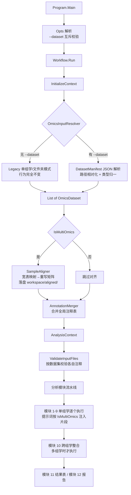

## 用户需求

为 `src/` 下的组学数据分析 LLM Agent 命令行程序进行多组学兼容性升级，在完全不破坏现有单组学分析能力的前提下，新增基于 JSON 数据集定义文件的多组学输入通道，并对分析流程中的 LLM 提示词做单组学 / 多组学双场景的兼容性优化。

## 产品概述

程序当前通过 `--expression / --annotation / --sampleinfo` 三个命令行参数直接接收单个组学的数据文件路径。升级后新增 `--dataset` 参数，接收一份描述多组学数据集的 JSON 文件，一次性声明多个组学的表达矩阵、独立注释表、样本元数据、组学类型、展示标签与数据单位，并声明跨组学的样本对齐关系。

新的调用方式：

```
research --research=research.txt --dataset=input.json --reference=refs/ -w=./workspace/
```

原有单组学调用方式保持完全不变。

## 核心功能

### 1. 数据集定义文件解析

- `datasets` 数组中每个元素描述一个组学：`id`（组学标识，同时作为样本对齐宽表的列名）、`type`（组学类型，如 transcriptome / metabolome）、`label`（中文展示名）、`expression`（表达矩阵）、`annotation`（该组学专属注释表）、`sampleinfo`（该组学样本元数据）、`unit`（数据单位，如 TPM / peak area）。
- JSON 内的相对路径一律相对该 JSON 文件所在目录解析。
- `type` 字段的外部取值自动归一化为程序内部统一的组学类型体系。

### 2. 跨组学样本对齐

`sample_alignment` 支持三种情形：

- **省略**：认为各组学样本 ID 已经天然一致，直接按同名一一匹配。
- **`mapping_file`**：指定一张 subject 宽表 CSV（首列 `subject_id`，其余列名与各 dataset 的 `id` 对应）。
- **`subject_map`**：直接以内联 JSON 对象数组给出映射关系。

对齐执行结果：程序按映射关系把每个组学表达矩阵的样本列名替换为统一的 `subject_id`，仅保留所有组学共有的 subject，生成全新的对齐矩阵与对齐后样本信息表并落盘到工作区，后续所有分析模块一律引用工作区中这些对齐后的新文件。对齐过程输出统计摘要（各组学原始样本数、成功映射数、共有 subject 数、被丢弃的样本清单）。

### 3. 注释表分层管理

每个组学保留各自独立的注释表；同时把全部组学注释合并为一张带组学来源标识列的全局总表写入工作区，供沿用全局注释视角的既有模块无缝使用。

### 4. 参数互斥与校验

`--dataset` 与 `-e/-a/-s` 互斥，二选一；两者同时出现或都缺失时给出明确错误提示与用法说明。两种模式各自独立校验必需项，并对表达矩阵、注释表、样本信息表逐一做格式校验。

### 5. 跨组学整合分析模块

新增一个专用于多组学联合分析的模块（跨组学相关性网络、联合通路映射、组学层间一致性评估等），在单组学场景下自动跳过，不影响原有模块序列。

### 6. 提示词兼容性优化

统一升级共享上下文构建与各分析模块的提示词：单组学场景下不出现任何多组学噪声描述；多组学场景下向 LLM 明确提供各组学的标签、类型、单位、注释表、对齐状态、共有 subject 列表，并给出跨组学整合的分析指引与按组学区分的中间产物命名约定，避免多组学中间文件互相覆盖。

## 技术栈

沿用现有项目技术栈，不引入任何新依赖：

- **语言 / 平台**：VB.NET（`src/OmicsAgent.vbproj`）
- **命令行解析**：`Microsoft.VisualBasic.CommandLine.Reflection` 的 `<Opt(...)>` 特性（现有 `Opts` 类模式）
- **JSON 解析**：`Microsoft.VisualBasic.Serialization.JSON`（`LoadJSON(Of T)` / `GetJson`），与 `CustomModuleDefinition.LoadFromFile` 的既有反序列化实践保持一致
- **CSV 读写**：`Microsoft.VisualBasic.Data.Framework`（`DataFrameResolver.Load`、`RowIterator.RowSolver`、`Tokenizer.CharsParser`），复用 `src/Utils/CsvUtils.vb`
- **LLM 交互**：现有 `LLMClient` + `AnalysisModuleBase` 模板方法骨架

## 实现方案

### 总体策略

采用**输入适配层 + 上下文规范化**的思路：把「命令行参数 → AnalysisContext」这段逻辑从 `Workflow.InitializeContext` 中抽出为独立的数据集解析器，让单组学参数模式与 JSON 数据集模式各自构建出**结构完全一致**的 `List(Of OmicsDataset)`，汇入同一条下游流水线。这样下游 11 个模块、`BuildContextInfo`、校验逻辑全部无需感知输入来源，天然保证单组学零回归。

样本对齐作为一道独立的**预处理前置阶段**插入在上下文初始化之后、模块执行之前：读取宽表映射，重写各组学矩阵列名为 `subject_id`，取共有 subject 交集裁剪，落盘到 `workspace/aligned/`，然后把 `OmicsDataset.ExpressionFile` / `SampleInfoFile` 指针重定向到新文件。这是用户明确要求的方案——真正生成新矩阵而非仅在内存中记录映射，好处是下游 R 脚本无需理解映射关系，直接按统一 `subject_id` 列名读取即可做跨组学合并，大幅降低 LLM 生成正确 R 代码的难度。

### 关键技术决策

**决策 1：新增 `OmicsInputResolver` 而非在 `Workflow` 内堆分支**

`Workflow.InitializeContext` 已有 89 行，混杂了数据集发现、路径解析、工作区创建、文件读取四类职责。直接加 JSON 分支会使其膨胀到不可维护。抽出 `AppRuntime/OmicsInputResolver.vb` 专职「解析输入 → 产出 Datasets 集合」，`InitializeContext` 只保留工作区与上下文装配。符合 SRP，也便于后续再扩展新的输入形态。

**决策 2：保留 `ExpressionFile` 语义，新增 `SourceExpressionFile` 记录原始路径**

对齐会把 `ExpressionFile` 重定向到工作区新文件。由于 `MatrixName`（= 文件名去扩展名）在原代码第 177 行被用于样本信息匹配，重定向后语义会漂移。解决办法：新增 `Id` 属性作为数据集的**稳定主键**，所有需要区分组学的场景（中间文件命名、宽表列名、注释合并标识）一律使用 `Id` 而非 `MatrixName`；`MatrixName` 仅保留给单组学旧路径使用，行为不变。同时保留 `SourceExpressionFile` / `SourceSampleInfoFile` 用于日志与溯源。

**决策 3：跨组学模块索引避开自定义模块区间**

现有 `CreateModule` 中 `Case Is >= 12` 已被 `JsonDefinedModule` 占用（`customIdx = index - 12`）。若把新模块放在 12 会与自定义模块冲突。方案：将跨组学整合模块定为**索引 10**，把原 `ResultTablesModule`(10) → 11、`ReportModule`(11) → 12，自定义模块起始索引相应改为 13。同步更新 `ParseModulesToRun` 默认列表、`MainAsync` 中判断报告模块位置的 `10 OrElse 11` 条件、以及 `Program.HelpText` 中的 `--module=<n>` 说明。

之所以选择插入到结果汇总之前而非追加到末尾，是因为跨组学整合的产物必须被结果表模块与报告模块收录；追加到末尾会导致其结论无法进入报告。

**决策 4：提示词采用「条件片段注入」而非双份模板**

不为多组学单独维护一套提示词（会造成两份文案漂移，违反 DRY）。做法是在 `AnalysisModuleBase` 中新增受保护的辅助方法（如 `OmicsScopeHint()`、`PerOmicsOutputConvention()`），根据 `_context.IsMultiOmics` 返回对应片段，各模块在 `GeneratePlanPromptText()` 中按需插值。单组学时这些方法返回单组学措辞或空串，保证提示词中不出现"若为多组学则…"这类干扰性条件语句——这类摇摆措辞是当前 Module6/Module9 提示词的实际问题，会让 LLM 在单组学场景下产生不必要的分支判断。

**决策 5：中间产物按组学 ID 命名**

当前 Module1 约定预处理产物统一为 `preprocessed_` 前缀，多组学下多个矩阵会互相覆盖。改为 `preprocessed_{dataset.Id}.csv`，并在 `BuildContextInfo` 中把每个组学的预期产物路径显式列给 LLM，消除命名歧义。单组学时仍生成 `preprocessed_{id}.csv`（id 有稳定默认值），下游模块提示词统一按前缀通配读取，行为向后兼容。

### 性能与可靠性

- 对齐矩阵重写是本次唯一的重 IO 操作。表达矩阵可达数十万行，必须采用**流式逐行处理**（复用 `RowIterator.RowSolver` 迭代器模式，参考 `CsvUtils.ReadFirstColumn` 的实现），按目标列索引数组投影输出，避免整表载入内存。时间复杂度 O(行数 × 保留列数)，空间 O(单行)。
- 列投影索引在处理首行表头时一次性计算完成并缓存，避免逐行做字符串查找（否则退化为 O(行数 × 列数 × 列名长度)）。
- 对齐结果具备幂等性：目标文件已存在且源文件更新时间未变化时可跳过重写，配合现有 `--debug-cache` 调试习惯。
- 交集为空、某组学映射列缺失、宽表列名与 dataset id 对不上等异常，一律在对齐阶段提前失败并给出可操作的错误信息（指出具体哪个组学、哪些样本 ID 未匹配），不允许把空矩阵传给下游模块。

### 日志与影响面控制

- 复用 `Workflow` 现有 `_logger`（`ConsoleLog`）与 `[OK]/[X]` 前缀风格输出对齐统计。
- 未匹配样本清单超过阈值时截断输出，避免刷屏。
- 全部改动对单组学路径为纯增量：`--dataset` 未提供时，`OmicsInputResolver` 走原有 legacy 分支，逻辑逐行等价于现状。

## 架构设计



## 目录结构

```
g:/OmicsWorks/src/
├── Program.vb                                  # [MODIFY] 更新 HelpText：补充 --dataset,-d 参数说明与 JSON 结构示例、
│                                               #   sample_alignment 三种写法说明、--module 编号范围改为 1-12；
│                                               #   Main 中在 ValidateRequiredArgs 前后保持现有控制流不变。
│
├── AppRuntime/
│   ├── Opts.vb                                 # [MODIFY] 新增 <Opt("--dataset","-d")> dataset 属性；
│   │                                           #   重写 ValidateRequiredArgs：先做 dataset 与 e/a/s 互斥检查
│   │                                           #   （同时提供 → 报错；都缺失 → 报错），再按模式分别校验必需项
│   │                                           #   （dataset 模式仅需 research + dataset；legacy 模式需原四项）；
│   │                                           #   新增只读属性 UseDatasetManifest 供下游判断输入模式；
│   │                                           #   ParseModulesToRun 默认列表改为 1..12。
│   │
│   ├── DatasetManifest.vb                      # [NEW] --dataset JSON 文件的强类型模型与加载器。
│   │                                           #   定义 DatasetManifest（datasets 数组 + sample_alignment）、
│   │                                           #   DatasetEntry（id/type/label/expression/annotation/sampleinfo/unit）、
│   │                                           #   SampleAlignmentSpec（mapping_file 与 subject_map 二选一）。
│   │                                           #   提供 LoadFromFile：用 Serialization.JSON 反序列化，
€   │                                           #   把所有相对路径基于 JSON 文件所在目录转为绝对路径，
│   │                                           #   校验 id 非空且唯一、expression 必填且文件存在，
│   │                                           #   缺失字段给出定位到具体数组下标的错误信息。
│   │
│   ├── OmicsInputResolver.vb                   # [NEW] 输入适配层，统一产出 List(Of OmicsDataset)。
│   │                                           #   Resolve(opts) 按 opts.UseDatasetManifest 分派：
│   │                                           #   - ResolveFromManifest：由 DatasetManifest 构建数据集，
│   │                                           #     填充 Id/Label/Unit/OmicsType/各自 AnnotationFile；
│   │                                           #   - ResolveLegacy：原样迁移 Workflow.InitializeContext
│   │                                           #     第 145-182 行的文件夹/单文件发现与样本信息匹配逻辑，
│   │                                           #     并为每个数据集补一个稳定的默认 Id（取 MatrixName）。
│   │                                           #   内含 NormalizeOmicsType：把 transcriptome/metabolome/
│   │                                           #   proteome/lipidome 等外部取值映射到内部 rna/metabolite/
│   │                                           #   protein/lipid 体系，未知值回落到原 InferOmicsType 推断。
│   │
│   └── SampleAligner.vb                        # [NEW] 跨组学样本对齐执行器。
│                                               #   BuildSubjectMap：三种情形归一为 subject_id → (omicsId → 原始样本ID)
│                                               #   的映射表（省略 sample_alignment 时以各组学样本 ID 交集自建恒等映射）。
│                                               #   Align：计算所有组学共有 subject 集合；对每个组学流式读取原始矩阵，
│                                               #   按目标列索引投影并把表头替换为 subject_id，写出到
│                                               #   workspace/aligned/aligned_{id}.csv；同步生成映射后的
│                                               #   aligned_sampleinfo_{id}.csv（id 列替换为 subject_id）；
│                                               #   把规范化宽表另存为 workspace/aligned/subject_map.csv 供 R 脚本引用；
│                                               #   重定向 dataset 的 ExpressionFile/SampleInfoFile 到新文件；
│                                               #   输出对齐统计摘要并对交集为空/列缺失等情况抛出明确异常。
│
├── Models/
│   ├── OmicsDataset.vb                         # [MODIFY] 新增 Id（稳定主键，用于中间文件命名与宽表列名）、
│   │                                           #   Label（展示名）、Unit（数据单位）、AnnotationFile、
│   │                                           #   AnnotationContent、SourceExpressionFile、SourceSampleInfoFile、
│   │                                           #   SubjectIDs（对齐后 subject 列表）、IsAligned 标志。
│   │                                           #   保留 MatrixName 原有语义与既有调用点不变；
│   │                                           #   新增只读 DisplayName（优先 Label，回落 Id/OmicsType）供提示词使用。
│   │
│   └── AnalysisContext.vb                      # [MODIFY] 新增 SubjectIDs（跨组学共有个体列表）、
│                                               #   SubjectMapFile（工作区规范化宽表路径）、AlignedDir、
│                                               #   IsSampleAligned 标志；确认/补充 IsMultiOmics 只读属性
│                                               #   （Datasets.Count > 1）。保持既有 AnnotationFile 指向
│                                               #   合并后的全局注释表，确保旧模块引用不失效。
│
├── Utils/
│   ├── CsvUtils.vb                             # [MODIFY] 新增流式列投影写出方法（按列索引数组重写矩阵并替换表头）、
│   │                                           #   读取 subject 宽表为映射结构的方法、
│   │                                           #   以及按 id 列重映射样本信息表的方法。
│   │                                           #   均复用现有 RowIterator.RowSolver 迭代器模式，逐行处理不全量载入。
│   │
│   └── AnnotationMerger.vb                     # [NEW] 多组学注释表合并器。
│                                               #   读取各 dataset 各自的注释表，追加 omics_id / omics_label 列，
│                                               #   合并写出到 workspace/merged_annotation.csv，
│                                               #   并把 context.AnnotationFile 指向该文件、
│                                               #   context.AnnotationContent 填充合并结果。
│                                               #   单组学时直接透传原注释表，不产生额外文件。
│
├── Workflow.vb                                 # [MODIFY] InitializeContext 瘦身：数据集发现委托给 OmicsInputResolver；
│                                               #   工作区目录创建增加 aligned/ 子目录；
│                                               #   在读取 SampleIDs/MoleculeIDs 处修正现有缺陷
│                                               #   （原第 215-220 行被 If File.Exists(ds.SampleInfoFile) 包裹，
│                                               #   导致样本信息缺失时 ID 不被读取）；
│                                               #   多组学时依次调用 SampleAligner 与 AnnotationMerger；
│                                               #   ValidateInputFiles 改为按数据集校验各自注释表；
│                                               #   CreateModule 索引重排：10=跨组学整合、11=结果表、12=报告、
│                                               #   自定义模块起始改为 13（customIdx = index - 13）；
│                                               #   MainAsync 中插入自定义模块位置的判断条件同步改为 11 OrElse 12；
│                                               #   多组学模块在单组学场景下由 CreateModule 返回 Nothing 跳过。
│
└── Modules/
    ├── Base/
    │   └── AnalysisModuleBase.vb               # [MODIFY] BuildContextInfo 升级为单/多组学双形态：
    │                                           #   工作区信息段落在多组学时补充 aligned/ 目录与 subject_map.csv 路径；
    │                                           #   数据集段落输出 Id/Label/OmicsType/Unit/各自注释表/
    │                                           #   预期预处理产物文件名/是否已对齐；
    │                                           #   多组学时追加"跨组学样本对齐"段落（共有 subject 数与列表）；
    │                                           #   样本 ID 列表过长时截断，控制 token 消耗。
    │                                           #   新增受保护辅助方法 OmicsScopeHint() 与
    │                                           #   PerOmicsOutputConvention()，供各模块提示词按场景插值。
    │                                           #   GenerateAndRunScriptAsync 中原"同时兼容单组学和多组学数据"
    │                                           #   的模糊措辞替换为按场景生成的明确指令。
    │
    ├── Standard/
    │   ├── Module1_Preprocessing.vb            # [MODIFY] 产物命名约定改为 preprocessed_{组学Id}.csv；
    │   │                                       #   多组学时明确各组学独立预处理、单位差异需分别处理（TPM vs peak area）；
    │   │                                       #   单组学时移除多组学措辞。
    │   ├── Module2_PCA.vb                      # [MODIFY] 多组学时指引按组学分别做 PCA 并额外做基于共有 subject 的
    │   │                                       #   联合 PCA / Procrustes 一致性比较；单组学保持原文案。
    │   ├── Module3_ComparisonDesign.vb         # [MODIFY] 多组学时强调比较组设计须基于统一 subject_id 层面，
    │   │                                       #   保证各组学共用同一套分组定义。
    │   ├── Module4_Limma.vb                    # [MODIFY] 输入路径改为按组学 Id 通配；多组学时要求逐组学差异分析
    │   │                                       #   并输出带组学标识的结果表，供跨组学模块汇总。
    │   ├── Module5_KeggFunction.vb             # [MODIFY] 多组学时指引使用各组学自身注释表做富集，
    │   │                                       #   并在 KEGG 通路层面做跨组学联合映射。
    │   ├── Module6_WGCNA.vb                    # [MODIFY] 整理现有零散多组学措辞（第 13-14/42/50/63/92 行），
    │   │                                       #   改为由 OmicsScopeHint 统一注入；明确多组学时以另一组学的
    │   │                                       #   GSVA 得分作为性状矩阵的具体文件来源与列对齐要求。
    │   ├── Module7_CMeans.vb                   # [MODIFY] 多组学时按组学分别聚类，并说明跨组学趋势对比方法。
    │   ├── Module8_Bayesian.vb                 # [MODIFY] 多组学时指引构建跨组学层间贝叶斯网络，节点标注组学来源。
    │   ├── Module9_PLSPM.vb                    # [MODIFY] 明确各组学潜变量构建须基于对齐矩阵与共有 subject；
    │   │                                       #   单组学时明确说明跳过而非让 LLM 自行判断。
    │   ├── Module10_CrossOmics.vb              # [NEW] 跨组学整合分析模块（ModuleIndex=10，
    │   │                                       #   CsvFileNamePrefix="crossomics_"）。继承 AnalysisModuleBase，
    │   │                                       #   实现 GeneratePlanPromptText 与 GetConclusionItems。
    │   │                                       #   分析内容：基于对齐矩阵计算跨组学分子间相关性网络、
    │   │                                       #   组学层间一致性评估、KEGG 通路层面的多组学联合映射、
    │   │                                       #   关键跨组学调控轴识别。要求读取 aligned/ 目录下各组学
    │   │                                       #   preprocessed 产物，按 subject_id 合并。
    │   │                                       #   单组学场景下不被实例化。
    │   ├── Module10_ResultTables.vb            # [MODIFY] ModuleIndex 由 10 改为 11；
    │   │                                       #   结果汇总提示词补充收录跨组学模块产物。
    │   └── Module11_Report.vb                  # [MODIFY] ModuleIndex 由 11 改为 12；
    │                                           #   报告提示词在多组学时增加跨组学整合章节与
    │                                           #   多组学研究结论的撰写指引。
    │
    └── JsonDefinedModule.vb                    # [MODIFY] 自定义模块索引基准由 12 改为 13，与 CreateModule 保持一致。
```

## 关键数据结构

```
' AppRuntime/DatasetManifest.vb —— --dataset JSON 的强类型契约
Public Class DatasetManifest
    Public Property datasets As DatasetEntry()
    Public Property sample_alignment As SampleAlignmentSpec
    Public Shared Function LoadFromFile(path As String) As DatasetManifest
End Class

Public Class DatasetEntry
    Public Property id As String
    Public Property type As String
    Public Property label As String
    Public Property expression As String
    Public Property annotation As String
    Public Property sampleinfo As String
    Public Property unit As String
End Class

Public Class SampleAlignmentSpec
    Public Property mapping_file As String
    Public Property subject_map As Dictionary(Of String, String)()
End Class
```

`subject_map` 以 `Dictionary(Of String, String)()` 承载，是因为其键集合（`subject_id` 加各组学 `id`）由用户的 dataset 定义动态决定，无法用固定字段的强类型类表达。

## Agent Extensions

### SubAgent

- **code-explorer**
- Purpose: 在改造模块索引与提示词前，全量核查 `CreateModule` 索引、`ParseModulesToRun` 默认列表、`MainAsync` 中报告模块位置判断、`JsonDefinedModule` 索引基准以及 `Program.HelpText` 中所有涉及模块编号的引用点，确保索引重排无遗漏。
- Expected outcome: 输出一份完整的模块索引引用清单（文件路径 + 行号 + 上下文），保证 10/11/12 重排后不出现悬空引用或错位调用。