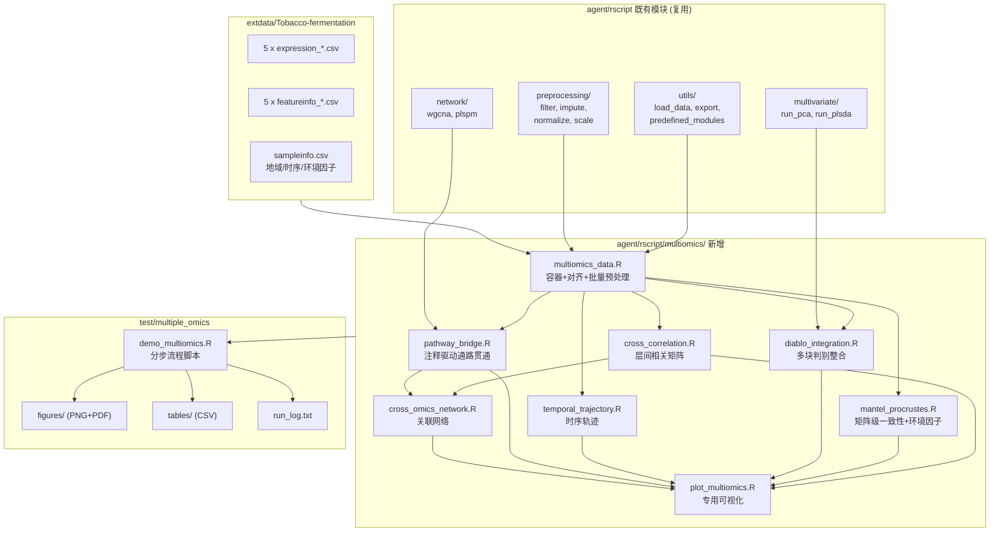

## 用户需求

在现有 OmicsWorks 组学分析流程项目中，针对新增的复杂多组学测试数据 `extdata/Tobacco-fermentation`（烟草风味发酵，5 个组学层 + 环境元数据），完成三件事：

1. 向 `agent/rscript` 新增适用于**多组学关联分析**的模块函数代码（新建 `multiomics/` 子目录）
2. 在 `test/multiple_omics` 中参考 `demo_metabolomics.R` 编写一个**多组学关联分析 demo 流程脚本**
3. **真实执行**该 demo 脚本进行脚本化测试，跑通并修复暴露的问题

## 产品概述

本次交付一套「多组学整合分析模块库 + 端到端演示流程」。模块库以可复用函数形式沉淀跨组学分析能力，demo 脚本将这些模块串联成完整流水线，针对烟草在云南（高原）与河南（平原）两地的发酵过程，解析优质风味形成机制。

数据实况：转录组（2000 特征）、蛋白组（1000）、代谢组（1000）、挥发性风味组（300）、微生物组 16S（131），共 312 个样本；样本元数据含品种、发酵天数/阶段、地理位置、温度、湿度、海拔等因子。转录组与蛋白组带 `organism` 列区分宿主与微生物（dual omics）；各层共享 `kegg`/`super_class`/`family` 注释列，可作为跨组学生物学连接键。

## 核心功能

### 四大科学分析目标

- **地域差异解析**：对比云南 vs 河南，结合海拔、温度、湿度连续环境因子，识别地域特异的多组学特征
- **发酵时序动态**：沿 timepoint/phase（Fresh → 早期 → 活跃 → 后熟）追踪各组学变化轨迹与阶段划分
- **微生物-代谢物驱动关系**：关联微生物组与代谢/挥发组，定位驱动风味形成的关键菌群
- **基因-蛋白-代谢通路贯通**：借助 organism/kegg/family 注释，打通宿主与微生物功能通路直至风味物质

### 新增模块能力

- **多组学容器与对齐**：统一管理多层组学，按共有样本对齐，提供批量预处理
- **跨组学相关性**：层间特征相关矩阵与显著性，支持稀疏化与配对提取
- **矩阵级关联检验**：Mantel test、Procrustes 分析，量化组学层间及与环境因子的整体一致性
- **多块判别整合**：基于 DIABLO/多块 PLS 的地域与阶段判别，提取跨组学判别特征
- **时序轨迹分析**：各组学层的时序聚类与阶段轨迹刻画
- **注释驱动的通路贯通**：按 kegg/super_class/family/organism 聚合跨层模块并关联
- **跨组学网络与可视化**：关联网络构建、圈图/热图/轨迹图等专用绘图

### 可视化产出

demo 脚本按步骤输出到 `test/multiple_omics/figures`（PNG+PDF）与 `tables`（CSV），涵盖各层 PCA/PLS-DA 得分图、组学层相关性圈图与热图、Mantel/Procrustes 统计图、DIABLO 判别与载荷图、时序轨迹图、微生物-代谢物关联网络图、通路贯通热图，以及各步骤统计结果表。

## 技术栈选择

沿用项目既有 R 技术栈，不引入新范式：

- **语言/组织方式**：R 脚本 + 函数库，按功能子目录组织，`source_all_scripts.R` 递归加载
- **注释风格**：roxygen2 英文风格（`#' @description` / `@param` / `@return` / `@examples \dontrun{}` / `@export`）
- **错误处理**：base R 的 `stop()` / `warning()` / `message()` / `cat()`（全库不存在 log_*/check_*/`%||%` helper，不得臆造）
- **可选依赖判断**：`requireNamespace("pkg", quietly = TRUE)` + `pkg::func()` 调用

### 依赖包

用户已确认「允许自由引入新包，缺失时报错提示安装即可」：

| 包 | 用途 | 来源 | 现状 |
| --- | --- | --- | --- |
| mixOmics | DIABLO 多块判别整合 | CRAN 清单 | **已在 `install_packages.R`** |
| vegan | Mantel test、Procrustes、RDA | CRAN | **需新增** |
| igraph | 跨组学关联网络构建与布局 | CRAN | **需新增** |
| ggplot2 / pheatmap / RColorBrewer / ggrepel | 绘图 | CRAN | 已在清单 |
| WGCNA / limma / GSVA | 模块特征值、差异、通路打分 | 已有 | 已在清单 |


## 实现方案

### 总体策略

采用「**多组学容器 + 分层分析函数 + 注释驱动关联**」三层设计：

1. **容器层**：新增 `MultiOmicsData` 容器（list + S3 class），内部持有若干命名的 `OmicsData`（复用既有 `create_omics_data`），统一按共有样本对齐。这是所有跨组学函数的唯一入口数据结构，避免各函数各自处理对齐逻辑。
2. **分析层**：每个科学目标对应一个独立文件，函数签名保持 `(mo, ...)` 或 `(matrix_list, ...)` 的一致形态，返回结构化 list（含数值结果 + 可直接 `export_table` 的 data.frame）。
3. **可视化层**：绘图函数与分析函数分离（`run_*` / `plot_*` 配对），与既有模块（`run_pca`/`plot_pca_scores`）范式一致。

### 关键技术决策

**决策 1：新建 `multiomics/` 目录而非塞入 `network/`**
全库 grep 确认无任何多组学整合代码，`network/` 语义偏「单组学内部网络」。独立目录职责清晰、便于扩展；`source_all_scripts.R` 已递归扫描（`list.files(recursive = TRUE)`）且加载顺序为 `utils/` → `qcqa/` → 其余按路径排序，`multiomics/` 排在 `machine_learning/` 之后、`multivariate/` 之前，其依赖的 `utils/` 已先行加载，**无需修改引导脚本**。

**决策 2：复用 `create_omics_data` 而非另起炉灶**
`MultiOmicsData` 内部每层直接调用既有 `create_omics_data()`，继承其样本/特征对齐与 `metadata` 统计。注意其返回元素名为 **`expression`**（非 `expr`），新代码一律用 `mo$omics[[k]]$expression`；统计信息用 `metadata$matched_features`（既有 `print.OmicsData` 访问 `$matched` 是历史 BUG，不受影响也不修复，避免扩大改动面）。

**决策 3：跨组学相关性的性能控制**
用户要求完整规模分析。最大配对为转录组 2000 × 代谢组 1000 = 200 万对相关系数。采用**向量化矩阵运算**而非双重 for 循环：对行标准化后的矩阵做 `A %*% t(B) / (n-1)` 一次性得到 Pearson 相关矩阵，复杂度 O(f1×f2×n)，200 万对在 312 样本下约几秒完成，内存约 16MB（double），完全可接受。p 值由相关系数解析推导（t 分布）而非置换，避免 O(perm×f1×f2) 爆炸；BH 校正后按阈值稀疏化输出，只导出显著配对，控制 CSV 体积。Spearman 通过预先 `rank()` 转换后复用同一路径。

**决策 4：Mantel/Procrustes 用距离矩阵层面，天然低维**
组学层间一致性检验在 312×312 距离矩阵上进行，与特征数无关，置换 999 次开销极小，可放心用完整特征计算距离。

**决策 5：DIABLO 的降维前置**
`mixOmics::block.splsda` 在 2000 特征上可运行但耗时较长且易过拟合。采用 `keepX` 参数做**内建稀疏选择**（每成分选 top N 特征），这是 DIABLO 的标准用法而非人为预筛，既符合"完整规模"（全特征入模）又保证收敛。同时用 `tryCatch` 包裹，失败时降级为各层 PLS-DA 并 `cat` 提示。

**决策 6：通路贯通复用 `build_latent_def_from_annotation` 范式**
`network/plspm_net.R` 已有「按 kegg/super_class 聚合特征成潜变量」的成熟写法。跨组学版本沿用同一思路，扩展为跨层聚合：同一 `super_class`/`family`/`kegg` 下汇集来自不同组学层的特征，用 `predefined_module_eigengenes`（`utils/predefined_modules.R`）计算模块特征值，再做层间模块相关，实现基因→蛋白→代谢→风味的贯通。`organism` 列用于拆分宿主/微生物两套通路。

**决策 7：demo 脚本的容错与可重入**
沿用参考脚本的 `tryCatch` + `cat` 提示范式，每个 Step 独立容错，单步失败不中断整体流程，便于一次运行暴露尽可能多的问题。

### 性能与可靠性

- 跨组学相关：向量化矩阵乘法，避免 200 万次 `cor.test` 调用（后者需数分钟至数十分钟，前者秒级）
- 距离矩阵复用：Mantel/Procrustes/PCoA 共用同一份预计算的层内距离矩阵，避免重复计算
- 大表导出：相关性结果按显著性阈值稀疏化后导出，防止生成百 MB 级 CSV
- 数值稳健：相关计算前剔除零方差特征（否则产生 NaN），并在日志中 `cat` 报告剔除数量

### 避免技术债

- 不新增任何 helper 抽象层（项目无此约定），错误处理直接用 base R
- 不修改既有 33 个文件的任何函数签名，纯增量新增，零回归风险
- `install_packages.R` 仅在 `cran_packages` 向量追加 `vegan`、`igraph` 两项，不改动其安装逻辑

## 执行要点

- **路径**：Windows 环境，demo 脚本内统一用正斜杠绝对路径（如 `G:/OmicsWorks/...`），与参考脚本一致
- **不照抄冗余段**：参考脚本第 17-21 行的 `list.files("R", ...)` 循环依赖不存在的相对目录，新脚本只保留 `source(".../source_all_scripts.R")`
- **`sample_info` 列可用性**：已实读确认含 `location`/`location_code`/`variety`/`timepoint`/`day`/`phase`/`temperature_C`/`humidity_pct`/`altitude_m`/`altitude_class`，可直接用作分组与环境因子，无需额外构造
- **各层 feature ID 列不同**：16S/代谢/挥发用 `ID`，转录/蛋白用 `gene_id`；`load_feature_info(file, id_col=...)` 需按层传入正确列名
- **表达矩阵首列名不同**：16S 为 `ID`、代谢组为 `name`；`load_expression_matrix` 默认取第一列作 ID，直接调用即可
- **执行验证**：用 `Rscript` 真实运行 demo，检查 figures/tables 产出数量与关键 `cat` 输出，修复报错后重跑至通过

## 架构设计



### 数据流

```
5 层 CSV 载入 (load_expression_matrix + load_feature_info)
   ↓
create_multiomics_data()  →  按共有样本对齐，封装为 MultiOmicsData
   ↓
preprocess_multiomics()   →  逐层 filter/impute/normalize/scale
   ↓
   ├─ 各层 run_pca / run_plsda      → 地域与阶段的单层概览
   ├─ run_cross_correlation()       → 层间特征相关（微生物-代谢物）
   ├─ run_mantel_test/procrustes()  → 层间一致性 + 环境因子关联
   ├─ run_diablo()                  → 多块判别（地域/阶段）
   ├─ run_temporal_trajectory()     → 发酵时序轨迹
   └─ build_cross_omics_modules()   → kegg/super_class/organism 通路贯通
   ↓
build_cross_omics_network() + plot_* → 网络与可视化
   ↓
export_table / export_plot → figures/ + tables/
```

## 目录结构

```
G:/OmicsWorks/
├── agent/rscript/
│   ├── install_packages.R                      # [MODIFY] 仅在 cran_packages 向量追加 "vegan", "igraph"
│   │                                           #   两项，用于 Mantel/Procrustes 与跨组学网络。
│   │                                           #   不改动安装/加载逻辑与其他任何内容。
│   │
│   └── multiomics/                             # [NEW] 多组学整合模块目录。source_all_scripts.R
│       │                                       #   已递归扫描，无需修改引导脚本。
│       │
│       ├── multiomics_data.R                   # [NEW] 多组学容器与对齐。
│       │                                       # 功能：create_multiomics_data(expr_list, sample_info,
│       │                                       #   feature_info_list, match_cols) 逐层调用既有
│       │                                       #   create_omics_data()，取所有层共有样本做交集对齐，
│       │                                       #   返回 S3 class "MultiOmicsData" 的 list：
√       │                                       #   {omics=<named list of OmicsData>, sample_info,
│       │                                       #    common_samples, metadata{n_omics, omics_names,
│       │                                       #    n_samples, n_features_per_omics}}。
│       │                                       #   另含 print.MultiOmicsData()、get_omics_matrix(mo, name)、
│       │                                       #   get_omics_list(mo) 取全部矩阵、
│       │                                       #   preprocess_multiomics(mo, 各步参数) 逐层串联既有
│       │                                       #   filter_missing_values/impute_min_half/
│       │                                       #   normalize_sample_total/scale_pareto。
│       │                                       # 要点：元素名用 expression（非 expr）；统计用
│       │                                       #   metadata$matched_features；各层可指定不同 match_col。
│       │
│       ├── cross_correlation.R                 # [NEW] 跨组学特征相关分析（微生物-代谢物核心）。
│       │                                       # 功能：run_cross_correlation(mat_x, mat_y, method=
│       │                                       #   c("pearson","spearman"), p_adjust="BH",
│       │                                       #   r_threshold=0.6, p_threshold=0.05) 返回
│       │                                       #   {cor_matrix, p_matrix, padj_matrix, pairs(稀疏化
│       │                                       #   显著配对 data.frame: feature_x, feature_y, r, p, padj)}。
│       │                                       #   run_all_pairwise_correlation(mo, layer_pairs)
│       │                                       #   批量跑多组层间配对。
│       │                                       # 实现要点：必须用向量化矩阵乘法（行标准化后
│       │                                       #   A %*% t(B)/(n-1)）而非 cor.test 循环，2000x1000
│       │                                       #   规模需秒级完成；spearman 先 rank 再走同一路径；
│       │                                       #   p 值由 t 分布解析计算；预先剔除零方差特征并 cat 报告；
│       │                                       #   结果按阈值稀疏化，防止导出超大 CSV。
│       │
│       ├── mantel_procrustes.R                 # [NEW] 矩阵级一致性与环境因子关联。
│       │                                       # 功能：run_mantel_test(mat_list, env_data=NULL,
│       │                                       #   dist_method="bray"/"euclidean", permutations=999)
│       │                                       #   计算层间及各层与环境因子矩阵(temperature_C/
│       │                                       #   humidity_pct/altitude_m)的 Mantel r 与 p；
│       │                                       #   run_procrustes(mat_x, mat_y, permutations=999)
│       │                                       #   返回 procrustes SS、相关系数、显著性与旋转后坐标。
│       │                                       # 实现要点：基于 vegan::mantel / vegan::protest；
│       │                                       #   距离矩阵在样本维度(312x312)计算，与特征数无关，
│       │                                       #   可用完整特征；距离矩阵预计算一次供多处复用；
│       │                                       #   vegan 缺失时 stop 并提示安装。
│       │
│       ├── diablo_integration.R                # [NEW] 多块判别整合（地域/阶段差异）。
│       │                                       # 功能：run_diablo(mo, group_col="location",
│       │                                       #   ncomp=2, keepX=NULL, design=0.1) 封装
│       │                                       #   mixOmics::block.splsda，返回 {model, scores(各层),
│       │                                       #   loadings(各层), selected_features(各层 top 特征),
│       │                                       #   performance}。keepX 默认按层特征数自适应。
│       │                                       # 实现要点：全特征入模、由 keepX 做内建稀疏选择（DIABLO
│       │                                       #   标准用法，非人为预筛）；tryCatch 包裹，失败时 cat
│       │                                       #   提示并返回 NULL 由 demo 降级为各层 PLS-DA。
│       │
│       ├── temporal_trajectory.R               # [NEW] 发酵时序动态分析。
│       │                                       # 功能：run_temporal_trajectory(mo, time_col="day",
│       │                                       #   group_col="location", phase_col="phase")
│       │                                       #   按时间点聚合各层均值、计算轨迹坐标(层内 PCA 上的
│       │                                       #   时序路径)、层间轨迹一致性；
│       │                                       #   run_temporal_clustering(expr_matrix, sample_info,
│       │                                       #   time_col, n_clusters) 复用既有 run_cmeans 做
│       │                                       #   时序表达模式聚类，返回各 cluster 的时序 profile。
│       │                                       # 实现要点：day 列含 -1(Fresh) 需保留为最早时间点；
│       │                                       #   按 location 分别建轨迹以对比两地发酵节奏差异。
│       │
│       ├── pathway_bridge.R                    # [NEW] 注释驱动的基因-蛋白-代谢通路贯通。
│       │                                       # 功能：build_cross_omics_modules(mo, category_col=
│       │                                       #   "super_class"/"family"/"kegg", organism_col=
│       │                                       #   "organism", min_size=2) 跨层汇集同一注释类别下的
│       │                                       #   特征，逐层调用既有 predefined_module_eigengenes()
│       │                                       #   得到模块特征值矩阵；
│       │                                       #   run_pathway_bridge(modules, layer_order=c(
│       │                                       #   "transcriptome","proteome","metabolome","volatilome"))
│       │                                       #   计算相邻层同名模块的相关与显著性，输出贯通链路表；
│       │                                       #   split_by_organism(feature_info, organism_col) 拆分
│       │                                       #   宿主 Nicotiana tabacum 与微生物两套通路。
│       │                                       # 实现要点：借鉴 network/plspm_net.R 中
│       │                                       #   build_latent_def_from_annotation 的聚合范式；
│       │                                       #   各层 feature_info 的注释列名已确认一致(kegg/
│       │                                       #   super_class/family)，16S 层无 super_class 需容错跳过。
│       │
│       ├── cross_omics_network.R               # [NEW] 跨组学关联网络。
│       │                                       # 功能：build_cross_omics_network(cor_pairs_list,
│       │                                       #   r_threshold=0.7, padj_threshold=0.05) 将多组
│       │                                       #   run_cross_correlation 的 pairs 合并为 igraph 图，
│       │                                       #   节点按组学层着色、边按正负相关着色；
│       │                                       #   get_network_hubs(graph, top_n=20) 按度/中介中心性
│       │                                       #   提取枢纽节点(候选关键菌群/风味物质)，返回 data.frame。
│       │                                       # 实现要点：基于 igraph；边数需按阈值控制在可绘制规模，
│       │                                       #   超限时 cat 提示并按 |r| 取 top N 边。
│       │
│       └── plot_multiomics.R                   # [NEW] 多组学专用可视化。
│                                               # 功能：plot_cross_correlation_heatmap(cor_result,
│                                               #   top_n) 层间相关热图(pheatmap)；
│                                               #   plot_mantel_network(mantel_result) 层间/环境因子
│                                               #   一致性关系图；plot_procrustes(proc_result)
│                                               #   Procrustes 位移图；plot_diablo_scores(diablo_result,
│                                               #   sample_info, color_col) 各层判别得分图；
│                                               #   plot_temporal_trajectory(traj_result) 时序轨迹图；
│                                               #   plot_cross_omics_network(graph) 网络图；
│                                               #   plot_pathway_bridge_heatmap(bridge_result) 通路贯通热图。
│                                               # 实现要点：全部返回 ggplot 对象(或 pheatmap 对象)以适配
│                                               #   既有 export_plot/export_heatmap；配色复用
│                                               #   utils/plot_helpers.R 的 make_group_colors()。
│
├── extdata/Tobacco-fermentation/               # [READ-ONLY] 测试数据，不修改
│
└── test/multiple_omics/                        # [现有空目录]
    ├── demo_multiomics.R                       # [NEW] 多组学关联分析 demo 流程脚本。
    │                                           # 结构：严格参考 test/omics_flow/demo_metabolomics.R —
    │                                           #   #!/usr/bin/env Rscript 头 + 研究背景注释 +
    │                                           #   set.seed(42) + source(source_all_scripts.R) +
    │                                           #   library() + data_dir/result_dir/fig_dir/tab_dir +
    │                                           #   dir.create，随后
    │                                           #   "# ==== Step N ====" + cat("\n=== Step N ===\n")
    │                                           #   分步推进，每步 export_table/export_plot，
    │                                           #   每步 tryCatch 容错不中断。
    │                                           # 步骤规划：
    │                                           #   Step1  五层数据载入(注意 16S/代谢/挥发用 ID、
    │                                           #          转录/蛋白用 gene_id 作 id_col)
    │                                           #   Step2  create_multiomics_data 对齐 + print
    │                                           #   Step3  preprocess_multiomics 逐层预处理
    │                                           #   Step4  各层 PCA(地域/阶段着色)概览
    │                                           #   Step5  各层 PLS-DA(location 判别) + VIP
    │                                           #   Step6  地域差异：limma 按 location 逐层差异 + 火山图
    │                                           #   Step7  Mantel test：层间一致性 + 环境因子
    │                                           #          (temperature_C/humidity_pct/altitude_m)
    │                                           #   Step8  Procrustes：关键层配对一致性
    │                                           #   Step9  DIABLO 多块判别(location) + 得分/载荷图
    │                                           #   Step10 时序轨迹：按 day/phase 分 location 建轨迹
    │                                           #   Step11 时序聚类：各层表达模式 cmeans
    │                                           #   Step12 微生物-代谢物跨组学相关 + 热图
    │                                           #   Step13 微生物-挥发组(风味)相关 + 关键菌群
    │                                           #   Step14 通路贯通：super_class/kegg 跨层模块 +
    │                                           #          organism 拆分宿主/微生物
    │                                           #   Step15 跨组学网络构建 + hub 节点提取 + 网络图
    │                                           #   Step16 汇总：cat 关键发现 + 产出文件计数
    │
    ├── figures/                                # [NEW-输出] 各步骤 PNG+PDF 图件
    ├── tables/                                 # [NEW-输出] 各步骤 CSV 结果表
    └── run_log.txt                             # [NEW-输出] Rscript 运行日志，供验证与排错
```

## 关键代码结构

仅给出跨组学函数共用的核心数据契约，其余为常规实现：

```
# MultiOmicsData 容器（multiomics_data.R）
# 所有跨组学函数的统一输入
list(
  omics          = list(               # 命名 list，键为组学层名
    transcriptome = <OmicsData>,       # 每个元素为既有 create_omics_data 的返回值
    proteome      = <OmicsData>,       #   其矩阵字段名为 $expression
    metabolome    = <OmicsData>,
    volatilome    = <OmicsData>,
    microbiome    = <OmicsData>
  ),
  sample_info    = <data.frame>,       # 对齐后的共有样本元数据
  common_samples = <character vector>,
  metadata       = list(
    n_omics              = <int>,
    omics_names          = <character vector>,
    n_samples            = <int>,
    n_features_per_omics = <named int vector>
  )
)
# class(x) <- "MultiOmicsData"

# 跨组学相关结果契约（cross_correlation.R）
list(
  cor_matrix  = <matrix>,              # features_x  x  features_y
  p_matrix    = <matrix>,
  padj_matrix = <matrix>,
  pairs       = <data.frame>           # 稀疏化显著配对：
                                       # feature_x, feature_y, r, p, padj
                                       # 可直接 export_table，也是网络构建的输入
)
```

## Agent Extensions

### SubAgent

- **code-explorer**
- Purpose: 在编写新模块前，补充确认既有可复用函数的精确签名与返回结构，重点包括 `preprocessing/` 的 `filter_missing_values`/`impute_min_half`/`normalize_sample_total`/`scale_pareto`、`multivariate/` 的 `run_pca`/`run_plsda`、`network/cmeans.R` 的 `run_cmeans`、`utils/predefined_modules.R` 的 `predefined_module_eigengenes`、`utils/plot_helpers.R` 的 `make_group_colors`，避免新模块调用时参数或返回字段名错配
- Expected outcome: 得到一份准确的可复用函数签名与返回字段清单，使新增 multiomics 模块的内部调用一次写对，减少运行期返工