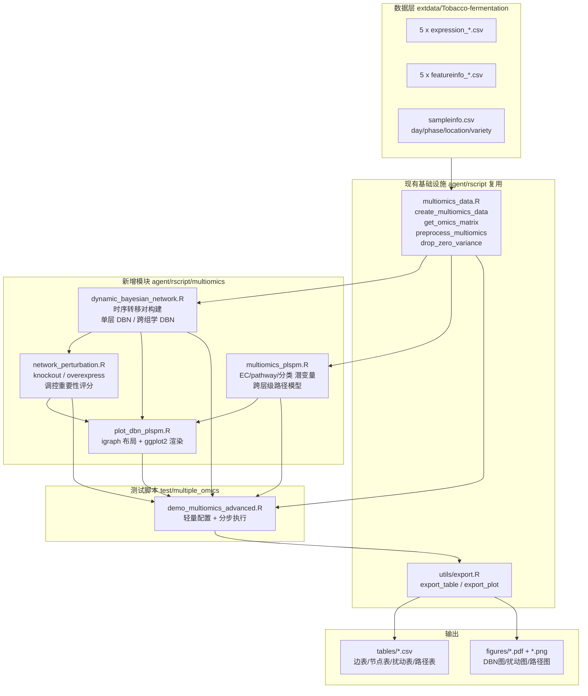

## 用户需求

在现有的多组学分析流程项目（`agent/rscript` 模块化 R 脚本库 + `test/multiple_omics` 测试脚本）基础上，新增三类高级多组学关联分析能力，并基于 `extdata/Tobacco-fermentation` 烟叶发酵五层组学时序数据完成脚本化验证。

## 产品概述

向 `agent/rscript` 补充一批面向多组学时序数据的分析模块函数，并在 `test/multiple_omics` 下新建一个**轻量、快速**的测试脚本（参照 `demo_multiomics.R` 的编写模式，但不重跑其耗时的全量步骤），用 `C:\Program Files\R\R-4.5.0\bin\x64\Rscript.exe` 执行验证，产出 CSV 结果表与网络图（PDF + PNG）。

## 核心功能

### 一、动态贝叶斯网络（DBN，基于 bnlearn）

- 面向时序数据构建**带时滞结构**的动态贝叶斯网络：将同一特征在相邻时间点展开为 `X_t0` 与 `X_t1` 两组节点，通过黑白名单强制边只能由 t0 指向 t1，从而区别于静态贝叶斯网络。
- **分层建网**：对 transcriptome、proteome、metabolome、volatilome、microbiome 五个组学各自构建一张 DBN。
- **合并全景建网**：将五层组学的代表性特征合并，构建一张涵盖全部组学的完整跨组学 DBN，节点标注所属组学层。
- 结果导出为数据框 CSV：有向边表（from / to / 所属组学 / 边强度 / 方向置信度）、节点表（节点度、入度、出度、所属组学）、网络统计摘要。
- 绘制网络图：单组学 DBN 图（时滞分层布局）与跨组学全景 DBN 图（按组学层着色、按枢纽度调整节点大小）。

### 二、虚拟扰动分析（基于已构建的 DBN）

- 在已学习的网络上执行**虚拟干预**，支持多种扰动模式：
- **节点删除（knockout）**：移除节点及其全部出边，评估下游影响范围。
- **过表达（overexpression）** 与 **抑制（inhibition）**：将节点固定在高／低状态，观察下游节点状态分布的偏移。
- 量化每个节点的**调控重要性**：受影响的下游节点数、下游可达范围、扰动前后下游状态分布的平均偏移量、综合影响力评分与排名。
- 结果导出为数据框 CSV：扰动节点级汇总表、扰动-下游节点对明细表。
- 绘制可视化：调控重要性排名条形图、扰动影响热图、关键节点的扰动影响子网络图。

### 三、多层级 PLS-PM 路径分析

- 基于注释信息构建潜变量，支持三类分组来源：
- **EC number**（转录组／蛋白组，按 EC 大类层级归并，需清洗 "EC " 前缀）
- **Pathway 映射**（KEGG 通路）
- **物质分类**（代谢组／挥发物的 super_class / class / family；微生物的 taxonomy_phylum / taxonomy_class）
- 每个潜变量由所属组学层的一组实测特征构成，标注其归属的组学层次。
- **构建跨层次路径模型**：按生物学层级顺序（microbiome → transcriptome → proteome → metabolome → volatilome）自动生成连接不同层次潜变量的内模型路径矩阵，运行 PLS-PM 求解。
- 结果导出为数据框 CSV：内模型路径系数表（起点／终点潜变量、所属层、路径系数、显著性）、外模型载荷表、潜变量得分表、模型拟合质量指标（R²、GoF、Cronbach alpha 等）。
- 绘制网络图：按组学层次分层排布的路径图，边宽映射路径系数绝对值、边色映射正负、虚实线映射显著性。

## 交付要求

- 新模块函数写入 `agent/rscript` 相应子目录，可被 `source_all_scripts.R` 自动加载。
- 新测试脚本独立于 `demo_multiomics.R`，通过特征降维与规模控制保证**运行时间可控**。
- 所有分析步骤具备容错能力，单步失败不中断整体流程，并输出清晰的进度与统计信息。
- 最终用指定的 Rscript.exe 实际执行并验证通过。

## 技术栈

- **语言/运行时**：R 4.5.0（`C:\Program Files\R\R-4.5.0\bin\x64\Rscript.exe`）
- **核心分析包**（均已实测安装可用）：`bnlearn`（DBN 结构学习、参数拟合、`cpquery`/`cpdist` 条件概率推断、`mutilated` 干预网络）、`plspm`（正式 PLS-PM 求解）、`igraph`（网络布局与图论指标）
- **可视化**：`ggplot2` + `ggrepel`（沿用项目现有绘图约定），`igraph` 提供布局坐标后用 ggplot2 渲染
- **不可用依赖**：`gRain` 实测为 FALSE，因此虚拟扰动**不使用 gRain 精确推断**，改用 `bnlearn::cpquery`（likelihood weighting）+ `bnlearn::mutilated` + igraph 图论可达性三条互补路径

## 实现方案

### 总体策略

新增 4 个模块文件到 `agent/rscript/`，1 个测试脚本到 `test/multiple_omics/`。所有新函数遵循项目既有约定：roxygen2 风格文档注释、`@export` 标记、返回命名 list、失败时 `stop()` 并由调用方 `tryCatch` 捕获、`cat(sprintf(...))` 输出进度。文件放入 `agent/rscript/` 子目录后由 `source_all_scripts.R` 自动递归加载，**无需修改加载器**。

### 关键技术决策

#### 决策 1：DBN 采用「时滞展开 + 黑白名单约束」实现

**做法**：把时序矩阵重构为「转移对（transition pairs）」样本集。对每个特征 `F`，生成两列 `F_t0` 与 `F_t1`；每一行样本对应一个相邻时间点转移 `(t_k → t_{k+1})`。随后向 `bnlearn::hc()` 传入 `blacklist`，禁止 `t1 → t0` 的反向边、禁止 `t0` 内部的同期边，从而**强制学到的边全部是跨时间步的因果时滞边**。

**为何这样选**：

- 现有 `run_bnlearn()` 声明了 `time_points` 参数但**完全未使用**，是纯静态网络。用户明确要求「动态贝叶斯网络」，时滞结构是 DBN 区别于 BN 的定义性特征，必须补上。
- 相比引入 `dbnR` 等新包，本方案完全基于已安装的 `bnlearn`，零新增依赖，且黑白名单是 bnlearn 的原生一等能力，稳定可靠。
- 转移对展开天然处理了本数据集「13 个时间点 × 2 地区 × 2 品种 × 生物学重复」的复杂设计：**按 (location, variety, replicate) 分组内部各自沿 day 排序生成转移对**，避免跨条件错误配对产生伪边。

**关键实现细节**：

- 时间点聚合：同一 (day, location, variety) 的生物学重复先取均值，得到干净的时间序列，再生成转移对。这一步同时把 312 样本压缩到 13×2×2 = 52 个时间点观测，转移对约 12×2×2 = 48 对。
- **样本量约束是本方案的核心瓶颈**：48 个转移对样本只能支撑有限节点数的可靠结构学习。因此 `max_nodes` 默认设为较小值（单组学 20~25，跨组学合并 30~40），并通过方差排序 + 每层配额选择代表性特征。
- 离散化沿用现有 `run_bnlearn()` 的三分位数策略（保持项目内一致性），但改为在**转移对矩阵上统一离散化**，保证 `F_t0` 与 `F_t1` 的分箱边界一致（这点很关键，否则同一特征前后时刻不可比）。
- 边强度评估：用 `bnlearn::boot.strength()` 做 bootstrap 稳定性打分，输出 `strength`（边存在概率）与 `direction`（方向置信度），并按 `strength` 阈值过滤，避免小样本下的假阳性边。为控制耗时，bootstrap 次数默认设为中等量级（如 R=100）且可参数化。

#### 决策 2：跨组学合并 DBN 采用「按层配额选特征 + 层内外边分类」

- 各组学层按方差（或与时间的相关性）选 top-K 特征，K 按层分配（如每层 6~8 个），合并成统一矩阵，节点名加组学前缀（如 `TRA|CCD1`、`MIC|Acetobacter_aceti`）避免跨层重名冲突。
- 学到的边按两端节点前缀自动标注为 `intra_omics`（层内）或 `inter_omics`（跨层），跨层边正是用户关心的「涉及所有多组学的完整网络」的核心信息。
- 可选提供 `layer_order` 白/黑名单约束，把跨层边的方向限制为符合生物学层级（microbiome/transcriptome → proteome → metabolome → volatilome），使网络更具可解释性；默认关闭，由测试脚本显式开启以对比。

#### 决策 3：虚拟扰动采用「三层次互补」策略（规避 gRain 缺失）

由于 `gRain` 不可用，设计三种互补的扰动评估手段，从廉价到昂贵逐级提供证据：

1. **结构层（图论可达性，O(V+E)，极快）**：基于 `igraph` 计算被扰动节点的**下游可达节点集**（descendants）。节点删除（knockout）直接对应移除节点后下游连通性的损失，输出 `n_descendants`、`downstream_reach`。这一层无需推断，永远可用，作为兜底。

2. **干预层（mutilated network）**：用 `bnlearn::mutilated()` 构造干预后的网络（切断被扰动节点的所有入边，将其固定为指定状态），这是 Pearl do-算子的标准实现，语义上正确对应「过表达 / 敲低」。

3. **推断层（cpquery/cpdist 近似推断）**：在拟合好的贝叶斯网络（`bnlearn::bn.fit`）上，用 `cpdist()` 采样比较扰动前后每个下游节点的**状态分布偏移**（用总变差距离 TVD 或高状态概率变化量化）。这是最有信息量但也最耗时的一层。

**性能控制**：`cpquery`/`cpdist` 的采样次数（`n` 参数）是主要耗时来源，设为可配置参数并给出保守默认值；只对**下游节点非空**的扰动节点执行推断层，跳过叶子节点；只对 top-N 重要节点（由结构层快速筛出）做完整推断。这个「先用 O(V+E) 图论筛选、再对少量候选做昂贵采样」的两阶段设计是控制总耗时的关键。

**综合重要性评分**：融合下游节点数、平均分布偏移量、节点介数中心性，归一化后加权得到 `impact_score` 并排名，回答用户的「验证调控重要性」诉求。

#### 决策 4：PLS-PM 改用 `plspm` 正式包，并新建跨组学模块（保留旧函数）

**现状问题**：现有 `run_plspm()` 名不副实——它用 `prcomp` 的 PC1 当潜变量得分、用两两 `lm` 当路径系数，既不是 PLS-PM 的迭代权重估计，也没有真正的内外模型联合估计，且**只接受单个 expr_matrix，无法处理多组学**。

**方案**：新建 `multiomics_plspm.R`，**不修改也不删除**现有 `plspm_net.R`（避免影响 `demo_multiomics.R` 等既有调用，控制变更爆炸半径），新函数直接调用 `plspm::plspm()`：

- **潜变量构建**（`build_multiomics_latent_def()`）：统一接口，从 `MultiOmicsData` 容器出发，按层指定分组来源：
- `ec_number`：先 `gsub("^EC\\s*", "", x)` 清洗前缀，再按指定层级截断（如取前 2 段 `1.13` 作为 EC 大类），实现层级归并。这是必需的，因为完整 EC 号粒度过细，每组特征数不足。
- `kegg`：按 KEGG ID / pathway 映射分组。注意实测代谢组首行 `kegg` 为 NA，**覆盖率不足时自动降级到物质分类**。
- 物质分类：`super_class` / `class` / `family`（代谢组、挥发物）、`taxonomy_phylum` / `taxonomy_class`（微生物层，因其无 ec_number / super_class）。
- 每个潜变量记录 `layer`（所属组学）、`source`（分组依据）、`n_features`，并按 `min_size` 过滤过小的组。
- **跨层路径矩阵自动生成**（`build_hierarchical_inner_model()`）：按用户给定的 `layer_order`（如 `microbiome → transcriptome → proteome → metabolome → volatilome`）生成 plspm 要求的**下三角 0/1 内模型矩阵**，只允许上游层的潜变量指向下游层，天然满足 plspm 对递归模型的要求。同层潜变量之间默认不连边（可选开启）。
- **plspm 调用要点**：`plspm()` 需要 `Data`（samples × 所有观测变量）、`path_matrix`（下三角）、`blocks`（每个潜变量对应的列索引）、`modes`（全部 "A" 反射型）。需把多组学矩阵**转置并按样本对齐后横向拼接**成一张宽表，并把 blocks 从特征名映射为列索引。
- **数值稳健性**：plspm 对零方差列、常数列、完全共线列敏感，调用前复用项目已有的 `drop_zero_variance()`（`multiomics_data.R` 中已存在）清洗；对潜变量数过多的情况提供 `max_latent` 截断（按方差解释度排序保留），避免路径矩阵爆炸导致求解缓慢或不收敛。
- 结果提取：`inner_model`（各内生潜变量的回归系数、R²）、`outer_model`（载荷、权重、communality）、`scores`、`inner_summary`（GoF、Cronbach alpha、AVE 等），统一整理为扁平数据框便于 `export_table()` 导出。

#### 决策 5：绘图统一用 igraph 计算布局，ggplot2 渲染

沿用项目现有 `plot_bnlearn_network()` / `plot_plspm_network()` 的「ggplot2 + geom_segment + ggrepel::geom_label_repel」渲染范式（保持视觉一致性、复用 `export_plot()`），但**布局从简陋的圆形升级为 igraph 的分层/力导向布局**：

- DBN 单层图：按时滞分两列（t0 左、t1 右）的分层布局。
- 跨组学 DBN 图：按组学层分列的分层布局，节点按层着色、按度数定大小。
- PLS-PM 路径图：按 `layer_order` 分列的层次布局，边宽 ∝ |path_coeff|、边色映射正负、linetype 映射显著性。
- 所有绘图函数在无边时返回带提示文字的空 ggplot（复用现有 `plot_bnlearn_network()` 的兜底写法），而非报错。

### 性能与规模控制（用户明确关注的耗时问题）

测试脚本 `demo_multiomics_advanced.R` 的时间预算控制手段：

1. **不重跑 demo 的全量步骤**：只做数据加载 + 预处理 + 三块新增分析。预处理沿用 `preprocess_multiomics(mo, group_col = "condition")`，这是必要前置且开销可接受。
2. **特征强降维**：DBN 每层仅取 top 20~25 高方差特征，跨组学合并网仅取 30~40 节点。结构学习复杂度对节点数高度敏感，这是最有效的控速杠杆。
3. **时间点聚合**：312 样本 → 52 个 (day, location, variety) 均值观测 → 约 48 个转移对，矩阵极小。
4. **bootstrap 与采样次数参数化**：`boot.strength` 的 R 与 `cpdist` 的 n 均设中等默认值，测试脚本中显式传入较小值。
5. **扰动分析两阶段筛选**：先用 O(V+E) 图论算全部节点，只对 top-N 候选做采样推断。
6. **PLS-PM 潜变量数截断**：`max_latent` 控制路径矩阵规模。
7. 脚本头部提供集中的**配置区（config block）**，所有规模参数集中可调，便于用户后续按需放大。

### 避免技术债

- 复用现有基础设施：`create_multiomics_data()` / `get_omics_matrix()` / `get_feature_info()` / `preprocess_multiomics()` / `drop_zero_variance()` / `export_table()` / `export_plot()`，不重复实现。
- 不修改 `source_all_scripts.R`（新文件自动被扫描加载）。
- 不修改 `demo_multiomics.R`，不改动现有 `run_bnlearn()` / `run_plspm()` 的签名与行为，**保证向后兼容**，新能力以新函数形式提供。
- 新函数命名与项目风格一致（`run_*` 执行、`build_*` 构建、`plot_*` 绘图、`summarise_*` 汇总）。

## 架构设计



### 数据流

**DBN 链路**：
`MultiOmicsData` → 按 (day, location, variety) 聚合重复 → 每组内按 day 排序 → 生成 `(t0, t1)` 转移对 → 统一三分位离散化 → 构造 blacklist（禁 t1→t0、禁 t0 内同期边） → `bnlearn::hc()` 学结构 → `boot.strength()` 打分过滤 → 提取 arcs/nodes/adjacency → 数据框 + 网络图

**扰动链路**：
DBN 结果 → `bn.fit()` 拟合参数 → igraph 算全节点下游可达性（快速筛选） → top-N 候选 → `mutilated()` 构造干预网络 → `cpdist()` 采样对比下游状态分布 → TVD 偏移量 → 综合 `impact_score` 排名 → 数据框 + 排名图/热图/影响子网图

**PLS-PM 链路**：
`MultiOmicsData` + 各层 featureinfo → 按层选分组源（ec_number 清洗归并 / kegg / super_class / taxonomy） → 潜变量定义（含 layer 标注、min_size 过滤、max_latent 截断） → 各层矩阵转置对齐拼宽表 → 按 layer_order 生成下三角 path_matrix → `plspm::plspm()` → 提取 inner/outer/scores/fit → 数据框 + 分层路径图

## 目录结构

```
g:/OmicsWorks/
├── agent/rscript/
│   └── multiomics/
│       ├── dynamic_bayesian_network.R   # [NEW] 动态贝叶斯网络核心模块。
│       │     # 职责：面向多组学时序数据构建带时滞结构的 DBN。
│       │     # 主要函数：
│       │     #   aggregate_time_series(mat, sample_info, time_col="day",
│       │     #       group_cols=c("location","variety")) -> 按时间点+分组聚合
│       │     #       生物学重复取均值，返回聚合矩阵与时间轴元数据。
│       │     #   build_transition_pairs(agg_mat, time_meta, max_lag=1) ->
│       │     #       在每个 (location,variety) 序列内部按 day 排序生成相邻
///     │     #       时间点转移对，输出 t0/t1 双份列的数据框。
│       │     #   discretize_transition_data(df, n_bins=3) -> 对 t0/t1 使用
│       │     #       同一套分箱边界做三分位离散化（保证前后时刻可比），
│       │     #       返回 factor 数据框。
│       │     #   run_dbn_layer(expr_matrix, sample_info, feature_info=NULL,
│       │     #       time_col="day", group_cols, max_nodes=25, algorithm="hc",
│       │     #       score="bic", boot_R=100, strength_threshold=0.5, seed=42)
│       │     #       -> 单组学 DBN，返回 list(network, fitted, arcs, nodes,
│       │     #       adjacency, edges_df, nodes_df, stats)。edges_df 含
│       │     #       from/to/from_feature/to_feature/strength/direction。
│       │     #   run_dbn_multiomics(mo, layers=NULL, per_layer_nodes=8,
│       │     #       time_col="day", group_cols, enforce_layer_order=FALSE,
│       │     #       layer_order=NULL, ...) -> 跨组学合并 DBN。节点加组学
│       │     #       前缀防重名，边标注 intra_omics/inter_omics，可选按
│       │     #       layer_order 施加方向约束 blacklist。
│       │     #   summarise_dbn_network(dbn_result) -> 网络统计摘要数据框
│       │     #       （节点数/边数/跨层边数/平均度/最大入出度等）。
│       │     # 实现要点：全部结构学习前用 drop_zero_variance() 清洗；
│       │     #   blacklist 必须同时禁止 t1->t0 与 t0 内部同期边；
│       │     #   boot.strength 用 transition 数据框，R 可调以控耗时；
│       │     #   小样本下若 hc 失败需 stop() 抛出清晰信息由调用方捕获。
│       │
│       ├── network_perturbation.R        # [NEW] 虚拟扰动分析模块。
│       │     # 职责：在已学习的 DBN 上做虚拟干预，量化节点调控重要性。
│       │     # 主要函数：
│       │     #   get_downstream_nodes(adjacency_or_arcs, node) -> 基于 igraph
│       │     #       计算下游可达节点集合（descendants），O(V+E)。
│       │     #   run_node_knockout(dbn_result, nodes=NULL, top_n=NULL) ->
│       │     #       删除节点及其出边，评估下游连通性损失、网络碎片化程度。
│       │     #   run_virtual_perturbation(dbn_result, nodes=NULL,
│       │     #       mode=c("knockout","overexpress","inhibit"),
│       │     #       n_sim=5000, top_n=15, seed=42) -> 主入口。
│       │     #       overexpress/inhibit 用 bnlearn::mutilated() 构造干预网络
│       │     #       并用 cpdist() 采样，对比扰动前后每个下游节点的状态分布，
│       │     #       用总变差距离(TVD)量化偏移。
│       │     #       返回 list(node_summary, pair_details, params)。
│       │     #   score_regulatory_importance(perturb_result, dbn_result) ->
│       │     #       融合下游节点数、平均TVD、介数中心性，归一化加权得
│       │     #       impact_score 并排名，返回排序数据框。
│       │     # 实现要点：两阶段设计——先图论筛出有下游的节点，再只对
│       │     #   top_n 候选做 cpdist 采样，这是耗时控制的关键；
│       │     #   叶子节点直接跳过推断层；n_sim 参数化；
│       │     #   若 bn.fit 或 cpdist 失败要降级为纯结构层结果而非整体报错。
│       │
│       ├── multiomics_plspm.R            # [NEW] 多层级跨组学 PLS-PM 模块。
│       │     # 职责：从注释构建跨组学潜变量并求解层级路径模型。
│       │     # 主要函数：
│       │     #   clean_ec_number(x, level=2) -> 去除 "EC " 前缀与空格，
│       │     #       按 level 截断 EC 层级（如 "EC 1.13.11.71" -> "1.13"）。
│       │     #   build_multiomics_latent_def(mo, layer_sources, min_size=3,
│       │     #       max_latent_per_layer=NULL, kegg_mapping=NULL,
│       │     #       ec_level=2, verbose=TRUE) -> 统一潜变量构建入口。
│       │     #       layer_sources 形如 list(transcriptome="ec_number",
│       │     #       proteome="ec_number", metabolome="super_class",
│       │     #       volatilome="super_class", microbiome="taxonomy_phylum")。
│       │     #       返回 list(latent_def, definitions)，definitions 含
│       │     #       latent/layer/source/n_features。
│       │     #       需处理 kegg 覆盖率不足时自动降级到物质分类。
│       │     #   build_hierarchical_inner_model(definitions,
│       │     #       layer_order, allow_within_layer=FALSE) -> 生成 plspm
│       │     #       要求的下三角 0/1 path_matrix（潜变量按 layer_order 排序，
│       │     #       仅允许上游层指向下游层）。
│       │     #   run_multiomics_plspm(mo, latent_def, definitions, path_matrix,
│       │     #       scale=TRUE, boot_val=FALSE, br=100) -> 将各层矩阵转置
│       │     #       并按共同样本对齐拼成宽表，把 blocks 由特征名映射为列索引，
│       │     #       调用 plspm::plspm()。返回 list(model, inner_paths,
│       │     #       outer_loadings, scores, fit_summary, definitions)。
│       │     #       inner_paths 为扁平数据框：from/to/from_layer/to_layer/
│       │     #       path_coeff/std_error/t_value/p_value/significant。
│       │     #   summarise_plspm_paths(plspm_result, p_threshold=0.05) ->
│       │     #       按层次对路径做汇总统计。
│       │     # 实现要点：调用 plspm 前必须 drop_zero_variance() 清洗，
│       │     #   否则 plspm 在常数列/共线列上会报错或不收敛；
│       │     #   宽表列名需 make.names() 与 make.unique() 处理避免非法/重名；
│       │     #   blocks 必须是列索引向量（plspm 要求），不能直接传特征名；
│       │     #   不修改现有 plspm_net.R，保证向后兼容。
│       │
│       └── plot_dbn_plspm.R              # [NEW] DBN 与 PLS-PM 可视化模块。
│             # 职责：用 igraph 计算布局、ggplot2 渲染，风格与项目现有
│             #   plot_* 函数一致，输出可直接传入 export_plot()。
│             # 主要函数：
│             #   plot_dbn_layer(dbn_result, title=NULL, label_top=20) ->
│             #       单组学 DBN 图，t0/t1 分层两列布局，箭头表时滞方向，
│             #       边透明度/宽度映射 strength。
│             #   plot_dbn_multiomics(dbn_result, title=NULL, label_top=25) ->
│             #       跨组学 DBN 图，节点按组学层着色分列，大小映射度数，
│             #       跨层边高亮、层内边淡化。
│             #   plot_perturbation_ranking(importance_df, top_n=20,
│             #       title=NULL) -> 调控重要性排名横向条形图。
│             #   plot_perturbation_heatmap(pair_details, top_n=20) ->
│             #       扰动节点 x 下游节点的影响强度热图。
│             #   plot_perturbation_subnetwork(dbn_result, node, ...) ->
│             #       单个关键节点的扰动影响子网络图（高亮下游可达节点）。
│             #   plot_plspm_hierarchy(plspm_result, layer_order,
│             #       p_threshold=0.05, title=NULL) -> 按组学层分列的层次
│             #       路径图，边宽 ∝ |path_coeff|、色映射正负、linetype
│             #       映射显著性、节点按层着色。
│             # 实现要点：所有函数在数据为空/无边时返回带提示文字的空
│             #   ggplot（参考现有 plot_bnlearn_network 兜底写法）而非报错；
│             #   标签用 ggrepel::geom_label_repel 并限制 label_top 数量
│             #   避免图面拥挤；配色沿用项目现有风格。
│
└── test/multiple_omics/
    └── demo_multiomics_advanced.R        # [NEW] 高级多组学分析测试脚本。
          # 职责：参照 demo_multiomics.R 的编写模式，独立验证三块新增分析，
          #   刻意保持轻量以缩短运行时间。不修改 demo_multiomics.R。
          # 结构（严格对齐 demo 的写法）：
          #   - #!/usr/bin/env Rscript + 大段 # === 英文研究背景/科学问题注释
          #     （说明 Q1 时序因果结构、Q2 调控重要性、Q3 跨层级路径）
          #   - set.seed(42)
          #   - source("G:/OmicsWorks/agent/rscript/source_all_scripts.R")
          #   - suppressPackageStartupMessages({ library(ggplot2); library(ggrepel) })
          #   - 路径块：data_dir / result_dir / fig_dir / tab_dir，dir.create
          #   - **配置区 config block**：集中所有规模参数（每层节点数、
          #     跨组学节点数、boot_R、n_sim、top_n、min_size、max_latent），
          #     附注释说明放大参数会增加耗时，便于用户调节。
          #   - layer_spec 列表（完全复用 demo 的定义，注意 microbiome
          #     用 match_col="ID"，其余四层用 match_col="name"）
          #   - Step 1: 加载五层组学 + sampleinfo（load_sample_info /
          #     load_expression_matrix / load_feature_info）
          #   - Step 2: create_multiomics_data + preprocess_multiomics(
          #     mo, group_col="condition")
          #   - Step 3: 逐层 run_dbn_layer()，导出 edges/nodes CSV，
          #     plot_dbn_layer() 出图
          #   - Step 4: run_dbn_multiomics() 构建跨组学全景 DBN，导出边表
          #     （含 intra/inter_omics 标注）、节点表、summarise_dbn_network
          #     摘要，plot_dbn_multiomics() 出图
          #   - Step 5: 在跨组学 DBN 上 run_virtual_perturbation() 依次执行
          #     knockout / overexpress / inhibit 三种模式，
          #     score_regulatory_importance() 排名，导出 node_summary 与
          #     pair_details CSV，出排名图/热图/关键节点子网图
          #   - Step 6: build_multiomics_latent_def()（转录组+蛋白组用
          #     ec_number，代谢组+挥发物用 super_class，微生物用
          #     taxonomy_phylum）-> build_hierarchical_inner_model(
          #     layer_order = c("microbiome","transcriptome","proteome",
          #     "metabolome","volatilome")) -> run_multiomics_plspm()，
          #     导出 inner_paths / outer_loadings / scores / fit_summary CSV，
          #     plot_plspm_hierarchy() 出图
          #   - Step 7: Summary，统计生成的图表数量与各步关键指标，
          #     参照 demo 的 "-----" 分隔线汇总输出风格
          # 实现要点：每一步都用 demo 的 tryCatch 容错范式包裹，
          #   失败时 cat 错误信息并置 NULL，绝不中断整体流程；
          #   输出命名沿用 stepNN_描述 规范，为避免与 demo 已有的
          #   step01~step18 输出文件冲突，统一采用 adv_stepNN_ 前缀。
```

## 关键接口定义

```
# 单组学动态贝叶斯网络：时滞展开 + 黑白名单约束
run_dbn_layer <- function(expr_matrix, sample_info, feature_info = NULL,
                          time_col = "day",
                          group_cols = c("location", "variety"),
                          max_nodes = 25, algorithm = "hc", score = "bic",
                          boot_R = 100, strength_threshold = 0.5,
                          n_bins = 3, seed = 42)
# 返回: list(network, fitted, arcs, nodes, adjacency,
#            edges_df, nodes_df, stats)
#   edges_df 列: from, to, from_feature, to_feature, strength, direction
#   nodes_df 列: node, feature, time_slice, degree, in_degree, out_degree

# 跨组学合并动态贝叶斯网络
run_dbn_multiomics <- function(mo, layers = NULL, per_layer_nodes = 8,
                               time_col = "day",
                               group_cols = c("location", "variety"),
                               enforce_layer_order = FALSE,
                               layer_order = NULL,
                               algorithm = "hc", score = "bic",
                               boot_R = 100, strength_threshold = 0.5,
                               seed = 42)
# 返回: 同 run_dbn_layer，且 edges_df 额外含
#   from_omics, to_omics, edge_type ("intra_omics" / "inter_omics")
#   nodes_df 额外含 omics 列

# 虚拟扰动分析（两阶段：图论筛选 -> 采样推断）
run_virtual_perturbation <- function(dbn_result, nodes = NULL,
                                     mode = c("knockout", "overexpress", "inhibit"),
                                     n_sim = 5000, top_n = 15, seed = 42)
# 返回: list(node_summary, pair_details, params)
#   node_summary 列: node, omics, mode, n_descendants, mean_tvd,
#                    max_tvd, betweenness, impact_score, rank
#   pair_details 列: perturbed_node, downstream_node, distance,
#                    tvd, prob_shift

# 多组学潜变量定义（EC number / pathway / 物质分类）
build_multiomics_latent_def <- function(mo, layer_sources, min_size = 3,
                                        max_latent_per_layer = NULL,
                                        kegg_mapping = NULL,
                                        ec_level = 2, verbose = TRUE)
# layer_sources 例:
#   list(transcriptome = "ec_number", proteome = "ec_number",
#        metabolome = "super_class", volatilome = "super_class",
#        microbiome = "taxonomy_phylum")
# 返回: list(latent_def, definitions)
#   definitions 列: latent, layer, source, n_features

# 层级内模型矩阵（plspm 要求的下三角 0/1 矩阵）
build_hierarchical_inner_model <- function(definitions, layer_order,
                                           allow_within_layer = FALSE)
# 返回: 下三角 0/1 矩阵，行列名为潜变量名，按 layer_order 排序

# 跨组学 PLS-PM 求解
run_multiomics_plspm <- function(mo, latent_def, definitions, path_matrix,
                                 scale = TRUE, boot_val = FALSE, br = 100)
# 返回: list(model, inner_paths, outer_loadings, scores,
#            fit_summary, definitions)
#   inner_paths 列: from, to, from_layer, to_layer, path_coeff,
#                   std_error, t_value, p_value, significant
```

## 实施注意事项

- **不修改现有文件**：`source_all_scripts.R`、`demo_multiomics.R`、`bnlearn_net.R`、`plspm_net.R` 全部保持原样，新能力以新文件新函数提供，爆炸半径最小、向后兼容。
- **转移对分组必须正确**：绝不能跨 (location, variety) 配对相邻时间点，否则会学出大量伪因果边。这是 DBN 正确性的关键。
- **t0/t1 离散化边界必须一致**：同一特征在两个时间切片上要用同一套分箱边界，否则前后时刻状态不可比。
- **EC number 必须清洗前缀**：实测值形如 `"EC 1.13.11.71"`，直接用会导致分组失败。
- **微生物层无 ec_number / super_class**：只能用 `taxonomy_phylum` / `taxonomy_class` / `family`，潜变量构建函数需按层容错处理缺失注释列（参考现有 `build_cross_omics_modules()` 的「跳过并提示」而非报错的做法）。
- **代谢组 kegg 覆盖率可能不足**：实测首行为 NA，需检测覆盖率并自动降级到物质分类。
- **plspm 的 blocks 必须传列索引**而非特征名；宽表列名需 `make.names()` + `make.unique()` 处理。
- **gRain 不可用**：扰动推断只能走 `bnlearn::cpquery` / `cpdist` / `mutilated`，且必须对采样失败做降级处理（退回纯结构层结果）。
- **性能兜底**：所有耗时参数（`boot_R`、`n_sim`、`max_nodes`、`per_layer_nodes`、`top_n`）均参数化并在测试脚本配置区集中设置较小默认值，确保脚本可在可接受时间内跑完。
- **输出文件命名加 `adv_` 前缀**，避免覆盖 `demo_multiomics.R` 已产出的 step01~step18 文件。
- **中文编码**：注释文件的 `description` / `importance` / `odor_info` 列含中文，读写 CSV 时注意编码一致性，导出表尽量避免携带这些长文本列。
- **PowerShell 执行方式**：调用带空格路径需用 `& "C:/Program Files/R/R-4.5.0/bin/x64/Rscript.exe" "G:/OmicsWorks/test/multiple_omics/demo_multiomics_advanced.R"`，并将 stdout/stderr 重定向到日志文件（参照 demo 已有 `demo_run.log` / `demo_run.err.log` 的做法）便于排查。

## Agent Extensions

### SubAgent

- **code-explorer**
- Purpose: 在实现过程中按需检索 `agent/rscript` 下既有工具函数的确切签名与用法（如 `load_expression_matrix`、`load_feature_info`、`export_heatmap`、`predefined_module_eigengenes` 等），确认新模块可复用的接口，避免重复实现或参数误用。
- Expected outcome: 明确列出可复用函数的准确签名与返回结构，使新增模块严格对齐项目既有约定。