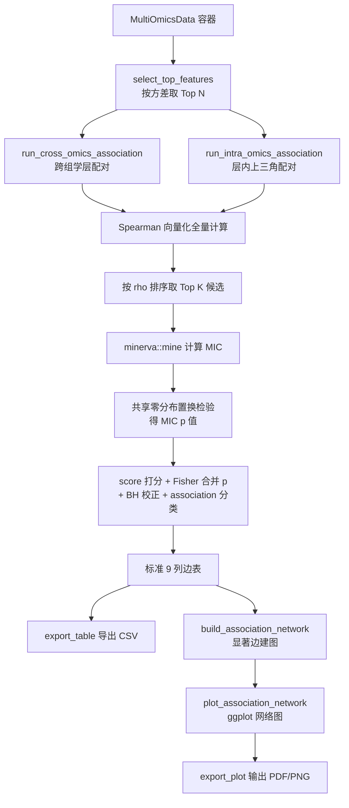

## 用户需求

在现有生物组学分析流程项目中，向 `agent/rscript` 模块库新增适用于多组学的关联分析模块函数，并在 `test/multiple_omics` 中新增一个轻量测试脚本来驱动这些新模块，最后用 `Rscript.exe` 实际执行验证。

## 产品概述

新增一套「Spearman + MIC 双指标关联网络」分析能力，同时刻画特征间的**单调线性关联**（Spearman）与**任意函数形式的非线性关联**（MIC，最大信息系数）。分析覆盖两个维度：

- **跨组学关联**：不同组学层之间的特征配对（如微生物组 vs 挥发性组分）
- **组学内关联**：同一组学层内部的特征配对

因现有 `demo_multiomics.R` 分析内容庞大、执行耗时长，新增分析写入**独立的新测试脚本**，不改动原脚本，并通过特征预筛选把整体耗时控制在数分钟内。

## 核心功能

### 一、双指标关联计算（两个核心函数）

- **跨组学函数**：接收两个组学层矩阵，计算所有跨层特征对的关联
- **组学内函数**：接收单个组学层矩阵，计算层内所有特征对（上三角，不含自身配对）的关联
- 每个特征对同时输出：Spearman 相关系数与 p 值、MIC 值与 MIC 置换检验 p 值
- 提供**综合打分（score）与合并 p 值（pvalue）**，并支持通过参数切换打分口径：
- 综合强度型：`|rho|` 与 `MIC` 的加权均值
- 非线性侧重型：`MIC - rho^2`，突出非线性关联
- 合并 p 值采用 Fisher 合并法整合两种检验
- 每个特征对给出 **association 分类标签**：依据显著性与 rho 符号，标注为正相关、负相关、非线性关联或不显著
- 支持特征预筛选（按方差取 Top N）、显著性阈值过滤、结果条数上限，控制计算规模

### 二、结果表格导出

导出 CSV 结果表，列名严格为：
`source`、`target`、`spearman-rho`、`spearman-pval`、`MIC`、`MIC-pvalue`、`score`、`pvalue`、`association`

### 三、显著关联网络可视化

- 仅保留显著关联边构建网络图
- 节点按所属组学层着色，节点大小反映连接度（degree）
- 边的颜色区分关联类型（正/负/非线性），边的粗细反映关联强度
- 标注度数最高的枢纽节点名称
- 输出 PDF 与 PNG 双格式

### 四、轻量测试脚本

在 `test/multiple_omics` 新增独立脚本，加载烟叶发酵五层组学数据，对全部组学层做特征预筛选后，执行跨组学两两配对与各层组学内配对的关联分析，导出所有结果表与网络图，并打印各步骤耗时与统计摘要。

## 技术栈

沿用项目现有 R 技术栈，不引入新范式：

- **语言**：R 4.5.0（`C:\Program Files\R\R-4.5.0\bin\x64\Rscript.exe`）
- **MIC 计算**：`minerva` 包（v1.5.10，CRAN）。当前环境**未安装**，但其依赖 `Rcpp` 已就绪且 CRAN 提供 Windows 二进制包，安装可行
- **网络与可视化**：`igraph`（已装）+ `ggplot2` / `ggrepel`（已装），沿用 `plot_multiomics.R` 中 `layout_with_fr` + 手工 `geom_segment`/`geom_point` 的绘图风格，**不引入 `ggraph`**（全仓库无该依赖）
- **统计**：base R `stats`（`p.adjust`、`pchisq`、`pt`）
- **模块自动加载**：`source_all_scripts.R` 递归扫描 `rscript/` 下所有 `*.R`，新文件**无需注册**即被自动加载

## 实现方案

### 核心策略

将 Spearman 与 MIC 两种互补的关联度量整合到统一的边表结构中。Spearman 走**向量化路径**（对行取 rank 后做标准化矩阵叉积），复用 `cross_correlation.R` 中已验证的 `.row_standardise()` 思路，使数万特征对的相关计算在秒级完成；MIC 因其动态规划网格划分本质无法向量化，是**唯一的性能瓶颈**，故采用「先用 Spearman 与方差预筛选缩小候选集，再对候选对计算 MIC」的两阶段策略。

### 关键技术决策

**1. 两阶段计算控制 MIC 成本（核心性能决策）**

MIC 单对计算约需 O(n^1.2) 网格搜索，312 样本下单次约 1-3 ms。若对预筛选后 5 层各 60 特征的全部配对暴力计算：跨组学 10 对 × 3600 = 36000 对，组学内 5 × 1770 = 8850 对，合计约 45000 对，仅 MIC 本身即需 1-2 分钟，叠加置换检验（每对 R 次重算）将放大到不可接受的量级。

因此设计为：

- 先全量计算 Spearman（向量化，毫秒级）
- 按 `|rho|` 或方差排序取 Top K 候选对（`max_pairs_for_mic` 参数，默认 2000）
- 仅对候选对调用 `minerva::mine()`
- 未进入候选集的对，MIC 与 MIC-pvalue 记为 `NA`，并在 `association` 中体现

**2. MIC 置换检验的成本控制**

朴素做法是对每个特征对独立做 R 次置换，成本为 `n_pairs × R` 次 MIC 计算，不可行。采用**共享零分布（shared null distribution）**策略：在给定样本量下，随机打乱构造 `n_perm`（默认 200）个无关联特征对，计算其 MIC 得到经验零分布，再用该分布对所有候选对求经验 p 值。这将成本从 `n_pairs × R` 降为常数 `n_perm`，是 MIC 显著性检验的标准可行近似，并在函数注释中明确说明该近似的前提（同样本量下 MIC 零分布仅依赖 n）。同时提供 `mic_pvalue_method` 参数，可选 `"permutation"`（共享零分布）或 `"none"`（跳过，返回 NA）以进一步提速。

**3. score 与 pvalue 的可切换定义（响应用户「由你定但要可切换」）**

- `score_method = "combined"`（默认）：`score = w * |rho| + (1 - w) * MIC`，`w` 由 `score_weight` 控制（默认 0.5）。直觉清晰，两种关联都强时得分最高
- `score_method = "nonlinear"`：`score = MIC - rho^2`（经典 MIC-R²），突出「MIC 高但线性弱」的非线性关联
- `pvalue` 统一用 **Fisher 合并法**：`X² = -2(ln p_spearman + ln p_MIC)`，服从 df=4 的卡方分布；当 MIC p 值缺失时退化为 Spearman p 值
- 三种口径均在 roxygen 文档与行内注释中说明数学定义与适用场景

**4. association 分类规则**

基于合并 p 值（BH 校正后）与两个指标的相对关系：

- 不显著 → `not_significant`
- 显著且 `|rho| >= rho_linear_min` → `positive` / `negative`（按 rho 符号）
- 显著但 `|rho|` 低而 MIC 高 → `nonlinear`

**5. 组学内配对的对称性处理**

单层矩阵计算自相关时只取**严格上三角**（`which(upper.tri(m), arr.ind = TRUE)`），避免自配对与重复边，同时使内存与结果规模减半。

**6. 依赖缺失的优雅降级**

模块顶部用 `requireNamespace("minerva", quietly = TRUE)` 检测；缺失时给出明确的安装提示并将 MIC 相关列置为 NA，保证脚本仍能跑完 Spearman 部分而不中断——与项目中 `build_cross_omics_network()` 对 `igraph`、`plot_cross_correlation_heatmap()` 对 `pheatmap` 的处理方式一致。

### 数据流



## 实现要点

**沿用现有约定，避免技术债**

- 矩阵一律为 **features x samples**（行=特征，列=样本），与 `cross_correlation.R` 完全一致
- 复用 `drop_zero_variance()`（`multiomics_data.R:480`）、`get_omics_matrix()`（`:203`）、`get_feature_info()`（`:258`）、`make_group_colors()`（`utils/plot_helpers.R:22`）
- 所有函数带 `verbose` 参数、roxygen 文档（`@description`/`@param`/`@return`/`@examples \dontrun{}`/`@export`）、返回 list，与现有模块签名风格统一
- 导出走 `export_table()` / `export_plot()`，不自行写文件

**列名含连字符的关键处理**
`source`、`spearman-rho`、`MIC-pvalue` 等含 `-` 的列名会被 R 的 `data.frame()` 默认改写为 `.`。必须构造时传 `check.names = FALSE`，或构造后用 `colnames() <-` 显式赋值。`export_table()` 内部用 `utils::write.csv(row.names = FALSE)`，只要 data.frame 列名正确即可原样落盘。此外 `source` 是 R 基础函数名，作为列名安全，但**不可**用作变量名。

**性能热点与规避**

- MIC 是唯一瓶颈，已通过两阶段候选 + 共享零分布双重控制
- Spearman 的 rank 变换用 `t(apply(mat, 1, rank))` 一次完成，不在配对循环内重复排序
- 候选对的 MIC 计算按行索引批量提取子矩阵，避免在循环中反复切片大矩阵
- 网络绘图前对边数设上限（`max_edges`），超限时保留 score 最高的边，防止图形渲染卡死

**容错与日志**

- 沿用 `cat(sprintf("[assoc] ..."))` 前缀式进度输出，与 `[cross-cor]`、`[multiomics]` 风格一致
- 测试脚本每个分析步骤用 `tryCatch` 包裹，单步失败不中断整体流程
- 样本数不足（< 8）时明确 `stop()` 并说明原因

**不改动的部分**

- 不修改 `demo_multiomics.R`（用户明确要求）
- 不修改现有任何模块函数，仅新增文件；仅在 `install_packages.R` 的 CRAN 清单中追加 `minerva` 一项

## 目录结构

```
g:/OmicsWorks/
├── agent/rscript/
│   ├── install_packages.R                          # [MODIFY] 在 cran_packages 向量中追加 "minerva"，
│   │                                               #   使一键安装脚本覆盖新依赖。仅此一行改动。
│   └── multiomics/
│       ├── association_network.R                   # [NEW] 核心模块。包含：
│       │                                           #   - select_top_features(): 按方差/丰度取 Top N 特征预筛选
│       │                                           #   - .spearman_matrix(): 向量化 Spearman（rank + 标准化叉积），
│       │                                           #     复用 .row_standardise() 思路，返回 rho 与解析 p 值
│       │                                           #   - .mic_null_distribution(): 共享零分布置换，返回 n_perm 个
│       │                                           #     随机对的 MIC，供经验 p 值查表
│       │                                           #   - .compute_mic_for_pairs(): 对候选对调用 minerva::mine()
│       │                                           #   - .assemble_edge_table(): 计算 score/Fisher 合并 p/BH 校正/
│       │                                           #     association 分类，输出严格 9 列（check.names = FALSE）
│       │                                           #   - run_cross_omics_association(): 【核心函数一】跨组学两层配对
│       │                                           #   - run_intra_omics_association(): 【核心函数二】层内上三角配对
│       │                                           #   - run_all_omics_associations(): 遍历 MultiOmicsData 所有
│       │                                           #     跨层组合与层内组合的便捷封装
│       │                                           #   要求：minerva 缺失时降级（MIC 列 NA）不报错；
│       │                                           #   矩阵为 features x samples；全部带 roxygen 文档与 verbose。
│       └── plot_association_network.R              # [NEW] 可视化模块。包含：
│                                                   #   - build_association_network(): 由边表筛显著边构建 igraph 对象，
│                                                   #     节点标注 omics 层与 degree，边标注 score/association
│                                                   #   - plot_association_network(): igraph::layout_with_fr 布局 +
│                                                   #     ggplot geom_segment/geom_point 绘制，节点按组学层着色
│                                                   #     (make_group_colors)、大小随 degree，边色区分
│                                                   #     positive/negative/nonlinear，ggrepel 标注 Top 枢纽节点
│                                                   #   - plot_association_summary(): 各配对组合的显著边数量与
│                                                   #     关联类型构成的堆叠柱状图
│                                                   #   - get_association_hubs(): 按 degree 排序输出枢纽节点表
│                                                   #   要求：沿用 plot_multiomics.R 绘图风格，返回 ggplot 对象供
│                                                   #   export_plot() 使用；网络为空时返回 NULL 并打印提示。
└── test/multiple_omics/
    └── demo_multiomics_association.R               # [NEW] 轻量测试脚本，参照 demo_multiomics_advanced.R 模式：
                                                    #   - 文件头大段注释：研究背景、科学问题、RUNTIME NOTE、OUTPUT
                                                    #   - set.seed(42) + source(source_all_scripts.R)
                                                    #   - CFG 配置块集中所有耗时旋钮（top_n_features、
                                                    #     max_pairs_for_mic、n_perm、阈值），每项带 cost 注释
                                                    #   - 照搬 layer_spec 五层定义（各层 id_col/match_col 不同）
                                                    #   - save_table()/save_figure() 助手 + n_tables/n_figures 计数
                                                    #   - Step1 加载五层 → Step2 建容器并预处理 → Step3 特征预筛选
                                                    #     → Step4 跨组学两两关联 → Step5 层内关联 → Step6 网络可视化
                                                    #     → Step7 汇总(含总耗时)
                                                    #   - 输出命名 tables/assoc_stepNN_*.csv、figures/assoc_stepNN_*
                                                    #   - 每步 tryCatch 容错，不改动 demo_multiomics.R
```

## 关键接口定义

两个核心函数的签名契约（多处调用依赖，需精确）：

```
# 【核心函数一】跨组学：两个不同组学层之间的特征关联
run_cross_omics_association <- function(mat_x, mat_y,
                                        name_x = "x", name_y = "y",
                                        top_n = NULL,
                                        max_pairs_for_mic = 2000,
                                        mic_pvalue_method = c("permutation", "none"),
                                        n_perm = 200,
                                        score_method = c("combined", "nonlinear"),
                                        score_weight = 0.5,
                                        p_adjust = "BH",
                                        p_threshold = 0.05,
                                        rho_linear_min = 0.3,
                                        max_edges = 5000,
                                        verbose = TRUE)

# 【核心函数二】组学内：同一组学层内部的特征关联（上三角）
run_intra_omics_association <- function(mat, name = "omics",
                                        top_n = NULL,
                                        max_pairs_for_mic = 2000,
                                        mic_pvalue_method = c("permutation", "none"),
                                        n_perm = 200,
                                        score_method = c("combined", "nonlinear"),
                                        score_weight = 0.5,
                                        p_adjust = "BH",
                                        p_threshold = 0.05,
                                        rho_linear_min = 0.3,
                                        max_edges = 5000,
                                        verbose = TRUE)
```

两者统一返回 list，其中 `edges` 为严格 9 列的边表：

```
list(
  edges  = <data.frame>,  # 列（严格顺序与命名，check.names = FALSE）:
                          #   source, target, spearman-rho, spearman-pval,
                          #   MIC, MIC-pvalue, score, pvalue, association
  nodes  = <data.frame>,  # name, omics, degree
  params = <list>         # 本次运行的全部参数与统计计数
)
```