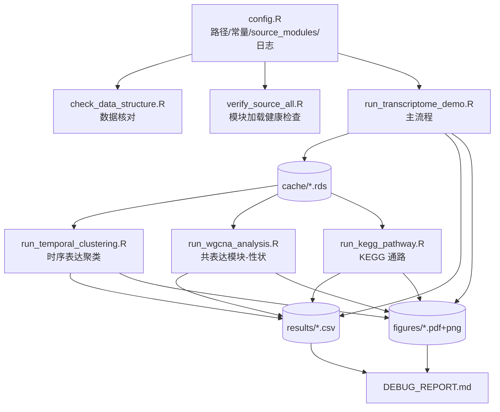

## 用户需求

基于 GNU R 解释器（`C:\Program Files\R\R-4.5.0\bin\Rscript.exe`），在 `test/multiple_omics/transcript_demo` 目录中编写一套 demo 转录组学分析流程。流程必须通过 `source()` 加载 `agent/rscript` 中的模块化 R 脚本，再调用其中的具体函数完成分析，导出结果数据表格与结果插图。流程的另一核心目的是压测 `agent/rscript` 模块库：根据 R 的真实运行输出定位缺陷，并在模块库源码内完成调试与修复。

## 输入数据

- `extdata/Tobacco-fermentation/expression/expression_transcriptome.csv`：2000 基因 × 312 样本，首列列名 `name`，连续型 TPM/FPKM 类丰度（0.10–111.43，中位 5.17），无缺失无零值
- `extdata/Tobacco-fermentation/featureinfo_transcriptome.csv`：2000 行 × 12 列，含 `gene_id`/`name`/`kegg`/`category`/`super_class`/`family`/`description` 等注释
- `extdata/Tobacco-fermentation/sampleinfo.csv`：312 样本 × 15 列，含 `phase`(4 水平)/`variety`(2)/`location`(2)/`timepoint`(13)/`day` 及温湿度海拔等数值性状

## 核心功能

**主流程分析链路**

- 数据加载与对齐：以 `name` 为主键对齐，保留全部 2000 基因，未匹配的 2 个基因注释置 NA
- 质量控制：样本/特征层面的 CV、缺失率、表达分布评估
- 预处理链路：缺失过滤 → 中位数归一化 → log2 变换 → Pareto 标度（Pareto 矩阵供 PCA，log2 矩阵供差异分析）
- PCA 主成分分析：按 phase、variety、location 分别着色的得分图与载荷图
- limma 差异表达：phase 主对比（Fresh vs Late_maturation）与 variety 次级对比，配火山图
- Fisher 过表达富集：按 super_class / category / family 三个注释维度，配富集条形图
- 差异基因分层聚类热图

**转录组特色分析**

- 时序表达模式聚类：利用 13 个时间点识别基因表达随发酵进程的变化模式，输出成员表、轮廓图与聚类中心图
- WGCNA 共表达模块：识别基因共表达模块，输出软阈值筛选图、聚类树，并与样本数值性状（温度/湿度/海拔/发酵天数）及 phase 做模块-性状关联，输出相关性热图
- KEGG 通路分析：基于注释表中的 KEGG KO 号做通路层面富集与通路活性评分

**产出物**

- `results/*.csv` 结果数据表格；`figures/*.{pdf,png}` 结果插图（每图双格式）；`cache/*.rds` 中间态缓存供进阶脚本复用
- `DEBUG_REPORT.md` 调试报告：逐条记录每个缺陷的现象、根因、修复方案与验证证据，并汇总关键分析结论

**调试与修复约束**

- 所有缺陷在 `agent/rscript` 源码内修复，不得在 demo 层用 try/tryCatch 掩盖
- 保持函数签名与返回结构向后兼容，不破坏既有 `metabolism_demo`/`proteome_demo` 调用
- 修复须为通用正确实现，不做针对本数据集的特判 hack

## 技术栈

- **语言/运行时**：GNU R 4.5.0（Windows ucrt），通过 `C:\Program Files\R\R-4.5.0\bin\Rscript.exe` 执行
- **模块库**：`agent/rscript`（既有模块化函数库，本次的被测对象与唯一分析逻辑来源）
- **核心依赖包**（已实测全部安装）：limma、WGCNA、pheatmap、ComplexHeatmap、ggplot2、ggrepel、RColorBrewer、cluster、e1071、matrixStats、reshape2、dplyr、tidyr、scales、cowplot、gridExtra、circlize、ggpubr
- **组织范式**：完全对齐同数据集已跑通的 `test/multiple_omics/proteome_demo/` 结构（config.R 集中配置 + 多脚本分阶段 + results/figures/cache 三分目录 + DEBUG_REPORT.md）

## 实现策略

### 总体方法

采用**"分层脚本 + 缓存驱动"**架构：`config.R` 作为单一配置源（绝对路径、分组常量、阈值、`source_modules()` 加载器、日志辅助），主流程脚本完成加载→QC→预处理→PCA→limma→富集→热图并将中间态写入 `cache/*.rds`，三个进阶脚本各自读取 cache 独立运行时序聚类、WGCNA 模块-性状关联、KEGG 通路分析。这样任一进阶分析失败或需重跑时无需重跑耗时的主流程，显著缩短"运行→发现缺陷→修复→验证"的调试迭代周期。

### 关键技术决策

**1. 差异分析走 limma + log2 路线，而非 DESeq2/edgeR**

实测数据为连续型非整数（0.1031–111.43，`is_integer_like = FALSE`），各样本列和相近（8417/8518/8405），无零值无缺失，属已归一化的 TPM/FPKM 类丰度而非原始 counts。计数模型的负二项分布假设不成立，强行套用会产生错误推断。因此沿用 `proteome_demo` 已验证的 `normalize_median → log2_transform(pseudo_count=1) → limma` 链路，与模块库现有能力完全契合，无需引入新依赖。

**2. 以 `name` 为主键对齐并保留全部 2000 基因**

实测 `gene_id` 与表达矩阵首列交集为 0，`name` 交集为 1998，故只能用 `name` 对齐。注释表 `name` 列存在 1 个重复值，会触发 `load_feature_info` 的 `make.unique` 兜底（该逻辑为 proteome_demo BUG-2 的修复产物，本次正好回归验证）。用户明确要求保留全部 2000 基因，因此需先验证 `create_omics_data` 在存在未匹配特征时是否会丢弃它们：若丢弃，优先在 demo 层改用行名对齐保留全量矩阵（注释列为 NA），仅当确认属模块通用缺陷时才修改源码。

**3. KEGG 分析需先做能力探测再决定实现路径（本次最大技术不确定性）**

`utils/kegg_pathway.R` 的接口面向代谢组设计：`map_kegg_compound_to_pathway(kegg_ids)` 联网请求 KEGG REST API 且语义针对化合物 C 号，而本数据的 `kegg` 列是 KO 号（如 `K01610`，非空 1762 条）。执行时按以下顺序决策：

- 优先尝试离线路径：若 `run_kegg_pathway_gsva` / `run_kegg_pathway_wgcna` 可接受外部构造的 mapping 表，则直接以 `kegg` 列作为通路分组键，绕开联网
- 若必须联网：使用 `cache_dir` 参数缓存 API 响应，避免调试迭代中重复请求；设置合理 `batch_size`/`delay` 控制速率
- 若 KO 号确实无法走现有 API 路径：在源码中扩展对 KO 的支持（属通用能力补全，非 hack），并在报告中记录设计理由
- 兜底方案：若联网不可用，改用 `enrichment/fisher_enrich.R` 以 `kegg` 列作为 `category_col` 完成通路层面富集，保证该环节仍有产出且仍能压测模块

**4. WGCNA 参数按 2000×312 规模设定**

`build_wgcna_modules` 内含 `pickSoftThreshold` 自动选幂，在此规模下为主要耗时点。采用 `network_type="signed"`、`min_module_size=30`（2000 基因规模下比默认 10 更能产出可解释模块）、`merge_cut_height=0.25`。trait 矩阵由 sampleinfo 数值列（`temperature_C`/`humidity_pct`/`altitude_m`/`day`）与 phase 哑变量拼接。WGCNA 结果单独缓存，避免重复计算。注意 `plot_soft_threshold(expr_matrix, powers, ...)` 首参为表达矩阵（与 readme.md 描述的 wgcna_result 不符，**以源码实现为准**）。

**5. 富集分析对 Unknown 类别的处理**

`super_class` 中 `Unknown` 占 1329/2000 (66%)。将其保留在背景全集中（保证统计正确性），但在结果表与图中标注，并在 DEBUG_REPORT 中说明该分布对富集灵敏度的影响，避免把"0 显著"误判为代码缺陷。

### 性能与可靠性

- **调试迭代成本**：cache 分层使进阶脚本可独立重跑，避免每次修复都重跑全流程；KEGG API 响应落 cache_dir
- **热点**：WGCNA 软阈值筛选（2000 基因）与 limma 逐基因拟合是主要耗时；已排除逐基因 R 循环的 `run_anova`（用户未选最大化覆盖，2000 基因循环过慢）
- **失败可见性**：`source_modules()` 对不存在的文件立即 `stop()`，保证加载失败在启动期暴露而非运行时崩溃；demo 中不使用 tryCatch 包裹分析调用，确保模块缺陷能真实抛出并被捕获定位

### 避免技术债

完全复用 `proteome_demo` 已验证的组织范式与调用约定（`filter_missing_values` 取 `$filtered_matrix`、`run_limma` 取 `$results`、`var_explained` 已是百分比不再乘 100、`plot_volcano` 显式传列名、`plot_profile_clusters` 不接受 `group_labels`、`clust$clusters` 用 `as.character()`），不引入新模式。所有分析逻辑仅通过 `source()` + 函数调用获得，demo 层不重新实现任何算法。

## 架构设计



模块调用关系：demo 脚本 → `source_modules()` → `agent/rscript` 各模块函数 → 返回 R 对象 → `export_table()`/`export_plot()`/`export_heatmap()` 落盘。

## 目录结构

```
g:/OmicsWorks/
├── test/multiple_omics/transcript_demo/          # [NEW] 本次产出目录（当前为空）
│   ├── config.R                                  # [NEW] 集中配置。定义 PROJECT_ROOT/RSCRIPT_ROOT/DATA_DIR、三个输入文件绝对路径、
│   │                                             #   RESULTS_DIR/FIGURES_DIR/CACHE_DIR 并自动 dir.create；分组常量
│   │                                             #   (GROUP_PHASE="phase"/GROUP_VARIETY="variety"/GROUP_LOCATION="location"/TIME_COL="day")；
│   │                                             #   对比常量 (Fresh vs Late_maturation、Burley vs Virginia)；阈值 (SEED/P_THRESHOLD=0.05/
│   │                                             #   LOGFC_THRESHOLD=1/N_TOP_CLUSTER/N_CLUSTERS/WGCNA 参数)；source_modules() 加载器
│   │                                             #   (文件不存在即 stop，source 时 local=FALSE, encoding="UTF-8")；section()/step()/mat_dim() 日志辅助。
│   │                                             #   全部绝对路径，不依赖 setwd()。照搬 proteome_demo/config.R 范式。
│   ├── check_data_structure.R                    # [NEW] 数据核对脚本。读取三个输入文件，输出维度、ID 列匹配情况
│   │                                             #   (name 交集 1998、gene_id 交集 0、name 重复 1 个)、样本匹配数、各分组水平分布、
│   │                                             #   注释列覆盖率(kegg 1762 非空)、数值范围与缺失零值统计；导出 00_ 前缀 CSV 供报告引用。
│   ├── verify_source_all.R                       # [NEW] 模块加载健康检查。source agent/rscript/source_all_scripts.R，
│   │                                             #   验证全部脚本加载成功且本流程所需关键函数在全局环境可见（exists 检查），
│   │                                             #   回归验证 proteome_demo BUG-1 的嵌套 source 递归修复未回退。
│   ├── run_transcriptome_demo.R                  # [NEW] 主流程。source_modules 加载 utils/load_data.R、utils/export.R、
│   │                                             #   utils/plot_helpers.R、theme_palette.R、preprocessing/{filter_missing,normalize,
│   │                                             #   transform,scale}.R、qcqa/qcqa.R、multivariate/pca.R、differential/limma_de.R、
│   │                                             #   enrichment/fisher_enrich.R、visualization/{volcano_plot,heatmap_plot}.R。
│   │                                             #   SECTION1 加载对齐(name 主键，保留 2000 基因)→SECTION2 QC→SECTION3 预处理链路
│   │                                             #   (filter→normalize_median→log2_transform→scale_pareto)→SECTION4 PCA(phase/variety/
│   │                                             #   location 三张得分图+载荷图)→SECTION5 limma 双对比+火山图→SECTION6 Fisher 富集
│   │                                             #   (super_class/category/family)+条形图→SECTION7 Top差异基因热图→SECTION8 cache 落盘。
│   │                                             #   注意取 $filtered_matrix / $results，var_explained 不再乘 100。
│   ├── run_temporal_clustering.R                 # [NEW] 时序表达模式聚类。读 cache，调用 proteome/protein_clustering.R 的
│   │                                             #   cluster_protein_profiles/plot_profile_clusters/plot_cluster_centers，
│   │                                             #   按 13 个 timepoint(day) 聚类基因表达轨迹；导出聚类成员表(cluster 列用 as.character)、
│   │                                             #   轮廓图、聚类中心图。不传 group_labels 参数。
│   ├── run_wgcna_analysis.R                      # [NEW] WGCNA 共表达模块与性状关联。读 cache，调用 network/wgcna_module.R 的
│   │                                             #   build_wgcna_modules(min_module_size=30, network_type="signed")、
│   │                                             #   plot_soft_threshold(首参为表达矩阵)、plot_wgcna_dendrogram，及 network/wgcna_trait.R 的
│   │                                             #   wgcna_module_trait/plot_module_trait；trait 由 temperature_C/humidity_pct/altitude_m/day
│   │                                             #   + phase 哑变量构成；导出模块成员表、模块特征基因矩阵、模块-性状相关表与热图；
│   │                                             #   WGCNA 结果单独缓存避免重算。
│   ├── run_kegg_pathway.R                        # [NEW] KEGG 通路分析。读 cache，基于 feature_info 的 kegg(KO号) 列。
│   │                                             #   优先尝试 utils/kegg_pathway.R 的离线路径(run_kegg_pathway_gsva/
│   │                                             #   run_kegg_pathway_wgcna 传入自构 mapping)；需联网时用 cache_dir 缓存 API 响应；
│   │                                             #   若 KO 号不被现有 API 路径支持则在源码扩展 KO 支持；兜底用 fisher_enrich 以 kegg 为
│   │                                             #   category_col 完成通路富集。导出通路富集表/通路活性矩阵与对应插图。
│   ├── results/                                  # [NEW] 结果表格输出目录（由 config.R 自动创建）
│   ├── figures/                                  # [NEW] 插图输出目录，每图 pdf+png 双格式
│   ├── cache/                                    # [NEW] 中间态 rds 缓存目录
│   └── DEBUG_REPORT.md                           # [NEW] 调试报告。六节结构：一、被测模块统计表；二、缺陷逐条记录
│                                                 #   (现象/根因/修复/验证证据)；三、关键分析结论表(数据尺度/PCA方差/差异基因数/
│                                                 #   富集结果/模块数等，含对"0 显著"类结果的生物学解释)；四、产出清单；
│                                                 #   五、运行方式(按依赖顺序的 PowerShell 命令)；六、修复原则落实情况。
└── agent/rscript/                                # [MODIFY] 仅修改运行中实际暴露缺陷的文件
    └── <按实际运行输出确定>                        # 可能涉及 utils/load_data.R(create_omics_data 未匹配特征处理)、
                                                  #   utils/kegg_pathway.R(KO 号支持扩展)、network/wgcna_module.R、
                                                  #   network/wgcna_trait.R、proteome/protein_clustering.R 等。
                                                  #   修复须保持签名与返回结构向后兼容，不破坏 metabolism_demo/proteome_demo；
                                                  #   须为通用正确实现，不做数据特判；每处修复须有运行证据。
```

## 执行要点

- **运行顺序**：`check_data_structure.R` → `verify_source_all.R` → `run_transcriptome_demo.R`（必须先跑，生成 cache）→ 三个进阶脚本任意顺序
- **调用约定复用**（源自 proteome_demo 已验证经验，避免重踩）：`filter_missing_values()` 取 `$filtered_matrix`；`run_limma()` 取 `$results`；`run_pca()$var_explained` 已是百分比；`plot_volcano()` 显式传 `p_col="p_adj"`/`logfc_col="logFC"`/`feature_col="feature_id"`；`run_fisher_enrich()` 显式传 `feature_id_col="name"`；`plot_profile_clusters()`/`plot_cluster_centers()` 不接受 `group_labels`
- **以源码为准而非 readme**：已发现 `plot_soft_threshold` 的首参在 readme.md 中被描述为 `wgcna_result`，实际实现为 `expr_matrix`；调用前应核对源码签名
- **缺陷定位纪律**：demo 中不用 tryCatch 包裹分析调用，让错误真实抛出；每次修复后重跑对应脚本取得验证证据再记入报告
- **兼容性守护**：修改 `agent/rscript` 任一文件后，需确认 `metabolism_demo`/`proteome_demo` 的调用方式仍成立（签名与返回结构不变）
- **中文编码**：`source()` 统一 `encoding="UTF-8"`，避免 Windows GBK 环境下中文注释乱码

## Agent Extensions

### SubAgent

- **code-explorer**
- Purpose: 在编写各分析脚本前，批量核查 `agent/rscript` 中待调用函数（WGCNA 模块与性状关联、KEGG 通路、时序聚类、QC 等）的真实参数签名、返回结构与跨文件依赖关系，避免依据过时的 readme.md 描述编码
- Expected outcome: 产出准确的函数签名与返回值清单（含已发现的 readme 与实现不一致点，如 `plot_soft_threshold` 首参），使 demo 脚本一次性按真实接口调用，减少无效调试迭代