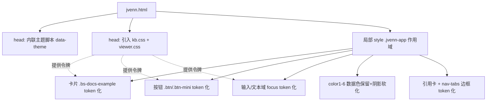

## 用户需求

更新 `jvenn.html` 页面的视觉样式，使其颜色、主题、阴影、圆角等风格与 `styles/viewer.css` 的设计体系（基于 `kb.css` 设计令牌）保持统一。

## 产品概述

jvenn.html 是一个交互式维恩图查看器页面，目前基于 Bootstrap 框架，未接入项目统一的设计令牌体系。需要在保留 Bootstrap 布局骨架的前提下，引入 `kb.css` 设计令牌，并对页面内的卡片、按钮、输入框、色块、引用框等局部样式进行重写，使其与查看器风格一致，同时支持明暗主题切换。

## 核心功能

- 在 `<head>` 引入 `styles/kb.css`（令牌基准）并在 `viewer.css` 之后引入，确保令牌可用且不冲突
- 将页面卡片（Venn 全局配置面板）、按钮组、输入框/文本域、色块聚焦态、引用卡片、导航标签等颜色/边框/阴影/圆角统一到设计令牌
- 在 `<html>` 上接入 `data-theme` 机制，支持跟随系统偏好与本地存储的主题切换
- 保留 jvenn 列表的 6 个语义数据色（#006600 等），仅将其边框/聚焦阴影/容器背景 token 化
- 隔离 jvenn 作用域，避免 kb.css 全局 `.btn` 与 Bootstrap `.btn` 互相覆盖导致布局或外观异常

## 技术栈选择

- 保留现有 Bootstrap 3 栅格（container/row-fluid/span*）负责布局
- 引入 `styles/kb.css` 提供的设计令牌（:root 亮色 + `html[data-theme="dark"]` 暗色），不新增任何令牌定义
- 在 `jvenn.html` 局部 `<style>` 中基于令牌重写视觉细节，并为其外层容器加 `.jvenn-app` 命名空间以隔离 kb.css 全局类
- 主题切换沿用 viewer.css 的 `data-theme` 机制（localStorage 优先，回退到 `prefers-color-scheme`）

## 实现方案

### 总体策略

保留 Bootstrap 的栅格与组件类名作为结构层，将视觉表现层完全迁移到 kb.css 令牌。通过在 `body` 外套一层 `.jvenn-app` 容器（或修改现有 `.container`），把 jvenn 专属样式都写在 `.jvenn-app` 作用域下，确保 kb.css 的全局 `.btn`/`.card` 不会污染 jvenn 的 Bootstrap 按钮，反过来 jvenn 也不影响其他页面。

### 关键技术决策

1. **作用域隔离**：给 jvenn 根容器加 `.jvenn-app` 类，所有重写样式以 `.jvenn-app .btn`、`.jvenn-app .bs-docs-example` 等前缀书写。这样 kb.css 的全局 `.btn` 不会直接命中 jvenn 按钮，避免 Bootstrap 与 VS Code 风格按钮混用导致的高度/圆角错乱。
2. **颜色统一**：所有 border 用 `var(--ui-border)`/`var(--ui-border-strong)`，背景用 `var(--ui-background)`/`var(--ui-background-alt)`，主色/聚焦用 `var(--accent)`，阴影用 `var(--shadow-sm)`/`var(--shadow-md)`，圆角用 `var(--radius)`/`var(--radius-sm)`。
3. **语义数据色保留**：`.control-group.color1~6` 的文本色与色块预览仍使用原 6 个数据色（用户数据语义），但聚焦态阴影从写死的 `0 0 6px 原色` 改为 `0 0 0 2px var(--accent-soft)` 的柔和 token 化阴影，边框统一为 `var(--ui-border-strong)`。
4. **主题切换脚本**：在 `<head>` 顶部内联一段同步脚本（避免闪烁），读取 `localStorage.theme` 或 `matchMedia('(prefers-color-scheme: dark)')` 设置 `document.documentElement.dataset.theme`；页面内提供一个主题切换按钮，写入 localStorage 并切换 `data-theme`。

### 性能与可靠性

- 内联主题脚本放在 `<head>` 最前，零网络依赖、零闪烁；技能上仅操作 `data-theme` 属性，token 过渡由 kb.css 的 `body` 过渡（0.35s）承担，无额外重排。
- 样式重写仅追加/覆盖局部规则，不改动 Bootstrap 与 vendor 文件，blast radius 可控。

## 实现注意

- 引入顺序：`kb.css` 必须在 `viewer.css` 之前；jvenn 局部 `<style>` 建议在 vendor css 之后、或置于末尾以最高优先级覆盖。
- 不要修改 `vendor/` 下任何 Bootstrap 文件，仅通过 jvenn 局部样式覆盖外观。
- `.bs-docs-example:after` 角标文字色用 `var(--ui-foreground-muted)`，背景用 `var(--ui-background-alt)`，边框 `var(--ui-border)`，圆角改为 `var(--radius-sm)`（原为 4px 0 4px 0，保留左上/左下裁角风格）。
- 引用卡片 `.col-12` 的 `.label.label-info` 角标改为 token 化（accent 背景 + 白字），容器边框/圆角/阴影统一。
- `.nav-tabs` 下边框与 `.tab-content` 四边边框统一为 `var(--ui-border)`；链接 hover/active 色用 `var(--accent)`。
- 全局 `a` 链接色设为 `var(--accent)`，与 viewer.css markdown 链接一致。

## 架构设计



## 目录结构

```
project-root/
├── jvenn.html              # [MODIFY] 1) head 顶部加内联主题脚本
│                           #           2) 引入 styles/kb.css 与 styles/viewer.css
│                           #           3) 给根容器加 .jvenn-app 作用域
│                           #           4) 重写局部 <style>：卡片/按钮/输入/色块/引用/标签
│                           #           5) 加主题切换按钮与切换逻辑
└── styles/
    ├── kb.css              # [引用不修改] 提供设计令牌与全局类，jvenn 局部样式在其之上覆盖
    └── viewer.css          # [引用不修改] 查看器专属类，作为风格对齐基准
```

## 关键代码结构

jvenn 局部样式命名空间与令牌映射（示意，非完整实现）：

```css
.jvenn-app .bs-docs-example {
  background: var(--ui-background);
  border: 1px solid var(--ui-border);
  border-radius: var(--radius);
  box-shadow: var(--shadow-sm);
}
.jvenn-app .bs-docs-example:after {
  background: var(--ui-background-alt);
  color: var(--ui-foreground-muted);
  border: 1px solid var(--ui-border);
}
.jvenn-app .btn,
.jvenn-app .btn-mini {
  border: 1px solid var(--ui-border-strong);
  border-radius: var(--radius-sm);
  background: var(--ui-background);
  color: var(--ui-foreground);
  transition: border-color .2s, background .2s, box-shadow .2s, transform .15s;
}
.jvenn-app .btn:hover { border-color: var(--accent); background: var(--ui-background-hover); box-shadow: var(--shadow-sm); }
.jvenn-app .btn.active,
.jvenn-app .btn-mini.active { background: var(--accent); color: #fff; border-color: var(--accent); }
.jvenn-app input:focus,
.jvenn-app textarea:focus { border-color: var(--accent); box-shadow: 0 0 0 2px var(--accent-soft); }
```

## 设计风格

采用与 viewer.css 一致的 VS Code 风格设计语言（浅色 / 暗色双主题），以设计令牌驱动的卡片、按钮、输入控件呈现。保留 jvenn 原有 Bootstrap 信息架构与六色数据语义，仅将视觉层（颜色、边框、阴影、圆角、主题过渡）统一为项目规范。

## 页面区块设计

- **顶栏（主题切换）**：右上角放置主题切换按钮，使用 `.btn` token 样式，图标随主题变化（日/月），点击写入 localStorage 并切换 `<html data-theme>`。
- **维恩图与主说明区（左 span6）**：`#jvenn-container` 保持原样；说明段落文字色用 `var(--ui-foreground-muted)`，文本域（结果列表）边框/圆角/聚焦阴影 token 化。
- **Venn 全局配置面板（右 span6，`.bs-docs-example`）**：卡片底 `var(--ui-background)`、边框 `var(--ui-border)`、圆角 `var(--radius)`、阴影 `var(--shadow-sm)`；左上角标底色 `var(--ui-background-alt)`、字色 `var(--ui-foreground-muted)`；内部的 `btn-mini` 按钮组、搜索输入框、状态 label 全部 token 化。
- **粘贴列表区（底部 span6，tab + 6 组 control-group）**：`nav-tabs` 与 `tab-content` 边框统一 `var(--ui-border)`；每个列表的标题输入框与文本域聚焦态使用 `0 0 0 2px var(--accent-soft)` 柔和阴影；color1~6 保留原数据色文字与色块，边框统一 `var(--ui-border-strong)`。
- **引用卡片（底部 cite）**：容器白底/暗色底 + `var(--ui-border)` 边框 + `var(--radius)` 圆角 + `var(--shadow-sm)`；角标改为 accent 背景白字标签。

## 交互与动效

- 全局背景/前景色随主题切换有 0.35s 过渡（来自 kb.css body 规则）。
- 按钮 hover 上浮 1px 并出现 accent 边框与柔和阴影；active 态填充 accent。
- 输入框聚焦出现 2px accent 柔光环。
- 主题切换按钮 hover 同样有轻微上浮与阴影反馈。