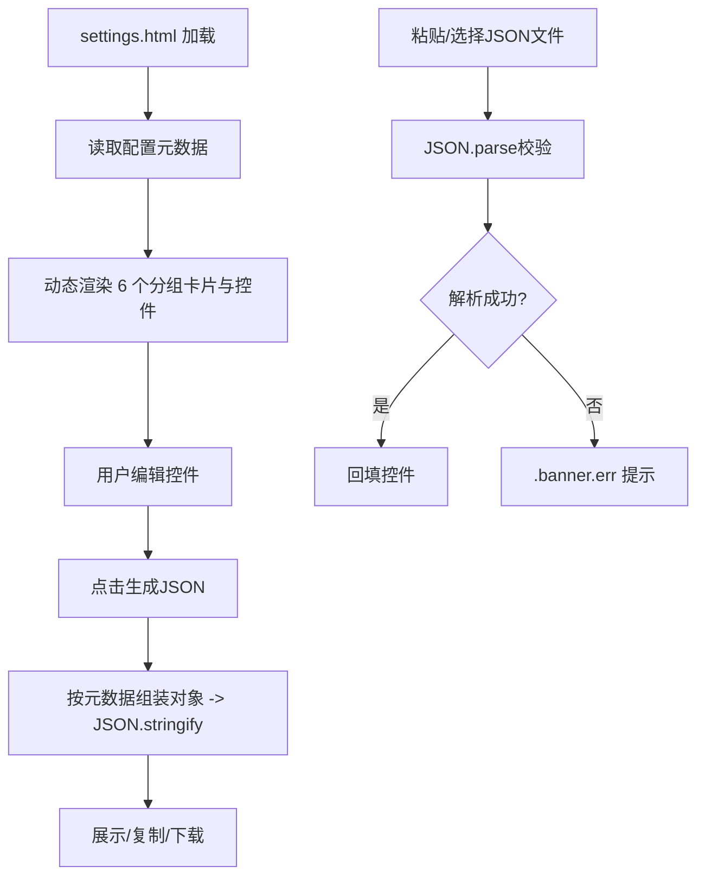

## 用户需求

在 `settings.html` 中使用原生 HTML + JavaScript 实现一个应用程序参数配置页面，用于加载给定结构的 JSON 配置数据并将当前配置生成对应的 JSON 字符串。

## 产品概述

一个基于 `styles/kb.css` 设计令牌与组件风格的参数配置单页应用。页面采用顶部工具栏（含主题切换）与左侧分组说明/主内容区结构，主区域按 6 个配置分组以卡片形式展示参数，支持从 JSON 文本或文件加载配置、按原结构生成 JSON 字符串，并提供复制与下载功能。

## 核心功能

- 按 6 个分组（Analysis、LLM、Literature、MySql、Report、Tools）渲染配置表单卡片，字段按类型渲染为文本/数字/密码/布尔/枚举控件。
- 支持粘贴 JSON 文本或选择 JSON 文件加载配置，解析成功后回填所有控件；解析失败以错误横幅提示。
- 支持从当前控件状态生成与原始结构完全一致的 JSON 字符串，展示在代码区。
- 提供「复制 JSON」「下载 JSON」操作，以及一键导出配置文件。
- 复用 kb.css 变量与组件类（.app、.topbar、.brand、.btn、.card、.search、.banner 等），并提供亮/暗主题切换。

## 技术栈

- 前端：原生 HTML5 + 纯 JavaScript（无框架、无构建步骤），与现有 `kb.html` 保持一致。
- 样式：直接复用 `styles/kb.css`，通过 `<link>` 引入，不新增颜色/字体/阴影令牌。
- 数据：浏览器原生 `FileReader` 读取 JSON 文件，`JSON.parse` / `JSON.stringify` 处理配置。

## 实现方案

采用「配置元数据驱动」渲染策略：将 6 个分组及字段的 key、类型、默认值、枚举选项声明为 JS 配置对象，页面初始化时据此动态生成表单卡片与控件，避免手写大量重复 HTML。加载时按该元数据回填控件，生成时按元数据递归读取控件值并组装为与原始结构相同的嵌套对象。

关键决策：

- 元数据驱动而非硬编码表单，提升可维护性与扩展性（后续新增分组/字段只需改配置对象），符合 DRY/YAGNI。
- 字段类型映射：number → `<input type="number">`、text → `<input type="text">`、password → `<input type="password">`、bool → `<input type="checkbox">`、enum → `<select>`（选项来自元数据）。
- 主题切换复用 `kb.html` 的 `data-theme` 属性方案，切换 `<html>` 上的 `data-theme` 并在按钮中切换图标/文字。
- 文件路径字段使用 `text` 输入，兼容本地路径输入；密码字段使用 `password` 类型避免明文暴露。

性能与可靠性：

- 纯前端、单页、字段总量约 22 项，DOM 规模小，无性能瓶颈；生成 JSON 为 O(n) 遍历。
- 加载解析失败时捕获 `JSON.parse` 异常，使用 `.banner.err` 展示错误信息且不破坏已有表单。
- 不引入外部依赖，离线可用；复制功能采用 `navigator.clipboard` 并降级到 `document.execCommand` 兜底。

## 实现说明（执行细节）

- 严格复用 kb.css 现有类：`.app` 网格、`.topbar`、`.brand`(含 `.logo`)、`.btn`/`.btn.primary`、`.sidebar`、`.card`(配合 `card--blue/green/purple/orange/teal/pink` 修饰)、`.card h3 .dot`、`.search`、`.banner.err`、`.banner.info`。
- 主内容区使用 `main.content` + `.view` + `.card`，每个分组一个卡片，卡片标题含 `.dot` 并使用不同 `card--*` 配色以区分分组。
- 控件样式复用 `.search` 输入框外观（border/radius/focus 态），保持视觉一致。
- 生成 JSON 使用 `JSON.stringify(obj, null, 2)`，展示在 `<pre class="markdown-body">` 风格代码区（或直接 `<pre>` + code 背景令牌）。
- 下载通过 `Blob` + `URL.createObjectURL` 生成 `app-config.json`，避免服务端依赖。
- 保持向后兼容：默认值与空字符串遵循用户给定 JSON 原样。

## 架构设计

页面为单一 HTML 文件，内部三段：

1. 结构层：`.app` 网格（topbar / sidebar / main.content）。
2. 样式层：仅 `<link>` 引入 `kb.css`，内联少量布局辅助（如表单栅格）但不定义新设计令牌。
3. 逻辑层：内联 `<script>` 包含配置元数据、渲染函数、加载函数、生成函数、主题切换、复制/下载函数。



## 目录结构

```
g:/OmicsWorks/agent/apps/
└── settings.html   # [NEW] 参数配置页面。引入 styles/kb.css；含 .app 布局（topbar+sidebar+main.content）；
                    # 内联 JS 配置元数据（6 分组字段定义）、动态卡片渲染、JSON 加载回填、JSON 生成、
                    # 复制/下载、主题切换逻辑。所有视觉样式走 kb.css 变量与组件类，不新增设计令牌。
```

## 关键代码结构（元数据示例）

```javascript
const CONFIG_SCHEMA = {
  Analysis: {
    title: "分析参数", cardClass: "card--blue",
    fields: [
      { key: "DiffPvalueCutoff", type: "number", step: "any" },
      { key: "DiffTopCount", type: "number", step: "1" },
      { key: "MetaboliteVipCutoff", type: "number", step: "any" },
      { key: "WgcnaTopMAD", type: "number", step: "1" }
    ]
  },
  LLM: {
    title: "大模型", cardClass: "card--purple",
    fields: [
      { key: "LLMApiKey", type: "password" },
      { key: "LLMMaxRounds", type: "number", step: "1" },
      { key: "LLMModelName", type: "text" },
      { key: "LLMServiceUrl", type: "text" }
    ]
  },
  Literature: {
    title: "文献检索", cardClass: "card--green",
    fields: [
      { key: "AutoSearchLiterature", type: "bool" },
      { key: "LiteratureSearchStrategy", type: "enum", options: ["none","auto","custom"] },
      { key: "MaxLiteratureCount", type: "number", step: "1" }
    ]
  },
  MySql: {
    title: "MySQL 数据库", cardClass: "card--orange",
    fields: [
      { key: "MySqlDatabase", type: "text" },
      { key: "MySqlHost", type: "text" },
      { key: "MySqlPassword", type: "password" },
      { key: "MySqlPort", type: "number", step: "1" },
      { key: "MySqlUser", type: "text" }
    ]
  },
  Report: {
    title: "报告输出", cardClass: "card--teal",
    fields: [
      { key: "OutputFormat", type: "enum", options: ["pdf","html","markdown"] }
    ]
  },
  Tools: {
    title: "外部工具", cardClass: "card--pink",
    fields: [
      { key: "PythonPath", type: "text" },
      { key: "RscriptPath", type: "text" },
      { key: "RsharpPath", type: "text" },
      { key: "WkHtmlToPdfPath", type: "text" }
    ]
  }
};
```

## 设计风格

沿用 `styles/kb.css` 的 VS Code 风格（亮色 / 暗色双主题）设计令牌与组件外观，保持与现有 kb.html 完全一致的视觉语言。采用顶部工具栏 + 左侧分组导航/说明 + 主内容区卡片流的布局，所有颜色、字体、阴影、圆角均取自 kb.css 变量，不新增任何自定义样式令牌。

## 页面规划（单页）

1. 顶部 topbar：品牌 logo、标题「应用参数配置」、右侧操作按钮组（加载配置、生成 JSON、复制、下载、主题切换）。
2. 左侧 sidebar：配置分组快捷导航列表（点击滚动定位到对应卡片），并用 `.search` 风格输入框做分组筛选。
3. 主内容区 main.content：以 `.view` 包裹，6 个 `.card` 分组卡片（Analysis/LLM/Literature/MySql/Report/Tools），分别使用 `card--blue/purple/green/orange/teal/pink` 修饰类区分，卡片标题含 `.dot`；每个字段以标签 + 控件（input/select/checkbox）形式排列，控件外观复用 `.search` 输入框样式。
4. JSON 输出区：底部 `.card` 内 `<pre>` 代码区展示生成结果，配复制/下载按钮与 `.banner` 状态提示。

## 交互细节

- 主题切换按钮复用 `data-theme` 方案，亮/暗无缝过渡（与 kb.css transition 一致）。
- 卡片入场采用 kb.css 已有 `rise` 动画。
- 控件 focus 态使用 `--accent` 描边与 `--accent-soft` 光晕（同 `.search:focus`）。
- 错误加载以 `.banner.err` 红框提示，成功操作以 `.banner.info` 提示。