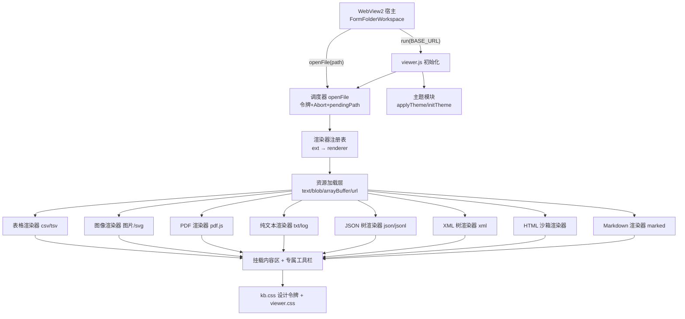

## 用户需求

在工作区 `apps/viewer.html` 中实现一个基于 HTML + JavaScript 的**多格式文件查看器**功能模块，由宿主（WinForms WebView2 的文件树）选中文件后驱动展示，视觉样式与 `styles/kb.css` 完全一致（配色、阴影、圆角、字体、明暗主题）。

## 产品概述

一个单页文件查看器：顶部为工具栏（文件名、类型徽标、格式专属操作按钮、主题切换），主体为内容区，按文件扩展名自动切换到对应的渲染视图。加载中显示骨架屏，失败显示错误横幅，未选择文件时显示空状态占位。宿主通过 `run(BASE_URL)` 初始化、`openFile(相对路径)` 打开文件。

## 核心功能

### 格式支持

- **csv / tsv**：按 RFC 4180 解析（支持引号包裹字段、字段内分隔符与换行、双引号转义），渲染为表格；首行作表头，带行号列、粘性表头；大文件分批渲染并提示总行列数。
- **图片（bmp / jpg / jpeg / png / gif / tiff）**：支持放大、缩小、旋转（±90°）、水平镜像、垂直镜像、适应窗口、1:1 原始尺寸、重置；支持滚轮缩放与拖拽平移；tiff 浏览器多不支持，加载失败时给出提示并提供下载/新窗口打开入口。
- **svg**：作为图像展示，复用上述全部变换工具栏。
- **pdf**：引入外部 PDF 查看器模块渲染，支持翻页（上一页/下一页/跳页）、页码显示、缩放；模块不可用时降级为内嵌浏览器原生查看或下载链接。
- **txt / log**：等宽字体纯文本展示，带行号、自动换行开关。
- **json / jsonl**：语法高亮 + 可折叠树形展示（对象/数组节点可逐级展开收起，显示子项数量）；jsonl 按行解析后合并为 JSON 数组再展示；提供全部展开/全部折叠；解析失败时回退为纯文本并提示错误位置。
- **xml**：语法高亮 + 标签折叠（元素节点可展开收起），保留属性、文本、注释、CDATA 的差异化着色；解析失败时提示并回退纯文本。
- **html**：在隔离沙箱中渲染网页文档，同时提供「渲染视图 / 源码视图」切换。
- **md**：通过 marked.js 渲染为 HTML 展示，套用现有正文排版样式。

### 通用能力

- 未识别扩展名时显示「暂不支持该格式」友好提示，并提供下载入口。
- 快速连续切换文件时，丢弃过期请求结果，避免旧内容覆盖新内容。
- 外部依赖不可用（离线）时，各视图均优雅降级而非白屏。
- 明暗双主题，与现有页面共用主题状态。

## 视觉效果

沿用 VS Code 亮/暗色调性：白/浅灰底、`#007acc` 蓝色强调、细边框、极轻阴影、8px 圆角、Segoe UI 与 Cascadia Code 字体组合。顶栏工具条扁平化按钮带 hover 微位移与蓝色描边高亮；表格斑马纹与粘性表头；代码/树形视图使用等宽字体与柔和的语法着色；视图切换带淡入上浮动画。

## 技术栈选型

沿用当前项目既有形态，**不引入构建工具、框架与包管理**：

- **原生 HTML + ES5/ES6 JavaScript（`"use strict"`）**：与 `js/kb.js`、`js/app.js` 完全一致的写法。
- **纯 CSS + CSS 自定义属性**：`styles/viewer.css` 仅承载查看器专属样式，**设计令牌全部复用 `styles/kb.css`**（页面同时 link 两个 css，`kb.css` 在前）。
- **CDN 依赖（jsDelivr，锁定版本）+ 全量降级**：
- `marked@12.0.2`（与 `analysis.html` 版本一致）— Markdown 渲染
- `pdfjs-dist@3.11.174`（`pdf.min.js` + `pdf.worker.min.js`）— PDF 渲染
- **不引入 highlight.js**：JSON/XML 需要「折叠」能力，highlight.js 只产出扁平 span 无法折叠。自建 DOM 树形渲染器同时输出高亮与折叠，反而更轻、更可控、零额外依赖。

## 实现思路

### 总体策略

以「**扩展名 → 渲染器**」注册表为核心的**策略模式**：`openFile(path)` 解析扩展名 → 查表取得渲染器描述符 → 按其声明的加载方式（text / blob / arrayBuffer / url）拉取资源 → 调用渲染器产出 DOM → 挂载到内容区，同时由渲染器声明其专属工具栏按钮。

```js
RENDERERS = { csv: tableRenderer, tsv: tableRenderer, png: imageRenderer, ... }
```

新增格式（如后续 VB 端已预留的 `xlsx`）只需注册一项，**不改动调度逻辑**，满足开闭原则与架构可扩展性。

### 关键技术决策

1. **宿主契约兼容**：顶层 `var openFile = null; var toggleTheme = null;`，在 `run(BASE_URL)` 内赋值 —— 与 `kb.js` 暴露 `showSummary`/`toggleTheme` 的写法逐字对齐，保证 `ExecuteScriptAsync("openFile('...')")` 可调用。顶栏保留 `id="topbar"`（宿主会将其 `display:none`）。
2. **调用时序保护**：宿主在 `NavigationCompleted` 才调用 `run()`，但 TreeView 的 `AfterSelect` 可能更早触发。故 `openFile` 在 `run()` 之前被调用时，将路径存入 `pendingPath`，`run()` 初始化完成后自动补打开。这是纯前端无法回避的时序风险，必须处理。
3. **竞态控制**：复用 `kb.js` 的 `activeToken` 令牌模式，并叠加 `AbortController`（参考 `app.js` 的 `abortController` 用法）主动取消在途请求。`TreeView1_AfterSelect` 在键盘上下键浏览时会高频触发，此项为**必需**而非优化。
4. **JSON/XML 自建折叠树**：递归构建 DOM，每个可折叠节点为 `<div class="jt-node">` + 折叠三角 + 摘要（`{…} 12 items`）。

- 性能：大文件全量递归建 DOM 会卡顿。采用**惰性展开** —— 折叠状态的子树不建 DOM，展开时才构建并缓存，将首屏复杂度从 O(全部节点) 降到 O(可见节点)；默认仅展开前两层。
- XML 用 `DOMParser().parseFromString(txt, "application/xml")`，检测 `querySelector("parsererror")` 判定失败。

5. **CSV/TSV 手写 RFC 4180 状态机解析**：单次字符扫描，O(n) 时间、无回溯，正确处理 `""` 转义、字段内分隔符与 CRLF。渲染层限制首批 2000 行 + 「加载更多」，用 `DocumentFragment` 批量插入，避免逐行 reflow。
6. **图片变换用单一状态对象 + CSS transform 合成**：`{scale, rotate, flipX, flipY, tx, ty}` → `translate(...) rotate(...) scale(sx, sy)`。仅改 `transform` 触发合成层动画，不引起 layout/repaint，性能优于逐次重绘 canvas。旋转与镜像的组合顺序固定，保证操作直觉一致。
7. **HTML 用 `<iframe sandbox>` 隔离**：以 `srcdoc` 注入并设 `sandbox`（不含 `allow-same-origin`/`allow-scripts`），防止被查看文档执行脚本、读取宿主页面或发起请求 —— 科研工作站会打开来源不明的产物文件，此隔离是**安全必需项**。
8. **SVG 走图片通道**：以 `blob: URL` 挂到 ``（而非 `innerHTML` 内联），既复用图片工具栏，又天然禁用 SVG 内嵌脚本。
9. **pdf.js worker 必须显式配置** `GlobalWorkerOptions.workerSrc`，否则报错。按页 `canvas` 渲染，`devicePixelRatio` 适配保证高清屏不糊。
10. **统一降级**：`typeof marked !== "undefined"`、`typeof pdfjsLib !== "undefined"` 检测，失败复用 `kb.css` 既有 `.banner.info` / `.banner.err` 提示，绝不白屏。

### 布局适配

`kb.css` 的 `.app` 是 `grid-template-columns: 312px 1fr` 双列（含侧栏）。本查看器**无侧栏**，故在 `viewer.css` 中用 `.app.app--viewer` 覆盖为单列 `grid-template-columns: 1fr`，并让 `main.content` 落在 `grid-column: 1`。`body` 的 `overflow:hidden` 与 `height:100vh` 保持不变，内容区自身滚动。

## 实现注意事项

- **不修改任何既有文件**：`kb.css`/`kb.js`/`app.js`/`kb.html`/`analysis.html` 一律不动，避免影响已上线的两个页面；新样式一律写在 `viewer.css`，通过新增类名覆盖，杜绝污染全局类。
- **不修改 VB 文件**：`FormFolderWorkspace.vb` 不在本工作区内，本次仅交付前端；在 `viewer.js` 文件底部以注释形式给出宿主端调用示例（参照 `kb.js` 末尾注释 `run(...)` 的既有做法），便于后续接线。
- **路径规范化**：Windows 路径分隔符 `\` 统一替换为 `/`，逐段 `encodeURIComponent` 后再拼接，避免中文/空格路径 404；拼接沿用 `BASE_URL + "/" + path`，并处理 `BASE_URL` 末尾斜杠重复。
- **XSS 防护**：所有来自文件内容的文本一律经 `esc()` 转义后再进 `innerHTML`（复用 `kb.js` 同款实现）；HTML 文档走 sandbox iframe；Markdown 渲染结果因来源为本地科研产物且已 sandbox 隔离风险可控，但仍避免拼接未转义的文件名。
- **资源释放**：图片/PDF/SVG 使用的 `URL.createObjectURL` 在切换文件时必须 `revokeObjectURL`；pdf 文档对象调用 `destroy()`，防止连续浏览大量文件时内存持续增长。
- **日志**：沿用 `console.warn`/`console.error` + 中文说明（与 `kb.js` 的「marked 解析失败，降级为纯文本」风格一致），仅在降级与异常路径打印，不输出文件正文内容避免日志刷屏。
- **事件绑定**：工具栏按钮采用内容区**事件委托**，避免每次切换文件反复 `addEventListener` 导致监听器泄漏。

## 架构设计



数据流：宿主选中文件 → `openFile(相对路径)` → 规范化路径、递增令牌、中止旧请求 → 查注册表 → 按需拉取（文本/二进制/直链）→ 渲染器产出 DOM → 校验令牌未过期 → 挂载并绑定工具栏。

## 目录结构

```
g:/OmicsWorks/agent/apps/
├── viewer.html          # [MODIFY] 当前为空文件。构建页面骨架：html[data-theme="light"]；
│                        #   head 中按序 link styles/kb.css（设计令牌基准）与 styles/viewer.css；
│                        #   CDN 引入 marked@12.0.2、pdfjs-dist@3.11.174（均加 onerror 静默降级）；
│                        #   body 内 .app.app--viewer 单列布局：header.topbar#topbar（含 brand/logo、
│                        #   文件名 #fileName、类型徽标 #fileBadge、动态工具栏容器 #toolbar、
│                        #   spacer、主题按钮 #themeBtn 含 #themeIcon/#themeLabel）；
│                        #   main.content#content 初始为 .empty 空状态；末尾引入 js/viewer.js。
│                        #   必须保留 id="topbar"（宿主会隐藏）与 marked 全局可用。
├── styles/
│   ├── kb.css           # [REUSE·不修改] 设计令牌与通用类来源（--accent/--shadow-*/--radius/
│   │                    #   --code-* /--card-*、.btn/.card/.banner/.skeleton/.empty/.markdown-body/
│   │                    #   滚动条与响应式）。viewer 全部颜色阴影圆角字体均引用其变量。
│   └── viewer.css       # [NEW] 查看器专属样式，仅用新类名，不覆盖 kb.css 既有类语义。包含：
│                        #   .app--viewer 单列 grid 覆盖；.viewer-toolbar 工具栏与 .tool-btn 扁平按钮
│                        #   （hover 位移+accent 描边，复用 --shadow-sm）；.file-badge 类型徽标（按类别
│                        #   取 --card-* 配色）；.vtable 表格（粘性表头、斑马纹、行号列、等宽数字）；
│                        #   .image-stage 画布（棋盘格透明底、grab/grabbing 光标、transform 过渡）；
│                        #   .pdf-stage 分页容器与 canvas 阴影；.plain-text 行号布局；
│                        #   .json-tree/.xml-tree 树形（缩进引导线、折叠三角、摘要文本）与
│                        #   .tk-key/.tk-str/.tk-num/.tk-bool/.tk-null/.tk-tag/.tk-attr/.tk-comment
│                        #   语法着色令牌（亮/暗两套，均由 html[data-theme="dark"] 派生）；
│                        #   .html-frame 沙箱 iframe 铺满样式。
└── js/
    └── viewer.js        # [NEW] 全部逻辑。结构对齐 kb.js：顶层 "use strict"；
                         #   var openFile = null; var toggleTheme = null;
                         #   function run(BASE_URL) { ... } 内实现：
                         #   ① 工具函数 $ / el / esc（与 kb.js 同款）；
                         #   ② 主题 applyTheme/initTheme（localStorage 键 "kb-theme"，与现有页面共享）；
                         #   ③ 网络层 fetchText/fetchBlob/fetchArrayBuffer（no-store + AbortController）；
                         #   ④ 路径工具 normalizePath/joinUrl/getExt/baseName；
                         #   ⑤ 渲染器注册表 RENDERERS 与调度 openFile（令牌+pendingPath+资源释放）；
                         #   ⑥ 各渲染器：parseDelimited(RFC4180状态机)+renderTable、renderImage
                         #      （scale/rotate/flipX/flipY/平移，滚轮与拖拽）、renderPdf（pdf.js，
                         #      workerSrc 配置、分页、destroy 释放）、renderPlainText、
                         #      parseJsonl+renderJsonTree（惰性展开）、renderXmlTree（DOMParser+
                         #      parsererror 检测）、renderHtml（sandbox iframe + 源码切换）、
                         #      renderMarkdown（marked 检测与 <pre> 降级，逐字复用 kb.js 实现）、
                         #      renderUnsupported；
                         #   ⑦ 状态视图 showSkeleton/showError/showEmpty（复用 kb.css 类）；
                         #   ⑧ 工具栏事件委托绑定；
                         #   ⑨ 文件末尾以注释给出宿主调用示例（对齐 kb.js 末尾风格）。
```

## 关键代码结构

仅给出跨模块依赖的核心契约（渲染器注册表接口），其余按上述描述实现：

```js
/**
 * 渲染器描述符：新增格式只需注册一项，调度逻辑无需改动
 * @typedef {Object} RendererSpec
 * @property {"text"|"blob"|"arrayBuffer"|"url"} load  资源加载方式
 * @property {string} kind      类别标识，用于工具栏与徽标配色（table/image/pdf/text/tree/web）
 * @property {(data:any, ctx:ViewerContext) => HTMLElement} render  产出待挂载的 DOM
 * @property {(ctx:ViewerContext) => HTMLElement[]} [toolbar]       该格式专属工具栏按钮
 * @property {() => void} [dispose]  清理 objectURL / pdf 文档等资源
 */

/**
 * @typedef {Object} ViewerContext
 * @property {string} path      规范化后的相对路径
 * @property {string} ext       小写扩展名
 * @property {string} name      文件名
 * @property {string} url       完整可访问 URL
 * @property {AbortSignal} signal
 */
```

## 设计定位

嵌入 WinForms 工作站的**工具型查看器面板**，非营销页面。设计目标是「零干扰、高信息密度、与宿主 IDE 观感统一」，严格延续 `kb.css` 已确立的 VS Code 亮/暗色设计语言，不引入任何新的色彩体系。

## 页面结构（单页，自上而下分块）

### 1. 顶栏工具条（header.topbar#topbar）

高 60px，白底 + 1px 下边框 + `--shadow-sm`。左侧为 38px 圆角方形 logo（`--accent` 底、白色文件图标）；紧邻纵向两行：主行显示当前文件名（17px/700，过长省略号），次行显示相对路径（12px、`--ui-foreground-muted`）。文件名右侧为类型徽标胶囊（11px 大写字母，按类别取 `--card-*` 配色：表格 teal、图像 purple、PDF pink、文本 gray、结构化 blue、网页 orange）。中部 spacer 撑开，右侧为格式专属工具栏与主题切换按钮。宿主会隐藏此栏，故所有关键操作在内容区顶部另有承载。

### 2. 格式工具栏（.viewer-toolbar）

位于内容区顶部、随视图动态替换的扁平按钮组。按钮 32px 高、6px 圆角、透明底、1px `--ui-border-strong` 描边，hover 时 `translateY(-1px)` + `--accent` 描边 + `--ui-background-hover` 底色，纯图标或图标加短文案。图像视图提供放大/缩小/左旋/右旋/水平翻转/垂直翻转/适应窗口/1:1/重置；PDF 提供上一页/页码输入/下一页/缩放；JSON 与 XML 提供全部展开/全部折叠/复制；HTML 提供渲染与源码分段切换；表格显示行列统计。按钮间以 1px 竖线分组。

### 3. 内容主体（main.content）

自身滚动，`fade` 淡入上浮动画。各视图形态：

- **表格**：整体包在 `.card` 内，粘性表头（`--ui-background-alt` 底、600 字重），首列窄行号（`--ui-foreground-subtle`、等宽），偶数行 `--ui-background-alt` 斑马纹，行 hover 为 `--ui-background-hover`，单元格 7px/10px 内边距、1px `--ui-border` 网格线，横向溢出滚动。
- **图像**：铺满的深浅棋盘格透明底舞台，图像居中并带 `--shadow-md`，光标 grab/grabbing，变换以 0.18s ease 过渡。
- **PDF**：纵向排列的页面卡片，每页白底 + `--shadow-md` + 8px 圆角，页间 20px 间隔，底部居中页码指示。
- **纯文本 / 树形**：`--code-background` 底、1px `--code-border` 边框、`--font-code` 等宽字体、行高 1.65。行号列右对齐、`--ui-foreground-subtle`、不可选中。树形视图每级 16px 缩进并带 1px 虚线引导线，折叠三角 hover 变 `--accent`，折叠时行尾显示 `{…} 12 items` 灰色摘要。
- **Markdown**：直接套用 `.markdown-body`，最大宽度 1080px 居中。
- **网页**：sandbox iframe 铺满，白底 + 细边框。

### 4. 状态层

加载中复用 `.skeleton` shimmer 骨架条；错误复用 `.banner.err`（红调）；离线降级提示复用 `.banner.info`（`--accent-soft` 底）；未选择文件时复用 `.empty`，46px 文件夹图标 + 「请从左侧文件树中选择一个文件」灰色提示。

## 交互与动效

全部动效克制在 0.15–0.4s：视图切换 `fade` 上浮 8px 淡入；按钮 hover 微位移 1px；图像变换平滑过渡；树节点展开无高度动画（避免大数据卡顿）。滚轮缩放图像，拖拽平移。全部交互均有 hover 与 active 反馈，保证「响应且有生命力」的操作手感。

## 响应式

沿用 `kb.css` 的 860px 断点：窄屏下顶栏隐藏路径次行，工具栏按钮收起文案仅留图标并允许横向滚动，内容区内边距降为 18px/16px。

## 主题

`html[data-theme]` 亮暗双主题，全部颜色引用 `kb.css` 变量，新增的语法着色令牌亦提供暗色派生值，保证两套主题下对比度均达可读标准。