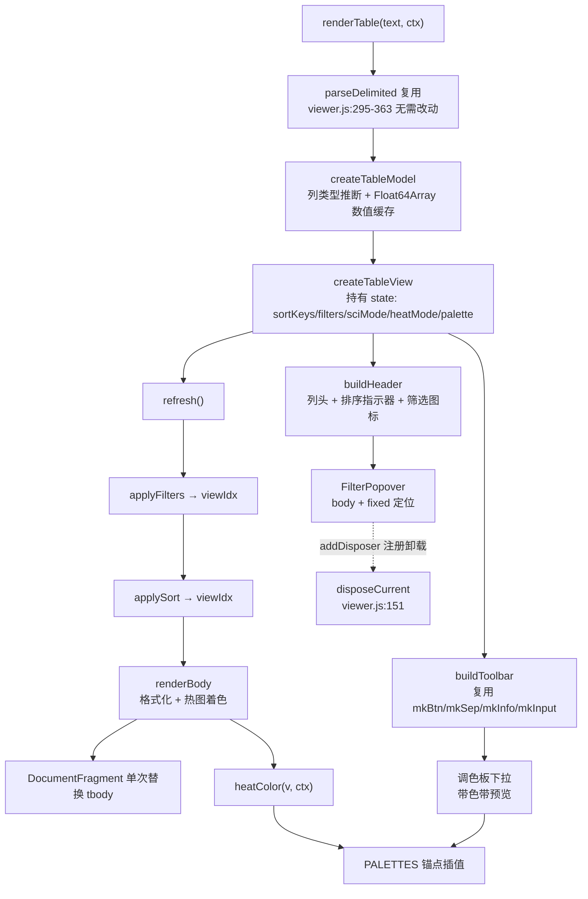

## 用户需求

更新 `viewer.html` 文件查看器中的 **csv / tsv 表格数据查看模块**，为表格增加交互式数据探索能力。经澄清确认，本次范围**仅限 csv / tsv**（xlsx 不实现）。

## 产品概述

在现有静态表格视图基础上，升级为一个具备排序、筛选、数字格式化与热图着色能力的轻量级数据探索器。所有操作作用于**当前已渲染的行**（保持既有「首批 2000 行 + 加载更多」的分批语义），点击「加载更多」后自动对新的已加载集合重新应用当前排序与筛选状态。

## 核心功能

### 1. 多列排序

- 点击列头在 **升序 → 降序 → 无序** 三态间循环切换。
- **Shift + 点击**列头可追加次级排序键，支持多列组合排序。
- 列头展示排序方向箭头与优先级序号（如 `↑1`、`↓2`），一目了然当前排序链。
- 数值列按数值大小比较，文本列按自然语言顺序比较；空值统一排至末尾；排序算法稳定。
- 提供「清除排序」快捷操作。

### 2. 列级行筛选

- 每个列头右侧显示**筛选漏斗图标**，点击弹出 Excel 风格下拉浮层。
- 浮层内提供三种筛选模式：
- **字符串筛选**：包含 / 不包含 / 等于 / 开头是 / 结尾是，可选区分大小写。
- **正则表达式筛选**：输入正则与标志位，实时校验，非法正则给出即时错误提示且不影响已有结果。
- **数值范围筛选**：最小值 / 最大值双输入框，支持只填一端的开区间。
- 多列筛选条件之间为 **AND** 组合。
- 已设置筛选的列头图标高亮显示，浮层内提供「清除本列」，工具栏提供「清除全部筛选」。
- 工具栏实时显示「筛选后 X / 已加载 Y 行」。

### 3. 数字显示格式切换

- 工具栏 toggle 按钮，在**原始数字字符串**与**保留 4 位有效数字的科学计数法**（如 `1.235e-5`）之间切换。
- 仅作用于被自动识别为数值类型的列，文本列保持原样。

### 4. 列热图着色

- 工具栏 toggle 按钮，开启后对所有数值列的单元格按**本列 min / max 归一化**结果渲染背景色。
- 每列独立归一化，同列内数值大小关系直观可见。

### 5. 全局热图着色

- 独立的 toggle 按钮，开启后对全表数值单元格按**行 Z-score 标准化**着色（每行减该行均值、除该行标准差，映射区间 clamp 在 -2 ~ +2）。
- 适合组学表达谱等需要跨列比较行内模式的场景。
- 全局热图开启时接管所有数值单元格着色，覆盖列热图设置，两者互斥。

### 6. 调色板选择

提供四组共 12 套调色板，通过工具栏下拉选择：

- **连续型**：Viridis / Magma / Plasma
- **发散型**：RdBu / RdYlBu / 蓝-白-红
- **单色渐变**：Blues / Greens / Oranges
- **经典**：Jet / Rainbow / 热力红黄

下拉项带**色带缩略预览条**，所见即所得。

## 视觉效果

- 列头新增排序指示器与筛选漏斗图标，hover 时浮现，已激活状态常驻高亮。
- 筛选浮层为带阴影的圆角卡片，模式切换用分段按钮组，输入框沿用现有 `.tool-input` 视觉语言。
- 热图单元格背景色由数值动态计算，单元格文字颜色根据背景亮度自动切换深 / 浅色，保证任意配色下的可读性。
- 热图模式下停用斑马纹，行 hover 改用描边高亮，避免与背景色冲突。
- 完整支持亮 / 暗双主题，窄屏下工具栏控件自适应收缩。

## 技术栈

沿用现有技术栈，**不引入任何新依赖**：

- **语言**：原生 JavaScript，**严格 ES5 语法**（全部 `var`，无 `let` / `const` / 箭头函数 / 模板字符串 / 解构 / `class`），与 `js/viewer.js` 现有 1593 行代码风格完全一致
- **样式**：原生 CSS，复用 `styles/kb.css` 提供的设计令牌（`--accent` / `--ui-background-*` / `--ui-border-*` / `--radius*` / `--shadow-*` / `--font-*`），`styles/viewer.css` 中不重复定义令牌
- **运行环境**：VB.NET WebView2（FormFolderWorkspace 宿主），通过 `ExecuteScriptAsync` 调用 `run(BASE_URL)` / `openFile(path)` / `toggleTheme()`
- **模块组织**：无模块系统，全部逻辑写在 `function run(BASE_URL) { ... }` 闭包内

**不引入 SheetJS**（xlsx 本次不做），**不新增 CDN 脚本**，`viewer.html` 无需改动。

## 实现方案

### 总体策略

将现有 `renderTable`（viewer.js 第 365–442 行）从「一次性构建静态 DOM」重构为 **「数据模型 + 视图状态 + 声明式重绘」** 的三层结构：

```
原始数据 (rawBody)  →  已加载切片 (loadedCount)
                          ↓  列类型推断 (colMeta)
                          ↓  筛选 (filters, AND 组合)
                          ↓  排序 (sortKeys, 多列稳定排序)
                     视图索引数组 (viewIdx)
                          ↓  格式化 (sciMode) + 着色 (heatMode, palette)
                     重建 tbody (DocumentFragment 一次性替换)
```

**核心决策：维护「视图索引数组」而非复制数据行**。`viewIdx` 是一个存放原始行下标的 `Array<number>`，筛选只做过滤、排序只做重排，始终不拷贝行数据本身。这样：

- 内存开销为 O(已加载行数) 的整数数组，而非 O(行数 × 列数) 的字符串副本
- 行号列始终能通过索引回溯到**原始行号**，排序后行号语义正确（不会显示成重排后的位置序号）
- 筛选与排序完全解耦，可任意组合、任意顺序更新

**核心决策：一次性替换 tbody 而非增量 diff**。已加载行上限受控（2000 的整数倍，用户主动点击才增长），全量重建配合 `DocumentFragment` + 单次 `replaceChild` 只触发一次 reflow，比 DOM diff 实现简单得多且性能足够。这符合 KISS 原则，也与现有 `appendRows` 使用 `DocumentFragment` 的既有实践一致。

### 关键技术点

#### 1. 列类型推断（一次性，带缓存）

新增 `inferColumnTypes(body, colCount, sampleLimit)`：对每列采样（最多 500 行，避免大文件首屏卡顿）统计可解析为有限数值的非空单元格比例，**≥ 80% 且至少 1 个有效数值**判定为数值列。

数值解析函数 `parseNum(s)` 需正确处理：

- 空串 / 纯空白 → `NaN`（视为缺失，不参与统计）
- 缺失值标记 `NA` / `N/A` / `NaN` / `null` / `-` / `.`（大小写不敏感）→ `NaN`
- 科学计数法 `1.2e-5` / `1.2E+5`
- 千分位逗号 `1,234.56` → 剥离后解析（**仅对 tsv 启用**；csv 中逗号是分隔符，被引号包裹的字段才可能含逗号，需保守处理）
- 百分号后缀 `12.5%` → 按原值保留字符串语义，不做特殊转换（避免歧义）
- 前后空白自动 trim

推断结果缓存在 `colMeta[i] = { numeric: bool, min, max, values: Float64Array }`。**数值列的解析结果缓存为 `Float64Array`**，避免筛选 / 排序 / 热图三处重复解析字符串——这是本方案最重要的性能优化点，把 O(3 × 行 × 列) 的字符串解析降为 O(行 × 列) 一次。

由于「加载更多」会扩充已加载集合，采用**增量更新**：新增行只解析新增部分，追加进缓存并增量更新 min / max，不做全量重算。

#### 2. 多列稳定排序

`sortKeys` 为 `[{ col: 3, dir: 1 }, { col: 0, dir: -1 }]` 形式的数组。比较器依次比较各键，全等时**回退比较原始行下标**——这使得 `Array.prototype.sort` 无论引擎是否稳定都能得到确定性结果（ES5 不保证 sort 稳定，V8 在 Chrome 70+ 才稳定，显式回退是最可靠的做法）。

- 数值列：读 `Float64Array` 缓存比较，`NaN`（缺失）恒排末尾（与排序方向无关）
- 文本列：`String.prototype.localeCompare`，空串恒排末尾
- 交互：单击列头三态循环（升 → 降 → 无），Shift + 单击追加为次级键；已存在于 `sortKeys` 中的列再次点击则原地更新方向或移除

#### 3. 筛选引擎

`filters[colIndex] = { mode, ... }`，三种 mode：

- `"text"`：`{ op: "contains"|"notContains"|"equals"|"startsWith"|"endsWith", value, caseSensitive }`
- `"regex"`：`{ source, flags, negate }` — **`RegExp` 对象在设置时构造一次并缓存**，绝不在筛选循环内 `new RegExp`（否则 O(行数) 次正则编译）。构造失败时保留上一次有效状态并在浮层内显示错误，不破坏当前视图
- `"num"`：`{ min, max }`（任一端可为空表示开区间），直接读 `Float64Array` 缓存比较，`NaN` 行被过滤掉

多列 AND 组合：单次遍历已加载行，对每行依次跑过所有激活的筛选器，任一不通过即短路 `continue`。复杂度 O(已加载行数 × 激活筛选列数)，2000 行场景下亚毫秒级。

#### 4. 调色板系统

新增 `PALETTES` 常量表，每套调色板定义为**锚点色数组**（3–9 个 RGB 三元组），运行时按归一化值 `t ∈ [0,1]` 做**分段线性 RGB 插值**：

```
function paletteColor(anchors, t)  // t 已 clamp 到 [0,1]
  → 定位 t 落在哪一段 → 段内线性插值 → 返回 [r, g, b]
```

选择锚点插值而非查表，理由：12 套调色板若各存 256 级查表会是 12 × 256 × 3 ≈ 9KB 的常量，而锚点方案仅需约 12 × 6 × 3 ≈ 200 个数字，且插值本身是 O(1) 常数级运算，对 2000 × N 单元格完全无压力。

**发散型调色板（RdBu / RdYlBu / 蓝-白-红）在全局 Z-score 模式下语义正确**：Z-score 区间 `[-2, +2]` 线性映射到 `t ∈ [0,1]`，中点 `t = 0.5` 恰好对应 Z = 0 的中性色。

**文字对比度自适应**：计算背景色的相对亮度 `L = 0.299R + 0.587G + 0.114B`，`L < 140` 时给单元格加 `.hm-dark` 类（文字白色），否则 `.hm-light`（文字深色）。避免深色背景上出现不可读的深色文字。

#### 5. 热图归一化（两种模式）

- **列热图** `heatMode = "col"`：读 `colMeta[c].min / max`，`t = (v - min) / (max - min)`；`max === min` 时统一取 `t = 0.5`（避免除零）
- **全局热图** `heatMode = "row"`：对每行的所有数值列计算均值 μ 与**总体标准差** σ，`z = (v - μ) / σ`，再 `t = clamp((z + 2) / 4, 0, 1)`；σ === 0（该行数值全相等）时 `t = 0.5`

行 Z-score 统计量在 `viewIdx` 重建后**惰性计算并缓存**在 `rowStats[origIdx] = { mean, sd }`，避免每次重绘重复求和。

#### 6. 热图与既有样式的冲突消解（关键）

现状 `viewer.css` 第 285–291 行：

```css
.vtable tbody tr:nth-child(even) td { background: var(--ui-background-alt); }
.vtable tbody tr:hover td { background: var(--ui-background-hover); }
```

热图背景色由 JS 写内联 `style.backgroundColor`，**内联样式优先级高于这两条 CSS 规则**，会导致：斑马纹被正确覆盖（符合预期），但 **hover 高亮失效**（不符合预期）。

解决方案：热图开启时给 `<table>` 加 `.heatmap-on` 类：

- `.vtable.heatmap-on tbody tr:nth-child(even) td { background: transparent; }` — 显式关闭斑马纹，让未着色的文本列也保持干净背景
- `.vtable.heatmap-on tbody tr:hover td { box-shadow: inset 0 0 0 9999px rgba(...); }` — hover 改用 inset box-shadow 叠加半透明遮罩，**不占用 background 属性**，与内联背景色共存

这是 CSS 层面的最小侵入改法，不需要给每个单元格加 `!important`，也不破坏非热图模式下的既有视觉。

#### 7. 筛选浮层定位

`.viewer-stage` 是 `overflow: auto` 且 `position: relative` 的滚动容器，`.vtable-wrap` 内部还有二级滚动。若浮层用 `position: absolute` 挂在列头内，**会被两层滚动容器裁剪**。

方案：浮层挂载到 `document.body`，使用 `position: fixed` + `getBoundingClientRect()` 计算列头位置定位，并做视口边界翻转（靠近右边缘时右对齐、靠近下边缘时向上弹出）。

生命周期管理：

- 打开时注册 `document` 的 `mousedown` 监听（点击浮层外关闭）、`keydown` 监听（Esc 关闭）、以及 `.vtable-wrap` 与 `window` 的 `scroll` / `resize` 监听（关闭浮层，避免浮层与列头脱节）
- **所有全局监听器必须通过 `addDisposer` 注册卸载函数**，遵循 `renderImage`（viewer.js 第 1085–1090 行）中 `window.addEventListener` 后 `addDisposer` 移除的既有模式，防止切换文件后监听器泄漏
- 浮层 DOM 节点本身也需在 disposer 中从 `body` 移除

#### 8. 「加载更多」与状态联动

改造现有 `moreBtn` 回调：不再直接 `appendRows`，而是 `loadedCount += MAX_TABLE_ROWS` → 增量扩充列类型缓存 → 调用统一的 `refresh()` 重建视图。这样新加载的行自动套用当前的排序、筛选、格式与着色状态，符合澄清结论第 2 条。

## 性能分析

| 操作 | 复杂度 | 2000 行 × 20 列实测预期 |
| --- | --- | --- |
| 首次解析 + 列类型推断 | O(行 × 列)，采样 500 行 | < 30ms |
| 单次筛选 | O(已加载行 × 激活筛选列) | < 2ms |
| 多列排序 | O(n log n × 排序键数)，读缓存不解析字符串 | < 15ms |
| 热图色值计算 | O(已加载行 × 数值列)，纯算术 | < 20ms |
| tbody 重建 | O(单元格数)，DocumentFragment 单次 replaceChild | < 60ms |
| **完整 refresh** | — | **< 100ms，交互无感** |


主要瓶颈是 DOM 重建而非计算。缓解措施：`Float64Array` 缓存消除重复字符串解析；`DocumentFragment` 批量构建后单次替换，全程只触发一次 reflow；筛选 / 排序参数变化时用 `requestAnimationFrame` 合并同一帧内的多次 `refresh` 调用（如连续输入筛选文本），配合输入框 200ms 防抖。

## 架构设计



### 模块划分（全部在 `run()` 闭包内，viewer.js 单文件）

| 模块 | 职责 |
| --- | --- |
| `parseNum` / `inferColumnTypes` | 数值解析与列类型推断，产出 `colMeta` |
| `PALETTES` / `paletteColor` / `luminance` | 调色板常量表、锚点插值、亮度计算 |
| `formatSci` | 4 位有效数字科学计数法格式化 |
| `makeFilterPredicate` | 按 filter 配置生成谓词函数（正则预编译） |
| `makeComparator` | 按 sortKeys 生成多列稳定比较器 |
| `openFilterPopover` | 筛选浮层的创建、定位、事件与销毁 |
| `renderTable` | 编排上述模块，管理 state 与 `refresh()` |


遵循 SRP：每个函数单一职责、可独立测试。遵循 OCP：新增调色板只需在 `PALETTES` 表加一项；新增筛选模式只需在 `makeFilterPredicate` 加一个分支，其余代码不动。

## 目录结构

```
g:/OmicsWorks/agent/apps/
├── js/
│   └── viewer.js       # [MODIFY] 主改造文件。
│                       #   ① 新增常量：SCI_DIGITS=4、NUM_SAMPLE_LIMIT=500、
│                       #      NUMERIC_RATIO=0.8、ZSCORE_CLAMP=2（置于第 29 行
│                       #      MAX_TABLE_ROWS 附近的常量区）
│                       #   ② 新增「表格工具」分节（置于 parseDelimited 之后、
│                       #      renderTable 之前）：parseNum / inferColumnTypes /
│                       #      formatSci / PALETTES / paletteColor / luminance /
│                       #      makeFilterPredicate / makeComparator
│                       #   ③ 新增 openFilterPopover：body 挂载 + fixed 定位 +
│                       #      视口边界翻转 + 三种模式表单 + addDisposer 清理
│                       #   ④ 重写 renderTable（现第 365-442 行）：模型/状态/
│                       #      refresh 三层结构，viewIdx 索引数组驱动，
│                       #      DocumentFragment 单次替换 tbody
│                       #   ⑤ 新增工具栏构件工厂 mkInput / mkSelect（紧邻现有
│                       #      mkBtn/mkSep/mkInfo，第 260-287 行区域），供表格
│                       #      与未来其他渲染器复用
│                       #   ⑥ 改造「加载更多」回调：改为 loadedCount 递增 +
│                       #      增量扩充缓存 + refresh()，保留排序筛选状态
│                       #   严格 ES5 语法、中文注释、双引号、分节注释风格一致
│
├── styles/
│   └── viewer.css      # [MODIFY] 样式扩展。
│                       #   ① 在第 9-39 行的 :root 与 html[data-theme="dark"]
│                       #      成对新增热图文字对比令牌 --hm-text-light /
│                       #      --hm-text-dark，遵循既有双主题成对定义模式
│                       #   ② 扩展表格视图段（现第 244-311 行）：
│                       #      .vtable th.sortable（cursor/hover/user-select）
│                       #      .vth-inner（列头 flex 布局：标题 + 指示器组）
│                       #      .vth-sort（排序箭头 + 优先级序号角标）
│                       #      .vth-filter（漏斗图标，hover 浮现、激活常驻高亮）
│                       #      .vtable.heatmap-on tbody tr:nth-child(even) td
│                       #        { background: transparent } 关闭斑马纹
│                       #      .vtable.heatmap-on tbody tr:hover td
│                       #        { box-shadow: inset 0 0 0 9999px ... } hover
│                       #        改用遮罩，避让内联 background
│                       #      td.hm-dark / td.hm-light 文字对比色
│                       #      td.num（数值列右对齐 + font-code + nowrap）
│                       #   ③ 新增筛选浮层段：.vfilter-pop（fixed/卡片/阴影/
│                       #      z-index 高于 sticky 表头）、.vfp-tabs 分段按钮组、
│                       #      .vfp-body 表单区、.vfp-err 错误提示、.vfp-actions
│                       #   ④ 新增调色板下拉段：.tool-select、.pal-swatch
│                       #      （linear-gradient 色带预览条）
│                       #   ⑤ 扩展第 573-594 行 @media (max-width:860px)：
│                       #      浮层宽度自适应、工具栏控件收缩
│                       #   仅复用 kb.css 既有令牌，不重复定义设计令牌
│
└── viewer.html         # [NO CHANGE] 无需改动。不新增 CDN（xlsx 不做），
                        #   #toolbar 与 #stage 结构沿用，筛选浮层挂到 body
```

## 实施要点

- **严守 ES5**：`js/viewer.js` 全文无 `let` / `const` / 箭头函数 / 模板字符串 / `class` / `Object.assign` / `Array.prototype.find`。`Float64Array` 是 ES5 时代的 Typed Array，WebView2（Chromium 内核）完全支持，可安全使用。
- **不改动 `parseDelimited`**：该函数已正确处理 RFC 4180 全部边界情况，直接复用。
- **不改动渲染器注册表**：`register(["csv","tsv"], ...)`（第 1420–1424 行）保持原样，本次不新增格式。
- **资源清理是硬性要求**：筛选浮层的 `document` / `window` / `.vtable-wrap` 上的所有监听器，以及挂在 `body` 上的浮层节点，必须全部通过 `addDisposer` 注册卸载。切换文件时 `disposeCurrent()`（第 151 行）会统一调用。这是防止 WebView2 长时间运行内存泄漏的关键。
- **降级与容错**：空文件保持现有 `banner info` 提示分支；非法正则不抛异常、不清空视图，仅在浮层内红字提示；筛选结果为空时在表格区显示「无匹配行」空态而非空白表格；`max === min` 与 `sd === 0` 的除零情况统一取中性色 `t = 0.5`。
- **向后兼容**：所有新功能默认关闭（`sciMode = false`、`heatMode = "off"`、无排序、无筛选），首次打开 csv/tsv 的视觉与行为与改造前**完全一致**，零回归风险。
- **日志**：沿用现有 `console.warn` 风格记录非致命异常（如正则编译失败），不输出单元格数据内容，避免大文件场景刷屏。
- **爆炸半径控制**：改动严格限定在 `renderTable` 及其新增辅助函数、以及 `viewer.css` 的表格与新增段落。不触碰 `renderPlainText` / `renderMarkdown` / `renderJson` / `renderXml` / `renderImage` / `renderPdf` / `renderHtmlDoc` 等其他渲染器，不触碰调度器 `doOpenFile` / `mount`，不触碰 `kb.js` / `app.js` / `kb.css`。
- **验证方式**：用 `__tmp_fixtures/serve.js` 起本地服务，浏览器控制台执行 `run("http://localhost:8080")` 后 `openFile("demo.csv")` / `openFile("demo.tsv")`，逐项验证排序、筛选、格式切换、两种热图与 12 套调色板，并在亮 / 暗主题下各验证一遍。

## 关键数据结构

```javascript
/* 列元信息：一次推断，全程复用，避免重复字符串解析 */
// colMeta[c] = {
//   numeric: Boolean,      // 是否数值列
//   min: Number,           // 已加载行内的最小值（NaN 表示无有效值）
//   max: Number,           // 已加载行内的最大值
//   nums: Float64Array     // 长度 = 已加载行数；非数值 / 缺失为 NaN
// }

/* 视图状态：唯一数据源，任何变更后调用 refresh() */
// state = {
//   loadedCount: Number,   // 已加载行数（MAX_TABLE_ROWS 的整数倍）
//   sortKeys: [ { col: Number, dir: 1 | -1 } ],   // 顺序即优先级
//   filters: {             // key 为列下标，仅存放已激活的筛选
//     [col]: { mode: "text",  op, value, caseSensitive }
//          | { mode: "regex", source, flags, negate, re }  // re 为预编译 RegExp
//          | { mode: "num",   min, max }
//   },
//   sciMode: Boolean,      // 4 位有效数字科学计数法
//   heatMode: "off" | "col" | "row",   // col=按列 min/max；row=按行 Z-score
//   palette: String        // PALETTES 的键名
// }

/* 调色板：锚点 RGB 数组，运行时分段线性插值 */
// PALETTES[key] = {
//   name: String,              // 中文显示名
//   group: String,             // "连续型" | "发散型" | "单色" | "经典"
//   diverging: Boolean,        // 发散型标记（全局 Z-score 模式优先推荐）
//   anchors: [ [r,g,b], ... ]  // 3-9 个锚点
// }
```