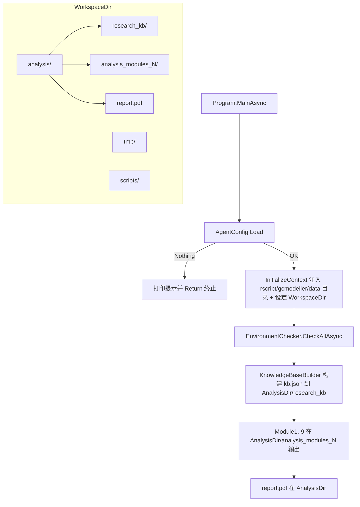

## 需求概述

基于 `agent_glm.txt` 对现有 VB.NET (.NET 10) 组学分析 agent 项目进行一致性审查，并修正代码中与需求不符的实现。审查范围覆盖：程序初始化（INI 运行环境检查、LLM/MySQL 配置、LLM 服务可用性、知识库构建）、9 个分析模块、工作区目录结构、外部资源（rscript/gcmodeller/data 目录）注入、文献检索路径，以及若干 LLM 提示词增强。

## 审查发现的不一致（待修正）

- **HIGH-1 INI 缺失未终止程序**：`AgentConfig.Load` 在 ini 不存在时生成模板并返回 `Nothing`，但 `Program.MainAsync` 未判断 `_config Is Nothing` 便将其传入 `EnvironmentChecker`，导致空引用崩溃，违反需求"生成 ini 配置文件…然后终止程序运行"。
- **HIGH-2 额外资源目录未注入上下文**：`AnalysisContext.RscriptsDir / GCModellerDir / DataDir` 在 `Program.InitializeContext` 中从未赋值（仅设置了 `PythonDir`），使 `BuildContextInfo` 传给 R 脚本的 `rscript_dir / gcmodeller_dir / data_dir` 为空，`source()` 加载既有脚本与 KEGG 背景模型能力失效，违反需求第 85 行。
- **MED-3 工作区目录结构不符**：`KnowledgeDir` 位于 `WorkspaceDir/research_kb`（应在 `analysis/` 内）；`CreateModuleDir` 与 `ReportPdf/ReportHtml` 建在 `WorkspaceDir` 根（应在 `analysis/` 内）；默认 workspace 被设为 `expression所在目录/analysis`，造成 `analysis/analysis` 嵌套，违反需求第 110–131 行。
- **MED-4 ncbi 文献检索路径错误**：`KnowledgeBaseBuilder.SearchFromNcbi` 使用相对路径 `scripts/search_pubmed.py` 而非配置的 `PythonScriptsDir`，且 PMC 全文获取逻辑未体现。
- **LOW-5~8 提示词增强**：预处理跳过标注解析、代谢组 VIP 衔接（Module2→Module4）、各模块优先 `source()` 既有脚本、kb.json 不足时回退自有知识但"严禁杜撰"的强调。

## 已确认符合需求（无需改动）

CsvUtils 格式校验、EnvironmentChecker 各检查项（仅缺终止分支）、每模块新建 OllamaClient 实例（token 隔离）、Module8 xlsx 样式、Module9 A3 HTML→PDF 与中英文图注、多组学 sampleinfo 匹配逻辑。

## 技术栈与既有模式

- 语言/框架：VB.NET、.NET 10、Ollama 客户端、WinForms 无关的控制台程序。
- 既有模式（应复用，避免引入新范式）：
- 配置：`AgentConfig` 提供只读属性 `RScriptsDir / RsharpScriptsDir / PythonScriptsDir / KeggDataDir`（基于 `ApplicationRoot`）。
- 上下文：`AnalysisContext` 已声明 `RscriptsDir / GCModellerDir / DataDir` 可写属性、`AnalysisDir = WorkspaceDir/analysis` 只读属性，以及 `KnowledgeDir / ReportPdf / ReportHtml / CreateModuleDir`。
- 文件路径：统一经 `PathUtils`、`ShellTool`（绝对/相对路径解析）。
- 模块基类：`AnalysisModuleBase` 的 `BuildContextInfo` 已把 `RscriptsDir/GCModellerDir/DataDir` 渲染进 LLM 上下文，只需上游赋值即可生效。

## 实现策略

1. **INI 终止分支（HIGH-1）**：在 `Program.MainAsync` 中于 `AgentConfig.Load` 之后增加 `_config Is Nothing` 判断——打印"已生成 config.ini 模板，请填写后重新运行"并 `Return`，复用现有日志与退出约定，不改 EnvironmentChecker 内部。
2. **资源目录注入（HIGH-2）**：在 `Program.InitializeContext` 末尾追加对 `context.RscriptsDir / context.GCModellerDir / context.DataDir` 的赋值（取自 `_config.RScriptsDir / RsharpScriptsDir / KeggDataDir`），使 `BuildContextInfo` 自动把正确路径传给 LLM。
3. **目录结构对齐（MED-3）**：仅调整目录属性的拼接位置，不改动模块运行逻辑。

- `AnalysisContext.KnowledgeDir` → `Path.Combine(AnalysisDir, "research_kb")`
- `CreateModuleDir` → `Path.Combine(AnalysisDir, moduleName)`
- `ReportPdf / ReportHtml` → `Path.Combine(AnalysisDir, ...)`
- `Program` 默认 workspace：`WorkspaceDir = Path.GetDirectoryName(expressionPath)`（analysis 文件夹位于其下），并相应 `EnsureDirectory(AnalysisDir)`。

4. **ncbi 检索路径（MED-4）**：`SearchFromNcbi` 改为运行 `_context.PythonDir` 下的脚本绝对路径（与 `GenerateNcbiSearchScript` 读取的模板目录一致）；在提示/模板层面明确当 `pmc` 可获取时下载全文。
5. **提示词增强（LOW-5~8）**：在对应模块 prompt 中补充：① Module1 解析 research 中"某矩阵不预处理"标注；② Module4 对代谢组读取 Module2 产出的 VIP 并施加 `VIP>1`；③ 各模块显式要求优先 `source(rscript_dir / gcmodeller_dir)` 中可用函数；④ 各模块强调 kb.json 不足时可用自有知识但不得杜撰生物学事实。

## 实现注意（Execution Notes）

- **最小改动、控制爆炸半径**：仅修改初始化流程与目录映射字符串，不触碰各模块的分析算法逻辑；保持 `tmp/`、`scripts/` 作为 `WorkspaceDir` 根下 `analysis/` 的兄弟目录不变（符合需求结构）。
- **向后兼容**：`AnalysisContext` 属性签名不变，仅改变默认值拼接；`Program` 在用户提供 `--workspace` 时行为不变。
- **日志复用**：沿用 `_logger`（ConsoleLog）输出 INI 提示信息，不引入新日志组件。
- **性能**：均为启动期一次性目录/配置操作，无循环或重负载，不影响运行时性能。

## 目录结构与修改清单

```
g:/OmicsWorks/src/
├── Program.vb                      # [MODIFY] MainAsync 增加 _config Is Nothing 终止；InitializeContext 注入 RscriptsDir/GCModellerDir/DataDir；修正默认 WorkspaceDir 为 expression 所在目录并 EnsureDirectory(AnalysisDir)
├── Models/
│   └── AnalysisContext.vb          # [MODIFY] KnowledgeDir 移入 AnalysisDir/research_kb；CreateModuleDir 改挂 AnalysisDir；ReportPdf/ReportHtml 移入 AnalysisDir
├── Knowledge/
│   └── KnowledgeBaseBuilder.vb     # [MODIFY] SearchFromNcbi 使用 _context.PythonDir 绝对路径运行脚本；明确 PMC 全文获取
└── Modules/
    ├── AnalysisModuleBase.vb       # [MODIFY] 在通用提示/上下文说明中强调"优先 source 传入脚本目录""kb 不足严禁杜撰"（可选共享）
    ├── Module1_Preprocessing.vb    # [MODIFY] prompt 解析 research 中跳过预处理标注
    ├── Module4_Limma.vb            # [MODIFY] prompt 增加代谢组 VIP>1 衔接（读取 Module2 产出）
    └── Module2_PCA.vb 等           # [MODIFY] 提示中补充 source 复用与严禁杜撰（轻量）
```

## 架构设计

修改均位于"启动编排层（Program）+ 上下文模型（AnalysisContext）+ 知识构建（KnowledgeBaseBuilder）+ 模块提示（Modules）"，不改变分析执行管线（RunModuleAsync → Plan → Script → Conclusion）与每模块新建 OllamaClient 的 token 隔离设计。目录映射修正后，工作区将严格符合需求第 110–131 行：



## 任务列表

1. 修改 Program.vb：Load 返回 Nothing 时打印提示并终止；InitializeContext 注入 RscriptsDir/GCModellerDir/DataDir；默认 WorkspaceDir 改为 expression 所在目录
2. 修改 AnalysisContext.vb：KnowledgeDir、CreateModuleDir、ReportPdf/ReportHtml 统一移入 AnalysisDir（analysis/）内
3. 修改 KnowledgeBaseBuilder.vb：SearchFromNcbi 使用 PythonScriptsDir 绝对路径运行脚本并明确 PMC 全文获取
4. 增强模块提示词：预处理跳过标注、代谢组 VIP 衔接、优先 source 既有脚本、kb 不足严禁杜撰