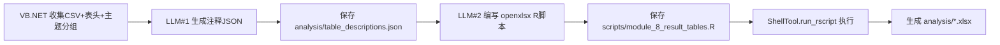

## 用户需求

将 Modules/Module8_ResultTables.vb 中直接由 VB.NET（OpenXML SDK）生成 xlsx 结果表格的逻辑，改造为由 LLM 驱动生成：先在 VB.NET 中收集 CSV 文件及其第一行表头并按分析主题分组，再让 LLM 编写每个工作表第一行（注释说明文本行）的英文注释，最后由 LLM 编写具体的 R 脚本（使用 openxlsx）生成符合要求样式的 xlsx 文件；改造完成后彻底清理 Module8 内所有 VB.NET 处理 xlsx 的代码。

## 产品概述

结果表格整理模块（模块 8）将分析流程产生的中间 CSV 结果，按分析主题汇总为多个带样式的工作簿 xlsx 文件。改造后，xlsx 的生成完全交由 LLM 编写的 R 脚本完成，VB.NET 仅负责收集输入、调用 LLM、保存并执行脚本。

## 核心特性

- VB.NET 收集 tmp/ 与各 analysis_modules_*/tables/ 下的 CSV，读取每个文件第一行表头并按 6 大主题分组。
- 第一次 LLM 调用：基于主题、表头与之前模块结论，生成每个 sheet 第一行的英文注释说明（含内容/列含义/可获取生物学知识），输出为结构化 JSON 并保存到 analysis/table_descriptions.json。
- 第二次 LLM 调用：编写 R 脚本（openxlsx），按指定样式读取 CSV 与描述 JSON 生成 xlsx。
- xlsx 样式要求：全局 Cambria Math 11 号字体、缩放 90%、默认白底；第一列浅灰背景+斜体+黑字；第一行注释默认底+草绿字；第二行列标题深蓝底+白字+加粗；冻结第一列与第二行（B3）；文件名、注释、标题、列标题等全为英文。
- 执行 R 脚本（ShellTool.run_rscript）生成结果 xlsx，并清理原有 OpenXML 处理代码。

## 技术栈

- 语言/框架：VB.NET（.NET 10，OptionInfer On），复用现有 Agent 架构（AnalysisModuleBase）。
- LLM 交互：Ollama LLMClient（`_llmFactory`），沿用 `RegisterTools`、`BuildContextInfo()`、`ExtractCodeBlock`、`ExtractJsonFromResponse`。
- 脚本执行：R 语言 + openxlsx 包，通过 `ShellTool.run_rscript`（与 Module4 一致）执行。
- CSV 读取：复用 `CsvUtils.ReadCsv`（表头为返回数组的第 0 行）。
- 文件工具：复用 `PathUtils`、基类 `_context.WorkspaceDir / ScriptsDir / AnalysisDir`。

## 实现方案

**总体策略**：保持 `AnalysisModuleBase` 三步式流程（Plan → Script → Conclusion）不变，仅重写 Module8 的 `GenerateAndRunScriptAsync`，使其从“VB.NET 直接写 xlsx”变为“VB.NET 收集输入 + 两次 LLM 调用（注释 JSON、R 脚本）+ 执行 R 脚本”。复用 `CollectResultCsvFiles`、`GroupCsvByTheme`，新增 `GenerateAnnotationsAsync`。

**关键设计决策**

1. 两阶段 LLM 调用：先生成注释 JSON（数据/文本），再生成 R 脚本（逻辑），解耦“写什么”与“怎么写样式”，降低单次 prompt 复杂度，提高注释准确性与可审查性。
2. 注释 JSON 落盘为 `analysis/table_descriptions.json`，R 脚本运行时读取该文件，避免把大段注释文本硬塞进 R 代码，保证注释与脚本一致、可复用。
3. R 脚本采用 openxlsx（支持 `createStyle`、`freezePane`、`setZoom`、`saveWorkbook`），缺失包时按 Module4 风格 `install.packages` 兜底。
4. 分组与主题沿用现有 6 类分组（Preprocessing_Results / PCA_Results / LIMMA_Differential_Results / KEGG_Functional_Results / WGCNA_Module_Results / Advanced_Analysis_Results），xlsx 文件名由主题键生成（英文，空格转下划线）。

**性能与可靠性**

- 仅读取 CSV 第一行表头（非整表）构造 prompt，控制 token 与内存；整表读取交给 R 端完成。
- R 脚本执行超时设为 600s（xlsx 写入远轻于微分/富集计算）。
- 保留 `ExtractJsonFromResponse` 容错；注释 JSON 解析失败时退回空注释，保证脚本仍可运行。

## 实现注意事项（防回归）

- 严格删除以下方法：`CreateXlsxAsync`、`CreateStylesheet`、`CreateSheetData`、`CreateTextCell`(两重载)、`CreateNumericCell`、`GetCellRef`（含 SpreadsheetDocument/Workbook/Worksheet/Pane 等 OpenXML 用法），文件内无显式 OpenXML Imports，无需改动 Imports。
- 保留 `GeneratePlanAsync`、`CollectResultCsvFiles`、`GroupCsvByTheme`、`ExtractJsonFromResponse`、`GenerateConclusionAsync`。
- R 脚本提示词须明确要求：所有文件名/文本英文、freeze panes 冻结第一列+第二行（即 B3）、缩放 90%、Cambria Math 11、第一列样式、第一行注释样式、第二行列标题样式，RGB 与现有代码一致（深蓝标题 #1F4E79、浅灰 id #D9D9D9、草绿注释 #228B22）。
- 脚本使用绝对路径，输出到 `analysis/` 目录，与现有产物目录结构一致。
- `GenerateConclusionAsync` 微调措辞：说明结果表格由 LLM 生成的 R 脚本（openxlsx）产出。

## 架构设计

沿用基类三步流程，Module8 内部数据流：



## 目录结构

```
g:/OmicsWorks/src/Modules/
└── Module8_ResultTables.vb   # [MODIFY] 重写 GenerateAndRunScriptAsync：改为"收集CSV表头→LLM生成注释JSON→LLM生成R脚本→执行"；新增 GenerateAnnotationsAsync；删除全部 OpenXML xlsx 处理私有方法（CreateXlsxAsync/CreateStylesheet/CreateSheetData/CreateTextCell/CreateNumericCell/GetCellRef）；微调 GenerateConclusionAsync 文案。
```

（产物文件自动生成：analysis/table_descriptions.json、analysis/*.xlsx、scripts/module_8_result_tables.R）

## 关键代码结构（提示词契约）

注释 JSON 结构（GenerateAnnotationsAsync 产出，供 R 脚本读取）：

```
{
  "xlsx_files": [
    {
      "file": "Preprocessing_Results.xlsx",
      "theme": "Preprocessing Results",
      "sheets": [
        { "csv": "<绝对路径>", "sheet_name": "<英文>", "annotation": "<英文注释说明>" }
      ]
    }
  ]
}
```

R 脚本核心样式提示（写入 LLM#2 prompt）：使用 openxlsx，全局字体 Cambria Math 11、zoom=0.9、白底；id 列（第一列）style：fill #D9D9D9 + italic + 黑字；注释行（第一行）style：默认底 + 字体色 #228B22；列标题行（第二行）style：fill #1F4E79 + 白字 + bold；`freezePane(ws, firstRow=2, firstCol=2)`；文本全英文。