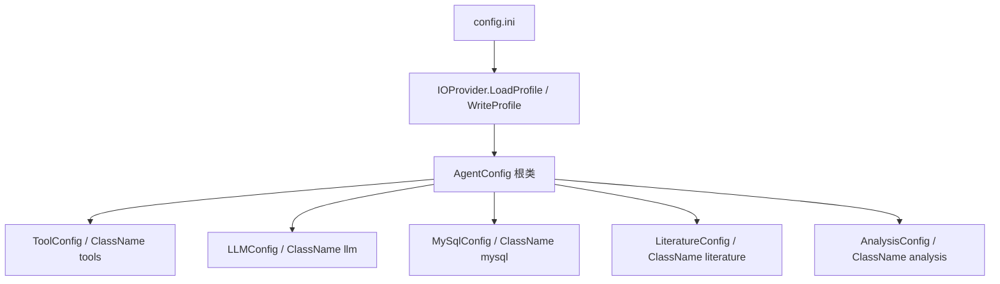

## 用户需求

- 基于底层运行时 `IOProvider` 模块的 `WriteProfile`/`LoadProfile`，彻底重构 `AppRuntime\AgentConfig.vb`，移除其中全部手动解析/生成 ini 文件的代码。
- 重构后必须对现有 `CreateTemplate` 生成的 ini 文件格式保持兼容：既能读取旧模板，也能用 `WriteProfile` 写出可被 `LoadProfile` 读回的文件。
- 同步更新所有引用 `AgentConfig` 配置项的外部代码到新的「段子对象」访问路径。

## 产品概述

OmicsAgent 是一个 VB.NET 科研 LLM Agent，其运行参数（外部工具路径、LLM 服务、MySQL 连接、文献检索策略、分析流程阈值）由 `config.ini` 管理。本次重构将配置读写从手写解析改为底层运行时提供的通用 CLR↔INI 序列化，降低维护成本、消除重复解析逻辑，同时保持文件格式的前向/后向兼容。

## 核心功能

- 使用 `IOProvider.LoadProfile(Of AgentConfig)` 将 `config.ini` 反序列化为强类型配置对象。
- 使用 `IOProvider.WriteProfile` 基于默认实例生成模板 `config.ini`。
- 将扁平配置属性重组为五类段子对象（`ToolConfig`/`LLMConfig`/`MySqlConfig`/`LiteratureConfig`/`AnalysisConfig`），保留原有五段及键名（`[tools]`、`[llm]`、`[mysql]`、`[literature]`、`[analysis]`）。
- 计算型只读属性（连接串、目录路径）妥善迁移，避免破坏序列化。
- 更新全部外部引用点，保证编译通过且运行行为不变。

## 技术栈

- 语言：VB.NET（.NET，项目已 `ProjectReference` 引用 `Microsoft.VisualBasic.Core`）
- 序列化：sciBASIC# 运行时 `IOProvider`（`Microsoft.VisualBasic.ComponentModel.Settings.Inf`）的 `WriteProfile`/`LoadProfile`
- 映射声明：`<ClassName>`（`Microsoft.VisualBasic.ComponentModel.DataSourceModel`）+ `<DataFrameColumn>`（`Microsoft.VisualBasic.ComponentModel.DataSourceModel.SchemaMaps`）
- 现有项目已 `Imports Microsoft.VisualBasic.ComponentModel.Settings.Inf`，可直接使用。

## 实现方案

**策略**：将 `AgentConfig` 由「扁平属性 + 手写解析」改为「根类持有 5 个段子对象 + IOProvider 通用序列化」。段名由段子类的 `<ClassName("...")>` 决定，键名由属性的 `<DataFrameColumn("ini键名")>` 决定；`Load` 调用 `LoadProfile(Of AgentConfig)`，`CreateTemplate` 调用 `WriteProfile`。

**关键决策**：

1. 段名/键名必须与现有模板逐一对应（`tools/rscript…`、`llm/url…`、`mysql/host…`、`literature/max_count…`、`analysis/diff_pvalue…`）。因 `LoadMapping(..., mapsAll:=True)` 中键名取自 `DataFrameColumn.Name`，为保证小写/下划线键名与旧模板一致，每个基元属性都显式标注 `<DataFrameColumn("键名")>`。
2. ReadOnly 基元属性不能留在被序列化类上（`WriteProfile` 写出后，`LoadProfile` 的 `ClassWriter.SetValue` 会因无 setter 抛异常）。因此：`MySqlConnectionString` 改为方法 `GetMySqlConnectionString()`；`RScriptsDir`/`RsharpScriptsDir`/`PythonScriptsDir`/`KeggDataDir` 改为 `Shared ReadOnly`（仅依赖 Shared `ApplicationRoot`，且 Shared 不参与实例序列化）。
3. 根类 `AgentConfig` 只保留「段子对象」实例属性 + Shared 属性/方法，确保 `WriteProfile` 不会写出多余的 `[AgentConfig]` 段，从而与模板格式一致。
4. 默认构造为各段赋默认值（`port=3306`、`max_count=20`、`auto_search=True`、`strategy=none`、`diff_pvalue=0.05`、`metabolite_vip=1.0`、`wgcna_top_mad=5000`、`diff_top_count=50`、`llm url=http://localhost:11434`、`model=qwen2.5:7b` 等），使 `WriteProfile` 生成的模板与旧模板数值一致。

**性能与可靠性**：序列化走运行时通用路径，复杂度 O(属性数)，无额外 IO；`Load` 在文件缺失时建模板并返回 `Nothing`，解析异常时 `LogException` 并返回 `Nothing`（不覆盖用户文件），与原行为一致。

## 实现注意事项

- 保留 Shared 的 `ApplicationRoot`、`DefaultIniPath`；保留 `ToJson()`（嵌套对象仍可 JSON 化）。
- 可选：为每个 `<DataFrameColumn>` 增加 `Description` 参数，使 `WriteProfile` 写出 `;` 行内注释；代价是旧模板的「段级注释块」丢失（行内注释可读），属可接受的小取舍。
- 布尔 `auto_search` 经 `CTypeDynamic`：模板默认 `"true"` 可正常解析；已知小限制——`"1"`/`"yes"` 不会被识别（旧模板未使用，不影响兼容）。
- 不改动无关逻辑；外部引用统一改为「段子对象」路径（如 `_config.RscriptPath` → `_config.Tools.RscriptPath`）。

## 架构设计

`AgentConfig` 作为序列化根，持有五个段子对象；`IOProvider` 负责读写 ini。



## 目录结构

- `g:/OmicsWorks/src/AppRuntime/AgentConfig.vb`  **[MODIFY]** 重写为根类 + 5 个嵌套段子类；移除手写解析与 `StringBuilder` 模板；`Load`/`CreateTemplate` 改用 `IOProvider`；`MySqlConnectionString` 改为方法；目录路径改为 Shared。
- `g:/OmicsWorks/src/Utils/Tools/ShellTool.vb`  **[MODIFY]**  `_config.RscriptPath/WkHtmlToPdfPath/RsharpPath/PythonPath` → `_config.Tools.*`。
- `g:/OmicsWorks/src/Program.vb`  **[MODIFY]**  `_config.LLMServiceUrl/LLMApiKey/LLMModelName` → `_config.LLM.*`；`_config.PythonScriptsDir`（Shared）保持不变。
- `g:/OmicsWorks/src/AppRuntime/EnvironmentChecker.vb`  **[MODIFY]**  各配置项改为对应段子对象路径；`DefaultIniPath`（Shared）不变。
- `g:/OmicsWorks/src/Knowledge/KnowledgeBaseBuilder.vb`  **[MODIFY]**  `_config.AutoSearchLiterature/LiteratureSearchStrategy` → `_config.Literature.*`；`_config.MySqlConnectionString` → `_config.GetMySqlConnectionString()`。
- `g:/OmicsWorks/src/Modules/Module4_Limma.vb`  **[MODIFY]**  `_config.MetaboliteVipCutoff/DiffTopCount` → `_config.Analysis.*`。
- `g:/OmicsWorks/src/Models/AnalysisContext.vb`  （无需改动；`RscriptsDir` 是独立属性，其值来源 `_config.RScriptsDir` 重构后仍为 Shared 可用）

## 关键代码结构

```
Imports Microsoft.VisualBasic.ComponentModel.Settings.Inf
Imports Microsoft.VisualBasic.ComponentModel.DataSourceModel
Imports Microsoft.VisualBasic.ComponentModel.DataSourceModel.SchemaMaps

<ClassName("tools")>
Public Class ToolConfig
    <DataFrameColumn("rscript")> Public Property RscriptPath As String = ""
    <DataFrameColumn("wkhtmltopdf")> Public Property WkHtmlToPdfPath As String = ""
    <DataFrameColumn("rsharp")> Public Property RsharpPath As String = ""
    <DataFrameColumn("python")> Public Property PythonPath As String = ""
End Class

Public Class AgentConfig
    <DataFrameColumn("tools")> Public Property Tools As New ToolConfig()
    <DataFrameColumn("llm")> Public Property LLM As New LLMConfig()
    <DataFrameColumn("mysql")> Public Property MySql As New MySqlConfig()
    <DataFrameColumn("literature")> Public Property Literature As New LiteratureConfig()
    <DataFrameColumn("analysis")> Public Property Analysis As New AnalysisConfig()

    Public Shared ReadOnly Property ApplicationRoot As String = App.HOME.ParentPath
    Public Shared ReadOnly Property DefaultIniPath As String = Path.Combine(AppDomain.CurrentDomain.BaseDirectory, "config.ini")

    Public Shared Function Load(path As String) As AgentConfig
        If Not File.Exists(path) Then
            CreateTemplate(path)
            Return Nothing
        End If
        Try
            Return IOProvider.LoadProfile(Of AgentConfig)(path)
        Catch ex As Exception
            Call App.LogException(ex)
            Return Nothing
        End Try
    End Function

    Public Shared Sub CreateTemplate(path As String)
        Call IOProvider.WriteProfile(Of AgentConfig)(New AgentConfig(), path)
    End Sub

    Public Function GetMySqlConnectionString() As String
        Return MySql.GetConnectionString()
    End Function
End Class
```