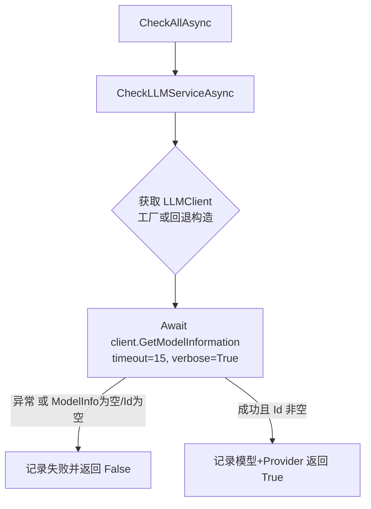

## 用户需求

将 `AppRuntime\EnvironmentChecker.vb` 中 `CheckLLMServiceAsync` 函数原有的手写 HttpClient 请求（请求 `LLMServiceUrl + /api/tags` 并遍历模型列表判断模型是否存在）替换为调用 `G:\LLMs\src\Ollama\LLMClient.vb` 已封装的 `GetModelInformation` 函数。

## 产品概述

环境检查阶段对大语言模型服务做可用性探测，要求后端无关，同时兼容 Ollama 与 OpenAI。

## 核心功能

- 通过 `LLMClient.GetModelInformation` 请求目标模型的信息，自动适配 Ollama / OpenAI 后端（由 `LLMUrl.Create` 决定 Provider）。
- 可用性判定规则：若 `GetModelInformation` 抛出异常，或返回的 `ModelInfo` 为空（Nothing）、或 `ModelInfo.Id` 为空字符串，则判定服务/模型不可用；否则判定可用并打印模型标识与后端来源。
- 保留清晰的日志指引（连接地址、成功信息、失败原因及配置修复建议）。

## 技术栈

- 语言：VB.NET（.NET，项目 `OmicsAgent.vbproj`）
- 依赖库：`Ollama` 项目（LLMs 源码工程），已通过 `Program.vb` 的 `Imports Ollama` 与 `New LLMClient(...)` 引用，无需新增引用。
- 关键 API：
- `Ollama.LLMClient`：构造函数 `New LLMClient(provider As ILLMProvider, model As String)`，实现 `IDisposable`。
- `Ollama.LLMClient.GetModelInformation(Optional timeout As Double = 1, Optional verbose As Boolean = True) As Task(Of ModelInfo)`：内部委托 `_provider.GetModelInformation`，请求失败向上抛异常。
- `Ollama.LLMUrl.Create(url As String, apiKey As String) As ILLMProvider`：根据 url 自动选择 Ollama / OpenAI Provider。
- `Ollama.ModelInfo`：含 `Id`（模型标识）、`Provider`（"ollama"/"openai"）等字段；成功时 `Id` 必被填充。

## 实现方案

**策略**：复用代码库既有的 LLMClient 构造与注入模式——在 `EnvironmentChecker` 构造函数中新增可选工厂参数 `Func(Of LLMClient)`，使 `CheckLLMServiceAsync` 通过工厂取得 `LLMClient` 后调用 `GetModelInformation` 进行探测，并依据返回对象与异常判定可用性。

**关键决策与理由**

1. **注入工厂而非在 Check 内直接 new**：`Program.vb` 中 `KnowledgeBaseBuilder` 及各分析模块均通过 `Function() CreateLLMClient()` 注入同一工厂，保持架构一致、避免重复构造逻辑；同时工厂为惰性调用，仅在检查时触发一次。
2. **构造函数参数设为 Optional（默认 Nothing）并保留回退构造**：当未注入工厂时，`CheckLLMServiceAsync` 依据 `_config.LLM` 用 `LLMUrl.Create(_config.LLM.LLMServiceUrl, _config.LLM.LLMApiKey)` + `LLMModelName` 直接构造，保证向后兼容、`Program.vb` 改动最小且安全。
3. **空值判定用 `info Is Nothing OrElse String.IsNullOrEmpty(info.Id)`**：经核对两个 Provider，`GetModelInformation` 成功后均会填充 `Id`（Ollama 取 `model`，OpenAI 取 `id`），因此以 `Id` 为空作为「逻辑空」判定，与用户需求「ModelInfo 是否为空值」等价且更稳健。
4. **超时设为 15 秒**：原函数手写请求超时即 15 秒，沿用以避免启动检查因默认 1 秒超时过快失败；`GetModelInformation` 的 `timeout` 参数即秒级超时，传入 `timeout:=15`。
5. **用 `Using` 包裹 LLMClient**：`LLMClient` 实现 `IDisposable` 且构造时会创建临时日志文件，使用 `Using` 确保检查结束后释放资源、刷新并关闭日志流。

**性能与可靠性**

- 探测为单次同步启动检查，无热路径；15 秒超时 + Try/Catch 防止阻塞与崩溃。
- 异常统一捕获并记录 `ex.Message`，不向上抛出，保持原 `CheckLLMServiceAsync` 返回 `Boolean` 的契约。

## 实现注意事项

- `EnvironmentChecker.vb` 顶部需新增 `Imports Ollama`（参照 `Program.vb` 第 2 行），否则无法解析 `LLMClient`/`ModelInfo`/`LLMUrl`。
- 删除原 `CheckLLMServiceAsync` 中的 `Imports System.Net.Http`、`Imports Microsoft.VisualBasic.MIME.application.json.Javascript` 以及 `HttpClient`/`JsonObject`/`JsonArray` 相关代码（已不再使用），避免无用依赖与编译冗余。
- 保持 `CheckAllAsync` 调用链不变（`Await CheckLLMServiceAsync()` 返回 False 即终止）。
- 日志文案需更新：原文案针对 Ollama「/api/tags」，现改为通用描述（服务地址、模型名、后端来源），并提示同时检查 `url`/`apikey`/`model` 配置。

## 架构设计

修改范围局限于 `EnvironmentChecker` 与 `Program.vb`，不引入新模块、不改变现有数据流。



## 目录结构与文件改动

```
g:\OmicsWorks\src\
├── AppRuntime\
│   └── EnvironmentChecker.vb   # [MODIFY] 1) 顶部新增 Imports Ollama；删除无用的 System.Net.Http 与 Json 相关 Imports。
│                             # 2) 构造函数新增 Optional llmClientFactory As Func(Of LLMClient) = Nothing 字段。
│                             # 3) 重写 CheckLLMServiceAsync：通过工厂(或回退)取 LLMClient，
│                             #    用 Using 包裹并 Await GetModelInformation(timeout:=15, verbose:=True)；
│                             #    以 info Is Nothing OrElse String.IsNullOrEmpty(info.Id) 或异常判定可用性，更新日志文案。
└── Program.vb                # [MODIFY] 第 105 行构造 EnvironmentChecker 时传入 Function() CreateLLMClient()
│                             # （与 KnowledgeBaseBuilder 等模块保持一致）。CreateLLMClient 已存在，无需新增。
```