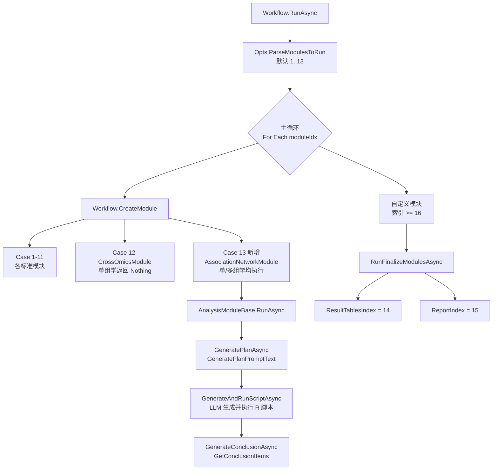
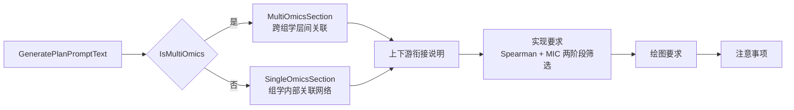

## 用户需求

在基于 LLM 的科研数据分析 Agent 命令行程序中，参考 `src/Modules/Standard` 目录下现有标准模块的写法，在 `Module13_ResultTables.vb` 之前插入一个全新的标准分析模块：**基于 Spearman 相关 + MIC（最大信息系数）双重方法的跨组学关联分析模块**，产出显著关联网络与网络可视化绘图结果。

## 产品概述

新增「Spearman + MIC 关联网络分析」标准分析模块，占据模块索引 **13**，位于跨组学整合分析（模块 12）之后、结果表格整理之前。原「结果表格整理」顺延为模块 14，「论文初稿撰写」顺延为模块 15，自定义模块起始索引顺延为 16。

该模块由 Agent 向 LLM 下发结构化分析提示词，由 LLM 编写并执行 R 脚本完成分子间关联关系的挖掘、显著关联边的筛选与导出，以及关联网络的可视化。

## 核心功能

### 1. 双重方法关联度量

- **Spearman 秩相关**：捕捉分子对之间的单调关联，输出相关系数 rho、p 值
- **MIC 最大信息系数**：捕捉线性与非线性关联，输出 MIC 值
- **MIC-ρ² 差值**：用于判别关联是线性还是非线性关系
- 两种方法**联合筛选**：同时满足 Spearman 显著性阈值与 MIC 阈值的分子对才被判定为显著关联边

### 2. 场景自适应

- **多组学场景**：以「跨组学分子对」为核心，按 subject_id 对齐后计算组学两两之间的分子关联；同时统计组学内部边与跨组学边
- **单组学场景**：退化为「组学内部分子-分子关联网络」，流程与产出结构保持一致，模块不会被跳过

### 3. 显著关联网络导出

- 分子筛选（差异分子 / 高变分子 top N）以控制组合爆炸
- 多重检验校正（BH/FDR），明确显著性阈值
- 导出边列表表格：分子对、来源组学、Spearman rho、p 值、q 值、MIC 值、MIC-ρ² 差值、关联方向、关联类型（线性/非线性）
- 导出节点属性表：节点 ID、名称、来源组学、度数、中心性指标
- 网络拓扑统计：节点数、边数、正/负相关边占比、跨组学边占比、模块化社团划分

### 4. 网络可视化绘图

- 关联网络图：节点按组学来源着色，边按正/负相关着色、按关联强度设置粗细
- 关联强度热图（Spearman 与 MIC 双矩阵对照）
- Spearman vs MIC 散点图，标识非线性关联候选
- 枢纽节点（hub）度数排序条形图
- 出版级质量主题，全英文标签，同时保存 PNG（300 dpi）与 PDF

### 5. 模块编号体系同步更新

全局重编号，确保命令行帮助、模块调度、模块间提示词的上下游引用、文档说明全部一致，项目可正常编译运行。

## 技术栈

沿用现有项目技术栈，不引入任何新技术：

- **语言/框架**：VB.NET，.NET 10（`OmicsAgent.vbproj`）
- **模块基类**：`OmicsAgent.AnalysisModuleBase`（`src/Modules/Base/AnalysisModuleBase.vb`）
- **LLM 接入**：`Ollama.LLMClient`，由 `AgentConfig.CreateLLMClient` 创建
- **分析执行层**：LLM 通过 `ShellTool.run_rscript` 生成并执行 R 脚本；R 包由 LLM 自行选择（MIC 实现不硬编码，提示词只描述方法学要求并要求缺包自动安装）
- **编译模型**：`.vbproj` 采用 SDK 默认通配编译（无逐文件 `Compile Include`），新增 `.vb` 文件无需修改项目文件

## 实现方案

### 核心策略

本项目的「分析模块」本质是**提示词生成器 + 执行编排单元**，而非算法实现体。因此新模块的工作是：继承 `AnalysisModuleBase`，重写 `ModuleName` / `ModuleIndex` / `CsvFileNamePrefix` / `GeneratePlanPromptText()` / `GetConclusionItems()`，把 Spearman + MIC 关联分析的方法学要求、上下游衔接、输出规范、绘图规范精确地组织为中文提示词，交由基类既有的「生成计划 → 生成并执行 R 脚本 → 生成结论」三段式流程驱动。

不新增任何 R 脚本文件，不新增基类方法，不改动执行引擎。

### 关键技术决策

**决策 1：模块索引采用全局重编号（用户已确认）**

新模块占用索引 13，`ResultTablesModule` → 14，`ReportModule` → 15，`CustomModuleStartIndex` → 16。

经代码验证，该方案风险可控：

- `FinalizeModules` 已将收尾模块索引抽取为**常量**，`Workflow.RunFinalizeModulesAsync`、`Opts.ParseModulesToRun`、`Workflow.CreateModule` 均通过常量引用，改常量即可全链路生效
- `Module14_Report.vb` 的 `CollectModuleConclusions` / `CollectAllFigures` / `CollectAllTables` 均读取 `result.ModuleIndex` **动态取值**（第 197/211/235 行），无索引硬编码
- `Module13_ResultTables.vb` 遍历 `_context.ModuleResults`，同样与具体索引无关
- 因此真正需要改动的硬编码点仅为：`FinalizeModules` 三个常量、`Workflow.CreateModule` 新增 `Case 13`、`Opts.ParseModulesToRun` 默认列表补 13、`Program.vb` 帮助文本、各模块提示词中的文字引用、README

**决策 2：模块在单组学场景同样执行（用户已确认）**

与 `Module12_CrossOmics` 不同（其在单组学时 `CreateModule` 返回 `Nothing`），本模块在 `Workflow.CreateModule` 中**无条件实例化**。场景差异通过提示词内部分支消化：复用基类已有的 `OmicsScopeHint()`、`PreprocessedInputHint()`、`PerOmicsOutputConvention()` 三个辅助方法，并新增私有方法 `MultiOmicsSection()`（多组学跨层关联要求）与 `SingleOmicsSection()`（单组学内部网络要求），二者互斥输出。

此设计沿用 `Module8_Bayesian.vb` 与 `Module11_Regression.vb` 中 `MultiOmicsSection()` 的既有约定（返回空串表示不适用），保持代码风格一致。

**决策 3：MIC 实现由 LLM 自行选择（用户已确认）**

提示词只描述方法学契约（需计算 MIC 与 MIC-ρ² 差值、需处理缺失依赖），不写死 `minerva` 等具体包名，避免与 LLM 实际可用的 R 环境冲突，同时保留 LLM 依据环境选择最优实现的空间。

**决策 4：组合爆炸的显式防控**

分子对数量为 O(N×M)，全量配对在组学数据规模下不可行。提示词中强制要求：

- 先做分子筛选（差异分子优先，其次 MAD/方差 top N，建议每组学 ≤ 500）
- 明确说明筛选依据并记录入结果
- MIC 计算开销显著高于 Spearman，要求**先用 Spearman 粗筛**再对通过初筛的分子对计算 MIC，将 MIC 计算量从 O(N×M) 降至显著边规模

这一「两阶段筛选」是本模块性能设计的核心，直接沿用 `Module12_CrossOmics` 中「优先只纳入各组学 top 500」的既有约束思路并加以强化。

### 避免技术债

- 完全复用基类既有抽象与辅助方法，零新增基类 API
- 文件命名、类命名、注释头格式、`Imports` 语句、`CsvFileNamePrefix` 约定全部对齐同目录既有模块
- 重编号只改常量与文本，不改变任何调度逻辑结构

## 实现要点

### 提示词组织要点（对齐既有模块）

- 文件头部保留 `' ===== 模块 13: ... =====` 分隔注释块与 XML 文档注释，格式同 `Module12_CrossOmics.vb`
- `GeneratePlanPromptText()` 内部章节顺序统一为：多组学/单组学补充段 → 上下游衔接说明 → 实现要求 → 绘图要求 → 重要注意事项
- 上下游引用文字须使用**重编号后**的索引：「供模块 14(表格) 和模块 15(报告) 引用」
- 输出文件命名调用 `PerOmicsOutputConvention(CsvFileNamePrefix)`，前缀取 `"assocnet_"`

### 重编号执行要点（防回归）

- **务必先改 `FinalizeModules` 常量**，再改 `Workflow.CreateModule`，避免中间态编译失败
- `Opts.ParseModulesToRun` 默认列表由 `{1..12}` 扩为 `{1..13}`，其 XML 文档注释中「结果表格(13)与报告(14)」需同步更新为 (14)/(15)
- `Workflow.vb` 第 79 行注释「结果表格(13)与报告(14)」为纯注释，同步更新以免误导后续维护
- 各标准模块提示词中的插值片段 `"12(跨组学整合)、"` 之后紧跟的 `13(表格) 和模块 14(报告)` 字面量需逐一替换为 `14(表格) 和模块 15(报告)`；同时在多组学分支中补充对模块 13(关联网络) 的引用
- `UserDataTablesModule.vb` 中「与 Module13 一致」「/report 模式」等注释性引用同步修正为 Module14

### 性能与稳健性

- 提示词中明确要求：共有个体数量较少时关联结果不稳定，须在结论中声明样本量限制
- 要求 MIC 计算前对各组学分别标准化，消除量纲差异
- 要求缺失 R 包时优雅处理（自动安装），失败时不中断整个模块

### 影响范围控制

- 不改动 `AnalysisModuleBase`、`ModuleResult`、`XlsxReportBuilder` 等公共组件
- 不改动 `/report` 模式的 `UserDataTablesModule` 业务逻辑（仅改注释文字）
- 重编号后所有既有工作区目录名（`analysis_modules_N`）会变化，属预期行为，README 需同步说明

## 架构设计

新模块在现有调度链路中的位置：



模块内部提示词构建结构：



## 目录结构

### 结构概述

新增 1 个标准模块文件；修改 1 个索引常量类、1 个调度类、1 个参数类、1 个入口帮助文本、9 个既有模块的提示词文字引用、1 个 README。

```
OmicsAgent/
├── src/
│   ├── Modules/
│   │   ├── Standard/
│   │   │   ├── Module13_AssociationNetwork.vb   # [NEW] Spearman + MIC 跨组学关联网络分析模块。
│   │   │   │                                    #   类名 AssociationNetworkModule，继承 AnalysisModuleBase。
│   │   │   │                                    #   ModuleName = "Spearman MIC Association Network"，ModuleIndex = 13，
│   │   │   │                                    #   CsvFileNamePrefix = "assocnet_"。
│   │   │   │                                    #   实现 GeneratePlanPromptText()：组织 Spearman + MIC 两阶段筛选、
│   │   │   │                                    #   FDR 校正、显著边导出、节点属性表、网络拓扑统计、网络可视化的提示词；
│   │   │   │                                    #   私有 MultiOmicsSection() 描述跨组学层间关联与 subject_id 对齐要求，
│   │   │   │                                    #   私有 SingleOmicsSection() 描述单组学内部分子-分子网络退化方案，二者互斥；
│   │   │   │                                    #   复用基类 OmicsScopeHint / PreprocessedInputHint / PerOmicsOutputConvention；
│   │   │   │                                    #   实现 GetConclusionItems()：显著关联对、线性/非线性关联判别、
│   │   │   │                                    #   网络拓扑与枢纽节点、跨组学边占比（多组学时追加条目）、
│   │   │   │                                    #   与上游模块结果的一致性。文件头注释与 XML 文档注释格式对齐 Module12。
│   │   │   ├── Module13_ResultTables.vb → Module14_ResultTables.vb
│   │   │   │                                    # [MODIFY+RENAME] 文件重命名；ModuleIndex 由 13 改为 14；
│   │   │   │                                    #   头部注释「模块 13」改为「模块 14」。类名 ResultTablesModule 保持不变，
│   │   │   │                                    #   避免影响 Workflow 与 UserDataTablesModule 的类型引用。
│   │   │   ├── Module14_Report.vb → Module15_Report.vb
│   │   │   │                                    # [MODIFY+RENAME] 文件重命名；ModuleIndex 由 14 改为 15；
│   │   │   │                                    #   头部注释「模块 14」改为「模块 15」。类名 ReportModule 保持不变。
│   │   │   ├── Module12_CrossOmics.vb           # [MODIFY] 提示词中「下游输出：...供模块 13(表格) 和模块 14(报告) 引用」
│   │   │   │                                    #   更新为「供模块 13(Spearman+MIC 关联网络)、14(表格) 和模块 15(报告) 引用」。
│   │   │   ├── Module11_Regression.vb           # [MODIFY] 下游引用文字：13(表格)/14(报告) → 14(表格)/15(报告)，
│   │   │   │                                    #   并补充模块 13(关联网络) 作为下游消费方。
│   │   │   ├── Module10_RandomForest.vb         # [MODIFY] 同上，更新下游模块索引引用文字。
│   │   │   ├── Module9_PLSPM.vb                 # [MODIFY] 同上（第 95 行附近）。
│   │   │   ├── Module8_Bayesian.vb              # [MODIFY] 同上（第 61 行附近）。
│   │   │   ├── Module7_CMeans.vb                # [MODIFY] 同上（第 61 行附近）。
│   │   │   ├── Module6_WGCNA.vb                 # [MODIFY] 同上（第 85 行附近）。
│   │   │   ├── Module5_KEGG.vb                  # [MODIFY] 同上（第 75 行附近）。
│   │   │   ├── Module4_Limma.vb                 # [MODIFY] 同上（第 72 行附近）；第 55 行「供模块 12 跨组学整合时汇总」
│   │   │   │                                    #   可追加说明差异分子同时作为模块 13 关联网络的节点初筛来源。
│   │   │   └── Module2_PCA.vb                   # [MODIFY] 第 69 行「供模块 14(报告) 引用」→「供模块 15(报告) 引用」。
│   │   └── Table/
│   │       └── UserDataTablesModule.vb          # [MODIFY] 仅修正注释文字：头部「模块 13: 用户数据表格整理」→「模块 14」，
│   │                                            #   「与 Module13 一致」→「与 Module14 一致」，
│   │                                            #   「供 ReportModule（Module14）撰写报告」→「（Module15）」。业务逻辑不变。
│   └── AppRuntime/
│       ├── FinalizeModules.vb                   # [MODIFY] 核心索引常量：ResultTablesIndex 13→14，ReportIndex 14→15，
│       │                                        #   CustomModuleStartIndex 15→16。Indices 属性与 IsFinalizeModule 逻辑
│       │                                        #   基于常量实现，无需改动。同步更新类级 XML 注释中的编号描述。
│       └── Opts.vb                              # [MODIFY] ParseModulesToRun 默认列表 {1..12} → {1..13}；
│                                                #   方法 XML 注释中「结果表格(13)与报告(14)」→「(14)/(15)」；
│                                                #   注释「12 = 跨组学整合」后补充「13 = Spearman+MIC 关联网络」。
├── workflow/
│   └── Workflow.vb                              # [MODIFY] CreateModule 在 Case 12 之后、
│                                                #   Case FinalizeModules.ResultTablesIndex 之前新增
│                                                #   「Case 13 : Return New AssociationNetworkModule(_config, _context, _logger)」，
│                                                #   无条件实例化（单组学不跳过）；
│                                                #   同步更新第 79 行注释中的「结果表格(13)与报告(14)」编号描述。
├── Program.vb                                   # [MODIFY] HelpText：--module 说明由「(1-12)」改为「(1-13)」，
│                                                #   模块清单追加「13=Spearman+MIC关联网络」，
│                                                #   收尾模块提示由「结果表(13)与报告(14)」改为「结果表(14)与报告(15)」；
│                                                #   第 175 行附近的 default 模块列表示例同步补 13。
└── README.md                                    # [MODIFY] 项目结构树补充新模块文件；
                                                 #   「分析模块说明」新增「模块 13：Spearman + MIC 关联网络分析」章节，
                                                 #   原模块 13/14 章节顺延为 14/15；
                                                 #   --module 参数说明、工作区输出结构示例（analysis_modules_13/14/15）、
                                                 #   注意事项第 5 条中的收尾模块编号同步更新。
```

## 关键代码结构

新模块的公共契约（仅接口层，不含实现体）：

```
Public Class AssociationNetworkModule : Inherits AnalysisModuleBase

    Public Overrides ReadOnly Property ModuleName As String = "Spearman MIC Association Network"
    Public Overrides ReadOnly Property ModuleIndex As Integer = 13
    Public Overrides ReadOnly Property CsvFileNamePrefix As String   ' => "assocnet_"

    Public Sub New(config As AgentConfig, context As AnalysisContext, Optional logger As Action(Of String) = Nothing)

    ' 多组学：跨组学层间关联要求；单组学时返回空串
    Private Function MultiOmicsSection() As String
    ' 单组学：退化为组学内部分子-分子关联网络；多组学时返回空串
    Private Function SingleOmicsSection() As String

    Protected Overrides Function GeneratePlanPromptText() As String
    Protected Overrides Function GetConclusionItems() As String
End Class
```

`FinalizeModules` 常量的目标取值：

```
Public Const ResultTablesIndex As Integer = 14
Public Const ReportIndex As Integer = 15
Public Const CustomModuleStartIndex As Integer = 16
```

## Agent Extensions

### SubAgent

- **code-explorer**
- Purpose: 在重编号阶段全仓扫描所有对模块索引 13/14/15 的残留硬编码与提示词文字引用（含 `.vb`、`README.md`、`custom_module_template.json`、`global.json` 等），确保无遗漏
- Expected outcome: 输出一份完整的「待修改位置清单」（文件路径 + 行号 + 原文），保证重编号后项目可编译且模块间上下游引用文字全部自洽