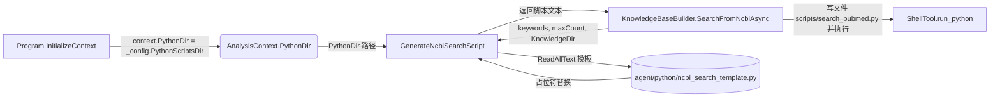

## 用户需求

将 `Knowledge\KnowledgeBaseBuilder.vb` 中 `GenerateNcbiSearchScript` 函数内联的 Python 检索脚本提取为独立的模板文件，并改造该函数：改为从「分析上下文环境中的 python 文件夹」读取模板脚本，通过占位符字符串替换生成最终 Python 脚本文本内容。模板文件放置于 `G:\OmicsWorks\agent\python`，且不得覆盖现有的 `pubmed_search.py` 工具脚本。

## 产品概述

这是一个代码重构任务，不改变对外行为（生成的 `search_pubmed.py` 仍写入 `_context.ScriptsDir` 并执行）。仅将「脚本内容直接拼接」改为「读取模板 + 占位符替换」，提升可维护性与可扩展性。

## 核心特性

- 提取并新建 Python 模板文件 `ncbi_search_template.py`，内容为原 NCBI PubMed 检索脚本，关键词/最大数量/输出目录改为占位符。
- 改造 `GenerateNcbiSearchScript`：从分析上下文的 python 目录读取模板文件，执行占位符替换后返回脚本文本；模板缺失时抛出清晰中文异常。
- 为 `AnalysisContext.PythonDir` 赋值，使其指向运行时 python 工具目录（`G:\OmicsWorks\agent\python`）。
- 现有 `pubmed_search.py` 保持不被修改、不被覆盖。

## 技术栈选择

- 语言/框架：VB.NET（.NET 10），沿用现有项目（OmicsAgent.vbproj）技术栈，不引入任何新依赖。
- 文件读取复用现有工具 `Utils\PathUtils.ReadAllText(path)`（已在 `GenerateNcbiSearchScript` 调用方使用）。
- 路径解析复用 `AnalysisContext.PythonDir` 与 `AgentConfig.PythonScriptsDir`（= `Path.Combine(ApplicationRoot, "python")`），运行时即对应 `G:\OmicsWorks\agent\python`。

## 实现方案

**策略**：将原 VB 内联的多行 Python 字符串整体抽取为磁盘上的模板文件，函数内部不再内联拼接，而是读取模板后做三次 `.Replace(...)` 替换（关键词列表、最大结果数、输出目录），返回拼接后的完整脚本文本。调用方（`SearchFromNcbiAsync`）写文件与执行脚本的逻辑完全不变。

**关键技术决策**：

1. **模板占位符命名**：使用 `{KEYWORDS}`、`{MAX_RESULTS}`、`{OUTPUT_DIR}` 三个大写、带花括号的专属令牌，避免与模板内 Python f-string（如 `{base_url}`、`{keyword}`、`{e}`）冲突。原脚本中用 `r"{outputDir}"` 包裹原始 Windows 路径，模板保留 `r"{OUTPUT_DIR}"` 形式，VB 中直接替换为真实路径，行为与现有一致（Python 原始字符串中反斜杠按字面处理，路径合法）。
2. **PythonDir 赋值来源**：`Program.vb` 的 `InitializeContext` 内（此时 `_config` 已加载）增加 `context.PythonDir = _config.PythonScriptsDir`，使「分析上下文环境中的 python 文件夹」语义落地。该属性此前声明但从未赋值，已被 `Modules\AnalysisModuleBase.vb:131` 作为工作区信息展示，赋值后信息也更真实。
3. **模板文件名**：使用 `ncbi_search_template.py`，明确区别于不可修改的 `pubmed_search.py`。

**性能与可靠性**：模板仅约 140 行，单次读取 + 3 次字符串替换，开销可忽略；无 N+1、无重复 IO。模板缺失时主动抛 `FileNotFoundException` 并提示路径，避免生成空脚本导致运行时静默失败。`GenerateNcbiSearchScript` 改为同步读取（与现有调用一致，无需 `Async`）。

**避免技术债**：不新增工具类/配置项，沿用现有 `PathUtils` 与 `AnalysisContext` 属性；不改动 `BuildAsync` 下游流程，控制改动爆炸半径。

## 实现备注

- 占位符替换顺序无关，但需确保令牌在模板中仅出现一次且在 f-string 之外；已核对 `{KEYWORDS}`、`{MAX_RESULTS}`、`{OUTPUT_DIR}` 仅出现于赋值处，安全。
- 读取模板前用 `File.Exists` 校验，缺失即抛带路径的中文异常；`File`/`Directory` 已在文件内通过 `System.IO` 可用，无需新增 import。
- 不修改 `vbproj`（`agent\python` 为运行时部署目录，区别于 `src\python` 的 glob 拷贝规则，用户已明确模板落点）。
- 保持 `outputDir` 直接替换（不调用 `ToPythonPath` 转换），以严格等效原实现行为，避免无意改变 Windows 路径语义。

## 架构设计

本次为局部重构，不引入新架构/分层。数据流：



## 目录结构

```
G:\OmicsWorks\agent\python\
└── ncbi_search_template.py   # [NEW] 提取出的 NCBI PubMed 检索 Python 模板脚本。原 GenerateNcbiSearchScript 内联脚本的纯文件版本，将
                              #       KEYWORDS、MAX_RESULTS、OUTPUT_DIR 三处改为 {KEYWORDS}/{MAX_RESULTS}/{OUTPUT_DIR} 占位符，
                              #       其余逻辑（urllib E-utilities 检索、XML 解析、txt 写出）保持不变。不得覆盖 pubmed_search.py。

g:\OmicsWorks\src\Program.vb  # [MODIFY] 在 InitializeContext 函数末尾（return context 前）增加
                              #          context.PythonDir = _config.PythonScriptsDir，
                              #          使分析上下文的 python 工具目录指向运行时 application root 下的 python 文件夹。

g:\OmicsWorks\src\Knowledge\KnowledgeBaseBuilder.vb
                             # [MODIFY] 重写 GenerateNcbiSearchScript：移除内联 VB 多行字符串拼接，改为
                              #          Path.Combine(_context.PythonDir, "ncbi_search_template.py") 读取模板，
                              #          校验存在性后依次 .Replace("{KEYWORDS}", kwList)、
                              #          .Replace("{MAX_RESULTS}", maxCount.ToString())、
                              #          .Replace("{OUTPUT_DIR}", outputDir) 并返回。签名与返回值(String)不变。
```

## 关键代码结构

模板文件头部（占位符位置）：

```python
KEYWORDS = [{KEYWORDS}]
MAX_RESULTS = {MAX_RESULTS}
OUTPUT_DIR = r"{OUTPUT_DIR}"
```

VB 侧替换逻辑（示意）：

```
Dim templatePath = Path.Combine(_context.PythonDir, "ncbi_search_template.py")
If Not File.Exists(templatePath) Then
    Throw New FileNotFoundException($"未找到 NCBI 检索 Python 模板脚本：{templatePath}。请确认 agent/python 目录下存在 ncbi_search_template.py。")
End If
Dim template = PathUtils.ReadAllText(templatePath)
Return template _
    .Replace("{KEYWORDS}", String.Join(", ", keywords.Select(Function(k) $"""{k}"""))) _
    .Replace("{MAX_RESULTS}", maxCount.ToString()) _
    .Replace("{OUTPUT_DIR}", outputDir)
```