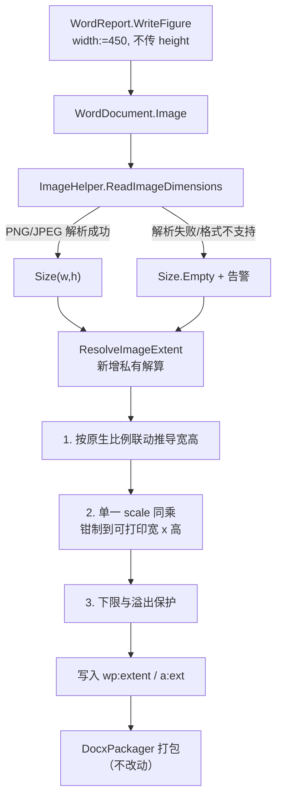

## 用户需求

修复 Word 文档生成模块（`G:\GCModeller\src\runtime\sciBASIC#\mime\applicationvnd.openxmlformats-officedocument.wordprocessingml.document\docx`）中与图片插入相关的代码缺陷。

当前 `Knowledge\WordReport.vb` 的 `WriteFigure` 只向 `WordDocument.Image` 传入 `width`（450 磅）而不传 `height`，导致生成的 docx 中插图宽高比严重失衡、绝大多数图片高度过低被压扁，结果插图无法清晰展示。

## 产品概述

让 docx 报告中的每一张插图都以图片自身的真实宽高比例呈现，既不被拉长也不被压扁，且始终完整落在页面可打印区域内；当图片尺寸无法可靠识别时，不再用臆造比例静默出图，而是给出明确告警。

## 核心功能

- **等比例插图**：只指定宽度时按原生比例自动推算高度；只指定高度时自动推算宽度；两者都不指定时按原生像素呈现；两者都显式指定时尊重调用方意图。
- **页面适配**：图片超出可打印宽度或可打印高度时，宽高同比例同时缩小，保证不溢出、不被裁切。
- **尺寸识别可感知**：PNG / JPEG 尺寸解析失败或格式不受支持时返回空尺寸并输出告警，不再静默套用 600x400 的臆造尺寸。
- **向后兼容**：`Image(file, width, height, caption)` 公开签名与既有调用方式保持不变。

## 视觉效果

生成的 docx 中，火山图、热图等组学结果图按原始长宽比居中排布，图注位于图下方居中；宽幅图铺满可打印宽度，长图自动缩至单页可容纳高度，整体版面比例协调、内容清晰可读。

## 技术栈

- **语言 / 框架**：VB.NET（.NET 5），沿用模块现有工程 `WordDocument.vbproj`
- **依赖**：仅 BCL + `System.Drawing.Size`（现有 `Imports ImageDimensions = System.Drawing.Size`、`Imports std = System.Math`），不新增第三方依赖
- **输出格式**：OOXML WordprocessingML（`wp:extent` / `a:ext`，单位 EMU）
- **引用关系**：`g:\OmicsWorks\src\OmicsAgent.vbproj` 第 236 行以 `ProjectReference` 直接引用 `WordDocument.vbproj`，改完源码重编译即生效，无需处理 DLL 拷贝或分发

## 实现思路

### 根因（已核实）

`WordDocument.vb` 第 734–736 行：

```
Dim widthEmu As Integer = If(width > 0, CInt(width * 12700), dims.Width * 9525)
Dim heightEmu As Integer = If(height > 0, CInt(height * 12700), dims.Height * 9525)
```

两行**各自独立判断**，彼此之间没有任何宽高比联动。当调用方只传 `width`（`WriteFigure` 的实际用法，`height` 保持默认 0）时，`heightEmu` 回退成「原生像素高 × 9525」，与已被显式设定的 `widthEmu` 完全脱钩，直接产出变形尺寸。

紧随其后的第 738–744 行只做页宽钳制，而 `width:=450` 磅 → `widthEmu` = 5,715,000 EMU，小于可打印宽度 `maxWEmu` = (11906 − 1440 − 1440) × 635 = 5,731,510 EMU，**钳制分支根本不触发**，错误的 `heightEmu` 被原样写进 XML。

数值验证（1200×900 px 图，`width:=450pt`）：`widthEmu` ≈ 6.25 英寸，`heightEmu` = 900 × 9525 = 8,572,500 ≈ 9.375 英寸 → 画框被拉高；对于宽而扁的组学结果图，同一缺陷反向产生高度极低的压扁效果，与用户观察到的现象吻合。

### 修复策略

将「尺寸解算」从 `Image` 主流程中抽出为一个私有纯函数 `ResolveImageExtent`，职责单一、可独立推理，`Image` 只负责校验、注册关系与拼装 XML（SoC）。解算分三步顺序执行：

**第一步：按原生比例联动推导**（`aspect = dims.Height / dims.Width`）

| 入参情形 | 处理 |
| --- | --- |
| 只给 `width` | `heightEmu = widthEmu × aspect` |
| 只给 `height` | `widthEmu = heightEmu ÷ aspect` |
| 两者都为 0 | 原生像素 × 9525 |
| 两者都 > 0 | 尊重调用方显式指定，不强制比例 |


**第二步：可打印区域双向钳制**

- `maxWEmu = (_pageWidth − _marginLeft − _marginRight) × 635`
- `maxHEmu = (_pageHeight − _marginTop − _marginBottom) × 635`
- 取 `scale = std.Min(1.0, std.Min(maxWEmu / widthEmu, maxHEmu / heightEmu))`，宽高**同乘同一个 scale**，一次性完成、避免两次独立钳制导致比例二次失真。

**第三步：下限保护** —— 结果不小于 1 EMU，防止极端输入产出 0 尺寸使 Word 判定文档损坏。

### 关键技术决策

- **单一 scale 同乘，而非先钳宽再钳高**：两次独立钳制会在第二次钳制时再次改变已经调整过的比例。取两个比值中的较小者一次性缩放，数学上保证比例恒定且必然同时满足两个约束。
- **中间计算全程 `Double`，末端一次 `CInt(std.Round(...))`**：EMU 数量级可达千万（页面上限约 573 万，原生大图更高），`Integer` 乘法链存在溢出风险，且逐步 `CInt` 会累积舍入误差。先在 `Double` 域完成全部乘除，最后收敛一次并做 `Integer.MaxValue` 边界防护。
- **除零防护**：`dims.Width` / `dims.Height` 为 0 时（空尺寸哨兵或畸形文件）跳过比例推导，退回安全默认，杜绝 `NaN` / `Infinity` 流入 XML —— 一旦写入非法 `cx`/`cy`，Word 会直接报文档损坏。
- **`Size.Empty` 作哨兵**：`ReadImageDimensions` 返回类型已是 `System.Drawing.Size`，`Size.Empty`（0,0）是天然的「未知尺寸」表达，无需引入 `Nullable` 或新类型，改动面最小。
- **保持公开签名不变**：`Image(file, width, height, caption)` 四参数签名与默认值一律不动，`ImageEntry` 结构不动，`DocxPackager` 无需改动，既有调用（含 test 项目第 184–185 行）零改动继续可用。

### 性能

单张图片的解算为纯算术，O(1)；`ReadImageDimensions` 对 PNG 走定长头部读取，对 JPEG 为一次线性段扫描，均远小于原有的 `File.ReadAllBytes` 开销。整体无新增热点。可选优化：`Image` 中当前分别调用 `file.ReadBinary` 与 `ImageHelper.ReadImageDimensions(file)`，实际读了两遍磁盘；可增加一个接受 `Byte()` 与扩展名的重载，复用已读入的字节数组，把每张图的磁盘 I/O 减半 —— 属低风险纯增量改动，不影响既有调用方。

## 实现要点

- **改动半径严格受控**：仅触及 `WordDocument.Image` 的尺寸解算段（第 730–744 行）与 `ImageHelper` 的兜底返回值。不重构 XML 拼装逻辑、不调整 `ImageEntry`、不改 `DocxPackager`、不动 `CreateTestPng`（test 项目第 34、36 行依赖它）。
- **告警复用既有模式**：`Image` 中「图片文件不存在」已使用 `Console.Error.WriteLine($"[警告] ...")`，尺寸解析失败沿用完全相同的前缀与输出通道，保持风格一致；告警只输出文件路径与失败原因，不打印字节内容，避免日志膨胀。
- **降级要安全而非中断**：`ReadImageDimensions` 返回 `Size.Empty` 时，`Image` 输出告警后仍需产出一张尺寸合理的图（无显式入参时退回可打印宽度、按 4:3 呈现），保证报告生成流程不因单张图元数据异常而中断 —— 这与 `WriteFigure` 中「缺图则跳过并记录」的既有容错取向一致。
- **`ReadJpegDimensions` 同步加固**：现有实现对 SOF0/SOF2 之外的渐进式 JPEG 变体（SOF1、SOF3、SOF5–SOF7、SOF9–SOF11、SOF13–SOF15）不识别，会落入兜底。在标记判断中纳入这些 SOF 变体、同时显式排除 `&HC4`(DHT) / `&HC8` / `&HCC`(DAC)，可显著降低真实图片走进兜底分支的概率。同时对 `length < 2` 做防护，避免 `pos` 不前进造成死循环。
- **验证走现成入口**：test 项目 `Program.vb` 第 181–185 行已直接引用两张真实 OmicsWorks 图片并分别以 `width:=450` / `width:=350` 调用，是天然的回归验证场景，无需另建测试工程。

## 架构设计

改动局限在 docx 模块内部两个文件，调用链与数据流保持不变：



## 目录结构

本次为缺陷修复，不新增文件，仅修改 docx 模块内两个源文件。

```
G:\GCModeller\src\runtime\sciBASIC#\mime\applicationvnd.openxmlformats-officedocument.wordprocessingml.document\
├── docx\
│   ├── WordDocument.vb    # [MODIFY] 核心修复。改造 Image 第 730-744 行尺寸解算：新增私有函数 ResolveImageExtent(dims, width, height) 返回 (widthEmu, heightEmu)，按 dims 原生比例联动推导四种入参情形，再以单一 scale 同乘钳制到可打印宽高（maxW=(_pageWidth-_marginLeft-_marginRight)*635，maxH=(_pageHeight-_marginTop-_marginBottom)*635），中间用 Double、末端 CInt(std.Round(..)) 并做下限与 Integer 边界防护；dims 为 Size.Empty 时输出 [警告] 并退回安全默认尺寸。保持 Image 四参数公开签名、ImageEntry 结构、XML 拼装（第 760-774 行）不变。可选：新增接受 Byte()+扩展名的尺寸重载以复用已读字节、避免二次磁盘读取。
│   └── ImageHelper.vb     # [MODIFY] 兜底可感知化。将 ReadPngDimensions / ReadJpegDimensions / ReadImageDimensions 中 6 处硬编码 Return New ImageDimensions With {.Width=600,.Height=400} 统一改为 Return Size.Empty，并在 ReadImageDimensions 的不支持格式与异常分支输出 [警告] 提示。同步加固 ReadJpegDimensions：纳入 SOF1/SOF3/SOF5-7/SOF9-11/SOF13-15 变体、显式排除 DHT(C4)/C8/DAC(CC)、对 length<2 做防护避免死循环。不得改动 CreateTestPng 及其 PNG 编码辅助函数（WriteChunk/ZlibCompress/Adler32/Crc32），test 项目第 34、36 行依赖它们。
└── test\
    └── Program.vb         # [VERIFY] 不改动。第 181-185 行已引用两张真实 OmicsWorks 图片并以 width:=450 / width:=350 调用 doc.Image，直接作为回归验证入口，运行后检查输出 docx 中插图比例是否与源图一致。
```

## 关键代码结构

仅给出新增私有解算函数的签名契约（不含实现体），这是本次修复的核心抽象：

```
''' <summary>
''' 依据图片原生尺寸与调用方指定的宽/高（磅），解算最终写入 OOXML 的 EMU 尺寸。
''' 保证：未同时指定宽高时严格保持原生宽高比；结果始终落在可打印区域内。
''' </summary>
''' <param name="dims">图片原生像素尺寸；Size.Empty 表示尺寸未知。</param>
''' <param name="width">调用方指定宽度（磅），0 表示自动。</param>
''' <param name="height">调用方指定高度（磅），0 表示自动。</param>
''' <param name="widthEmu">输出：最终宽度（EMU）。</param>
''' <param name="heightEmu">输出：最终高度（EMU）。</param>
Private Sub ResolveImageExtent(dims As Size,
                               width As Double,
                               height As Double,
                               ByRef widthEmu As Integer,
                               ByRef heightEmu As Integer)
```

单位换算常量沿用现有注释口径：1 px @96DPI = 9525 EMU，1 pt = 12700 EMU，1 twip = 635 EMU。

## Agent Extensions

### SubAgent

- **code-explorer**
- Purpose: 在修改前定位 docx 模块内 `Image`、`ReadImageDimensions`、`ImageEntry` 的全部调用点与依赖，确认 `WordDocument.vbproj` 之外是否还有其他工程消费这些公开 API，避免改动产生预期外的破坏。
- Expected outcome: 输出完整的调用点清单（含文件路径与行号），确认改动半径仅限本次计划列出的两个文件，且公开签名保持兼容。