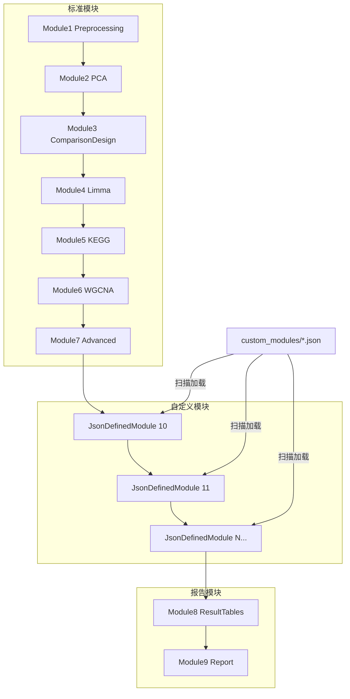

## 用户需求

### 任务一：标准分析模块代码更新

参考已完成的 `Module1_Preprocessing.vb` 代码模式，将 Modules 文件夹中剩余的标准分析模块（Module2-Module7）进行同样的代码更新。当前基类 `AnalysisModuleBase` 已被充分抽象，标准分析模块仅需提供 `GeneratePlanPromptText()` 和 `GetConclusionItems()` 两个 prompt 提示词以及 `CsvFileNamePrefix` 属性即可，不再需要重写 `GeneratePlanAsync`、`GenerateAndRunScriptAsync`、`GenerateConclusionAsync` 等方法。

### 任务二：自定义模块 JSON 加载系统

设计 JSON 数据对象，允许用户在 JSON 文件中定义分析模块的元数据（模块名称、CSV 前缀）及 `GeneratePlanPromptText` 和 `GetConclusionItems` 的 prompt 提示词。程序通过扫描指定文件夹中的 JSON 文件，自动加载用户自定义的分析模块到分析流程中。

**核心约束**：自定义模块必须在 `ResultTablesModule`（模块8）和 `ReportModule`（模块9）之前执行。

### 补充说明

- Module8（ResultTables）和 Module9（Report）是特殊模块，包含自定义 VB.NET 逻辑（CSV 收集/XLSX 生成、HTML 报告构建），不能完全转换为纯 prompt 模式，但需修复编译错误以适配新基类。
- 自定义模块的 ModuleIndex 从 10 开始递增，确保输出目录命名不与标准模块冲突。

## 技术栈

- 语言：VB.NET（.NET 10.0，OptionStrict Off）
- 项目类型：控制台应用（智能体框架）
- JSON 库：`Microsoft.VisualBasic.Serialization.JSON`（`LoadJSON(Of T)` 扩展方法）和 `Microsoft.VisualBasic.MIME.application.json.LenientJson`（`LenientJsonParser`）
- LLM 框架：Ollama 客户端（`LLMClient`、`LLMsResponse`）
- 配置管理：INI 文件（`IOProvider.LoadProfile`）

## 实现方案

### 任务一：标准分析模块更新（Module2-7）

**策略**：将每个模块从旧模式（重写 3 个方法）转换为新模式（仅重写 5 个成员），具体操作：

1. 移除 `Imports Microsoft.VisualBasic.Serialization.JSON` 和 `Imports Ollama`（不再直接使用）
2. 移除 `GeneratePlanAsync(llm, cancellationToken)` 重写 — 基类默认实现已包含重试机制，通过 `GeneratePlanPromptText()` 注入模块特定内容
3. 移除 `GenerateAndRunScriptAsync(llm, plan, step, cancellationToken)` 重写 — 基类默认实现通过 plan 的 execution_steps 驱动脚本生成
4. 移除 `GenerateConclusionAsync(llm, plan, cancellationToken)` 重写 — 该方法在基类中为 `Private`，无法重写
5. 新增 `CsvFileNamePrefix` 属性（`MustOverride`，必须实现）
6. 新增 `GeneratePlanPromptText()` 方法 — 合并旧 `GeneratePlanAsync` 中的任务描述和 `GenerateAndRunScriptAsync` 中的实现要求
7. 新增 `GetConclusionItems()` 方法 — 提取旧 `GenerateConclusionAsync` 中的总结条目

**各模块的 CsvFileNamePrefix 设计**：

| 模块 | 前缀 |
| --- | --- |
| Module2 PCA | `pca_` |
| Module3 ComparisonDesign | `comparison_` |
| Module4 Limma | `limma_` |
| Module5 KEGG | `kegg_` |
| Module6 WGCNA | `wgcna_` |
| Module7 Advanced | `advanced_` |


**Prompt 内容合并原则**：

- `GeneratePlanPromptText()`：包含分析目标描述 + 具体实现要求（R 包、绘图规范、文件输出路径等），使 LLM 能生成足够详细的 execution_steps
- `GetConclusionItems()`：保留原有的中文总结条目列表，指导 LLM 生成阶段性总结

### 任务一b：特殊模块修复（Module8-9）

Module8 和 Module9 包含大量自定义 VB.NET 逻辑，不能完全转换为纯 prompt 模式。修复策略：

1. **新增** `CsvFileNamePrefix`、`GeneratePlanPromptText()`、`GetConclusionItems()` 实现
2. **移除** `GeneratePlanAsync(llm, cancellationToken)` 重写 — 使用基类默认实现
3. **移除** `GenerateConclusionAsync(llm, plan, cancellationToken)` 重写 — 该方法在基类中为 `Private`，改由 `GetConclusionItems()` 驱动基类 LLM 总结生成
4. **保留** `GenerateAndRunScriptAsync(llm, plan, step, cancellationToken)` 重写 — 包含模块特有的 VB.NET 逻辑
5. **修复** Module8 中 `RegisterTools(llm)` → `RegisterTools(llm, True)`（基类要求两个参数）

### 任务二：自定义模块 JSON 加载系统

**JSON 数据对象设计**：

```
{
  "module_name": "Custom Network Analysis",
  "csv_file_name_prefix": "custom_network_",
  "generate_plan_prompt": "Design a plan for network analysis...\n\n# Implementation Requirements\n- ...",
  "conclusion_items": "1. 网络分析整体结果\n2. 关键节点识别\n3. ..."
}
```

**JsonDefinedModule 类设计**：

- 继承 `AnalysisModuleBase`
- 构造函数接收 `CustomModuleDefinition` 和 `moduleIndex` 参数
- 将 JSON 定义映射到 `ModuleName`、`CsvFileNamePrefix`、`GeneratePlanPromptText()`、`GetConclusionItems()`
- ModuleIndex 从 10 开始递增，避免与标准模块（1-9）冲突

**模块加载与执行流程**：

1. 在 `Workflow.Run` 中加载配置后，扫描自定义模块文件夹（默认 `{ApplicationRoot}/custom_modules/`，可通过 `--custom-modules` 参数指定）
2. 遍历文件夹中所有 `.json` 文件，反序列化为 `CustomModuleDefinition`，创建 `JsonDefinedModule` 实例
3. 解析 JSON 失败时记录错误并跳过，不影响其他模块加载
4. 在 `MainAsync` 的模块执行循环中，若模块列表包含 8 或 9，则在第一个 8/9 之前插入自定义模块索引
5. `CreateModule` 函数增加对 index >= 10 的自定义模块查找逻辑

**执行顺序保证**：

```
标准模块(1-7) → 自定义模块(10,11,...) → ResultTables(8) → Report(9)
```

## 实现注意事项

- **性能**：自定义模块加载仅在启动时执行一次，JSON 文件数量通常很少（< 10），无性能瓶颈
- **错误处理**：JSON 解析失败时跳过单个文件并记录日志，不影响其他模块；自定义模块文件夹不存在时静默跳过
- **向后兼容**：不修改 `ParseModulesToRun` 的默认返回值 `{1,2,3,4,5,6,7,8,9}`，自定义模块索引在 `MainAsync` 中动态插入；用户使用 `--module` 指定特定模块时不自动插入自定义模块（除非列表中包含 8 或 9）
- **日志**：使用现有的 `_logger` 委托记录模块加载信息，与现有模式一致
- **影响范围**：不涉及 `AnalysisModuleBase` 基类修改，不修改 `ModulePlan`、`ModuleResult` 等模型类

## 架构设计



## 目录结构

```
g:\OmicsWorks\src\
├── Models/
│   └── CustomModuleDefinition.vb          # [NEW] 自定义模块 JSON 数据模型。定义 module_name、csv_file_name_prefix、generate_plan_prompt、conclusion_items 四个字段，用于反序列化用户定义的 JSON 配置文件。
├── Modules/
│   ├── Base/
│   │   └── AnalysisModuleBase.vb          # [不修改] 抽象基类，已由用户完成抽象
│   ├── Module1_Preprocessing.vb           # [不修改] 参考模块，已完成更新
│   ├── Module2_PCA.vb                     # [MODIFY] 转换为新模式：移除 3 个方法重写，新增 CsvFileNamePrefix/GeneratePlanPromptText/GetConclusionItems。合并旧 prompt 中的 PCA/PLSDA/OPLSDA 分析任务描述和 R 脚本实现要求。
│   ├── Module3_ComparisonDesign.vb        # [MODIFY] 转换为新模式：移除 3 个方法重写，新增 3 个成员。保留比对组别设计的生物学依据和预期发现描述。
│   ├── Module4_Limma.vb                   # [MODIFY] 转换为新模式：移除 3 个方法重写，新增 3 个成员。保留 LIMMA 差异分析的多因素 ANOVA、F 检验、两两比较、VIP 计算等任务描述。
│   ├── Module5_KEGG.vb                    # [MODIFY] 转换为新模式：移除 3 个方法重写，新增 3 个成员。保留 KEGG 富集分析和 GSVA 分析的任务描述。
│   ├── Module6_WGCNA.vb                   # [MODIFY] 转换为新模式：移除 3 个方法重写，新增 3 个成员。保留 WGCNA 共表达网络构建和性状关联分析的任务描述。
│   ├── Module7_Advanced.vb               # [MODIFY] 转换为新模式：移除 3 个方法重写，新增 3 个成员。保留 CMeans 聚类、贝叶斯网络、PLS-PM 等进阶分析任务描述。
│   ├── Module8_ResultTables.vb           # [MODIFY] 修复编译：新增 CsvFileNamePrefix/GeneratePlanPromptText/GetConclusionItems，移除 GeneratePlanAsync 和 GenerateConclusionAsync 重写，保留 GenerateAndRunScriptAsync 重写，修复 RegisterTools 调用参数。
│   ├── Module9_Report.vb                 # [MODIFY] 修复编译：新增 CsvFileNamePrefix/GeneratePlanPromptText/GetConclusionItems，移除 GeneratePlanAsync 和 GenerateConclusionAsync 重写，保留 GenerateAndRunScriptAsync 重写。
│   └── JsonDefinedModule.vb              # [NEW] JSON 驱动的自定义模块类。继承 AnalysisModuleBase，构造函数接收 CustomModuleDefinition 和 moduleIndex，将 JSON 字段映射到 ModuleName/CsvFileNamePrefix/GeneratePlanPromptText/GetConclusionItems。
├── AppRuntime/
│   └── Opts.vb                           # [MODIFY] 新增 --custom-modules 命令行参数，用于指定自定义模块 JSON 文件夹路径。
├── Workflow.vb                            # [MODIFY] 新增 _customModules 列表字段、LoadCustomModules 方法（扫描文件夹加载 JSON）、修改 CreateModule 支持自定义模块查找、修改 MainAsync 在模块8/9之前插入自定义模块索引。
└── Program.vb                             # [MODIFY] 更新帮助文本，添加 --custom-modules 参数说明。
```

## 关键代码结构

### CustomModuleDefinition 数据模型

```
''' <summary>
''' 自定义分析模块的 JSON 配置数据模型。
''' 用户在 JSON 文件中定义模块元数据和 prompt 提示词，
''' 程序通过扫描文件夹加载这些定义来创建自定义分析模块。
''' </summary>
Public Class CustomModuleDefinition
    ''' <summary>模块名称，用于创建输出目录和日志显示</summary>
    Public Property module_name As String
    ''' <summary>CSV 文件名前缀，用于模块输出文件的命名</summary>
    Public Property csv_file_name_prefix As String
    ''' <summary>分析计划 prompt 提示词，对应 GeneratePlanPromptText() 的返回值</summary>
    Public Property generate_plan_prompt As String
    ''' <summary>总结条目文本，对应 GetConclusionItems() 的返回值</summary>
    Public Property conclusion_items As String
End Class
```

### JsonDefinedModule 类签名

```
''' <summary>
''' 由 JSON 配置文件驱动的自定义分析模块。
''' 通过 CustomModuleDefinition 提供模块特定的 prompt 提示词，
''' 完全复用 AnalysisModuleBase 的标准执行流程。
''' </summary>
Public Class JsonDefinedModule : Inherits AnalysisModuleBase
    Private ReadOnly _definition As CustomModuleDefinition
    Private ReadOnly _customIndex As Integer

    Public Sub New(config As AgentConfig, context As AnalysisContext, logger As Action(Of String),
                   definition As CustomModuleDefinition, moduleIndex As Integer)
    ' 构造函数：调用基类构造，保存定义和索引

    Public Overrides ReadOnly Property ModuleName As String
    ' 返回 _definition.module_name

    Public Overrides ReadOnly Property ModuleIndex As Integer
    ' 返回 _customIndex

    Public Overrides ReadOnly Property CsvFileNamePrefix As String
    ' 返回 _definition.csv_file_name_prefix

    Protected Overrides Function GeneratePlanPromptText() As String
    ' 返回 _definition.generate_plan_prompt

    Protected Overrides Function GetConclusionItems() As String
    ' 返回 _definition.conclusion_items
End Class
```