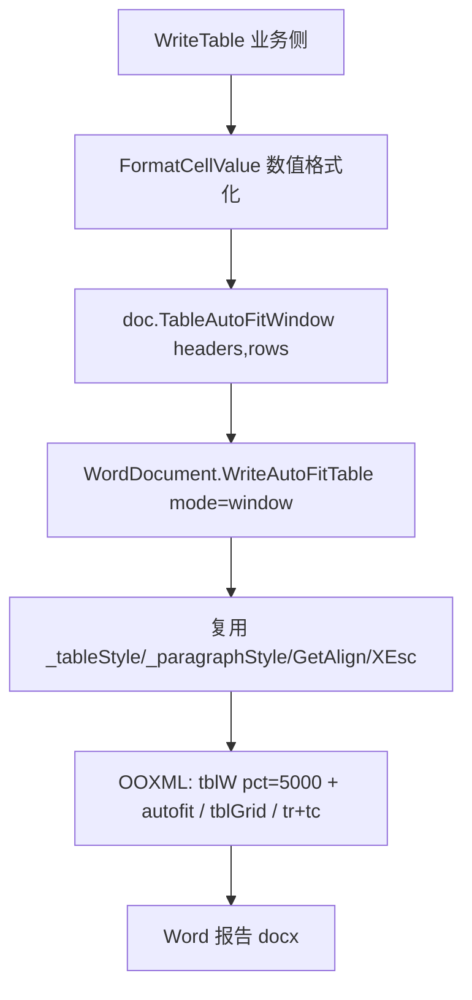

## 用户需求

将当前在业务项目 `WordReport.vb` 中实现的 `WriteAutoFitTable` 扩展方法移动并合并进基础代码库 `WordDocument` 模块，消除样式硬编码漂移，并补充 "auto fit to contents" 样式的对应函数。

## 产品概述

Word 报告表格目前由业务侧自行拼装 OOXML 实现窗口自适应表格，但颜色/字体与文档已配置的 `TableStyle` 不一致。本次将自适应表格逻辑下沉到基础库 `WordDocument`，统一读取 `_tableStyle`/`_paragraphStyle`，并提供两种自适应策略：按窗口自适应（auto fit to window，占满页面 100% 宽）与按内容自适应（auto fit to contents，按内容收缩宽度）。

## 核心功能

- 在基础库 `WordDocument` 新增私有核心方法，读取文档已配置的表格样式（深蓝表头、隔行底纹、边框、字体），仅改变列宽策略；复用库内既有 `XEsc` 与 `GetAlign` 辅助函数。
- `auto fit to window` 函数：表格宽度占满页面（100% pct），布局 `autofit`，由 Word 按窗口折列宽。
- `auto fit to contents` 函数：表格宽度随内容自适应（`w:tblW w:type="auto"` + `autofit`），列宽按单元格内容收缩。
- 业务侧删除本地 `WriteAutoFitTable`、`XmlEscape`、`GetCellAlign` 辅助，调用点改用库方法 `TableAutoFitWindow`，保留项目专属的 `FormatCellValue` 数值格式化。
- 清理上一步临时加入到基础库的 `AppendRaw` 死代码。

## 技术栈

- VB.NET，`net10.0`，`Option Strict Off` / `Option Infer On`
- Word 生成：`Microsoft.VisualBasic.MIME.Office.WordDocument`（外部项目源码引用，可修改）
- OOXML 表格：`w:tblPr` / `w:tblW` / `w:tblLayout` / `w:tblGrid` / `w:tr` / `w:tc`

## 实现思路

### 总体策略

在基础库 `WordDocument` 中，于现有 `Table` 方法附近新增一个私有核心 `WriteAutoFitTable(mode, headers, rows, alignments)`，其内部拼装逻辑与现有 `Table` 几乎一致（读取 `_tableStyle`、`_paragraphStyle`、`GetAlign`、`XEsc`），仅将列宽策略按 `mode` 切换：

- `window`：`w:tblW w:w="5000" w:type="pct"`（100% 页面宽）+ `w:tblLayout w:type="autofit"`。
- `contents`：`w:tblW w:type="auto"` + `w:tblLayout w:type="autofit"`。
二者 `gridCol` 与 `tcW` 均用 `w:w="0"`，由 Word 渲染时计算实际宽度。

再提供两个公开包装：`TableAutoFitWindow` 与 `TableAutoFitContents`，保持与现有 `Table(headers, rows, alignments)` 一致的方法签名（含二维数组 `(,)` 重载），便于调用方无缝替换。

### 关键技术决策

- **消除样式漂移**：原业务侧硬编码 "4472C4"/"8EAADB"/"D6E4F0" 且字体写死 Calibri/YaHei，与 `ApplyReportStyles` 实际配置（`TableStyle` 中 `HeaderBackColor="4472C4"` 等）未必一致；下沉后统一读取 `_tableStyle` 与 `_paragraphStyle`，与 `Table` 完全一致。
- **复用而非复制**：直接调用库内既有 `XEsc` 与 `GetAlign`，不新增本地辅助，减少维护面。
- **auto fit 实现**：`autofit` layout 是 Word 自动调整列宽的开关；`window` 用 `pct=5000`（=100%）让表格占满正文区；`contents` 用 `type="auto"` 让表格按内容收缩并靠左。
- **签名对齐**：公开方法提供 `String()()` 与 `String(,)` 两个重载（与 `Table` 对齐），调用方可直接传 `preview.rows`。
- **删除死代码**：移除上一步临时加入的 `AppendRaw`（业务侧不再需要，基础库也无其他调用方）。

### 性能与可靠性

- 表格规模小（CSV 预览最多 9 行、个位数列），O(行×列) 拼装开销可忽略。
- 自适应表格与固定宽度表格走同一套样式读取路径，行为可预期，不引入额外异常分支。
- 业务侧 `WriteTable` 的 `Try/Catch` 仍包裹整个 `BuildWordReport`，单表失败不影响整份文档。

## 实施要点

1. 基础库 `WordDocument.vb`：删除临时 `AppendRaw` 方法（位于 `Save` 之后）。
2. 基础库 `WordDocument.vb`：在 `Table` 方法后新增私有 `WriteAutoFitTable(mode, headers, rows, alignments)`，按 `mode` 输出不同 `tblW`/`tblLayout`，其余表头/数据行/边框/隔行底纹逻辑与 `Table` 一致并读取 `_tableStyle`/`_paragraphStyle`。
3. 基础库 `WordDocument.vb`：新增公开 `TableAutoFitWindow` 与 `TableAutoFitContents`（含 `String()()` 与 `String(,)` 重载），内部调用私有核心并传对应 `mode`。
4. 业务侧 `WordReport.vb`：删除 `WriteAutoFitTable` 扩展方法、`XmlEscape`、`GetCellAlign`；`WriteTable` 内 `doc.WriteAutoFitTable(preview.headers, formattedRows)` 改为 `doc.TableAutoFitWindow(preview.headers, formattedRows)`；保留 `FormatCellValue`。
5. 编译验证：`dotnet build OmicsAgent.vbproj -v q` 须 0 错误。

## 架构设计

改动收敛在基础库与业务侧单文件，不影响 HTML/PDF 路径，也不改变既有 `Table` 行为。



## 目录结构

```
G:/GCModeller/src/runtime/sciBASIC#/mime/applicationvnd.openxmlformats-officedocument.wordprocessingml.document/docx/
└── WordDocument.vb   # [MODIFY] 删除临时 AppendRaw；新增私有 WriteAutoFitTable(mode,...) 与
                       #   公开 TableAutoFitWindow / TableAutoFitContents（含交错数组与二维数组重载）

g:/OmicsWorks/src/
└── Knowledge/
    └── WordReport.vb  # [MODIFY] 删除本地 WriteAutoFitTable/XmlEscape/GetCellAlign；
                       #   WriteTable 调用改为 doc.TableAutoFitWindow(...)
                       #   保留 FormatCellValue
```

## 关键代码结构

```
' 基础库 WordDocument.vb 新增（示意签名，不含实现体）
Private Function WriteAutoFitTable(mode As String,
                                  headers As String(),
                                  rows As String()(),
                                  Optional alignments As String() = Nothing) As WordDocument

Public Function TableAutoFitWindow(headers As String(), rows As String()(),
                                   Optional alignments As String() = Nothing) As WordDocument

Public Function TableAutoFitContents(headers As String(), rows As String()(),
                                     Optional alignments As String() = Nothing) As WordDocument
```

## Agent Extensions

### Skill

- **docx**
- Purpose: 核对基础库新增自适应表格的 OOXML 结构（`w:tblW` 的 `pct`/`auto` 与 `w:tblLayout autofit`）是否符合 Word 规范，确保生成的 docx 不被损坏。
- Expected outcome: 确认 `window`（100% 页面宽）与 `contents`（按内容收缩）两种自适应表格的 OOXML 写法正确，文档可在 Word 中正常打开并自适应列宽。