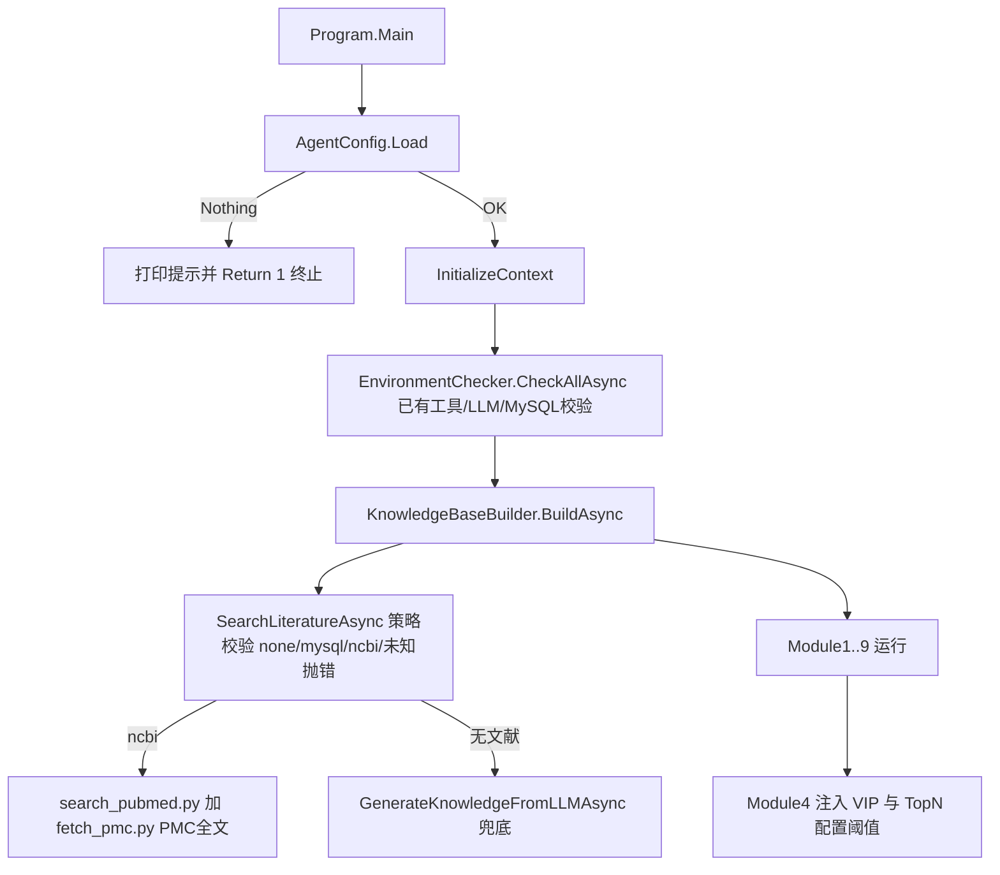

## 用户需求

基于 `G:\OmicsWorks\docs\omics-agent-requirement-audit-fix.md` 中列举的 9 项代码审查修改任务，修改 `G:\OmicsWorks\src` 下的 VB.NET (.NET 10) 组学分析 agent 项目，使其功能严格符合 `agent_glm.txt` 的功能需求。

## 核心功能（审查任务映射）

- **程序初始化校验（HIGH-1）**：校验外部工具路径（Rscript/wkhtmltopdf/R#/Python）与 LLM 配置，缺失或不可用时提示并终止；配置文件缺失时生成模板并终止。
- **文献检索（HIGH-2 / MEDIUM-1）**：NCBI 在线检索需抓取标题、引用、摘要，并在有 PMC 全文时获取全文，保存为 txt 到工作区 research_kb；检索策略仅允许 mysql/ncbi/none，未知策略应报错终止。
- **差异分析（MEDIUM-2）**：Module4 对代谢组数据需施加 VIP > 配置阈值筛选，并在 pvalue/VIP 筛选后按 |logFC| 降序取配置数量的 top 分子。
- **轻量核对（LOW-1/2/3、MEDIUM-3）**：预处理归一化细节、差异热图标签/分类色块、报告 Excel 样式、引用目录一致性需核对是否符合需求。
- **配置模板（LOW-4）**：配置文件模板默认文献检索策略由 mysql 改为 none。

## 技术栈

- 语言/框架：VB.NET、.NET 10、控制台程序，引用 Ollama 客户端包与本地 LiteratureDatabase/Researcher 工程。
- 既有模式（应复用）：`AgentConfig` 提供只读属性 `RScriptsDir/RsharpScriptsDir/PythonScriptsDir/KeggDataDir`（基于 `ApplicationRoot`）；`AnalysisContext` 提供 `WorkspaceDir/KnowledgeDir/PythonDir/ScriptsDir`；`ShellTool` 提供 `run_python/run_rscript`（工作目录 `WorkspaceDir`，脚本用相对路径 `scripts/xxx.py`）。

## 实现策略

### 1. Program.vb 配置守卫（HIGH-1 残余缺口）

`AgentConfig.Load` 在 ini 不存在时生成模板并返回 `Nothing`。当前 `Program.vb` 在加载后未判断，直接传入 `EnvironmentChecker` 导致空引用崩溃。在 `InitializeContext` 与 `EnvironmentChecker` 调用之前增加 `_config Is Nothing` 判断：打印"已生成 config.ini 模板，请填写后重新运行"并 `Return 1`。`EnvironmentChecker` 已具备工具路径存在性、LLM 配置、MySQL 配置（mysql 策略）、LLM 服务可用性（`/api/tags` 校验模型存在）的完整校验，无需重复实现。

### 2. KnowledgeBaseBuilder.vb（HIGH-2 + MEDIUM-1）

- **HIGH-2（NCBI PMC 全文）**：在 `SearchFromNcbiAsync` 中，于运行 `search_pubmed.py` 之后新增 PMC 全文获取。由 VB 内联生成 `fetch_pmc.py` 脚本（字符串模板，写入 `ScriptsDir`，依赖 Bio.Entrez：elink 将 pubmed PMID 关联到 pmc，再 efetch db=pmc 获取全文），从已生成的 `ref_*.txt` 解析 PMID，调用 `shell.run_python` 执行，将 PMC 全文追加到对应 txt。Biopython 缺失时脚本应优雅失败（已被现有 try/catch 兜底，不影响主流程）。
- **MEDIUM-1（策略校验）**：`SearchLiteratureAsync` 的 `Select Case` 增加显式 `Case "none"`（明确跳过自动检索并返回空列表）；`Case Else` 对真正未知策略 `LogInfo` 报错并抛出 `InvalidOperationException` 终止，而非静默回退。

### 3. Module4_Limma.vb 阈值注入（MEDIUM-2）

在 `GeneratePlanAsync` 与 `GenerateAndRunScriptAsync` 的 prompt 中，将恒定文案 "VIP > 1" / "top N" 替换为 `_config.MetaboliteVipCutoff` 与 `_config.DiffTopCount`，使 LLM 生成的 R 脚本实际使用配置阈值（默认 VIP>1.0、取 top 200 分子）。同时强调代谢组必须计算 VIP 并在筛选后按 |logFC| 降序取 top N。

### 4. AgentConfig.vb 模板默认（LOW-4）

`CreateTemplate` 中将 `[literature]` 段 `strategy = mysql` 改为 `strategy = none`，与运行时默认及需求（不自动检索除非显式配置）一致。

### 5. 已落地项核对（LOW-1/2/3、MEDIUM-3）

经读取源码确认：`Module1` 预处理 prompt 已含按行最小阳性值一半填充、列和归一化、log2(max>100)、按行中位数缩放并提示 source() 复用；`Module4` 热图已要求列=样本按分组排序、行=分子层次聚类、分子分类颜色块、显示分子/样本名；`Module8` 已实现 Cambria Math 11、缩放 90%、冻结首列+第二行、首列浅灰斜体、注释行草绿、列标题深蓝白粗、全英文；MEDIUM-3 参考文献复制到 `KnowledgeDir` 且 NCBI 检索结果也写入 `KnowledgeDir`，目录已一致，内联不足由 `GenerateKnowledgeFromLLMAsync` 兜底。均仅需核对确认，不破坏现有实现。

## 实现注意（Execution Notes）

- **最小改动、控制爆炸半径**：仅调整初始化守卫与文献检索/差异分析提示词，不触碰各模块分析算法与运行管线（RunAsync → Plan → Script → Conclusion）。
- **向后兼容**：`AgentConfig`/`AnalysisContext` 属性签名不变；PMC 脚本新增文件位于 `ScriptsDir` 运行时目录，不影响外部 `python/` 模板。
- **日志复用**：沿用现有 `_logger`（ConsoleLog），不引入新日志组件。
- **性能**：均为启动期/检索期一次性操作，无循环或重负载。
- **容错**：PMC 获取与未知策略均被现有 try/catch 或显式异常正确终止，无空引用风险。

## 目录结构与修改清单

```
g:/OmicsWorks/src/
├── Program.vb                      # [MODIFY] AgentConfig.Load 后增加 _config Is Nothing 守卫并终止(HIGH-1 残余)
├── Config/
│   └── AgentConfig.vb             # [MODIFY] CreateTemplate 的 strategy 默认 mysql→none(LOW-4)
├── Knowledge/
│   └── KnowledgeBaseBuilder.vb    # [MODIFY] SearchFromNcbiAsync 增加 PMC 全文获取(HIGH-2)；SearchLiteratureAsync 显式 none 且未知策略抛错(MEDIUM-1)
└── Modules/
    └── Module4_Limma.vb           # [MODIFY] prompt 注入 _config.MetaboliteVipCutoff 与 DiffTopCount(MEDIUM-2)
```

（验证项：Modules/Module1_Preprocessing.vb、Modules/Module4_Limma.vb 热图部分、Modules/Module8_ResultTables.vb、KnowledgeBaseBuilder 引用目录一致性——确认已符合需求，无实质改动）

## 架构设计

修改均位于"启动编排层(Program) + 配置(Config) + 知识构建(Knowledge) + 模块提示(Module4)"，不改变分析执行管线与各模块新建 OllamaClient 的 token 隔离设计。

