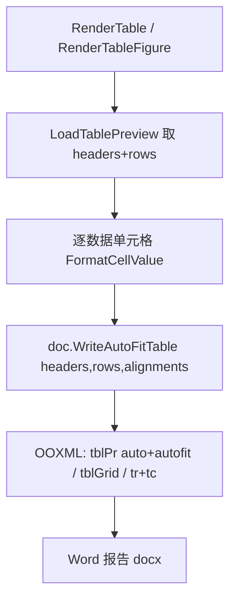

## 用户需求

在现有 Word 报告生成代码（`Knowledge/WordReport.vb`）基础上优化表格生成逻辑。

## 产品概述

当前 Word 报告中的表格通过 `WordDocument.Table` 生成，采用固定宽度平均分配列宽，且单元格中的数值未经任何格式化（如过长小数、超大/超小数值直接原样显示）。本次优化在不改动外部 sciBASIC 库的前提下，于本项目内实现两点改进：表格默认按窗口自适应宽度（auto fit to window）；表格内数值型单元格按规则格式化。

## 核心功能

- 表格默认 auto fit to window：生成的 Word 表格宽度随页面窗口自动调整，不再写死固定 dxa 列宽。
- 数值格式化：对表格数据单元格中可解析为实数的文本，若数值大于 10000 或小于 0.001，按保留三位小数的科学计数法显示（如 `1.234E+04`）；其余数值按四舍五入保留两位小数显示（如 `12.34`）。非数值文本（表头、单位、类别名等）原样保留。
- 上述优化同时作用于结果章节中的 `RenderTable` 与 `RenderTableFigure` 两处表格写入入口，保持与现有报告样式（深蓝表头、隔行底纹、边框）一致。

## 技术栈

- 沿用现有工程：VB.NET，`net10.0`，`Option Strict Off` / `Option Infer On`
- Word 生成：`Microsoft.VisualBasic.MIME.Office.WordDocument`（外部项目引用，只读，不修改）
- 表格样式：`Microsoft.VisualBasic.MIME.Office.WordDocument.WordStyle.TableStyle`（公开属性复用）
- 数值解析：.NET `Double.TryParse` / `Math.Round`

## 实现思路

### 总体策略

在 `WordReport.vb` 内新增两个私有/扩展辅助函数，并替换两处表格写入调用：

1. `FormatCellValue(raw As String) As String` —— 数值格式化纯函数。
2. `WriteAutoFitTable` 扩展方法 —— 构造 auto fit to window 的 OOXML 表格，复用 `ApplyReportStyles` 中已配置的 `TableStyle` 视觉属性。

由于外部 `Table` 写死固定宽度且私有成员不可访问，必须在本项目内自行拼装 auto fit 表格的 OOXML 字符串并追加到文档体。参考库中 `Table` 方法的 OOXML 结构（tblPr / tblGrid / tr / tc），仅将 `w:tblW` 改为 `w:type="auto"` 并加 `w:tblLayout w:type="autofit"`，单元格宽度用 `w:tcW w:w="0" w:type="auto"`，其余表头背景、边框、隔行底纹逻辑与库保持一致（读取 `doc` 上已设置的 `TableStyle`；若库未暴露 getter，则按 `ApplyReportStyles` 中写死的常量重建样式，保证视觉一致）。

### 关键技术决策

- **不改外部库**：跨仓库且私有成员不可访问，所有改动收敛在 `WordReport.vb`。
- **auto fit 实现**：`<w:tblPr>` 内 `<w:tblW w:type="auto"/>` + `<w:tblLayout w:type="autofit"/>`，列宽 `w:tcW w:w="0" w:type="auto"`，由 Word 渲染时按窗口折列宽。
- **数值格式化边界**：`Double.TryParse` 失败（文本/空/单位串）直接返回原值；成功后再判断阈值。科学计数法用 `ToString("0.000E+00")` 保证三位小数与统一符号；常规用 `Math.Round(x,2).ToString("F2")`。
- **格式化作用范围**：仅对数据行（跳过表头行）逐单元格应用 `FormatCellValue`，表头与单位列文本不受影响。
- **样式复用**：`WriteAutoFitTable` 读取 `ApplyReportStyles` 已写入文档的 `TableStyle`（通过 `doc.TableStyle(style)` getter 若可用；否则用与 `ApplyReportStyles` 相同的常量），确保深蓝表头、白字、隔行浅蓝底纹、细边框不变。

### 性能与可靠性

- 表格规模小（CSV 预览最多 9 行、列数个位数），O(行×列) 格式化与 OOXML 拼接开销可忽略，非瓶颈。
- `Double.TryParse` 对区域设置敏感，使用 `CultureInfo.InvariantCulture` 解析，避免中文环境逗号/点号问题。
- 格式化与拼接异常应被 `BuildWordReport` 既有的 Try/Catch 捕获并 `loginfo`，单表失败不中断整份报告。

## 实施要点

1. 新增 `FormatCellValue`：InvariantCulture 解析；`>10000 Or <0.001` → `0.000E+00`；否则 `F2`；非数值原样返回。
2. 新增 `WriteAutoFitTable` 扩展方法：构造 `w:tblPr`（auto width + autofit layout + 边框/表头底色通过 `w:tblStyle` 或内联 `w:shd`/`w:tcW`），遍历 headers 与 rows 生成 `tr/tc`，隔行底纹，对齐方式取自 `alignments`。
3. `RenderTable` 与 `RenderTableFigure`：组装 `rows` 后对每个数据行单元格调用 `FormatCellValue`，再将 `doc.Table(...)` 替换为 `doc.WriteAutoFitTable(...)`。
4. 复用 `ApplyReportStyles` 中已定义的表头色（`#1F4E79` 深蓝）、隔行色等常量，避免样式漂移。
5. 编译验证：在 `g:/OmicsWorks/src` 执行 `dotnet build OmicsAgent.vbproj -v q` 确认 0 错误。

## 架构设计

改动局限在 `WordReport.vb` 单文件内，不引入新模块、不改外部库、不影响 HTML/PDF 路径。



## 目录结构

```
g:/OmicsWorks/src/
└── Knowledge/
    └── WordReport.vb   # [MODIFY] 新增 FormatCellValue 与 WriteAutoFitTable；
                       #   RenderTable / RenderTableFigure 调用改为 WriteAutoFitTable
                       #   并在写入前对数据单元格应用 FormatCellValue。
```

## 关键代码结构

```
' 数值单元格格式化（非数值原样返回）
Private Function FormatCellValue(raw As String) As String
    Dim x As Double
    If Double.TryParse(raw, NumberStyles.Float, CultureInfo.InvariantCulture, x) Then
        If x > 10000 OrElse x < 0.001 Then
            Return x.ToString("0.000E+00", CultureInfo.InvariantCulture)
        Else
            Return Math.Round(x, 2).ToString("F2", CultureInfo.InvariantCulture)
        End If
    End If
    Return If(raw, "")
End Function

' 窗口自适应表格写入（扩展方法）
<Extension>
Private Function WriteAutoFitTable(doc As WordDocument,
                                   headers As String(),
                                   rows As String()(),
                                   Optional alignments As String() = Nothing) As WordDocument
    ' 构造含 w:tblW type=auto + w:tblLayout type=autofit 的 OOXML 表格
End Function
```

## Agent Extensions

### Skill

- **docx**
- Purpose: 在生成/优化 Word (.docx) 文档的表格与格式时，提供 Word OOXML 结构、表格自适应宽度与数值格式化的专业指导，确保产出符合 Word 规范。
- Expected outcome: 确认 auto fit to window 的 OOXML 写法（tblW/tblLayout）与数值格式化在 docx 中的正确呈现，避免生成损坏或不规范的文档。