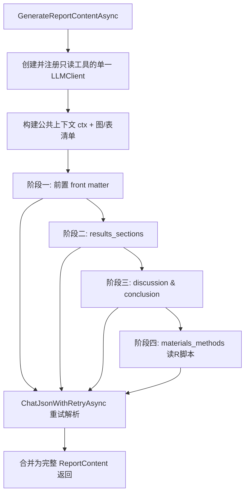

## 用户需求

当前 `Modules\Standard\Module11_Report.vb` 的 `GenerateReportContentAsync` 采用「一次性让 LLM 生成完整报告 JSON 再反序列化为 `ReportContent`」的方式，存在 LLM 思考负担重、目标 JSON 易生成出错导致无法得到有效对象、且缺少错误重试机制的问题。需要重构该函数的报告撰写逻辑。

## 产品概述

在不改变模块对外行为（仍返回完整 `ReportContent` 供 `GenerateAndRunScriptAsync` 生成 HTML/PDF 与 `report.json`）的前提下，将报告内容的生成从「单次全量生成」改为「分阶段增量生成」，并补齐错误重试机制。

## 核心特性

- 分四个阶段复用同一个 `LLMClient` 实例逐步生成报告内容：

1. 阶段一（前置部分）：依据结果数据、各模块段落总结、研究主题，生成 标题 / 摘要 / 关键词 / 引言；
2. 阶段二（结果章节）：生成每个分析模块的 `results_sections` 文本（含图/表引用，LLM 通过 `peek_csv` 预览表格后选取）；
3. 阶段三（讨论与结论）：生成 讨论 与 结论；
4. 阶段四（材料与方法）：指示 LLM 阅读工作区中保存的 R 脚本文件（位于 `_context.TmpDir` 与各模块 scripts 目录、`_context.ScriptsDir`），生成 `materials_methods` 文本。

- 每个阶段将解析出的 JSON 合并填入同一个 `ReportContent` 对象，最终返回完整报告对象。
- 每个阶段均内置错误重试机制（解析失败则追加纠正提示重新生成），确保最终返回有效的 `ReportContent`。

## 技术栈

- 语言/框架：VB.NET（Microsoft.VisualBasic，.NET，现状项目沿用）
- LLM 客户端：`Ollama.LLMClient`（通过 `_config.CreateLLMClient(...)` 创建；同一实例多次 `Chat` 保持对话上下文）
- 数据模型：`Knowledge/ReportData.vb` 中的 `ReportContent` / `ResultSection` / `TableFigureCaption`
- 文件工具：`AnalysisModuleBase.RegisterFileTools(llm, allowWriteFile:=False)` 提供的只读工具（`read_file`、`list_tree`、`peek_csv`、`list_files` 等）
- JSON 解析：`Microsoft.VisualBasic.Serialization.JSON` 的 `LoadJSON(Of ReportContent)`（部分字段 JSON 可正确填充，缺失字段保持默认）

## 实现方案

### 总体策略

保持 `GenerateReportContentAsync` 的签名不变（参数 `conclusions, figures, tables, cancellationToken`，返回值 `Task(Of ReportContent)`），在其内部用单一 `Using llm ... End Using` 复用同一个 LLM 对象，按 4 个阶段依次 `llm.Chat(...)`，每阶段把返回的 JSON 解析为「部分填充的 `ReportContent`」并合并到最终对象，最终返回合并后的完整对象。

### 关键决策与权衡

1. **复用同一 LLM 实例（用户明确要求）**：四个阶段在同一 `llm` 上连续调用，后一阶段天然拥有前一阶段的上下文（利于讨论/结论与材料方法引用前文）。代价是上下文 token 持续增长，但这是需求预期内的取舍，且各阶段 JSON 仅含当阶段字段，单轮输出规模远小于原全量 JSON，显著降低单次生成出错概率。
2. **分阶段 JSON + 字段级合并**：各阶段仅产出自身相关字段的 JSON（如阶段一仅 `title/abstract/keywords/introduction`），用 `LoadJSON(Of ReportContent)` 反序列化后按字段写入最终 `report`。`ReportContent` 模型无需改动，向后兼容 `BuildHtmlReport` 与 `report.json` 产出。
3. **重试机制对齐既有模式**：仿照 `AnalysisModuleBase.GeneratePlanAsync`（第165-222行）的 `For retry_round` 循环——解析失败时追加「你的 JSON 无效，请仅返回合法 JSON」类纠正提示再次 `llm.Chat`，直至解析成功或耗尽重试。统一封装为私有助手 `ChatJsonWithRetryAsync`，避免四段重复代码，符合 DRY。
4. **材料与方法阶段读取 R 脚本**：仅在阶段四额外在 prompt 中给出 `_context.TmpDir` 与 `_context.ScriptsDir` 路径，要求 LLM 用 `list_tree`/`list_files` 定位 `.R` 脚本并用 `read_file` 阅读后撰写方法学文本（读工具已在 `RegisterFileTools(False)` 中注册）。

### 性能与可靠性

- 复杂度：4 次主调用 + 每阶段最多 N 次重试（建议 `MaxReportStageRetries = 3`），最坏约 16 次 LLM 调用；相比一次超大 JSON，单次输出更短、更易解析，整体失败率更低。
- 容错：某阶段耗尽重试时该部分保留默认空值并写日志告警，其余阶段已生成内容仍保留，确保最终 `ReportContent` 始终有效、`BuildHtmlReport` 不崩溃（至少保证 `title` 有默认值）。
- 取消：各阶段 `llm.Chat` 均传递 `cancellationToken`，并在阶段间检测 `IsCancellationRequested` 提前退出。

## 实现要点（防回归）

- 保留并复用既有 `BuildContextInfo()`、`RegisterFileTools(llm, allowWriteFile:=False)`、`LogInfo`、`Workspace` 等基类能力，不引入新工具注册方式。
- 图/表可用文件清单（`figures`/`tables` 参数）与 `peek_csv` 预览提示需在阶段二 prompt 中完整保留，否则结果章节图/表引用失效。
- 每阶段原始 `resp.output` 仍落盘（如 `report_stage1.txt`...）便于排错，但不改变既有 `report.txt`/`report.json` 的既有产出路径与逻辑。
- 阶段间合并采用字段级赋值，避免用「整体覆盖」导致已生成内容被默认空值冲掉。

## 架构设计

保持不变的分层结构：`ReportModule` 继承 `AnalysisModuleBase`，`GenerateReportContentAsync` 仅作为内部私有函数重构。新增 4 个私有阶段函数与 1 个重试助手，均挂载在 `ReportModule` 内部，不新增模块、不改动基类与模型。



## 目录结构

```
src/
└── Modules/
    └── Standard/
        └── Module11_Report.vb   # [MODIFY] 重构 GenerateReportContentAsync：
                                 #   1) 单一 Using llm 中注册只读文件工具；
                                 #   2) 抽取公共上下文 ctx（BuildContextInfo + conclusions + 图/表清单）；
                                 #   3) 顺序调用 4 个阶段私有函数（均复用同一 llm）；
                                 #   4) 字段级合并为最终 ReportContent 返回；
                                 #   5) 新增私有函数：GenerateFrontMatterAsync /
                                 #      GenerateResultsSectionsAsync / GenerateDiscussionConclusionAsync /
                                 #      GenerateMethodologyAsync / ChatJsonWithRetryAsync。
                                 #   不改变调用方 GenerateAndRunScriptAsync 与 report.json/report.txt 产出。
```

## 关键代码结构

```
' 统一重试助手：解析失败时追加纠正 prompt 重新生成，返回部分填充的 ReportContent
Private Async Function ChatJsonWithRetryAsync(
    llm As LLMClient,
    initialPrompt As String,
    correctionPrompt As String,
    stageLabel As String,
    cancellationToken As CancellationToken) As Task(Of ReportContent)

' 四个阶段生成函数（均复用同一 llm，返回部分填充的 ReportContent）
Private Async Function GenerateFrontMatterAsync(llm As LLMClient, ctx As String, conclusions As Dictionary(Of Integer, String), cancellationToken As CancellationToken) As Task(Of ReportContent)
Private Async Function GenerateResultsSectionsAsync(llm As LLMClient, ctx As String, conclusions As Dictionary(Of Integer, String), figures As ResourceFile(), tables As ResourceFile(), cancellationToken As CancellationToken) As Task(Of ReportContent)
Private Async Function GenerateDiscussionConclusionAsync(llm As LLMClient, ctx As String, cancellationToken As CancellationToken) As Task(Of ReportContent)
Private Async Function GenerateMethodologyAsync(llm As LLMClient, ctx As String, cancellationToken As CancellationToken) As Task(Of ReportContent)
```