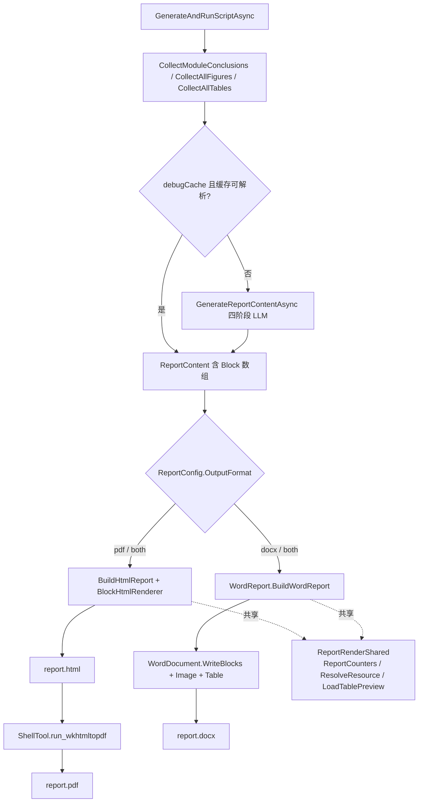

## 用户需求

将科研分析 Agent 的最终报告模块（`Modules/Standard/Module11_Report.vb`）的内容生成方式，从「LLM 直出 markdown 纯文本」升级为「LLM 直出结构化内容块（Block）数组」，并在报告输出环节新增一条可选的 Word（docx）导出路径，与现有的 HTML → PDF 路径并存，由运行时配置决定走哪条路径。

## 产品概述

报告模块负责汇总全流程各分析模块的结论文本、插图（PNG）与数据表（CSV），调用 LLM 分四个阶段（前置部分 / 结果章节 / 讨论结论 / 材料与方法）撰写一份完整的中文研究论文初稿。

现状痛点：LLM 生成的 markdown 纯文本经常出现语法错误（标题层级错乱、列表缩进异常、表格管道符不齐、代码围栏未闭合等），渲染为 HTML 后排版混乱，最终 PDF 质量不可控。

改造后：报告正文以「结构化内容块数组」承载，每个块显式声明自己的类型（标题 / 段落 / 列表 / 表格 / 引用 / 代码 / 分隔线等）及其专属字段，LLM 不再需要拼写 markdown 语法，从根源消除语法错误；同时新增 Word 文档输出路径，产出可直接编辑、带原生目录与图表编号的 docx 稿件。

## 核心功能

### 1. 报告内容模型结构化

- 报告正文的五个部分——引言、材料与方法、结果章节正文、讨论、结论——由纯文本字符串升级为结构化内容块数组。
- 标题、摘要、关键词、图表引用（文件名、中英文图注、展示字段）等元信息保持原有形态不变。
- 每个内容块自带类型标识与配套字段，块之间平级排列，不做嵌套。

### 2. LLM 提示词升级

- 四个生成阶段的提示词全部改写为「输出内容块数组」的形式，附带块类型清单、字段约定与示例。
- 保留并强化现有的「解析失败自动重试 + 纠错追加提示」机制，重试时明确指出块结构的合法性要求。
- 顺带修正现有提示词中「figure_tables 属性」与实际字段（figures / tables 两个数组）不一致的矛盾描述。

### 3. 双输出路径与运行时切换

- **HTML 路径（保留）**：内容块 → HTML 片段 → 完整 HTML 文档 → wkhtmltopdf → PDF，视觉效果与现有产出保持一致（封面、目录、摘要、编号章节、图注表注）。
- **Word 路径（新增）**：内容块 → Word 文档对象 → docx 文件，包含文档元数据、A4 页面、分级标题样式、原生目录域、分页、插图与配套中英文图注、CSV 表格渲染。
- 输出格式由配置文件与命令行参数共同决定，支持仅 HTML/PDF、仅 Word、或两者同时输出。

### 4. 图表处理一致性

- 两条路径共用同一套图表编号计数器，保证「图 1 / 表 1 …」在全文连续且两种输出结果编号一致。
- 图片在 HTML 路径中以内嵌数据形式呈现，在 Word 路径中以真实文件路径插入。
- CSV 表格在两条路径中均按声明字段过滤列、取前若干行渲染，读取失败时给出占位提示而非中断。

## 视觉效果

- **Word 文档**：A4 纵向、一英寸边距；一级标题深蓝加粗大号、二三级标题依次递减；正文中文黑体西文 Calibri、1.5 倍行距、首行缩进两字符；表格深蓝表头白字加粗、隔行浅蓝底纹、细边框；插图居中并附「图 N：中文图注 / Figure N: English caption」双语说明；文档开头为大标题封面页与自动生成的原生目录，各主要章节间分页。
- **HTML/PDF**：完全沿用现有样式表与版式，改造前后肉眼不可辨差异。

## 技术栈

沿用现有工程配置，不引入任何新的第三方依赖：

- **语言 / 框架**：VB.NET，`net10.0`，`OptionStrict Off` / `OptionInfer On`（见 `OmicsAgent.vbproj`）
- **内容块模型**：`Microsoft.VisualBasic.MIME.text.markdown.JSONSchema.Block`（来自已引用的 `markdown.NET5.vbproj`）
- **Word 生成**：`Microsoft.VisualBasic.MIME.Office.WordDocument`（来自已引用的 `WordDocument.vbproj`，**项目引用已存在，无需新增**）
- **JSON 解析**：现有 `LenientJsonParser.ParseJSON(...).CreateObject(Of T)` + `JsonContract.GetJson(...)`
- **配置体系**：sciBASIC INI 映射（`<ClassName>` + `<DataFrameColumn>`），命令行 `<Opt>` 特性
- **CSV 读取**：现有 `DataFrameResolver.Load(...)`

## 实现思路

### 总体策略

核心思想是**把「markdown 文本」这一脆弱的中间表示，替换为「Block 数组」这一强类型中间表示**，让 Block 数组成为两条渲染路径的**唯一公共数据源**：

```
LLM ──(Block JSON)──> ReportContent(Block()) ──┬──> BlockHtmlRenderer ──> HTML ──> wkhtmltopdf ──> PDF
                                                └──> WordDocument.WriteBlocks ──> docx
```

这样做的三个关键收益：

1. **消除语法错误**：LLM 输出 `{"type":"heading","level":2,"content":"..."}` 而非 `## ...`，格式合法性由 JSON schema 保证，而非由 LLM 的 markdown 拼写能力保证。
2. **渲染器可插拔**：新增输出格式（如 LaTeX、EPUB）只需实现一个 Block 消费者，不触碰 LLM 层。
3. **两条路径视觉一致**：同一份 Block 数组驱动，章节结构、图表编号天然对齐。

### 关键技术决策

**决策 1：`ResultSection.content` 升级为 Block 数组，其余元信息字段保持 String**

用户表述为「results_sections 升级为 Block 数组」，实际落点应是每个 section 的**正文** `content` 字段。理由：`ResultSection` 还携带 `module_index` / `title` / `figures` / `tables` 四个结构化元信息字段，这些字段驱动图表匹配与章节编号逻辑（`BuildResultsSection` 中按 `res.figures` 文件名匹配），若整体扁平化为 Block 数组会丢失图表绑定关系。因此保留 `ResultSection` 外壳，仅正文块化。

同理，`title` / `abstract` / `keywords` 保持 String / String() —— 它们是单行元信息，不存在 markdown 语法风险，块化只会徒增 LLM 负担与 token 消耗。

**决策 2：新建 `BlockHtmlRenderer`，而非改造 `MarkdownRender`**

现有 `HtmlReport.EscapeHtml` 内部走 `Static markdown As New MarkdownRender : markdown.Transform(text)`。模型块化后，这条路径失去输入。

方案对比：

- ~~Block → markdown 文本 → MarkdownRender → HTML~~：绕回 markdown 中间表示，等于把刚消除的语法风险又引回来（Block 内容中若含 `*`、`_`、`|` 等字符仍会被误解析），**否决**。
- **Block → HTML 直接渲染**：新增 `Knowledge/BlockHtmlRenderer.vb`，逐块 switch 输出 HTML 片段，纯文本部分做 HTML 实体转义。语义精确、无二次解析、复杂度 O(n)，**采用**。

实施前需先确认 `G:/GCModeller/src/runtime/sciBASIC#/mime/text%markdown/JSONSchema/BlockRenderer.vb`（18.13 KB）与 `JSONRenderer.vb`（8.59 KB）是否已暴露 Block → HTML 的公开 API：

- **若已提供**（例如 `BlockRenderer.RenderHTML(blocks)` 之类）→ 直接复用，`BlockHtmlRenderer.vb` 退化为一层薄封装，仅补充报告特有的 section 包裹与转义策略；
- **若仅提供 Block → markdown** → 自行实现 Block → HTML，输出与现有 `report.css` 类名兼容的标签结构。

这是本方案唯一的待验证点，已列为 todolist 第一项，**必须在动手改代码前完成核对**，避免重复造轮子。

**决策 3：抽取 `ReportRenderContext` 共享图表编号，两条路径复用**

现有 `ReportCounters`（`figureNo` / `tableNo`）以引用类型在章节间共享实现全文连续编号。Word 路径必须复用同一机制，否则两种输出的「图 3」可能指向不同图片。

做法：将 `ReportCounters` 从 `HtmlReport` 提升为 `Knowledge/ReportRenderShared.vb` 中的公共类型，同时把「按文件名在 `res.figures` / `res.tables` 中匹配资源、找不到则回退到 `fig.file.FileExists`」这段图表解析逻辑抽成共享函数 `ResolveResource(caption, pool)`，供 HTML / Word 两个渲染器调用。这是纯提取重构，不改变现有行为。

**决策 4：CSV 表格读取逻辑共享，避免 N+1 重复 IO**

`BuildTable` 中 `DataFrameResolver.Load` + 列过滤 + `Rows.Take(9)` 这段逻辑，Word 路径同样需要。抽成共享函数 `LoadTablePreview(file, fields, maxRows) As (headers As String(), rows As String()())`，返回中性数据结构，HTML 渲染器拼 `<table>`，Word 渲染器直接喂给 `doc.Table(headers, rows, alignments)`（该重载已存在，签名为 `Table(headers As String(), rows As String()(), Optional alignments As String() = Nothing)`）。

性能上，同一 CSV 在单次报告生成中最多被读一次（每个 section 的 table 声明各自对应不同文件），无需额外缓存；若配置为「同时输出 HTML 与 Word」，则会读两次——考虑到 CSV 数量为个位数、每次仅取前 9 行，可接受，不引入缓存以免增加复杂度（YAGNI）。

**决策 5：配置项放在新增 `[report]` 段，命令行可覆盖**

新增 `<ClassName("report")> Public Class ReportConfig`，含 `<DataFrameColumn("format")> Public Property OutputFormat As String = "pdf"`，取值 `pdf` / `docx` / `both`。理由：

- 沿用项目既有的 `<ClassName>` + `<DataFrameColumn>` INI 映射模式，与 `ToolConfig` / `AnalysisConfig` 等完全一致；
- 不塞进 `[tools]`（那里是可执行文件路径）或 `[analysis]`（那里是算法阈值），语义独立；
- 默认值 `pdf` 保证**现有用户零感知升级**，不改配置文件行为完全不变。

同时在 `AppRuntime/Opts.vb` 新增 `<Opt("--report-format")> Public Property report_format As String`，优先级高于 INI，便于命令行快速切换与调试。

**决策 6：`report.json` 缓存版本容错**

模型变更后旧缓存 JSON 中 `introduction` 是 String，新模型期望数组，`LoadJSON(Of ReportContent)` 会抛异常或产出脏数据。

现有 `debugCache` 分支代码为：

```
If debugCache AndAlso reportCache.FileExists AndAlso (reportContent = reportCache.LoadJSON(Of ReportContent)) IsNot Nothing Then
```

需用 `Try...Catch` 包裹，解析失败或关键字段为空时记录日志并**自动回退到重新生成**，而非崩溃。这是低成本高收益的健壮性保障。

### 性能与可靠性

- **复杂度**：Block 渲染 O(总块数)，CSV 读取 O(表数 × 9 行)，图片 IO O(图片数)。整体远低于 LLM 调用耗时，非瓶颈。
- **主要瓶颈仍是 LLM 调用**：四阶段串行 + 每阶段最多 3 次重试。Block 化后 JSON 结构更复杂，首次解析成功率可能略降，因此**必须强化提示词的 schema 描述与示例**（附完整块类型表 + 最小示例），把重试概率压回来。可参考 `G:/GCModeller/src/runtime/sciBASIC#/mime/text%markdown/JSONSchema/LLMPrompt.md` 中已经写好的成熟提示词模板，直接裁剪复用。
- **健壮性**：Block 数组为空 / `type` 未知 / 图片文件缺失 / CSV 加载失败，均需静默降级（跳过或输出占位文本）并 `LogInfo` 记录，绝不让单个坏块中断整份报告生成。`WordDocument.Image` 本身已有文件不存在的警告与跳过逻辑，`WriteBlock` 对未知 type 亦有兜底。
- **日志**：复用现有 `LogInfo` / `_logger`，不引入新日志设施；只记录文件路径与错误摘要，不打印完整 LLM 响应体（原始响应已单独落盘至 `report_{stage}.txt`，保持不变）。

### 技术债控制

- 严格复用现有模式：`<Extension>` + `Module` 的扩展方法风格、`Friend` 可见性、`ChatJsonWithRetryAsync` 泛化后的重试骨架、INI 配置映射写法。
- **不删除、不重命名**任何现有公开成员；`BuildHtmlReport` 签名保持不变，仅内部实现适配 Block。
- 不做无关重构：`CollectModuleConclusions` / `CollectAllFigures` / `CollectAllTables` 三个收集函数完全不动。

## 实施要点

1. **先验证再编码**：动手前必须先读 `BlockRenderer.vb` / `JSONRenderer.vb` 的公开签名，确认是否已有 Block → HTML 能力。这决定了 `BlockHtmlRenderer.vb` 是「薄封装」还是「完整实现」，影响后续所有工作量估算。

2. **命名空间确认**：`JSONSchema.Block` 的完整命名空间需从 `markdown.NET5.vbproj` 的 `RootNamespace` 推定。测试代码 `test/Program.vb` 中的用法是 `Imports Microsoft.VisualBasic.MIME.text.markdown` 后直接写 `JSONSchema.Block`，`Knowledge/HtmlReport.vb` 已有 `Imports Microsoft.VisualBasic.MIME.text.markdown`，可直接沿用同样的 import 方式。

3. **`ChatJsonWithRetryAsync` 保持返回 `ReportContent`**：四个阶段各自只填充 `ReportContent` 的部分字段，现有设计已能承载 Block 数组字段，无需改造成泛型。改动面越小越好。

4. **Word 路径的图表插入时机**：`WriteBlocks` 只消费 Block 数组，不认识 `figures` / `tables` 元信息。因此 Word 渲染器需要**按 section 手工编排**：先 `WriteBlocks(section.content)`，再遍历 `section.figures` 调 `doc.Image(路径, width:=450, caption:=$"图 {n}：{caption_cn}")`，再遍历 `section.tables` 调 `doc.Table(...)` 并在前面用 `doc.Paragraph` 写表注。顺序与 HTML 路径的 `BuildResultsSection` 严格一致（先图后表）。

5. **图片路径差异**：HTML 路径用 `New DataURI(figPath.filename).ToString` 内嵌 base64；Word 路径**必须传真实磁盘路径**——`WriteBlock` 的 image 分支与 `Image()` 方法均以 `File.Exists` 为前提，传 DataURI 会被判定为文件不存在而降级成占位文本。

6. **Word 目录用原生域**：`doc.Toc(maxLevel:=3)` 生成 Word 原生 TOC field，替代 HTML 路径中手写的 `BuildTableOfContents`。注意 Word 打开时需用户手动刷新域才显示页码，这是 OOXML 的固有行为，属预期表现。

7. **样式配置集中**：Word 文档的 `HeadingStyle` / `ParagraphStyle` / `TableStyle` 配置较长，应集中在 `WordReport.vb` 的一个私有函数 `ApplyReportStyles(doc)` 中，参考 `test/Program.vb` 的 `DemoFullFeatures` 写法，便于后续统一调整。

8. **`config.ini.template` 同步**：新增 `[report]` 段需按现有风格补齐中文注释（说明三个取值含义及默认值），否则用户无从得知新配置项存在。

9. **向后兼容验证清单**：不改配置 → 行为与改造前完全一致（仅出 PDF）；旧 `report.json` 缓存 → 自动失效重生成，不崩溃；`--report-format docx` → 只出 docx，不调用 wkhtmltopdf。

## 架构设计

### 数据流



### 分层职责

| 层次 | 组件 | 职责 |
| --- | --- | --- |
| 数据模型 | `Knowledge/ReportData.vb` | `ReportContent` / `ResultSection` 结构定义，正文字段为 `Block()` |
| 内容生成 | `Modules/Standard/Module11_Report.vb` | 四阶段 LLM 调用、Block JSON 提示词、解析重试、缓存容错 |
| 共享渲染基础 | `Knowledge/ReportRenderShared.vb` | 图表编号计数器、资源文件匹配、CSV 预览加载 |
| HTML 渲染 | `Knowledge/HtmlReport.vb` + `Knowledge/BlockHtmlRenderer.vb` | Block → HTML 片段，组装完整 HTML 文档 |
| Word 渲染 | `Knowledge/WordReport.vb` | Block → docx，样式配置、目录、图表编排 |
| 配置 | `AppRuntime/ConfigInf.vb` / `Opts.vb` / `config.ini.template` | 输出格式开关，INI + 命令行双通道 |


### 关键设计原则落地

- **SRP**：内容生成（LLM）、内容渲染（HTML/Word）、资源解析（图表/CSV）三者彻底分离。
- **OCP**：新增输出格式只需新建一个 Block 消费者 + 配置枚举值，不修改现有渲染器。
- **DRY**：图表编号、资源匹配、CSV 加载三段逻辑单点定义，两条路径共享。
- **KISS**：不引入渲染器抽象基类 / 工厂 / 注册表——当前仅两条路径，`Select Case` 分支足够清晰；待第三种格式出现时再抽象（YAGNI）。

## 目录结构

### 变更摘要

本次改造涉及 **3 个新增文件** 与 **5 个修改文件**，全部位于 `g:/OmicsWorks/src` 内。依赖库（GCModeller / sciBASIC#）**只读引用，不做任何修改**。

```
g:/OmicsWorks/src/
├── Knowledge/
│   ├── ReportData.vb              # [MODIFY] 报告数据模型。将 ReportContent 的 introduction /
│   │                              #   materials_methods / discussion / conclusion 四个属性，以及
│   │                              #   ResultSection.content，由 String 改为 JSONSchema.Block()。
│   │                              #   保持 title / abstract / keywords / module_index /
│   │                              #   TableFigureCaption 全部字段不变。需在文件顶部添加
│   │                              #   Imports Microsoft.VisualBasic.MIME.text.markdown。
│   │                              #   为各 Block 属性补充 XML 注释，说明其承载的章节语义。
│   │
│   ├── ReportRenderShared.vb      # [NEW] 两条渲染路径的共享基础设施。内容：
│   │                              #   1) ReportCounters 类（从 HtmlReport.vb 迁出）：figureNo /
│   │                              #      tableNo，引用类型跨章节共享，保证全文连续编号；
│   │                              #   2) ResolveResource(caption As TableFigureCaption,
│   │                              #      pool As ResourceFile()) As ResourceFile：按文件名精确
│   │                              #      匹配，未命中则检查 caption.file 是否为可用绝对路径，
│   │                              #      仍未命中返回 Nothing（调用方跳过）；
│   │                              #   3) LoadTablePreview(file As String, fields As String(),
│   │                              #      Optional maxRows As Integer = 9) 返回中性的
│   │                              #      (headers As String(), rows As String()())：内部用
│   │                              #      DataFrameResolver.Load 读取，fields 为空取全列，
│   │                              #      否则按 GetOrdinal 过滤出存在的列；异常时返回空并由
│   │                              #      调用方输出占位。逻辑完整搬移自现 BuildTable，行为不变。
│   │
│   ├── BlockHtmlRenderer.vb       # [NEW] Block 数组 → HTML 片段渲染器。
│   │                              #   入口 RenderBlocks(blocks As Block(), sb As StringBuilder)。
│   │                              #   【前置】先核对 GCModeller 的 BlockRenderer.vb /
│   │                              #   JSONRenderer.vb 是否已提供 Block→HTML 公开 API：若有则本
│   │                              #   文件退化为薄封装直接委托；若无则自行实现，按 type 分支处理
│   │                              #   heading(输出 h1~h6，level 钳制到 1-6) / paragraph(p) /
│   │                              #   list(ol|ul + li) / table(table+thead+tbody，按 alignments
│   │                              #   设置 text-align) / blockquote / code(pre+code，附
│   │                              #   language class) / hr / image(img) / link(a) /
│   │                              #   tasklist(带 checkbox 的 ul) / deflist(dl+dt+dd)。
│   │                              #   所有文本内容统一走 HTML 实体转义，防标签注入；
│   │                              #   未知 type 降级为 paragraph；blocks 为 Nothing/空时输出空串。
│   │                              #   输出标签结构须与现有 report.css 的选择器兼容。
│   │
│   ├── HtmlReport.vb              # [MODIFY] HTML 报告构建。改动点：
│   │                              #   1) 移除内部 ReportCounters 定义，改引用 ReportRenderShared；
│   │                              #   2) BuildStandardSection 的 body 参数由 String 改为 Block()，
│   │                              #      内部改调 BlockHtmlRenderer.RenderBlocks；
│   │                              #   3) BuildResultsSection 中 section.content 的渲染同样改为
│   │                              #      BlockHtmlRenderer；图表匹配逻辑改调共享 ResolveResource；
│   │                              #   4) BuildTable 内的 CSV 读取改调共享 LoadTablePreview，仅保留
│   │                              #      HTML 标签拼装部分；
│   │                              #   5) EscapeHtml 中基于 MarkdownRender.Transform 的实现废弃
│   │                              #      （abstract 字段若保持 String 则保留一个纯转义版本）；
│   │                              #   6) EscapeText / BuildDocumentHead / BuildCoverPage /
│   │                              #      BuildTableOfContents / BuildAbstractSection / BuildFigure
│   │                              #      保持原样。BuildHtmlReport 对外签名不变。
│   │
│   └── WordReport.vb              # [NEW] Word docx 报告构建器，参考 test/Program.vb 的
│                                  #   DemoFullFeatures + DemoBlockModel 写法。内容：
│                                  #   1) <Extension> Friend Function BuildWordReport(
│                                  #      content As ReportContent, res As ReportResource,
│                                  #      outFile As String, loginfo As Action(Of String))；
│                                  #   2) 私有 ApplyReportStyles(doc)：集中配置 PageSetupA4、
│                                  #      HeadingStyle(1/2/3)、ParagraphStyle(1.5 倍行距+首行缩进)、
│                                  #      TableStyle(深蓝表头+隔行底纹)、CodeStyle、BlockquoteStyle；
│                                  #   3) 编排顺序严格对齐 HTML 路径：DocTitle(title) → 关键词段落
│                                  #      → Toc(3) → PageBreak → 摘要 → H1 引言 + WriteBlocks →
│                                  #      H1 材料与方法 + WriteBlocks → PageBreak → H1 结果 →
│                                  #      逐 section: H2 标题 + WriteBlocks(content) + 逐图
│                                  #      doc.Image(真实路径, width:=450, caption:=图 N 双语) +
│                                  #      逐表 表注段落 + doc.Table(headers, rows, alignments) →
│                                  #      PageBreak → H1 讨论 + WriteBlocks → H1 结论 + WriteBlocks；
│                                  #   4) 图表编号复用共享 ReportCounters，与 HTML 路径一致；
│                                  #   5) 图片必须传磁盘真实路径（WriteBlock/Image 以 File.Exists
│                                  #      为前提，DataURI 会被判为不存在）；文件缺失时 loginfo 记录
│                                  #      并跳过，不中断；
│                                  #   6) 元数据：author 取 "OmicsAgent"，title 取 content.title，
│                                  #      tags 取 content.keywords，subject/description 填研究主题；
│                                  #   7) 末尾 doc.Save(outFile)，全程 Try/Catch 保护并 loginfo。
│
├── Modules/Standard/
│   └── Module11_Report.vb         # [MODIFY] 报告模块主体。改动点：
│                                  #   1) GenerateAndRunScriptAsync：在拿到 ReportContent 后按
│                                  #      _config.Report.OutputFormat（pdf/docx/both）分支——
│                                  #      pdf 分支维持原逻辑（BuildHtmlReport → 存 html →
│                                  #      ShellTool.run_wkhtmltopdf → report.pdf）；docx 分支调
│                                  #      WordReport.BuildWordReport 输出 analysis/report.docx；
│                                  #      both 分支两者都执行。report.json 落盘逻辑保持在分支之外；
│                                  #   2) debugCache 缓存读取用 Try/Catch 包裹，旧格式缓存解析失败
│                                  #      时 LogInfo 提示并回退到重新生成，不抛异常；
│                                  #   3) GenerateFrontMatterAsync：introduction 的 JSON 示例改为
│                                  #      Block 数组（两个 paragraph 块），title/abstract/keywords
│                                  #      保持 String；
│                                  #   4) GenerateResultsSectionsAsync：results_sections[].content
│                                  #      改为 Block 数组；顺带修正提示词中「figure_tables 属性」
│                                  #      与实际 figures/tables 双数组不符的矛盾描述；保留
│                                  #      peek_csv 预览表格字段的引导；
│                                  #   5) GenerateDiscussionConclusionAsync / GenerateMethodologyAsync：
│                                  #      discussion / conclusion / materials_methods 均改为 Block 数组；
│                                  #   6) 新增私有常量 BlockSchemaPrompt：集中存放 Block 类型清单与
│                                  #      字段约定说明（裁剪自 GCModeller 的 LLMPrompt.md），四个阶段
│                                  #      的 prompt 统一插入，避免重复且保证描述一致；
│                                  #   7) 四个 correction 提示词同步更新，明确要求「正文字段必须是
│                                  #      Block 对象数组，每个对象必须含 type 字段」；
│                                  #   8) ChatJsonWithRetryAsync 骨架与 MaxReportStageRetries 不变；
│                                  #   9) CollectModuleConclusions / CollectAllFigures /
│                                  #      CollectAllTables 完全不动。
│
├── AppRuntime/
│   ├── ConfigInf.vb               # [MODIFY] 新增 <ClassName("report")> Public Class ReportConfig，
│   │                              #   含 <DataFrameColumn("format")> Public Property OutputFormat
│   │                              #   As String = "pdf"（取值 pdf / docx / both）。写法严格对齐
│   │                              #   同文件内 ToolConfig / AnalysisConfig 的现有模式，补中文
│   │                              #   XML 注释说明各取值含义。
│   │
│   ├── AgentConfig.vb             # [MODIFY] 在现有 Tools / LLM / MySql / Literature / Analysis
│   │                              #   五个段属性之后，新增
│   │                              #   <DataFrameColumn("report")> Public Property Report As
│   │                              #   New ReportConfig()，保持与其余段属性完全一致的声明风格。
│   │
│   └── Opts.vb                    # [MODIFY] 新增 <Opt("--report-format")> Public Property
│                                  #   report_format As String，用于命令行覆盖 INI 中的输出格式，
│                                  #   优先级高于配置文件。声明风格对齐现有 <Opt> 项。
│
├── config.ini.template            # [MODIFY] 新增 [report] 配置段，按现有各段的中文注释风格，
│                                  #   说明 format 三个取值（pdf = 仅 HTML→PDF，保持原有行为；
│                                  #   docx = 仅 Word 文档；both = 两者都生成）及默认值 pdf。
│
└── Program.vb                     # [MODIFY][条件] 若命令行参数在此处解析并写入 AgentConfig，
                                   #   则需将 --report-format 的值覆盖到 _config.Report.OutputFormat，
                                   #   并对非法取值做校验（回退默认 pdf 并 LogInfo 警告）。
                                   #   若参数注入逻辑实际位于 Workflow.vb 或 AgentConfig 加载处，
                                   #   则改动落在对应文件——实施时以实际调用链为准。
```

## 关键代码结构

改造后的数据模型契约（本次改动的核心，多个模块依赖其精确形态）：

```
Imports Microsoft.VisualBasic.MIME.text.markdown

Namespace ReportData

    Public Class ReportContent
        ''' <summary>报告标题，单行元信息，保持 String</summary>
        Public Property title As String = ""
        ''' <summary>中文摘要，单段文本，保持 String</summary>
        Public Property abstract As String = ""
        Public Property keywords As String()

        ''' <summary>引言正文，结构化内容块数组</summary>
        Public Property introduction As JSONSchema.Block()
        ''' <summary>材料与方法正文，结构化内容块数组</summary>
        Public Property materials_methods As JSONSchema.Block()
        Public Property results_sections As ResultSection()
        ''' <summary>讨论正文，结构化内容块数组</summary>
        Public Property discussion As JSONSchema.Block()
        ''' <summary>结论正文，结构化内容块数组</summary>
        Public Property conclusion As JSONSchema.Block()
    End Class

    Public Class ResultSection
        Public Property module_index As Integer
        ''' <summary>章节标题，单行元信息，保持 String</summary>
        Public Property title As String = ""
        ''' <summary>章节正文，结构化内容块数组</summary>
        Public Property content As JSONSchema.Block()
        Public Property figures As TableFigureCaption()
        Public Property tables As TableFigureCaption()
    End Class

End Namespace
```

共享渲染基础设施的对外契约（HTML / Word 两条路径共同依赖，签名需精确）：

```
' Knowledge/ReportRenderShared.vb
Friend Class ReportCounters
    Public figureNo As Integer = 0
    Public tableNo As Integer = 0
End Class

''' <summary>按文件名在资源池中匹配；未命中则回退检查绝对路径；仍未命中返回 Nothing</summary>
Friend Function ResolveResource(caption As TableFigureCaption,
                                pool As ResourceFile()) As ResourceFile

''' <summary>读取 CSV 预览：按 fields 过滤列（空则全列），最多取 maxRows 行。
''' 失败时返回 headers/rows 均为空数组，由调用方输出占位提示。</summary>
Friend Function LoadTablePreview(file As String,
                                 fields As String(),
                                 Optional maxRows As Integer = 9) As (headers As String(), rows As String()())
```

## Agent Extensions

### SubAgent

- **code-explorer**
- Purpose: 核查 GCModeller 依赖库中 `BlockRenderer.vb` / `JSONRenderer.vb` 已暴露的公开 API，确认是否已具备 Block → HTML 渲染能力；同时确认 `JSONSchema.Block` 的完整命名空间与 `--report-format` 命令行参数在 `Program.vb` / `Workflow.vb` / `AgentConfig.vb` 中的实际注入位置。
- Expected outcome: 明确给出可复用的公开函数签名清单（或确认不存在，需自行实现 Block→HTML）、Block 类型的正确 Imports 写法，以及命令行参数覆盖配置的准确落点文件与行号，据此确定 `BlockHtmlRenderer.vb` 是薄封装还是完整实现。