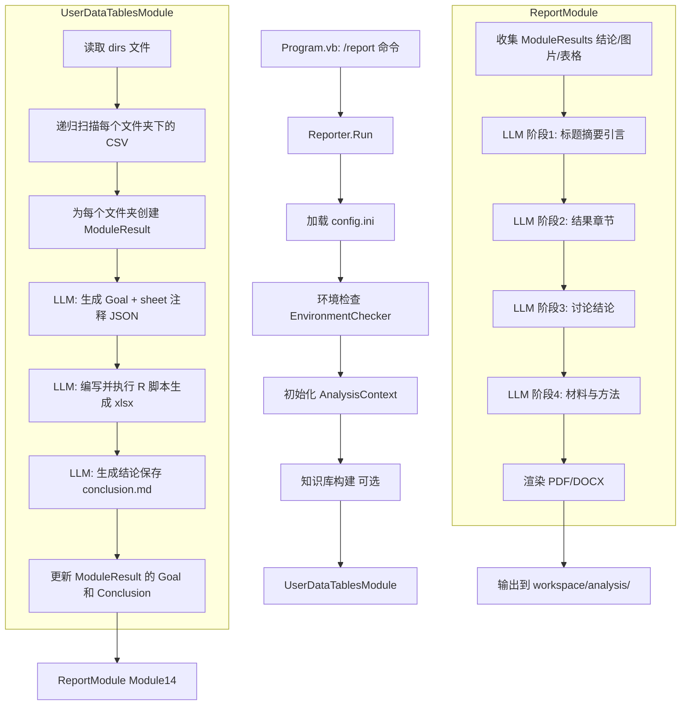

## 用户需求

为基于 LLM 的组学数据分析命令行工具新增 `/report` 数据报告模式。该模式与现有 `/agent` 模式的核心区别在于：LLM agent 不进行数据分析，而是直接处理用户自行分析得到的 CSV 结果表格，整理后生成论文初稿。

## 产品概述

`/report` 模式是面向已有分析结果的用户设计的数据报告工具。用户通过 `--dirs` 参数提供一个文本文件，列出所有存放分析结果 CSV 的文件夹路径。程序自动扫描这些文件夹，使用 LLM 理解数据内容，将杂乱的 CSV 整理为结构化的 xlsx 表格文件，最后以论文格式生成数据分析报告（PDF/DOCX）。

## 核心功能

- **用户数据文件夹扫描**：通过 `--dirs` 参数指定文件夹列表文件，每行一个文件夹路径，程序递归扫描每个文件夹下所有 CSV 文件
- **自动表格整理**：参考 Module13_ResultTables 的逻辑，对每个文件夹组的 CSV 调用 LLM 生成英文列注释 JSON，再调用 LLM 编写 openxlsx R 脚本生成带样式注释的 xlsx 文件（Cambria Math 字体、草绿色注释行、深蓝色表头、冻结窗格等）
- **数据内容理解**：LLM 结合研究主题和知识库，为每组 CSV 数据自动推断分析目标（Goal）和生成数据总结（Conclusion）
- **论文初稿撰写**：复用 Module14_Report 模块，基于整理后的数据表格和总结，分阶段生成包含标题摘要、引言、材料与方法、结果、讨论、结论的完整中文论文报告，支持 PDF 和 DOCX 输出

## 技术栈

- 语言：VB.NET 10.0
- LLM 客户端：Ollama（本地部署）
- R 脚本引擎：Rscript + openxlsx 包（xlsx 表格生成）
- 报告渲染：wkhtmltopdf（PDF）、sciBASIC# DOCX（Word）
- 项目架构：sciBASIC# 生态（DataFrame、JSON、Markdown 等）

## 实现方案

### 整体策略

遵循现有 `/agent` 模式的架构模式，在 `workflow/Reporter.vb` 中实现精简版的报告工作流，新创建一个 `UserDataTablesModule` 专门处理用户杂乱的 CSV 数据，最后复用已有的 `ReportModule`（Module14）生成论文报告。`UserDataTablesModule` 继承 `AnalysisModuleBase`，在 `GenerateAndRunScriptAsync` 中完成：扫描用户文件夹 → 创建 ModuleResult → 生成注释 → 生成 xlsx → 生成结论。

### 关键设计决策

**1. ModuleResult 预创建 vs 模块内创建**
选择在 `UserDataTablesModule.GenerateAndRunScriptAsync` 内部动态创建 ModuleResult 并加入 `_context.ModuleResults`。理由：数据扫描与整理是紧密耦合的操作，放在同一模块内保持了高内聚；且 ReportModule 仅依赖 `_context.ModuleResults` 列表，不关心其来源。

**2. 用户文件夹信息传递**
在 `AnalysisContext` 中新增 `UserDataDirsFile` 属性，由 `Reporter.vb` 在初始化上下文时赋值，`UserDataTablesModule` 通过 `_context.UserDataDirsFile` 读取。理由：符合项目现有的上下文传递模式（与 `ResearchFile`、`ReferenceDir` 等属性一致），避免引入新的参数传递机制。

**3. 环境检查复用**
直接复用 `EnvironmentChecker.CheckAllAsync()`。理由：该方法对 Rsharp 路径缺失做了容错（返回 True），Python 和 R# 虽然在 /report 模式下用不到但检查不会导致失败，无需创建新的精简检查方法。

**4. 注释与 xlsx 生成方式**
沿用 Module13_ResultTables 的两次 LLM 调用模式：第一次调用生成 sheet 注释 JSON，第二次调用编写并执行 R 脚本。额外增加一次 LLM 调用用于生成每个用户数据组的分析目标（Goal）和数据总结（Conclusion）。

### 架构设计



### 数据流

```
用户输入:
  --dirs=folders.txt     →  每行一个文件夹路径
  --research=research.txt  →  研究主题描述

Reporter.vb:
  读取 dirs 文件 → 初始化 AnalysisContext.UserDataDirsFile

UserDataTablesModule:
  读取 UserDataDirsFile → 扫描文件夹 → CSV 列表
  → LLM 生成 Group Goal + Sheet Annotations (JSON)
  → LLM 生成 R 脚本 → Rscript 执行 → xlsx 文件
  → LLM 生成 Conclusion → conclusion.md
  → 更新 ModuleResult.Goal / .Conclusion

ReportModule (Module14):
  遍历 ModuleResults → 读取 conclusion.md
  → LLM 分4阶段生成报告内容块
  → 渲染 HTML → wkhtmltopdf → report.pdf
  → 或渲染 DOCX → report.docx
```

## 实现细节

### 目录结构

```
g:/OmicsWorks/src/
├── src/
│   ├── AppRuntime/
│   │   └── Opts.vb                                          # [MODIFY] 新增 dirs 属性
│   ├── Models/
│   │   └── AnalysisContext.vb                               # [MODIFY] 新增 UserDataDirsFile 属性
│   └── Modules/
│       └── Standard/
│           └── UserDataTablesModule.vb                      # [NEW] 用户数据表格整理模块
├── workflow/
│   └── Reporter.vb                                          # [MODIFY] 完整实现 /report 工作流
```

### 关键代码结构

**Opts.vb 新增属性：**

```
<Opt("--dirs")> Public Property dirs As String
```

**AnalysisContext.vb 新增属性：**

```
''' <summary>用户数据文件夹列表文件路径（/report 模式专用）</summary>
Public Property UserDataDirsFile As String = ""
```

**UserDataTablesModule 核心结构：**

- ModuleName = "User Data Tables Compilation"
- ModuleIndex = 13
- NeedsPlantSteps = False
- GeneratePlanAsync：返回硬编码单步计划
- GenerateAndRunScriptAsync（核心）：

1. 读取 `_context.UserDataDirsFile`，解析每行文件夹路径
2. 递归扫描每个文件夹下的 CSV 文件
3. 过滤掉没有 CSV 的文件夹
4. 为每个有效文件夹组创建 ModuleResult（OutputDir 指向 `workspace/analysis/user_data_N/`，Workdir 指向用户原始文件夹）
5. 遍历每个 ModuleResult：

    - LLM Call 1：结合研究主题和知识库，生成模块分析目标（Goal）+ 每张 sheet 的英文列注释 JSON
    - LLM Call 2：编写 openxlsx R 脚本生成 xlsx（样式与 Module13 一致）
    - LLM Call 3：生成该组数据的阶段性中文总结，保存为 conclusion.md

6. 将每个 ModuleResult 加入 `_context.ModuleResults`

- GenerateConclusionAsync：生成对所有用户数据组的整体总结
- 异常处理：单个文件夹组失败不中断后续组处理

**Reporter.vb 核心流程：**

1. 控制台输出标题
2. 加载 `config.ini`，失败则终止
3. 验证 `--dirs` 和 `--research` 参数
4. 执行 `EnvironmentChecker.CheckAllAsync()`
5. 初始化轻量 AnalysisContext（仅设置 ResearchFile、ResearchTopic、ReferenceDir、WorkspaceDir、UserDataDirsFile，跳过数据集解析、样本对齐等 /agent 专属逻辑）
6. 可选构建知识库（调用 `KnowledgeBaseBuilder`）
7. 实例化并执行 `UserDataTablesModule.RunAsync(cancellationToken)`
8. 实例化并执行 `ReportModule.RunAsync(cancellationToken)`
9. 输出完成信息

### 性能注意事项

- CSV 递归扫描使用 `Directory.GetFiles("*.csv", SearchOption.AllDirectories)`，文件夹数量有限（用户手动指定），无需特殊优化
- 每个用户数据组创建独立 LLMClient 实例（模式与 Module13 一致），避免 token 累积
- 知识库内容在循环外一次性读取并截断到 30000 字符，复用于每个数据组的注释生成
- R 脚本生成后通过 ShellTool 同步执行，保证 xlsx 文件落盘后再进行下一组处理

### 容错与日志

- 复用 `AnalysisModuleBase.LogInfo` 日志方法，统一 `[HH:mm:ss]` 时间戳格式
- 单组 CSV 处理异常时输出警告并 `Continue For`，不阻断其他组
- dirs 文件中的空行和 `#` 开头注释行自动跳过
- 不存在的文件夹路径输出警告并跳过
- ReportModule 本身已对缺失 conclusion.md 做容错（见 `CollectModuleConclusions` 中 `FileExists` 检查）

## Agent Extensions

### SubAgent

- **code-explorer**
- 用途：在编写 UserDataTablesModule 和 Reporter.vb 时，需要读取 Module13_ResultTables.vb、AnalysisModuleBase.vb、KnowledgeBaseBuilder.vb 等参考文件以复用已有的私有方法模式（如 `CollectModuleCsvFiles`、`BuildRScriptPrompt`、`ReadKnowledgeBaseContent` 等）
- 预期结果：准确复用现有代码模式，确保新模块与项目架构风格一致