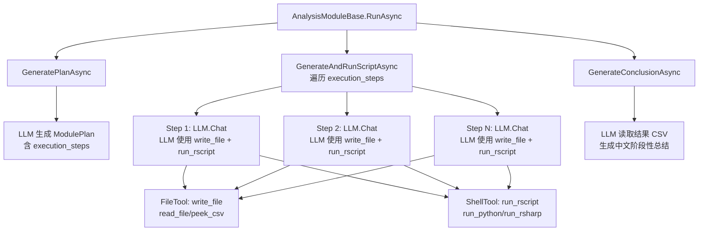

## 用户需求

将 OmicsAgent 智能体项目中 Modules 文件夹下剩余的 7 个分析模块（Module2-9）从旧的执行流程更新为新的执行流程，参考已完成的 `Module1_Preprocessing.vb` 代码模式。

## 产品概述

这是一个用于科研组学数据生信分析的智能体项目。每个分析模块负责一个具体的分析步骤（预处理、PCA、差异分析、KEGG富集、WGCNA等），通过 LLM 驱动完成分析计划生成、脚本编写与执行、阶段性总结的全流程。

## 核心功能

- **新流程核心**：LLM 生成分析计划时分解为 `execution_steps`，然后逐步执行——LLM 通过注册的函数调用工具（`write_file`、`run_rscript` 等）在工作区内编写并执行脚本，最后基于结果 CSV 文件生成阶段性总结
- **标准模块更新（Module2-7）**：将 GeneratePlanAsync 的 JSON schema 增加 `execution_steps`；将 GenerateAndRunScriptAsync 从手动提取代码块+手动执行改为纯 LLM 函数调用模式
- **特殊模块适配（Module8-9）**：保留 VB.NET 数据收集逻辑（CSV分组、图表收集等），将脚本生成与执行部分改造为 LLM 函数调用模式，计划中加入 `execution_steps`

## 技术栈

- **语言**: VB.NET (.NET 10)
- **LLM 框架**: Ollama (LLMClient)，支持 Function Calling
- **工具集**: FileTool（write_file/read_file/peek_csv/list_files等）+ ShellTool（run_rscript/run_python/run_rsharp/run_wkhtmltopdf）
- **分析脚本**: R 语言（生信分析）+ wkhtmltopdf（报告PDF转换）

## 实现方案

### 核心策略

参考 `Module1_Preprocessing.vb` 的已完成模式，对每个模块的三个抽象方法进行统一改造：

**GeneratePlanAsync 改造点：**

- JSON schema 中增加 `"execution_steps": [{{"action": "...", "goal": "..."}}, ...]`
- 错误处理统一使用 `plan.module_name = ModuleName`（小写字段名，匹配 ModulePlan 模型）

**GenerateAndRunScriptAsync 改造点：**

- prompt 中增加三要素：`current plan execution step: {[step].GetJson`、`All scripts and the generated CSV files are placed in this designated temporary workspace folder: {Workspace.GetDirectoryFullPath}`、`All pdf/png figure image files should save to workspace folder: {FiguresDir.GetDirectoryFullPath}`
- 任务描述从 "Write the complete R script. Use \`\`\`r ... \`\`\` code block." 改为 "Write and execute R script to..."
- 移除全部手动代码：`resp.ExtractCodeBlock("r")`、`rCode.SaveTo(scriptFile)`、`plan.RScriptContent = rCode`、`plan.RScriptFile = scriptFile`、`shell.run_rscript(...)` — 这些引用的 `RScriptContent`/`RScriptFile` 属性已从 ModulePlan 模型中移除，当前会导致编译错误
- 方法体仅保留 `Await llm.Chat(prompt, cancellationToken)`，依赖已注册的函数调用工具完成脚本编写与执行

**GenerateConclusionAsync 改造点：**

- 标准模块（2-7）基本保持不变（已使用 `plan.ToJson()` + `llm.Chat` + `Return resp.output` 模式）
- 确保结论提示词中引用正确的输出目录路径

### Module 8 适配方案（保留VB逻辑+新流程）

- **保留**: `CollectResultCsvFiles()`、`GroupCsvByTheme()`、`GetCsvHeader()`、`GenerateAnnotationsAsync()`、`ThemeDisplayName()`、`SanitizeSheetName()` 等全部 VB.NET 辅助方法
- **GeneratePlanAsync**: 增加 `execution_steps` 到 JSON schema
- **GenerateAndRunScriptAsync**: 保留 CSV 收集+分组+注释生成逻辑，将 `BuildRScriptPrompt` 的返回提示词改造——移除 "Write the complete R script inside a \`\`\`r ... \`\`\` code block."，增加 step 信息+工作区路径+工具使用指引，最后用 `Await llm.Chat(prompt, cancellationToken)` 替代手动提取/保存/执行
- **GenerateConclusionAsync**: 保持不变（返回静态总结文本）

### Module 9 适配方案（保留VB逻辑+新流程）

- **保留**: `CollectModuleConclusions()`、`CollectAllFigures()`、`CollectAllTables()`、`GenerateReportContentAsync()`、`BuildHtmlReport()` 等全部 VB.NET 辅助方法
- **GeneratePlanAsync**: 增加 `execution_steps` 到 JSON schema
- **GenerateAndRunScriptAsync**: 保留数据收集+报告内容生成+HTML构建逻辑，VB 保存 HTML 文件后，构造包含 step 信息+工作区路径+HTML/PDF 路径的提示词，让 LLM 通过 `run_wkhtmltopdf` 函数调用工具完成 PDF 转换，替代手动 `shell.run_wkhtmltopdf(...)`
- **GenerateConclusionAsync**: 保持不变（返回静态总结文本）

## 实现注意事项

- **编译修复**: Module2-7 当前引用 `plan.RScriptContent`/`plan.RScriptFile`（已从 ModulePlan 移除），更新后即修复编译错误
- **属性名一致性**: Module1 使用小写字段名 `plan.module_name`，Module2-7 部分使用 `plan.ModuleName`（VB.NET 大小写不敏感，均可编译，但统一为小写更清晰）
- **JSON 双花括号**: VB 插值字符串中 JSON 花括号需用 `{{` `}}` 转义，参考 Module1 写法
- **工具已注册**: 基类 `RegisterTools` 已在 `GenerateAndRunScriptAsync(plan, token)` 的包装方法中为每个 step 的 LLMClient 注册了全部工具，子类无需重复注册
- **逐步执行**: 基类已实现对 `plan.execution_steps` 的遍历，每个 step 创建独立 LLMClient 并调用子类的 `GenerateAndRunScriptAsync(llm, plan, step, token)`，子类只需在 prompt 中引用 `[step].GetJson`
- **Module 8 幂等性**: 基类对每个 step 调用一次 GenerateAndRunScriptAsync，Module 8 的 CollectResultCsvFiles/GroupCsvByTheme 是只读操作可安全重复调用；但注释生成和 XLSX 生成应通过 step 的 action/goal 区分执行内容

## 架构设计



## 目录结构

```
g:\OmicsWorks\src\
├── Modules/
│   ├── Module1_Preprocessing.vb          # [参考] 已完成新流程更新，作为模板
│   ├── Module2_PCA.vb                    # [MODIFY] PCA/PLSDA/OPLSDA分析模块
│   │   - GeneratePlanAsync: JSON增加execution_steps
│   │   - GenerateAndRunScriptAsync: 移除手动提取/保存/执行，改为纯llm.Chat函数调用
│   │   - GenerateConclusionAsync: 保持不变
│   ├── Module3_ComparisonDesign.vb       # [MODIFY] 比对组别设计模块
│   │   - GeneratePlanAsync: JSON增加execution_steps（保留comparisons字段）
│   │   - GenerateAndRunScriptAsync: 移除手动提取/保存/执行，改为纯llm.Chat函数调用
│   │   - GenerateConclusionAsync: 保持不变
│   ├── Module4_Limma.vb                  # [MODIFY] LIMMA差异分析模块
│   │   - GeneratePlanAsync: JSON增加execution_steps
│   │   - GenerateAndRunScriptAsync: 移除手动提取/保存/执行，改为纯llm.Chat函数调用
│   │   - GenerateConclusionAsync: 保持不变
│   ├── Module5_KEGG.vb                   # [MODIFY] KEGG功能分析模块
│   │   - GeneratePlanAsync: JSON增加execution_steps
│   │   - GenerateAndRunScriptAsync: 移除手动提取/保存/执行，改为纯llm.Chat函数调用
│   │   - GenerateConclusionAsync: 保持不变
│   ├── Module6_WGCNA.vb                  # [MODIFY] WGCNA性状关联分析模块
│   │   - GeneratePlanAsync: JSON增加execution_steps
│   │   - GenerateAndRunScriptAsync: 移除手动提取/保存/执行，改为纯llm.Chat函数调用
│   │   - GenerateConclusionAsync: 保持不变
│   ├── Module7_Advanced.vb               # [MODIFY] 进阶分析模块
│   │   - GeneratePlanAsync: JSON增加execution_steps
│   │   - GenerateAndRunScriptAsync: 移除手动提取/保存/执行，改为纯llm.Chat函数调用
│   │   - GenerateConclusionAsync: 保持不变
│   ├── Module8_ResultTables.vb           # [MODIFY] 结果表格整理模块（保留VB逻辑）
│   │   - GeneratePlanAsync: JSON增加execution_steps
│   │   - GenerateAndRunScriptAsync: 保留CSV收集/分组/注释生成，R脚本执行改为llm.Chat函数调用
│   │   - 保留全部VB辅助方法: CollectResultCsvFiles/GroupCsvByTheme/GetCsvHeader等
│   │   - GenerateConclusionAsync: 保持不变
│   ├── Module9_Report.vb                 # [MODIFY] 报告生成模块（保留VB逻辑）
│   │   - GeneratePlanAsync: JSON增加execution_steps
│   │   - GenerateAndRunScriptAsync: 保留数据收集/内容生成/HTML构建，PDF转换改为llm.Chat函数调用
│   │   - 保留全部VB辅助方法: CollectModuleConclusions/CollectAllFigures/BuildHtmlReport等
│   │   - GenerateConclusionAsync: 保持不变
│   └── Base/
│       └── AnalysisModuleBase.vb         # [不修改] 基类已更新为新流程
├── Models/
│   └── ModulePlan.vb                     # [不修改] 数据模型已更新
└── Utils/
    └── Tools/
        ├── FileTool.vb                   # [不修改] 文件操作工具
        └── ShellTool.vb                  # [不修改] 脚本执行工具
```

## 关键代码结构

### 标准模块 GenerateAndRunScriptAsync 新模式（Module2-7 统一参考）

```
' 新模式：仅依赖 llm.Chat + 函数调用，无手动提取/保存/执行
Protected Overrides Async Function GenerateAndRunScriptAsync(
    llm As LLMClient, plan As ModulePlan, [step] As [Step], 
    cancellationToken As CancellationToken) As Task
    
    Dim prompt = $"
You are a bioinformatics R script expert. Write and execute R script to perform {分析类型} according to the following plan.

{BuildContextInfo()}

# Analysis Plan
{plan.module_name}
plan goal: {plan.goal}
plan notes: {plan.notes}
current plan execution step: {[step].GetJson}

All scripts and the generated CSV files are placed in this designated temporary workspace folder: {Workspace.GetDirectoryFullPath}
All pdf/png figure image files should save to workspace folder: {FiguresDir.GetDirectoryFullPath}

# Your Task
{具体分析任务描述}

# Important Notes
- Use the source() function to load helper scripts from the rscript/ folder when applicable
- Save all output files using absolute paths
- The script should be self-contained and runnable via Rscript
- Print progress messages to stdout
"
    Await llm.Chat(prompt, cancellationToken)
End Function
```

### GeneratePlanAsync JSON schema 新增字段（所有模块统一）

```
{{
  ""module_name"": ""<模块名>"",
  ""goal"": ""<目标描述>"",
  ""input_files"": [""<输入文件路径>""],
  ""output_files"": [""<输出文件路径>""],
  ""execution_steps"": [{{""action"": ""<当前步骤动作描述>"", ""goal"": ""<当前步骤目标>""}}, ...],
  ""notes"": ""<特殊注意事项>""
}}
```