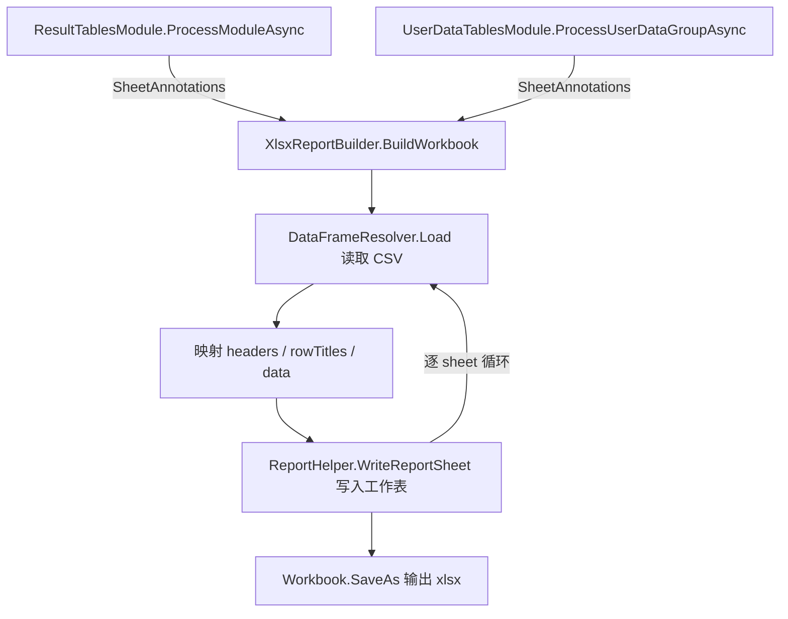

## 用户需求

将 `ResultTablesModule.ProcessModuleAsync` 与 `UserDataTablesModule.ProcessUserDataGroupAsync` 两个函数中"由 LLM 编写 R 脚本 → 执行 R 脚本 → 产出带样式 xlsx"的实现路径，替换为在 VB.NET 端直接读取 CSV 并调用 `ReportHelper.WriteReportSheet` 生成 xlsx，彻底移除该环节的 LLM 与 R 脚本依赖，以消除 token 消耗、执行不确定性与失败风险。

## 功能内容

### 保留不变的部分

- 两个模块的第一次 LLM 调用（`GenerateAnnotationsForModuleAsync` / `GenerateGoalAndAnnotationsForGroupAsync`）继续负责生成每张工作表的英文注释与工作表名，返回 `SheetAnnotations` 对象。
- `table_descriptions.json` 继续落盘到各自的输出目录，作为记录与排查依据。
- `UserDataTablesModule` 中生成 `conclusion.md` 的第三次 LLM 调用、`ModuleResult` 的构造与加入 `_context.ModuleResults` 的流程完全保持。
- 各模块 CSV 收集、输出目录创建、xlsx 文件命名规则保持原样。

### 变更的部分

- 删除两个模块中各自的 `BuildRScriptPrompt` 函数，以及对应的"创建 LLM 客户端 → 注册工具 → Chat"代码块。
- 新增共享的 xlsx 生成能力：依据 `SheetAnnotations` 中的每一项（csv 绝对路径、工作表名、注释文本），用 sciBASIC 的 CSV 解析器读取表格，逐张工作表写入同一个工作簿，最后保存为目标 xlsx 文件。
- CSV 到工作表的映射：表头整行作为列标题行，第一列作为行标题列，其余列作为数据区。

### 容错与健壮性

- 单张工作表读取或写入失败时记录警告并跳过，不中断同一工作簿中其它工作表的生成。
- 工作表名重复时自动去重，避免因不同子目录下同名 CSV 导致整个工作簿生成失败。
- CSV 为空或仅有表头时仍产出仅含注释行与标题行的工作表。
- 当一个工作簿中没有任何工作表成功写入时，跳过保存并输出明确的警告日志。

## 视觉效果

生成的 xlsx 沿用 `ReportHelper.WriteReportSheet` 既定的报表样式：第 1 行为跨列合并的草绿色斜体注释行（白底、左对齐），第 2 行为深蓝底白色加粗的列标题行，第 3 行起为 Cambria 11 号正文，其中首列为深灰色斜体行标题，窗格冻结于 B2。

## 技术栈

- 语言/框架：VB.NET，`net10.0`（`OmicsAgent.vbproj`，`OptionStrict Off` / `OptionInfer On`）
- xlsx 写出：`Microsoft.VisualBasic.MIME.Office.Excel.ReportHelper.WriteReportSheet` + `...Excel.XLSX.Writer.Workbook`（来自已引用的 `xlsx-netcore5.vbproj`）
- CSV 解析：`Microsoft.VisualBasic.Data.Framework.StorageProvider.DataFrameResolver`（来自已引用的 `dataframework-netcore5.vbproj`）
- 无需新增任何 ProjectReference 或 NuGet 依赖

## 实现方案

### 总体策略

两个目标函数中被替换的代码块结构完全同构（`BuildRScriptPrompt` → `CreateLLMClient` → `RegisterTools(llm, True)` → `Chat`），且上游都已经产出同一种数据模型 `SheetAnnotations`。因此**抽取一个共享的静态工具模块** `XlsxReportBuilder`，对外暴露单一入口：输入 `SheetAnnotations` + 目标 xlsx 完整路径 + 日志回调，输出成功写入的工作表数量。两个模块各自把原来的 7~9 行 LLM 代码替换为一次同步调用。

这样做的理由：

- 遵循 DRY，避免在两个模块里复制粘贴同一段 CSV→xlsx 逻辑；后续样式或容错策略调整只需改一处。
- `SheetAnnotations` 已经是两个模块共同的中间契约（`csv` / `sheet_name` / `annotation` 三个字段恰好对应 `WriteReportSheet` 的三项输入），以它为入参无需引入新的数据结构。
- 新模块放在 `src\Modules\Table\` 下，与 `SheetAnnotations.vb` 同目录，符合现有的文件组织方式。

### CSV → 工作表的列映射

按用户确认，复用 `src\Utils\CsvUtils.vb` 中 `ValidateExpressionMatrix` 的读取范式：

```
Dim rows = DataFrameResolver.Load(csvPath)
Dim header = rows.HeadTitles          ' String()，含第一列列名
For i = 0 To rows.Nrows - 1
    Dim row = rows.GetRow(i)          ' RowObject，Count 与 header 等长
```

映射到 `WriteReportSheet(workbook, sheetName, commentText, headers, rowTitles, data)`：

- `headers` ← `rows.HeadTitles` 全量（含第一列列名），保证标题行与正文行列数对齐
- `rowTitles` ← 每行 `row(0)`
- `data` ← 每行 `row(1)` 至 `row(row.Count - 1)`
- `commentText` ← `SheetAnnotations.Sheet.annotation`
- `sheetName` ← `SheetAnnotations.Sheet.sheet_name`

选择 `DataFrameResolver` 而非 `Split(","c)`，是因为它能正确处理字段内含逗号、引号与转义的情况，且是项目内既有的标准 CSV 读取方式。

### 关键技术决策

1. **一次性物化 vs 流式**：`WriteReportSheet` 的签名接收 `IEnumerable`，但其内部立刻 `ToList()`，且 `Workbook` 本身在内存中构建整个工作簿，因此流式读取无法带来实质收益。`DataFrameResolver.Load` 为整表载入，行数据用 `List(Of Object)` 逐行构造后传入即可。为控制内存，仅在单张工作表处理期间持有该表数据，处理完随即释放引用（逐 sheet 局部变量作用域）。复杂度为 O(总单元格数)，与 xlsx 写出本身同量级，不构成额外瓶颈。

2. **工作表名去重**：`Workbook.AddWorksheet(name)` 遇到同名会抛 `WorksheetException`，而两个模块均以 `SearchOption.AllDirectories` 递归收集 CSV，不同子目录下的同名文件经 `SanitizeSheetName` 后必然冲突。在 `XlsxReportBuilder` 内维护一个 `HashSet(Of String)`（`StringComparer.OrdinalIgnoreCase`，Excel 工作表名大小写不敏感），冲突时追加 `_2`、`_3` 后缀，并保证结果仍 <= 31 字符。同时对空的 `sheet_name` 做兜底（回退为 CSV 文件名，再回退为 `Sheet{i}`）。

3. **逐 sheet 容错**：每张工作表的读取与写入包在独立的 `Try/Catch` 内，失败仅记录警告并继续下一张，保留旧 R 提示词中"跳过并警告，不要停止"的语义。返回成功写入的工作表数，调用方据此判断是否产出了有效文件。

4. **空工作簿兜底**：`Workbook` 至少需要一个 worksheet 才是合法 xlsx。若所有工作表都失败（成功数为 0），跳过 `SaveAs` 并输出警告，避免生成损坏文件或抛出难以定位的异常。

5. **保存方式**：使用 `New Workbook()`（不自动创建 Sheet1）+ 末尾 `SaveAs(xlsxPath)`。避免 `New Workbook(createWorkSheet:=True)` 残留一张空的 Sheet1。

6. **样式以 `ReportHelper` 为准**：`WriteReportSheet` 的实际样式与旧 R 提示词的描述存在细微差异（草绿色 `#70AD47` vs `#228B22`、首列无浅灰底、冻结点 B2 而非 B3、无 90% 缩放）。`ReportHelper` 是用户为这两个模块专门编写的报表模块，应以其既有实现为唯一样式来源，**不修改 `ReportHelper.vb`**。相应地，两个模块头部注释与 `GeneratePlanPromptText` / `GetConclusionItems` 中描述"由 LLM 编写 R 脚本生成"和旧样式细节的文案需同步更新，避免文档与实现不一致误导后续 LLM 环节。

7. **同步方法而非 async**：xlsx 生成是纯 CPU/IO 本地操作，无需 `Task`。`XlsxReportBuilder` 暴露同步方法，在原 `Await` 位置直接调用即可；两个 Process 函数因仍有其它 `Await` 调用，保持 `Async Function` 签名不变。

### 参数与遗留代码清理

- 删除 `Module13_ResultTables.vb` 第 340-414 行 `BuildRScriptPrompt`，删除 `UserDataTablesModule.vb` 第 405-478 行 `BuildRScriptPrompt`。
- 删除后 `plan As ModulePlan` / `[step] As [Step]` 在两个 Process 函数中不再被使用：`ProcessModuleAsync` 与 `ProcessUserDataGroupAsync` 均精简掉这两个形参，并同步修改各自唯一的调用点（`Module13` 第 111 行、`UserDataTables` 第 148 行）。`GenerateAndRunScriptAsync` 的重写签名本身不变。
- `Module13_ResultTables.vb` 末尾的 `Public Class TableAnnotation`（第 416-422 行）与 `SheetAnnotations.Sheet` 完全重复且无任何引用，一并删除。
- 保留 `RegisterTools` / `RegisterFileTools` 在其它 LLM 调用处的使用，不得误删。
- `Module13_ResultTables.vb` 若移除 `BuildRScriptPrompt` 后 `Imports Microsoft.VisualBasic.Serialization.JSON`（用于 `JsonContract.GetJson`）不再被使用，需核对 `descJson.ToString` 等其它用法后再决定去留。

## 实现要点

- **复用既有模式**：CSV 读取严格照搬 `CsvUtils.ValidateExpressionMatrix` 的 `DataFrameResolver.Load` / `HeadTitles` / `GetRow(i)` 写法；日志统一走各模块基类的 `LogInfo`，`XlsxReportBuilder` 通过 `Action(Of String)` 回调接收，不自建日志通道。
- **日志控制**：每张工作表成功时输出一行简要日志（工作表名 + 行数），避免逐行日志刷屏；失败时输出 `[警告]` 前缀 + 文件路径 + `ex.Message`，与现有两个模块的告警文案风格保持一致；不打印 CSV 单元格内容，避免泄露数据与日志膨胀。
- **爆炸半径控制**：仅改动两个 Process 函数内的 xlsx 生成段落与被删除的私有方法，不触碰注释生成、conclusion 生成、计划生成、CSV 收集等既有逻辑；不修改 `ReportHelper.vb` 与 `SheetAnnotations.vb` 的公开契约；`rscript/xlsxTable.R` 模板文件保留在原处（可能被其它模块引用），仅解除本次两个模块对它的引用。
- **向后兼容**：`table_descriptions.json` 的结构与落盘位置不变，下游 `ReportModule`（Module14）读取 `ModuleResult` 的方式不受影响。
- **数值类型**：`WriteReportSheet` 的 `data` 形参为 `IEnumerable(Of Object)`，底层 `AddNextCell` 依据运行时类型决定单元格类型。当前 `RowObject` 提供的是字符串，为保持旧 R 脚本"数值列保持数值类型"的效果，对单元格值做一次轻量数值探测（`Double.TryParse` + `CultureInfo.InvariantCulture`），成功则装箱为 `Double` 写入，否则按字符串写入。该探测为每单元格一次 O(1) 操作，开销可忽略。

## 架构设计



改造前后调用链对比：

- 改造前：`SheetAnnotations` → 写 JSON → `BuildRScriptPrompt` → `LLMClient.Chat` → `write_file` / `run_rscript` 工具 → R + openxlsx → xlsx
- 改造后：`SheetAnnotations` → 写 JSON → `XlsxReportBuilder.BuildWorkbook` → `DataFrameResolver` + `ReportHelper` → xlsx

## 目录结构

```
g:\OmicsWorks\src\
└── src\
    ├── Modules\
    │   ├── Table\
    │   │   ├── XlsxReportBuilder.vb        # [NEW] 共享 xlsx 报表构建工具模块。职责：依据 SheetAnnotations
    │   │   │                               #   逐张工作表读取 CSV 并写入同一 Workbook，最终保存为 xlsx。
    │   │   │                               #   对外暴露 BuildWorkbook(annotations, xlsxPath, logger) As Integer，
    │   │   │                               #   返回成功写入的工作表数量。内部实现：New Workbook() 建空工作簿；
    │   │   │                               #   遍历 annotations.sheets，用 DataFrameResolver.Load 读 CSV，
    │   │   │                               #   HeadTitles 作 headers、row(0) 作 rowTitles、row(1..n) 作 data，
    │   │   │                               #   调用 workbook.WriteReportSheet 写入；维护 HashSet 做工作表名
    │   │   │                               #   去重（冲突加 _2/_3 后缀并截断至 31 字符）与空名兜底；
    │   │   │                               #   每张 sheet 独立 Try/Catch，失败记警告并跳过；单元格值做
    │   │   │                               #   Double.TryParse 数值探测以保持数值类型；成功数为 0 时跳过
    │   │   │                               #   SaveAs 并告警。需 Imports xlsx Writer 与 StorageProvider 命名空间。
    │   │   ├── SheetAnnotations.vb         # [UNCHANGED] 数据契约，作为 XlsxReportBuilder 的入参类型
    │   │   └── UserDataTablesModule.vb     # [MODIFY] ProcessUserDataGroupAsync：删除第 205-211 行的
    │   │                                   #   BuildRScriptPrompt 调用与 LLMClient xlsx 代码块，改为调用
    │   │                                   #   XlsxReportBuilder.BuildWorkbook(goalJson, Path.Combine(outputDir,
    │   │                                   #   xlsxFileName), AddressOf LogInfo)；保留第 200-203 行 JSON 落盘、
    │   │                                   #   保留第 213-222 行 conclusion 与 ModuleResults 逻辑；删除第 405-478 行
    │   │                                   #   BuildRScriptPrompt 整个函数；精简 plan / [step] 形参并同步修改
    │   │                                   #   第 148 行调用点；更新类头部 xlsx 样式注释与 GeneratePlanPromptText
    │   │                                   #   第 7 条、GetConclusionItems 中关于"LLM 编写 R 脚本"的描述。
    │   └── Standard\
    │       └── Module13_ResultTables.vb    # [MODIFY] ProcessModuleAsync：删除第 149-157 行的 BuildRScriptPrompt
    │                                       #   调用与 LLMClient xlsx 代码块，改为调用 XlsxReportBuilder.BuildWorkbook(
    │                                       #   descJson, Path.Combine(mr.OutputDir, xlsxFileName), AddressOf LogInfo)；
    │                                       #   保留第 145-147 行 JSON 落盘；删除第 340-414 行 BuildRScriptPrompt
    │                                       #   整个函数；删除第 416-422 行无引用的 TableAnnotation 类；精简
    │                                       #   plan / [step] 形参并同步修改第 111 行调用点；核对并清理不再使用的
    │                                       #   Imports；更新类头部注释第 4/5 条与样式说明、GeneratePlanPromptText
    │                                       #   第 6 条、GetConclusionItems 中关于"LLM 编写 R 脚本"的描述。
    └── Utils\
        └── CsvUtils.vb                     # [UNCHANGED] 仅作为 DataFrameResolver 读取范式的参考，不修改
```

## 关键代码结构

`XlsxReportBuilder` 对外唯一入口（仅签名，不含实现）：

```
''' <summary>
''' 依据 LLM 生成的表格注释信息，把一组 CSV 编译为带样式的单个 xlsx 文件。
''' </summary>
''' <param name="annotations">含 sheets（csv 路径 / 工作表名 / 注释文本）的注释模型</param>
''' <param name="xlsxPath">输出 xlsx 的完整路径</param>
''' <param name="logger">日志回调，通常传入模块基类的 LogInfo</param>
''' <returns>成功写入的工作表数量；为 0 时表示未生成任何文件</returns>
Public Function BuildWorkbook(annotations As SheetAnnotations,
                              xlsxPath As String,
                              logger As Action(Of String)) As Integer
```